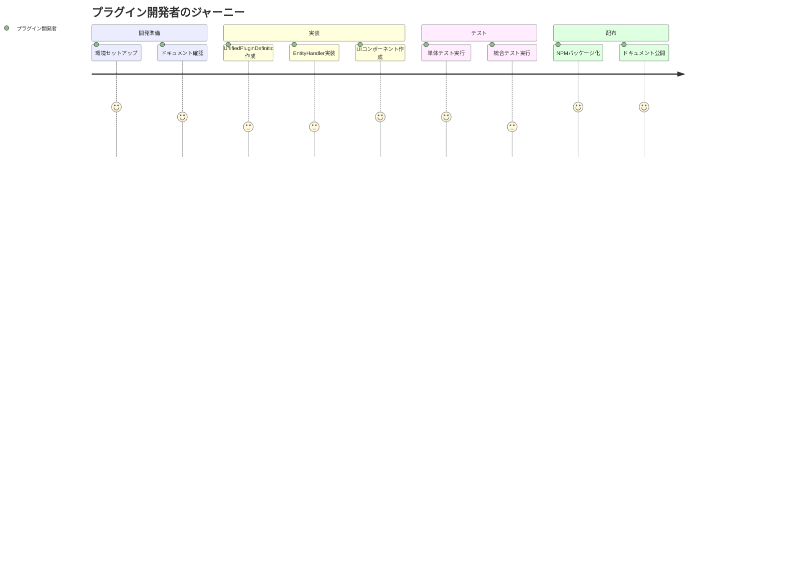
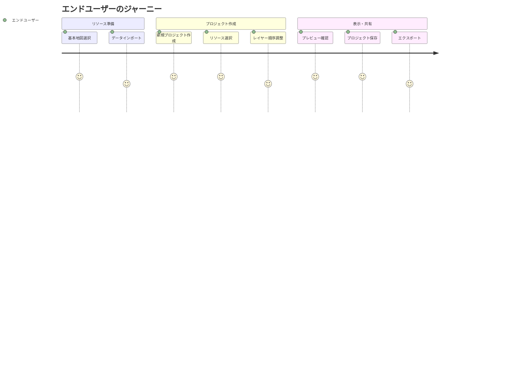

# プラグインアーキテクチャ実装 ユーザストーリー

## 概要

このドキュメントは hierarchidb プラグインアーキテクチャ実装機能の詳細なユーザストーリーを記載します。

## ユーザー種別の定義

### プライマリユーザー

- **プラグイン開発者**: hierarchidb の機能を拡張するプラグインを開発する技術者。TypeScript と React の知識を持ち、ノードタイプ固有の機能を実装する
- **アプリケーション開発者**: hierarchidb を使用してアプリケーションを構築する開発者。複数のプラグインを組み合わせて地図ベースのシステムを構築する
- **エンドユーザー**: 最終的なアプリケーションを使用する利用者。地図データの作成・編集・表示を行う

### セカンダリユーザー

- **システム管理者**: プラグインの導入・設定・管理を行う運用担当者
- **外部システム**: API 経由でプラグイン機能にアクセスする外部アプリケーション

## ユーザストーリー

### 📚 エピック1: プラグイン開発と登録

#### ストーリー1.1: 新しいノードタイププラグインの開発 🟢

**ユーザストーリー**:
- **私は** プラグイン開発者 **として**
- **新しい地図要素（例：交通情報レイヤー）を追加したい状況 において**
- **UnifiedPluginDefinition を実装して新しいノードタイプを定義 をしたい**
- **そうすることで** アプリケーションに新しい機能を追加できる

**詳細説明**:
- **背景**: 標準機能では提供されていない特殊な地図要素が必要
- **前提条件**: TypeScript と hierarchidb のアーキテクチャを理解している
- **利用シーン**: 交通情報、天気情報、イベント情報などの動的レイヤー追加
- **期待する体験**: 型安全な開発環境で、既存システムと完全に統合されたプラグインを作成

**関連要件**: REQ-002, REQ-401

**優先度**: 高

**見積もり**: 3-5日

#### ストーリー1.2: EntityHandler の実装 🟢

**ユーザストーリー**:
- **私は** プラグイン開発者 **として**
- **プラグイン固有のデータ管理が必要な状況 において**
- **EntityHandler インターフェースを実装してCRUD操作を定義 をしたい**
- **そうすることで** ノードに紐づくエンティティを適切に管理できる

**詳細説明**:
- **背景**: 各ノードタイプは固有のデータ構造とビジネスロジックを持つ
- **前提条件**: Dexie.js によるIndexedDB操作の基本知識
- **利用シーン**: BaseMapEntity の地図設定、ShapeEntity の GeoJSON データ管理
- **期待する体験**: 標準化された方法でデータの永続化と取得が可能

**関連要件**: REQ-004

**優先度**: 高

**見積もり**: 2日

#### ストーリー1.3: ライフサイクルフックの設定 🟢

**ユーザストーリー**:
- **私は** プラグイン開発者 **として**
- **ノードの作成・更新・削除時にカスタム処理を実行したい状況 において**
- **ライフサイクルフック（beforeCreate, afterCreate 等）を定義 をしたい**
- **そうすることで** ノードのライフサイクルに応じた処理を自動実行できる

**詳細説明**:
- **背景**: ノード操作時の前処理・後処理が必要（リソース初期化、キャッシュクリア等）
- **前提条件**: AOP の概念とライフサイクルパターンの理解
- **利用シーン**: 地図リソースの初期化、関連データの自動生成、クリーンアップ処理
- **期待する体験**: 宣言的にライフサイクル処理を定義でき、警告時は処理継続、エラー時はロールバック

**関連要件**: REQ-003, REQ-104

**優先度**: 高

**見積もり**: 1日

### 📚 エピック2: プラグインの統合と設定

#### ストーリー2.1: プラグインのビルド統合 🟢

**ユーザストーリー**:
- **私は** アプリケーション開発者 **として**
- **新しいプラグインを追加する状況 において**
- **pnpm add でプラグインを追加しビルドに統合 をしたい**
- **そうすることで** プラグインがアプリケーションに静的に組み込まれる

**詳細説明**:
- **背景**: プラグインは npm パッケージとして管理
- **前提条件**: pnpm ワークスペースの理解
- **利用シーン**: 新機能プラグインの追加、既存プラグインのアップデート
- **期待する体験**: pnpm add 後のビルドでプラグインが統合される

**関連要件**: REQ-101, REQ-103

**優先度**: 高

**見積もり**: 1日

#### ストーリー2.2: プラグイン設定の管理 🟡

**ユーザストーリー**:
- **私は** システム管理者 **として**
- **アプリケーションの要件に応じてプラグインを有効化・無効化したい状況 において**
- **設定ファイルでプラグインの enabled フラグと settings を管理 をしたい**
- **そうすることで** 環境ごとに異なるプラグイン構成を実現できる

**詳細説明**:
- **背景**: 開発環境と本番環境で異なるプラグイン構成が必要
- **前提条件**: app.config.ts の構造を理解している
- **利用シーン**: テスト環境でのデバッグプラグイン有効化、本番環境での最小構成
- **期待する体験**: 簡単な設定変更でプラグインの有効・無効を切り替え可能

**関連要件**: REQ-001

**優先度**: 中

**見積もり**: 0.5日

### 📚 エピック3: UI コンポーネントの動的登録

#### ストーリー3.1: カスタムダイアログコンポーネントの提供 🟢

**ユーザストーリー**:
- **私は** プラグイン開発者 **として**
- **ノードタイプ固有の作成・編集ダイアログが必要な状況 において**
- **React コンポーネントを UIComponentRegistry に登録 をしたい**
- **そうすることで** ユーザーが直感的にノードを操作できる UI を提供できる

**詳細説明**:
- **背景**: 各ノードタイプは異なるデータ構造を持ち、専用の UI が必要
- **前提条件**: React と TypeScript での UI 開発経験
- **利用シーン**: BaseMap の地図スタイル選択、Shape の GeoJSON アップロード UI
- **期待する体験**: 型安全な props でコンポーネントを定義し、自動的に適切な場面で表示

**関連要件**: REQ-006

**優先度**: 高

**見積もり**: 2日

#### ストーリー3.2: React Router との統合 🟢

**ユーザストーリー**:
- **私は** プラグイン開発者 **として**
- **ノードタイプごとに異なるビューやアクションを提供したい状況 において**
- **React Router v7 のルーティングアクションを定義 をしたい**
- **そうすることで** URL ベースのナビゲーションと状態管理を実現できる

**詳細説明**:
- **背景**: SPA でのディープリンクとブラウザバック対応が必要
- **前提条件**: React Router v7 の知識
- **利用シーン**: /map/basemap/view, /project/compose などの URL 構造
- **期待する体験**: ファイルシステムベースのルーティングで直感的な URL 構造を実現

**関連要件**: REQ-007

**優先度**: 中

**見積もり**: 1日

### 📚 エピック4: Worker API の拡張

#### ストーリー4.1: カスタム API メソッドの追加 🟢

**ユーザストーリー**:
- **私は** プラグイン開発者 **として**
- **ノードタイプ固有の処理を API として公開したい状況 において**
- **WorkerAPIExtensions でカスタムメソッドを定義 をしたい**
- **そうすることで** 他のコンポーネントからプラグイン機能を利用できる

**詳細説明**:
- **背景**: プラグイン固有の複雑な処理を API として標準化
- **前提条件**: Worker スレッドでの非同期処理の理解
- **利用シーン**: getMapPreview, exportMapConfig, parseCSVStyles などの特殊処理
- **期待する体験**: 型安全な API 定義と自動的な Worker スレッドでの実行

**関連要件**: REQ-005

**優先度**: 中

**見積もり**: 1日

### 📚 エピック5: プロジェクト統合機能

#### ストーリー5.1: Resources ツリーノードの参照と集約 🟢

**ユーザストーリー**:
- **私は** エンドユーザー **として**
- **複数の地図リソースを組み合わせたプロジェクトを作成したい状況 において**
- **チェックボックス付きツリー UI で Resources を選択 をしたい**
- **そうすることで** 統合された地図表示を簡単に構成できる

**詳細説明**:
- **背景**: 個別のリソースを組み合わせて複雑な地図を作成
- **前提条件**: Resources と Projects の概念を理解している
- **利用シーン**: 基本地図 + 交通情報 + イベント情報の重ね合わせ表示
- **期待する体験**: ドラッグ＆ドロップやチェックボックスで直感的にプロジェクト構成

**関連要件**: REQ-202

**優先度**: 高

**見積もり**: 3日

## ユーザージャーニー

### ジャーニー1: プラグイン開発から配布まで

**詳細**:
1. **環境セットアップ**: TypeScript, React, pnpm のインストールと設定
2. **ドキュメント確認**: アーキテクチャ仕様と API リファレンスの理解
3. **UnifiedPluginDefinition作成**: 型定義とメタデータの実装
4. **EntityHandler実装**: CRUD 操作とワーキングコピー管理
5. **UIコンポーネント作成**: ダイアログ、パネル、フォームの実装
6. **単体テスト実行**: Vitest による個別機能のテスト
7. **統合テスト実行**: 実際のアプリケーションでの動作確認
8. **NPMパッケージ化**: package.json の設定と公開準備
9. **ドキュメント公開**: 使用方法と API ドキュメントの作成

### ジャーニー2: エンドユーザーの地図プロジェクト作成

## ペルソナ定義

### ペルソナ1: 田中太郎（プラグイン開発者）

- **基本情報**: 35歳、フルスタック開発者、TypeScript経験5年
- **ゴール**: 再利用可能で保守しやすいプラグインの開発
- **課題**: 複雑なアーキテクチャの理解と型定義の正確な実装
- **行動パターン**: ドキュメントを詳細に読み、サンプルコードから学習
- **利用環境**: VSCode, Node.js 18+, pnpm

### ペルソナ2: 佐藤花子（エンドユーザー）

- **基本情報**: 28歳、都市計画担当者、プログラミング経験なし
- **ゴール**: 複数の地理データを組み合わせた分析地図の作成
- **課題**: 技術的な知識なしに複雑な地図を作成したい
- **行動パターン**: GUI 操作を好み、ビジュアルフィードバックを重視
- **利用環境**: Chrome ブラウザ、Windows 11

## 非機能的ユーザー要求

### ユーザビリティ要求

- **学習容易性**: プラグイン開発の基本を1日で習得可能 🟡
- **効率性**: 熟練開発者は1日で基本プラグインを作成可能 🟢
- **記憶しやすさ**: 統一されたインターフェースで記憶負荷を軽減 🟢
- **エラー対応**: 最小限のエラーメッセージで十分 🟢
- **満足度**: TypeScript の型補完による快適な開発体験 🟢

### アクセシビリティ要求

- **視覚**: スクリーンリーダー対応の UI コンポーネント 🟡
- **操作**: キーボードのみでの完全操作対応 🟡
- **認知**: 一貫性のある UI パターンと用語使用 🟢

## 成功指標

- プラグイン開発時間: 基本プラグイン3日以内
- エラー率: ビルドエラー発生率 10% 以下
- 採用率: 公開プラグインの 80% が UnifiedPluginDefinition 使用
- ビルド統合: pnpm add 後のビルド成功率 100%

## 変更履歴

- 2025-01-28: 初版作成（統合プラグインアーキテクチャ仕様に基づく）