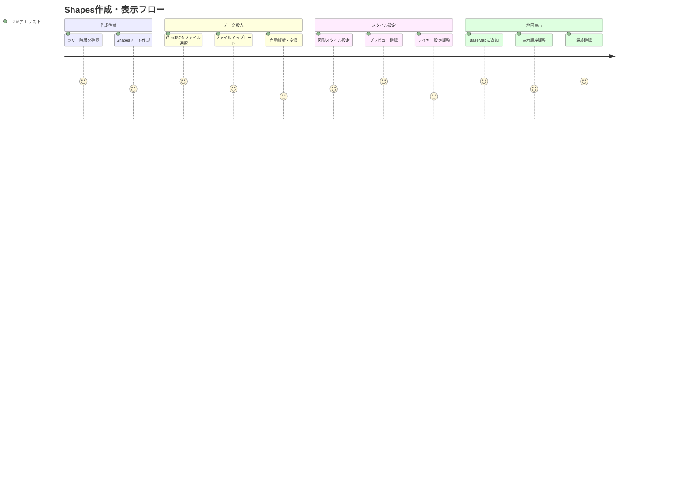
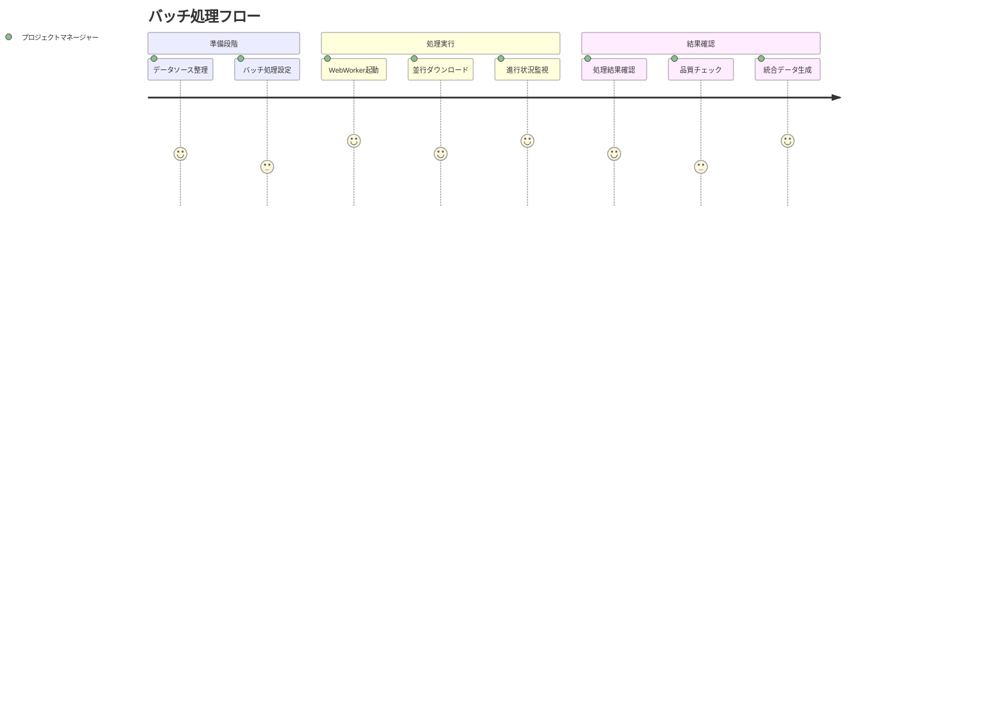
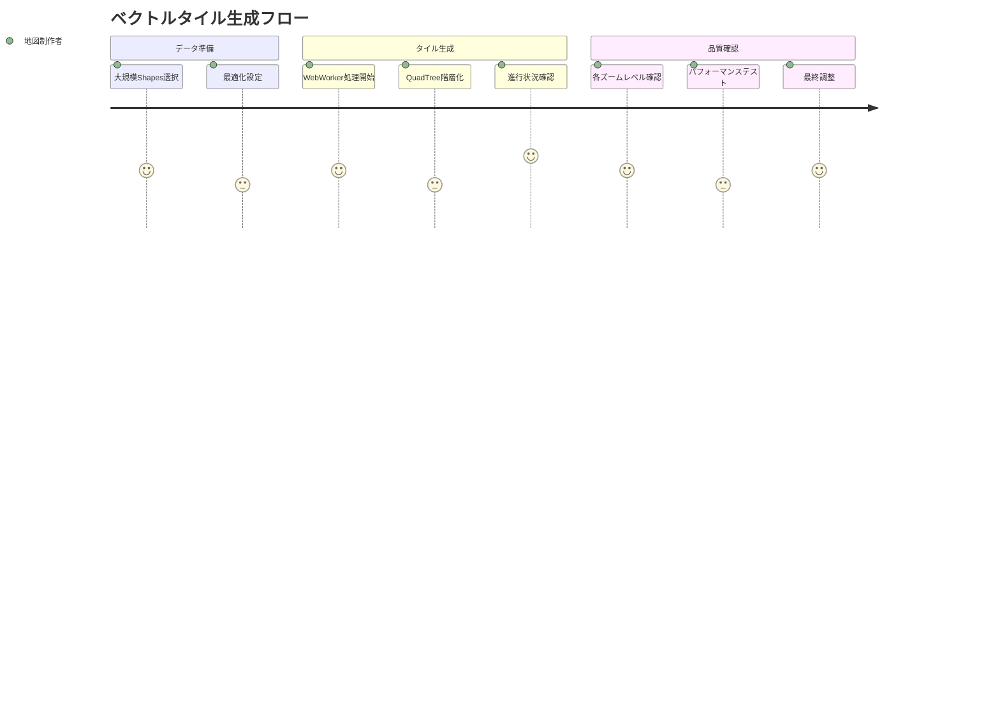

# Plugin Shapes ユーザストーリー

## 概要

このドキュメントはShapesプラグイン機能の詳細なユーザストーリーを記載します。地理空間図形データの管理、WebWorkerによるバッチ処理、ベクトルマップ生成に関するユーザーの要求を包括的にカバーします。

**【信頼性レベル】**: 🟡 既存のBaseMapプラグイン実装とeria-cartographの地図処理パターンから妥当な推測

## ユーザー種別の定義

### プライマリユーザー

- **GISアナリスト**: 地理空間データを専門的に分析・処理するユーザー
- **地図制作者**: 地図コンテンツを作成・編集するデザイナーやカルトグラファー
- **データサイエンティスト**: 大規模な地理空間データセットを扱う研究者・分析者
- **プロジェクトマネージャー**: 地理空間プロジェクトの管理・統括を行うユーザー

### セカンダリユーザー

- **システム管理者**: Shapesプラグインの設定・メンテナンスを行うユーザー
- **エンドユーザー**: 完成した地図を閲覧・利用する一般的なユーザー
- **外部システム**: API経由でShapesデータを利用するアプリケーション
- **BaseMapプラグイン**: Shapesと連携して地図表示を行う他のプラグイン

## ユーザストーリー

### 📚 エピック1: Shapes作成・管理

#### ストーリー1.1: 新しいShapesの作成

**ユーザストーリー**:
- **私は** GISアナリスト **として**
- **新しい地理空間データプロジェクトを開始する時に**
- **Shapesノードを作成して基本的な図形データを定義したい**
- **そうすることで** プロジェクト全体で一貫した地理空間データ管理を実現できる

**詳細説明**:
- **背景**: 各プロジェクトで異なる地理空間データセットを管理する必要がある
- **前提条件**: 階層ツリー内でShapesを作成可能な権限を持っている
- **利用シーン**: 新規調査プロジェクト、データ収集活動、分析レポート作成
- **期待する体験**: 直感的なUIで図形タイプを選択し、即座にプレビューできる

**関連要件**: REQ-001, REQ-101

**優先度**: 高

**見積もり**: 8ストーリーポイント

#### ストーリー1.2: GeoJSONデータのインポート

**ユーザストーリー**:
- **私は** データサイエンティスト **として**
- **既存のGeoJSONファイルを再利用したい時に**
- **ファイルをアップロードして自動的にShapesに変換したい**
- **そうすることで** 既存のデータ資産を効率的に活用できる

**詳細説明**:
- **背景**: 他のツールで作成されたGeoJSONデータを取り込む必要がある
- **前提条件**: 有効なGeoJSON形式のファイルが存在する
- **利用シーン**: データ移行、外部データ統合、チーム間でのデータ共有
- **期待する体験**: ドラッグ&ドロップでファイルをアップロードし、自動的に解析される

**関連要件**: REQ-002, REQ-103

**優先度**: 高

**見積もり**: 13ストーリーポイント

#### ストーリー1.3: ShapesのWorking Copy編集

**ユーザストーリー**:
- **私は** 地図制作者 **として**
- **既存のShapesを変更する必要がある時に**
- **Working Copyを作成して安全に編集したい**
- **そうすることで** 元のデータを保護しながら新しい設計を試行錯誤できる

**詳細説明**:
- **背景**: 本番データを直接変更することはリスクが高い
- **前提条件**: 編集対象のShapesが存在し、編集権限を持っている
- **利用シーン**: データ改善、エラー修正、スタイル調整
- **期待する体験**: 編集中の図形をリアルタイムでプレビューしながら調整可能

**関連要件**: REQ-005, REQ-201

**優先度**: 高

**見積もり**: 21ストーリーポイント

### 📚 エピック2: バッチ処理・大規模データ

#### ストーリー2.1: 複数ファイルの一括処理

**ユーザストーリー**:
- **私は** プロジェクトマネージャー **として**
- **大量の地理空間ファイルを効率的に処理したい時に**
- **WebWorkerによるバッチ処理で複数ファイルを並行処理したい**
- **そうすることで** 大規模なデータセットを短時間で統合できる

**詳細説明**:
- **背景**: 手動での一つずつ処理では時間がかかりすぎる
- **前提条件**: 複数のGeoJSONまたは関連ファイルが準備されている
- **利用シーン**: 大規模調査データの統合、複数地域データの結合
- **期待する体験**: フォルダをドロップするだけで自動的に全ファイルが処理される

**関連要件**: REQ-501, REQ-502, REQ-102

**優先度**: 中

**見積もり**: 34ストーリーポイント

#### ストーリー2.2: 外部データソースからの自動取得

**ユーザストーリー**:
- **私は** GISアナリスト **として**
- **定期的に更新される外部データソースを利用したい時に**
- **URLを指定してWebWorkerで自動的にダウンロード・更新したい**
- **そうすることで** 最新のデータを常に利用できる環境を構築できる

**詳細説明**:
- **背景**: 手動でのデータ更新は忘れやすく非効率
- **前提条件**: 信頼できる外部データソースのURLが存在する
- **利用シーン**: 政府オープンデータ活用、リアルタイム監視システム
- **期待する体験**: 一度設定すれば自動的に最新データが反映される

**関連要件**: REQ-501, REQ-504, REQ-105

**優先度**: 中

**見積もり**: 21ストーリーポイント

### 📚 エピック3: ベクトルマップ生成

#### ストーリー3.1: 高解像度ベクトルタイル生成

**ユーザストーリー**:
- **私は** 地図制作者 **として**
- **大量の図形データを効率的に表示したい時に**
- **WebWorkerでベクトルタイルを生成して高速表示を実現したい**
- **そうすることで** ユーザーに快適な地図閲覧体験を提供できる

**詳細説明**:
- **背景**: 大量の図形データをそのまま表示するとパフォーマンスが劣化する
- **前提条件**: 大規模なShapesデータセットが存在する
- **利用シーン**: Webアプリケーション公開、モバイルアプリ対応
- **期待する体験**: ズームレベルに応じて最適化された図形が滑らかに表示される

**関連要件**: REQ-601, REQ-602, REQ-605

**優先度**: 中

**見積もり**: 55ストーリーポイント

#### ストーリー3.2: 図形簡素化処理

**ユーザストーリー**:
- **私は** データサイエンティスト **として**
- **詳細すぎる図形データをパフォーマンス向上のために最適化したい時に**
- **Douglas-Peuckerアルゴリズムによる自動簡素化を適用したい**
- **そうすることで** データサイズを削減しながら視覚的品質を保持できる

**詳細説明**:
- **背景**: 高精度データは必要以上に詳細な場合が多い
- **前提条件**: 複雑な図形データを含むShapesが存在する
- **利用シーン**: Web公開用最適化、モバイル対応、ストレージ節約
- **期待する体験**: 簡素化レベルを調整しながらリアルタイムで結果を確認できる

**関連要件**: REQ-301, REQ-605

**優先度**: 低

**見積もり**: 34ストーリーポイント

### 📚 エピック4: BaseMapとの連携

#### ストーリー4.1: ShapesのBaseMapへの重畳表示

**ユーザストーリー**:
- **私は** エンドユーザー **として**
- **作成したShapesを実際の地図上で確認したい時に**
- **BaseMapにShapesレイヤーを追加して重畳表示したい**
- **そうすることで** 地理的コンテキストを持った図形データを視覚化できる

**詳細説明**:
- **背景**: Shapesは単独では地理的文脈が理解しにくい
- **前提条件**: ShapesとBaseMapの両方が作成済み
- **利用シーン**: 調査結果発表、レポート作成、意思決定支援
- **期待する体験**: ワンクリックで地図上に図形が表示され、即座に全体像を把握できる

**関連要件**: REQ-403, REQ-202

**優先度**: 高

**見積もり**: 13ストーリーポイント

#### ストーリー4.2: レイヤー順序とスタイル制御

**ユーザストーリー**:
- **私は** 地図制作者 **として**
- **複数のShapesレイヤーの表示順序とスタイルを調整したい時に**
- **レイヤー管理パネルで直感的に設定を変更したい**
- **そうすることで** 最適な視覚的階層と見やすさを実現できる

**詳細説明**:
- **背景**: 複数のデータレイヤーが重なると情報が見えにくくなる
- **前提条件**: 複数のShapesがBaseMapに追加されている
- **利用シーン**: 複合的な分析結果表示、多層的な情報提示
- **期待する体験**: ドラッグ&ドロップでレイヤー順序を変更し、即座に反映される

**関連要件**: REQ-007, REQ-004

**優先度**: 中

**見積もり**: 21ストーリーポイント

### 📚 エピック5: 高度な編集機能

#### ストーリー5.1: 図形のインタラクティブ編集

**ユーザストーリー**:
- **私は** GISアナリスト **として**
- **地図上で直接図形を描画・編集したい時に**
- **マウスドラッグによる直感的な図形操作を行いたい**
- **そうすることで** 正確で効率的な地理空間データ作成ができる

**詳細説明**:
- **背景**: 座標入力による編集は非効率で直感的でない
- **前提条件**: Shapesの編集画面にアクセスしている
- **利用シーン**: フィールド調査結果の記録、境界線の微調整
- **期待する体験**: Google Mapsのような直感的な描画・編集操作

**関連要件**: REQ-004, NFR-301

**優先度**: 中

**見積もり**: 55ストーリーポイント

#### ストーリー5.2: 座標系変換

**ユーザストーリー**:
- **私は** データサイエンティスト **として**
- **異なる座標系のデータを統合したい時に**
- **自動的な座標系変換機能を利用したい**
- **そうすることで** 多様なデータソースを統一的に扱える

**詳細説明**:
- **背景**: 異なるデータソースは異なる座標系を使用している場合が多い
- **前提条件**: 座標系情報を含むGeoJSONデータが存在する
- **利用シーン**: 国際的なデータ統合、異なる測量システムのデータ結合
- **期待する体験**: 座標系を選択するだけで自動的に変換が実行される

**関連要件**: REQ-003, REQ-103

**優先度**: 低

**見積もり**: 34ストーリーポイント

## ユーザージャーニー

### ジャーニー1: 初回Shapes作成から表示まで

**詳細**:
1. **ツリー階層を確認**: 適切な場所にShapesを配置するため階層構造を確認
2. **Shapesノード作成**: 新規Shapesノードを作成し、基本情報を入力
3. **GeoJSONファイル選択**: ローカルファイルまたはURLからデータソースを指定
4. **ファイルアップロード**: WebWorkerによるバックグラウンド処理でファイルを取得
5. **自動解析・変換**: 座標系検出、図形タイプ分析、統計情報生成
6. **図形スタイル設定**: 色、線幅、透明度などの視覚的属性を設定
7. **プレビュー確認**: リアルタイムプレビューで設定結果を確認
8. **レイヤー設定調整**: 表示範囲、ズームレベル制限などを調整
9. **BaseMapに追加**: 関連するBaseMapにShapesレイヤーを追加
10. **表示順序調整**: 他のレイヤーとの重なり順序を調整
11. **最終確認**: 完成した地図表示での最終的な見た目を確認

### ジャーニー2: バッチ処理による大規模データ処理

### ジャーニー3: ベクトルタイル生成・最適化

## ペルソナ定義

### ペルソナ1: 田中研一（GISアナリスト）

- **基本情報**: 32歳、地理情報システム専門家、上級レベルの技術知識
- **ゴール**: 正確で効率的な地理空間データ分析を実現したい
- **課題**: 複雑なGISツールの習得と大量データ処理に時間がかかる
- **行動パターン**: データの正確性を重視し、詳細な検証を行う
- **利用環境**: 高性能ワークステーション、複数モニター、専用GISソフト

### ペルソナ2: 佐藤美香（地図制作者）

- **基本情報**: 28歳、グラフィックデザイナー兼カルトグラファー、中級レベルの技術知識
- **ゴール**: 美しく分かりやすい地図コンテンツを効率的に制作したい
- **課題**: 技術的な複雑さとデザインの両立が難しい
- **行動パターン**: 視覚的品質を重視し、ユーザー体験を考慮する
- **利用環境**: MacBook Pro、デザインソフトウェア、タブレット

### ペルソナ3: 山田太郎（データサイエンティスト）

- **基本情報**: 35歳、データ分析専門家、高度な技術知識
- **ゴール**: 大規模な地理空間データセットから洞察を得たい
- **課題**: 処理速度とメモリ効率の最適化が重要
- **行動パターン**: 自動化とスクリプト化を好み、効率を最優先とする
- **利用環境**: クラウド環境、Python/R、Jupyter Notebook

### ペルソナ4: 鈴木和子（プロジェクトマネージャー）

- **基本情報**: 42歳、プロジェクト管理者、基本的な技術知識
- **ゴール**: チーム全体の生産性向上とプロジェクト成功を実現したい
- **課題**: 技術的な詳細とプロジェクト全体の整合性を管理する必要がある
- **行動パターン**: 標準化と効率化を重視し、リスク管理を行う
- **利用環境**: 企業支給PC、プロジェクト管理ツール、ビデオ会議

## 非機能的ユーザー要求

### ユーザビリティ要求

- **学習容易性**: GIS初心者でも30分以内で基本操作を習得可能
- **効率性**: 熟練後、標準的なShapes作成を10分以内で完了
- **記憶しやすさ**: 1ヶ月後でも基本的なワークフローを思い出して実行可能
- **エラー対応**: 処理エラー時、具体的な解決策を提示するガイダンス
- **満足度**: 大規模データ処理の自動化と時間短縮に高い満足度を実現

### パフォーマンス要求

- **応答性**: 図形編集時のフィードバックが100ms以内
- **処理速度**: 1000個の図形データを2秒以内で表示
- **バッチ処理**: 100ファイルの並行処理を5分以内で完了
- **メモリ効率**: WebWorker処理時の最大メモリ使用量5MB以内
- **スケーラビリティ**: 10,000個の図形要素まで安定動作

### 品質要求

- **正確性**: 座標変換における誤差0.1メートル以内
- **完全性**: データロスのない形でのインポート・エクスポート
- **一貫性**: 異なるデータソース間での統一的な表示品質
- **可用性**: 24時間365日の安定稼働（99.9%の稼働率）
- **保守性**: 新しいデータ形式への拡張が容易な設計

### セキュリティ要求

- **データ保護**: アップロードされたファイルの適切な暗号化
- **アクセス制御**: ユーザー権限に基づく編集権限管理
- **データ完全性**: 不正な変更からのデータ保護
- **プライバシー**: 個人情報を含む地理空間データの適切な匿名化

これらのユーザストーリーは、Shapesプラグインの包括的な機能要件と、それを利用する多様なユーザーの需要を反映しています。