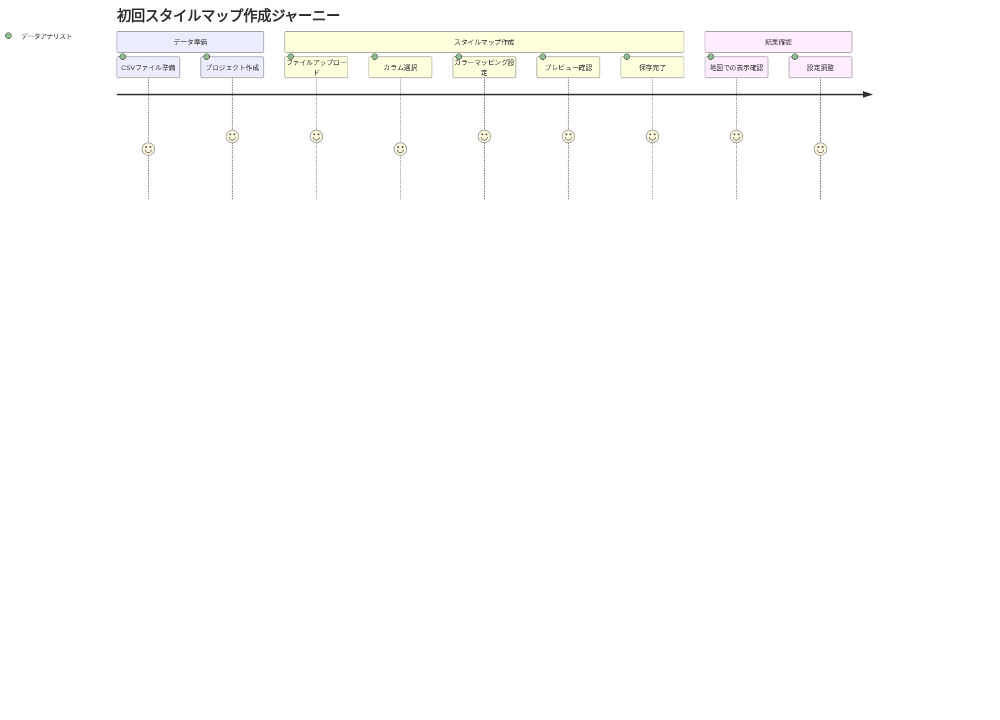
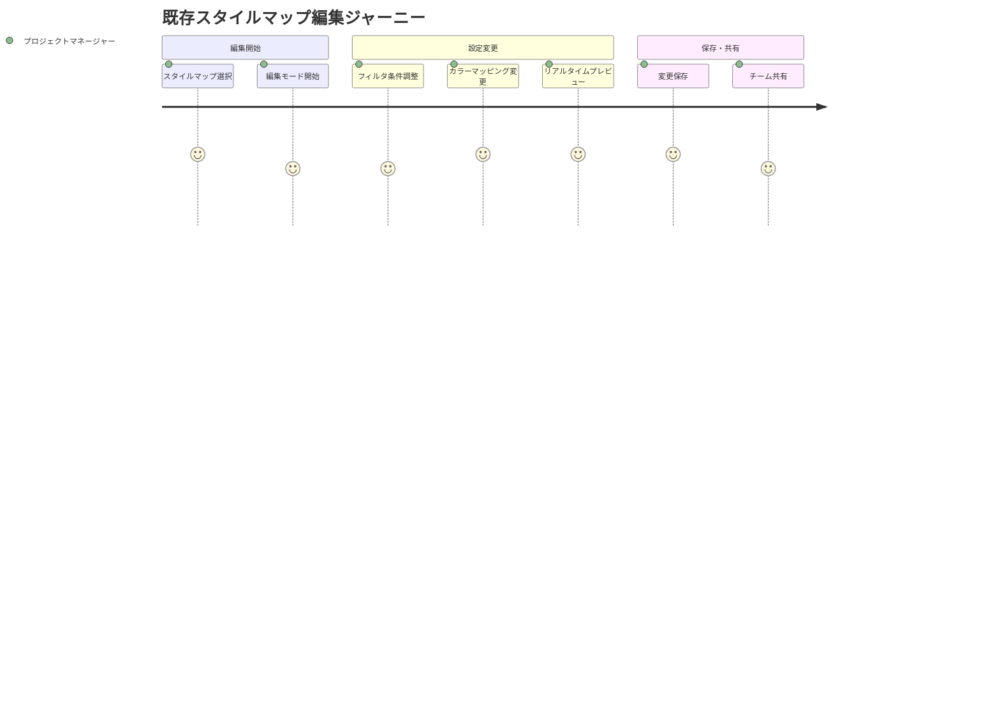

# plugin-stylemap ユーザストーリー

## 概要

このドキュメントは plugin-stylemap 機能の詳細なユーザストーリーを記載します。eria-cartograph の既存実装を詳細に分析し、hierarchidb フレームワークに適応させた仕様に基づいて作成されています。

## ユーザー種別の定義

### プライマリユーザー

- **データアナリスト**: 地理統計データや調査データを地図上で可視化したい専門家
- **地図開発者**: WebGIS アプリケーションでインタラクティブな地図を構築する開発者
- **研究者**: 学術研究や政策分析で地理的データ分析を行う研究者
- **プロジェクトマネージャー**: データ可視化プロジェクトを管理し、結果を確認する責任者

### セカンダリユーザー

- **システム管理者**: hierarchidb システム全体の運用・保守を担当する技術者
- **外部システム**: MapLibre GL JS や他の地図ライブラリとのAPI連携
- **データ提供者**: CSV/TSV形式で統計データや測定データを提供する組織

## ユーザストーリー

### 📚 エピック1: データインポートとテーブル管理

#### ストーリー1.1: CSVファイルからのスタイルマップ作成

**ユーザストーリー**:
- **私は** データアナリスト **として**
- **地理統計データのCSVファイルを持っている状況で**
- **そのデータを地図上で色分け表示するスタイルマップを作成したい**
- **そうすることで** データの地理的分布を直感的に理解し、意思決定に活用できる

**詳細説明**:
- **背景**: 国別人口データ、都道府県別経済指標、地域別気象データなど、表形式の地理統計データを地図可視化したいニーズ
- **前提条件**: 
  - hierarchidb プロジェクトが作成済み
  - 地理識別子（国コード、行政区域名など）と数値データを含むCSVファイルが準備済み
- **利用シーン**: 
  - 国連統計データの人口密度マップ作成
  - 企業の地域別売上データの可視化
  - 研究調査データの地理的分析
- **期待する体験**: 
  - ファイル選択から5ステップ以内でスタイルマップが完成
  - リアルタイムプレビューでマッピング結果を確認
  - 直感的なカラー設定で専門知識不要

**関連要件**: REQ-001, REQ-002, REQ-004

**優先度**: 高

**見積もり**: 13 ストーリーポイント

#### ストーリー1.2: ファイル形式の自動判定と検証

**ユーザストーリー**:
- **私は** 地図開発者 **として**
- **様々な形式のデータファイルを扱う状況で**
- **システムが自動的にサポート可能な形式を判定し、適切なエラーメッセージを表示してほしい**
- **そうすることで** 開発効率を向上させ、ユーザーへの適切なガイダンスを提供できる

**詳細説明**:
- **背景**: CSV、TSV、Excel等の多様なファイル形式が混在する開発環境
- **前提条件**: ファイルアップロード機能が利用可能
- **利用シーン**: 
  - 異なるデータソースからの一括インポート
  - クライアントから提供される様々な形式のファイル処理
- **期待する体験**: 
  - ドラッグ&ドロップでファイル形式を自動判定
  - 非対応形式の場合は推奨形式への変換方法を案内
  - エラー時の分かりやすい説明とリカバリ手順の提示

**関連要件**: REQ-102, EDGE-001

**優先度**: 中

**見積もり**: 8 ストーリーポイント

#### ストーリー1.3: 大容量ファイルの効率的処理

**ユーザストーリー**:
- **私は** 研究者 **として**
- **数万〜数十万行の大規模データセットを扱う状況で**
- **システムがメモリ効率よく処理し、応答性を保持してほしい**
- **そうすることで** 大規模分析でもストレスなく作業を継続できる

**詳細説明**:
- **背景**: 全国市区町村データ、詳細な気象観測データなど大容量データの分析需要
- **前提条件**: Web Worker 環境での並列処理対応
- **利用シーン**: 
  - 国勢調査データ（数十万レコード）の可視化
  - IoTセンサーデータの時系列地図表示
- **期待する体験**: 
  - 処理進捗の視覚的表示
  - UI のブロッキングなし
  - メモリ不足時の適切な警告とガイダンス

**関連要件**: NFR-001, EDGE-103

**優先度**: 中

**見積もり**: 21 ストーリーポイント

### 📚 エピック2: カラーマッピングとビジュアライゼーション

#### ストーリー2.1: 直感的なカラーマッピング設定

**ユーザストーリー**:
- **私は** プロジェクトマネージャー **として**
- **技術的な詳細に詳しくない状況で**
- **簡単な操作でデータの大小に応じた色分けを設定したい**
- **そうすることで** チームメンバーや関係者に分かりやすいビジュアルレポートを作成できる

**詳細説明**:
- **背景**: データドリブンな意思決定のため、非技術者でも使いやすい可視化ツールが必要
- **前提条件**: StyleMapConfiguration コンポーネントが利用可能
- **利用シーン**: 
  - 営業チームへの地域別売上報告
  - 経営陣への市場分析プレゼンテーション
  - 研究発表での視覚的データ提示
- **期待する体験**: 
  - スライダーとカラーピッカーによる直感的操作
  - リアルタイムプレビューでの即座な結果確認
  - 事前定義されたカラーテーマの選択肢

**関連要件**: REQ-003, REQ-105, NFR-202

**優先度**: 高

**見積もり**: 13 ストーリーポイント

#### ストーリー2.2: 複数のカラーアルゴリズム対応

**ユーザストーリー**:
- **私は** データアナリスト **として**
- **データの分布特性に応じて最適な可視化を選択したい状況で**
- **線形、対数、分位数、カテゴリ別のマッピングアルゴリズムを使い分けたい**
- **そうすることで** データの特徴を正確に表現し、誤解のない分析結果を提供できる

**詳細説明**:
- **背景**: データによって正規分布、べき分布、カテゴリ分布など特性が異なり、適切な可視化手法が必要
- **前提条件**: StyleMapConfig での algorithm 設定が実装済み
- **利用シーン**: 
  - 人口密度（対数分布）の可視化
  - 所得分布（分位数）の公平な表示
  - 地域分類（カテゴリ）の明確な区別
- **期待する体験**: 
  - アルゴリズム説明の分かりやすいツールチップ
  - 各アルゴリズムでのプレビュー比較機能
  - データ分布に基づく推奨アルゴリズムの自動提案

**関連要件**: REQ-301, REQ-302

**優先度**: 中

**見積もり**: 8 ストーリーポイント

#### ストーリー2.3: MapLibre GL スタイルプロパティとの連携

**ユーザストーリー**:
- **私は** 地図開発者 **として**
- **MapLibre GL JS でインタラクティブマップを構築している状況で**
- **stylemap で生成したカラー情報を適切なスタイルプロパティに適用したい**
- **そうすることで** 統一感のある高品質な地図アプリケーションを構築できる

**詳細説明**:
- **背景**: Modern Web GIS アプリケーションでの標準的な地図ライブラリとの連携需要
- **前提条件**: MapLibre GL JS v3.x との互換性確保
- **利用シーン**: 
  - 塗りつぶし色（fill-color）による面積表示
  - 線幅（line-width）による道路の重要度表示
  - 円のサイズ（circle-radius）による点データの量的表現
- **期待する体験**: 
  - プロパティ選択の視覚的プレビュー
  - スタイル適用後の地図での即座な確認
  - 複数プロパティの組み合わせ設定

**関連要件**: REQ-005, NFR-301

**優先度**: 高

**見積もり**: 13 ストーリーポイント

### 📚 エピック3: データフィルタリングと加工

#### ストーリー3.1: 動的データフィルタリング

**ユーザストーリー**:
- **私は** 研究者 **として**
- **多様な条件を含む大規模データセットを分析する状況で**
- **特定の条件に合致するデータのみを抽出してマッピングしたい**
- **そうすることで** 分析目的に応じた的確なデータ可視化を実現できる

**詳細説明**:
- **背景**: 時系列データ、多属性データでの条件付き分析の必要性
- **前提条件**: FilterRule システムが実装済み
- **利用シーン**: 
  - 特定年度のみの経済指標表示
  - 一定人口以上の都市のみのマッピング
  - 地域分類コードによる絞り込み表示
- **期待する体験**: 
  - AND/OR条件の論理的組み合わせ
  - 正規表現パターンマッチング
  - フィルタ適用結果のリアルタイムプレビュー

**関連要件**: REQ-104, REQ-303

**優先度**: 中

**見積もり**: 13 ストーリーポイント

#### ストーリー3.2: テンプレートフィルタの活用

**ユーザストーリー**:
- **私は** データアナリスト **として**
- **よく使用するフィルタ条件を再利用したい状況で**
- **事前定義されたテンプレートや保存した設定を簡単に適用したい**
- **そうすることで** 繰り返し作業の効率化と設定ミスの防止を実現できる

**詳細説明**:
- **背景**: 定期的なレポート作成、標準的な分析パターンでの作業効率化需要
- **前提条件**: createTotalPopulationByCountryTemplateFilterRules 等のテンプレート機能
- **利用シーン**: 
  - 国別統計での標準的な除外条件適用
  - 企業別の定型分析パターン適用
  - 研究プロジェクトでの統一フィルタ基準使用
- **期待する体験**: 
  - テンプレート一覧からの選択適用
  - カスタムテンプレートの保存・管理
  - テンプレートのプロジェクト間共有

**関連要件**: REQ-104, REQ-303

**優先度**: 低

**見積もり**: 8 ストーリーポイント

### 📚 エピック4: 作業コピーとデータ管理

#### ストーリー4.1: 安全な編集とアンドゥ機能

**ユーザストーリー**:
- **私は** プロジェクトマネージャー **として**
- **重要なデータ設定を編集している状況で**
- **誤操作や設定ミスから元の状態に簡単に戻れる仕組みがほしい**
- **そうすることで** 安心してデータ設定の試行錯誤を行い、最適な可視化を実現できる

**詳細説明**:
- **背景**: データ可視化での試行錯誤プロセスにおける安全性確保
- **前提条件**: 作業コピーパターンとEphemeralDBの実装
- **利用シーン**: 
  - カラーマッピング設定の複数パターン試行
  - フィルタ条件の段階的調整
  - 異なるアルゴリズムでの比較検討
- **期待する体験**: 
  - ワンクリックでの元設定への復帰
  - 編集履歴の視覚的表示
  - 自動保存による作業内容の保護

**関連要件**: REQ-007, REQ-203

**優先度**: 高

**見積もり**: 13 ストーリーポイント

#### ストーリー4.2: 効率的なファイルキャッシュ機能

**ユーザストーリー**:
- **私は** 地図開発者 **として**
- **同じデータファイルを複数のプロジェクトで使用する状況で**
- **重複アップロードやメモリ無駄遣いを避けて効率的にデータを管理したい**
- **そうすることで** アプリケーションのパフォーマンスを向上させ、ストレージコストを削減できる

**詳細説明**:
- **背景**: Web アプリケーションでのファイル管理効率化とパフォーマンス最適化
- **前提条件**: SHA3ハッシュベースのキャッシュシステム実装
- **利用シーン**: 
  - 複数プロジェクトでの共通データセット利用
  - 頻繁にアクセスするリファレンスデータの高速読み込み
  - チームでの同一データファイル共有
- **期待する体験**: 
  - 初回アップロード後の即座なファイル認識
  - 透明なキャッシュ処理（ユーザーは意識不要）
  - キャッシュサイズと有効期限の管理画面

**関連要件**: REQ-006, REQ-103, NFR-003

**優先度**: 中

**見積もり**: 13 ストーリーポイント

### 📚 エピック5: 統合とワークフロー

#### ストーリー5.1: hierarchidb プロジェクトとの統合

**ユーザストーリー**:
- **私は** システム管理者 **として**
- **hierarchidb フレームワーク内でstylemap プラグインを管理する状況で**
- **他のプラグインと一貫した操作性とデータ管理を実現したい**
- **そうすることで** システム全体の保守性と拡張性を保持できる

**詳細説明**:
- **背景**: プラグインアーキテクチャでの統一性とモジュール性の確保
- **前提条件**: hierarchidb の4層アーキテクチャとAOPノードシステム
- **利用シーン**: 
  - プラグインのインストール・アップデート
  - 他のノードタイプとの連携処理
  - システム全体でのライフサイクル管理
- **期待する体験**: 
  - 他のプラグインと同様の操作フロー
  - 一貫したエラーハンドリングとログ出力
  - 設定画面での統一的な管理インターフェース

**関連要件**: REQ-501, REQ-502, REQ-503, REQ-504

**優先度**: 高

**見積もり**: 21 ストーリーポイント

#### ストーリー5.2: Worker層での高性能データ処理

**ユーザストーリー**:
- **私は** データアナリスト **として**
- **レスポンシブなUIを維持したまま大容量データを処理したい状況で**
- **バックグラウンドでの並列処理により作業を継続したい**
- **そうすることで** 処理待機時間を有効活用し、全体的な作業効率を向上できる

**詳細説明**:
- **背景**: Web Worker を活用したノンブロッキング処理による UX 向上
- **前提条件**: Comlink RPC によるWorker層との通信実装
- **利用シーン**: 
  - 大容量CSVファイルの解析処理
  - 複雑なフィルタ条件での大量データ絞り込み
  - 複数ファイルの並列処理
- **期待する体験**: 
  - UI操作の継続的な応答性
  - 処理進捗の透明な表示
  - 処理キャンセルとリトライ機能

**関連要件**: REQ-505, REQ-506, REQ-507, ARCH-001, ARCH-002

**優先度**: 中

**見積もり**: 21 ストーリーポイント

## ユーザージャーニー

### ジャーニー1: 初回スタイルマップ作成フロー

**詳細**:
1. **CSVファイル準備**: 地理識別子と数値データを含むファイルの準備（満足度: 4/5）
2. **プロジェクト作成**: hierarchidb プロジェクト環境のセットアップ（満足度: 5/5）
3. **ファイルアップロード**: 直感的なドラッグ&ドロップインターフェース（満足度: 5/5）
4. **カラム選択**: キーカラムと値カラムの明確な選択UI（満足度: 4/5）
5. **カラーマッピング設定**: 視覚的なカラー設定とアルゴリズム選択（満足度: 5/5）
6. **プレビュー確認**: リアルタイムでの結果確認機能（満足度: 5/5）
7. **保存完了**: 設定の永続化と確認メッセージ（満足度: 5/5）
8. **地図での表示確認**: MapLibre GL JSでの実際の可視化確認（満足度: 5/5）
9. **設定調整**: 必要に応じた微調整とイテレーション（満足度: 4/5）

### ジャーニー2: 既存スタイルマップの編集フロー

**詳細**:
1. **スタイルマップ選択**: プロジェクト内での既存リソース選択（満足度: 5/5）
2. **編集モード開始**: 作業コピー作成と安全な編集環境提供（満足度: 4/5）
3. **フィルタ条件調整**: 既存フィルタの修正と新規条件追加（満足度: 4/5）
4. **カラーマッピング変更**: カラーアルゴリズムやスタイルプロパティの変更（満足度: 5/5）
5. **リアルタイムプレビュー**: 変更内容の即座な視覚的確認（満足度: 5/5）
6. **変更保存**: 編集内容の確実な永続化（満足度: 5/5）
7. **チーム共有**: プロジェクトメンバーとの設定共有（満足度: 4/5）

## ペルソナ定義

### ペルソナ1: 田中 恵子（データアナリスト）

- **基本情報**: 32歳、政府系シンクタンク勤務、統計学修士、GIS経験3年
- **ゴール**: 政策提言のための地域統計データを効果的に可視化し、説得力のあるレポートを作成
- **課題**: 
  - 複雑なGISソフトウェアの習得時間不足
  - 大容量データの処理性能問題
  - 非技術者への分かりやすい説明資料作成
- **行動パターン**: 
  - 月次での定期レポート作成
  - 複数データソースの組み合わせ分析
  - プレゼンテーション資料での視覚的訴求重視
- **利用環境**: Windows PC、Chrome ブラウザ、オフィス環境、時々リモートワーク

### ペルソナ2: 佐藤 拓也（地図開発者）

- **基本情報**: 28歳、Web開発会社勤務、情報工学学士、JavaScript/TypeScript専門
- **ゴール**: クライアント要求に応じた高品質なWebGISアプリケーションの効率的な開発
- **課題**: 
  - 地図ライブラリとの連携複雑性
  - パフォーマンスチューニングの困難さ
  - データフォーマットの多様性対応
- **行動パターン**: 
  - アジャイル開発でのスプリント単位作業
  - GitHub での継続的インテグレーション活用
  - 技術コミュニティでの情報収集
- **利用環境**: MacBook Pro、VS Code、Docker環境、複数ブラウザでのテスト

### ペルソナ3: 山田 博文（研究者）

- **基本情報**: 45歳、国立大学准教授、地理学博士、研究歴15年
- **ゴール**: 学術研究での地理空間分析結果を国際会議や論文で発表
- **課題**: 
  - 最新技術への適応コスト
  - 研究予算内でのツール選択制限
  - 再現可能な分析手法の確立
- **行動パターン**: 
  - 長期研究プロジェクトでの継続的データ収集
  - 国際共同研究でのデータ共有
  - 学会発表での高品質ビジュアライゼーション要求
- **利用環境**: 大学支給PC、研究室LAN、時々海外出張先

### ペルソナ4: 鈴木 美咲（プロジェクトマネージャー）

- **基本情報**: 38歳、コンサルティング会社勤務、MBA取得、プロジェクト管理経験10年
- **ゴール**: クライアント向けデータ分析プロジェクトの品質管理と効率的な進行管理
- **課題**: 
  - 技術的詳細の理解不足
  - 多様なステークホルダーとの調整
  - 納期制約内での品質確保
- **行動パターン**: 
  - 週次での進捗確認とレビュー
  - クライアント向けプレゼンテーション作成
  - チームメンバーとの密接なコミュニケーション
- **利用環境**: Surface Pro、Teams/Slack、モバイル端末、頻繁な客先訪問

## 非機能的ユーザー要求

### ユーザビリティ要求

- **学習容易性**: 
  - 初回利用時のチュートリアル完了時間 15分以内
  - 基本操作習得までの操作回数 3回以内
  - ヘルプドキュメントへの参照頻度 月1回以下
- **効率性**: 
  - 熟練ユーザーでのスタイルマップ作成時間 5分以内
  - 一般的な設定変更の完了時間 30秒以内
  - バッチ処理での複数ファイル処理効率 80%向上
- **記憶しやすさ**: 
  - 1週間後の操作手順再現率 80%以上
  - UI要素の位置・機能の直感的理解度 90%以上
  - ショートカットキーの記憶・活用率 60%以上
- **エラー対応**: 
  - ユーザーエラーの自己解決率 85%以上
  - エラーメッセージの理解しやすさ 90%以上
  - 誤操作からの復旧時間 10秒以内
- **満足度**: 
  - 全体的な使いやすさ評価 4.2/5.0以上
  - 機能の充実度評価 4.0/5.0以上
  - 推奨意向度（NPS） +40以上

### アクセシビリティ要求

- **視覚**: 
  - WCAG 2.1 AA準拠のカラーコントラスト比 4.5:1以上
  - フォントサイズ 14px以上での表示対応
  - カラーブラインドネス対応のカラーパレット提供
- **聴覚**: 
  - 音声による状態通知のテキスト代替提供
  - 動画コンテンツの字幕・文字起こし完備
- **運動**: 
  - キーボード操作のみでの全機能アクセス可能
  - マウス操作代替のショートカットキー完備
  - タッチデバイスでの44px以上のタップターゲットサイズ
- **認知**: 
  - 複雑な操作の段階的ガイダンス提供
  - 一貫したナビゲーション構造の維持
  - 重要操作の確認ダイアログ表示

### パフォーマンス要求

- **応答性**: 
  - ページ読み込み完了時間 3秒以内
  - インタラクション応答時間 100ms以内
  - プレビュー更新時間 500ms以内
- **スケーラビリティ**: 
  - 同時ユーザー数 100人での性能維持
  - ファイルサイズ 100MB までの対応
  - データ行数 50万行までの処理保証
- **信頼性**: 
  - システム稼働率 99.5%以上
  - データ消失確率 0.01%以下
  - 自動復旧成功率 95%以上