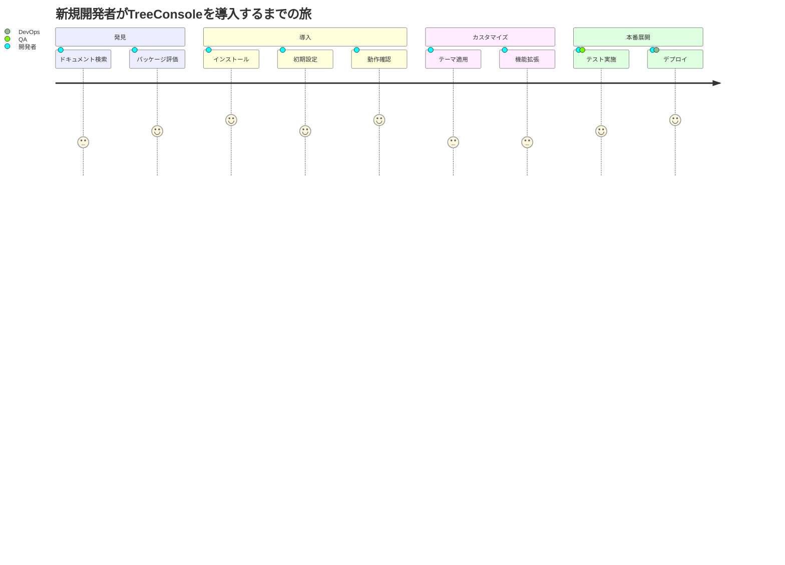
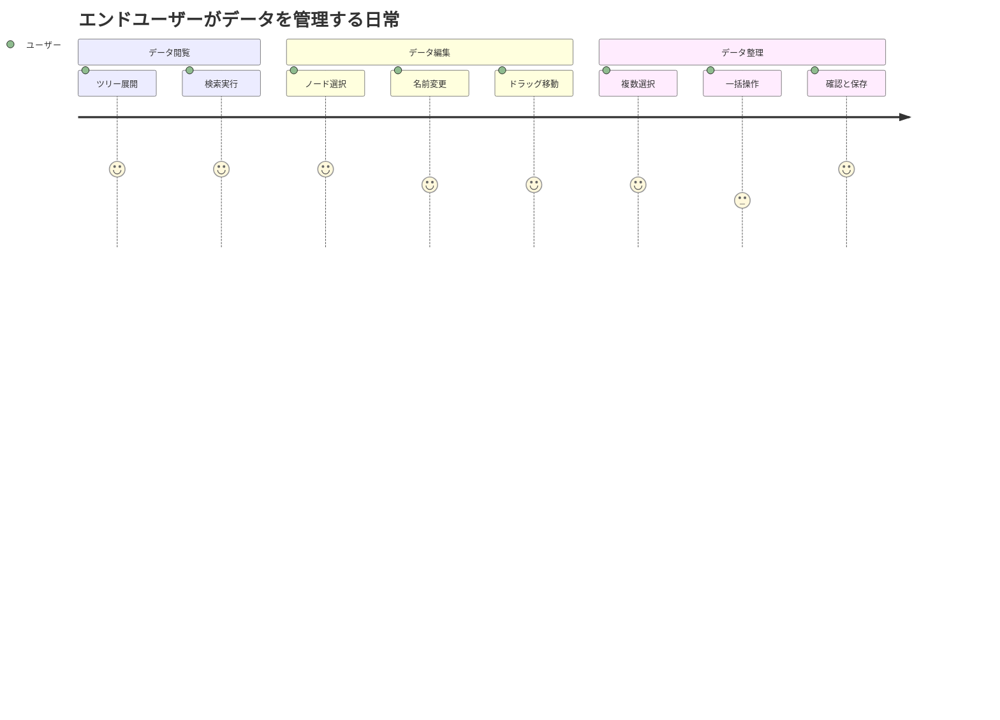

# TreeConsole Migration ユーザストーリー

## 概要

このドキュメントは、TreeConsoleコンポーネントの移行に関する詳細なユーザストーリーを記載します。移行によって影響を受けるすべてのステークホルダーの視点から、要求と期待を明確化します。

## ユーザー種別の定義

### プライマリユーザー

- **フロントエンド開発者**: HierarchiDBを使用してアプリケーションを開発する開発者。TreeConsoleパッケージの主要な利用者。TypeScript/React経験3年以上、コンポーネントライブラリの使用経験あり。

- **パッケージメンテナー**: HierarchiDBのコア開発チームメンバー。パッケージの保守、更新、品質管理を担当。モノレポ管理経験、OSS貢献経験あり。

- **アプリケーションエンドユーザー**: TreeConsoleを搭載したアプリケーションの最終利用者。技術知識は限定的だが、効率的なデータ管理を求める。

### セカンダリユーザー

- **システムインテグレーター**: HierarchiDBを既存システムに統合する技術者。API互換性、パフォーマンス、セキュリティを重視。

- **QAエンジニア**: TreeConsoleコンポーネントのテストを担当。自動テスト、手動テスト、パフォーマンステストを実施。

- **DevOpsエンジニア**: CI/CDパイプライン、デプロイメント、監視を担当。ビルド時間、バンドルサイズを重視。

## ユーザストーリー

### 📚 エピック1: パッケージ利用と統合

#### ストーリー1.1: パッケージのインストールと初期設定 🟢

**ユーザストーリー**:
- **私は** フロントエンド開発者 **として**
- **新規プロジェクトでツリー構造のデータ管理機能が必要な** **において**
- **npm/pnpmで@hierarchidb/ui-treeconsoleをインストールして、最小限の設定で動作させたい**
- **そうすることで** 開発時間を短縮し、信頼性の高いUIコンポーネントを利用できる

**詳細説明**:
- **背景**: 多くのプロジェクトで階層データの管理UIが必要だが、一から開発するのは時間がかかる
- **前提条件**: React 18以上、TypeScript環境が構築済み
- **利用シーン**: 新規プロジェクトの立ち上げ時、既存プロジェクトへの機能追加時
- **期待する体験**: 5分以内にインストールから基本的な動作確認まで完了

**関連要件**: REQ-001, REQ-401, REQ-405

**優先度**: 高

**見積もり**: 3ストーリーポイント

#### ストーリー1.2: カスタムテーマの適用 🟡

**ユーザストーリー**:
- **私は** フロントエンド開発者 **として**
- **自社のブランドガイドラインに従ったUIを構築する必要がある状況** **において**
- **TreeConsoleコンポーネントにカスタムテーマを適用したい**
- **そうすることで** 統一感のあるユーザー体験を提供できる

**詳細説明**:
- **背景**: 企業アプリケーションでは独自のカラースキームやスタイルガイドの適用が必須
- **前提条件**: Material-UIテーマシステムの理解
- **利用シーン**: エンタープライズアプリケーション開発、ブランディング要件がある場合
- **期待する体験**: CSS-in-JSまたはテーマプロバイダーを通じた簡単なカスタマイズ

**関連要件**: REQ-301, NFR-205

**優先度**: 中

**見積もり**: 5ストーリーポイント

#### ストーリー1.3: 大規模データセットの処理 🟢

**ユーザストーリー**:
- **私は** アプリケーションエンドユーザー **として**
- **10,000件以上のデータを扱う業務** **において**
- **スムーズなスクロールと高速な検索でデータを操作したい**
- **そうすることで** 業務効率を維持し、ストレスなく作業を完了できる

**詳細説明**:
- **背景**: データ量の増加に伴い、パフォーマンス問題が顕在化
- **前提条件**: 大規模データセットが存在する環境
- **利用シーン**: データカタログ管理、ファイルシステムブラウザ、組織階層管理
- **期待する体験**: 10,000ノードでも1秒以内の初期表示、スムーズなスクロール

**関連要件**: REQ-003, NFR-001, NFR-002

**優先度**: 高

**見積もり**: 8ストーリーポイント

### 📚 エピック2: 開発とメンテナンス

#### ストーリー2.1: コンポーネントのテスト 🟢

**ユーザストーリー**:
- **私は** QAエンジニア **として**
- **TreeConsoleを使用した機能の品質保証を行う際** **において**
- **包括的なテストツールとモックデータを使用してテストを実行したい**
- **そうすることで** バグの早期発見と品質の維持ができる

**詳細説明**:
- **背景**: UIコンポーネントのテストは複雑で、適切なツールとデータが必要
- **前提条件**: Jest/Vitest、React Testing Library環境
- **利用シーン**: 単体テスト、統合テスト、E2Eテスト
- **期待する体験**: テストユーティリティとフィクスチャの提供、90%以上のカバレッジ

**関連要件**: NFR-301, EDGE-001〜004

**優先度**: 高

**見積もり**: 5ストーリーポイント

#### ストーリー2.2: パッケージの更新と移行 🟡

**ユーザストーリー**:
- **私は** パッケージメンテナー **として**
- **依存関係の更新や新機能の追加が必要な時** **において**
- **既存の利用者に影響を与えずにパッケージを更新したい**
- **そうすることで** 技術的負債を最小限に抑えながら進化を続けられる

**詳細説明**:
- **背景**: 定期的な更新は必須だが、破壊的変更は避けたい
- **前提条件**: セマンティックバージョニング、CI/CDパイプライン
- **利用シーン**: セキュリティパッチ適用、新機能追加、バグ修正
- **期待する体験**: 自動化されたテストとリリースプロセス、明確な移行ガイド

**関連要件**: MIG-001, MIG-002, NFR-304

**優先度**: 中

**見積もり**: 8ストーリーポイント

### 📚 エピック3: エンドユーザー体験

#### ストーリー3.1: 直感的なツリー操作 🟢

**ユーザストーリー**:
- **私は** アプリケーションエンドユーザー **として**
- **日常的にツリー構造のデータを整理する業務** **において**
- **ドラッグ＆ドロップや右クリックメニューで直感的に操作したい**
- **そうすることで** 学習コストを最小限に抑えて生産性を向上できる

**詳細説明**:
- **背景**: 複雑なUIは学習コストが高く、採用の障壁となる
- **前提条件**: 基本的なPC操作スキル
- **利用シーン**: フォルダ整理、カテゴリ管理、組織構造編集
- **期待する体験**: エクスプローラーやFinderと同様の操作感

**関連要件**: REQ-004, REQ-101, NFR-201, NFR-202

**優先度**: 高

**見積もり**: 5ストーリーポイント

#### ストーリー3.2: アクセシビリティ対応 🟢

**ユーザストーリー**:
- **私は** 視覚障害を持つエンドユーザー **として**
- **スクリーンリーダーを使用してアプリケーションを操作する際** **において**
- **キーボードのみですべての機能にアクセスしたい**
- **そうすることで** 他のユーザーと同等の作業効率を達成できる

**詳細説明**:
- **背景**: アクセシビリティは法的要件でもあり、倫理的責任でもある
- **前提条件**: スクリーンリーダー（JAWS、NVDA等）の使用
- **利用シーン**: データ入力、情報検索、レポート作成
- **期待する体験**: 明確な音声フィードバック、論理的なタブ順序

**関連要件**: NFR-201, NFR-202, NFR-203

**優先度**: 高

**見積もり**: 8ストーリーポイント

## ユーザージャーニー

### ジャーニー1: 新規開発者のオンボーディング

**詳細**:
1. **ドキュメント検索**: READMEとAPIドキュメントを確認
2. **パッケージ評価**: デモとStorybookで機能を確認
3. **インストール**: npm/pnpmでパッケージを追加
4. **初期設定**: 基本的なpropsを設定して組み込み
5. **動作確認**: サンプルデータで基本動作を確認
6. **テーマ適用**: ブランドカラーとスタイルを適用
7. **機能拡張**: カスタムアクションを追加
8. **テスト実施**: 単体・統合テストを作成
9. **デプロイ**: 本番環境へのリリース

### ジャーニー2: エンドユーザーの日常操作

## ペルソナ定義

### ペルソナ1: 田中 太郎（フロントエンド開発者）

- **基本情報**: 28歳、Web開発会社勤務、React経験3年、TypeScript経験2年
- **ゴール**: 高品質なUIを短期間で実装し、クライアントの要求を満たす
- **課題**: 複雑なUI要件と短い納期のバランス、技術選定の責任
- **行動パターン**: 公式ドキュメント重視、コミュニティ活用、OSSへの積極的な貢献
- **利用環境**: MacBook Pro、VS Code、Chrome DevTools

### ペルソナ2: 佐藤 花子（プロダクトマネージャー兼エンドユーザー）

- **基本情報**: 35歳、事業会社勤務、Excel上級者、プログラミング経験なし
- **ゴール**: チームの生産性向上、データの可視化と共有の効率化
- **課題**: 技術的な制約の理解、チームメンバーへの教育
- **行動パターン**: ビジュアル重視、ショートカット多用、定型作業の自動化を好む
- **利用環境**: Windows 11、Edge、1920x1080ディスプレイ

### ペルソナ3: 山田 次郎（アクセシビリティが必要なユーザー）

- **基本情報**: 42歳、データアナリスト、弱視、スクリーンリーダー使用歴5年
- **ゴール**: 視覚的制限に関わらず、同僚と同等の作業効率を達成
- **課題**: 不適切なアクセシビリティ実装による作業の遅延
- **行動パターン**: キーボード中心の操作、音声フィードバック依存、高コントラストモード使用
- **利用環境**: Windows 11、NVDA、キーボードナビゲーション

## 非機能的ユーザー要求

### ユーザビリティ要求

- **学習容易性**: 既存のファイルマネージャーの経験があれば15分以内に基本操作を習得可能
- **効率性**: 熟練ユーザーは1分間に20以上のノード操作が可能
- **記憶しやすさ**: 1週間使用しない後でも、主要機能を忘れずに使用可能
- **エラー対応**: エラー発生時に明確な原因と解決方法を提示
- **満足度**: System Usability Scale (SUS)スコア80以上

### アクセシビリティ要求

- **視覚**: 色だけに依存しない情報伝達、十分なコントラスト比（4.5:1以上）
- **聴覚**: 音声フィードバックに代わる視覚的フィードバックの提供
- **運動**: 大きなクリックターゲット（44x44px以上）、ドラッグ操作の代替手段
- **認知**: シンプルで一貫性のある操作、明確なラベルとヘルプテキスト