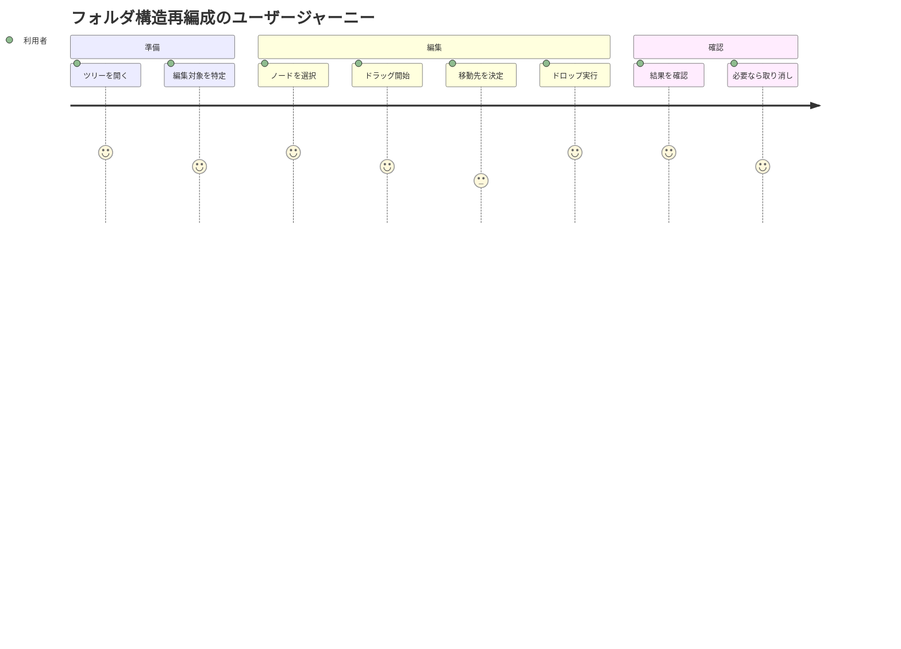

# Worker実装 ユーザストーリー

## 概要

このドキュメントはWorker層実装の詳細なユーザストーリーを記載します。

## ユーザー種別の定義

### プライマリユーザー

- **フロントエンド開発者**: 🟢 Worker APIを通じてツリーデータを操作するReact開発者
- **アプリケーション利用者**: 🟢 ブラウザでツリー構造データを編集・管理するエンドユーザー
- **システム統合者**: 🟡 hierarchidbを拡張してドメイン固有の機能を実装する開発者

### セカンダリユーザー

- **メンテナンス担当者**: 🟡 システムのデバッグや性能チューニングを行う技術者
- **UI層**: 🟢 Comlink経由でWorkerと通信するフロントエンドモジュール

## ユーザストーリー

### 📚 エピック1: データ操作とCRUD

#### ストーリー1.1: ノードの新規作成

**ユーザストーリー**:
- **私は** フロントエンド開発者 **として**
- **新しいフォルダやファイルをツリーに追加したい状況** において
- **Working Copyを作成してから確定する2段階の作成フロー** をしたい
- **そうすることで** ユーザーが入力をキャンセルできる柔軟な編集体験を提供できる

**詳細説明**:
- **背景**: 🟢 直接作成ではなくWorking Copy経由にすることで、編集の一時保存とキャンセルが可能
- **前提条件**: 🟢 親ノードのTreeNodeIdが既知であること
- **利用シーン**: フォルダ右クリックメニューから「新規作成」を選択
- **期待する体験**: 名前入力ダイアログ表示中もツリー操作が可能

**関連要件**: REQ-001, REQ-004, REQ-101

**優先度**: 高

**見積もり**: 5ポイント

#### ストーリー1.2: 既存ノードの編集

**ユーザストーリー**:
- **私は** アプリケーション利用者 **として**
- **既存のノードの名前や説明を変更したい** において
- **楽観的ロックで競合を検出しながら安全に編集** をしたい
- **そうすることで** 他のタブでの同時編集による不整合を防げる

**詳細説明**:
- **背景**: 🟢 複数タブでの同時編集時のデータ整合性確保
- **前提条件**: 🟢 編集対象ノードのupdatedAtタイムスタンプを保持
- **利用シーン**: ノードをダブルクリックして編集モード
- **期待する体験**: 競合時は明確なエラーメッセージと再読み込み提案

**関連要件**: REQ-102, REQ-103, REQ-104

**優先度**: 高

**見積もり**: 8ポイント

#### ストーリー1.3: ノードの移動

**ユーザストーリー**:
- **私は** アプリケーション利用者 **として**
- **ドラッグ&ドロップでノードを別の場所に移動** したい
- **移動先での名前競合を自動解決** してほしい
- **そうすることで** 直感的なツリー構造の再編成ができる

**詳細説明**:
- **背景**: 🟢 ファイルシステムのような直感的な操作性
- **前提条件**: 🟢 移動元と移動先が同一ツリー内
- **利用シーン**: プロジェクト構造のリファクタリング
- **期待する体験**: 自己や子孫への移動は視覚的に禁止

**関連要件**: REQ-105, REQ-402, REQ-403

**優先度**: 高

**見積もり**: 13ポイント

### 📚 エピック2: 購読とリアルタイム同期

#### ストーリー2.1: ツリーの部分購読

**ユーザストーリー**:
- **私は** フロントエンド開発者 **として**
- **巨大なツリーの一部分のみを効率的に表示** したい
- **pageNodeId以下の展開されたノードのみを購読** したい
- **そうすることで** パフォーマンスを維持しながら大規模データを扱える

**詳細説明**:
- **背景**: 🟢 10万ノード規模でも快適な操作性
- **前提条件**: 🟢 URLパスで/t/:treeId/:pageNodeIdを指定
- **利用シーン**: 深い階層構造のプロジェクトナビゲーション
- **期待する体験**: 遅延ロードによるスムーズな展開

**関連要件**: REQ-007, REQ-008, REQ-009

**優先度**: 高

**見積もり**: 21ポイント

#### ストーリー2.2: 複数タブでのリアルタイム同期

**ユーザストーリー**:
- **私は** アプリケーション利用者 **として**
- **同じツリーを複数のブラウザタブで開いている** 状況で
- **一方のタブでの変更が他のタブに即座に反映** されることを期待する
- **そうすることで** 一貫性のあるデータビューを維持できる

**詳細説明**:
- **背景**: 🟢 差分検出と16msコアレスによる効率的な同期
- **前提条件**: 🟢 同一ブラウザセッション内
- **利用シーン**: 複数ビューでの比較編集作業
- **期待する体験**: ちらつきのないスムーズな更新

**関連要件**: REQ-008, REQ-009, REQ-201

**優先度**: 中

**見積もり**: 13ポイント

### 📚 エピック3: Undo/Redoと履歴管理

#### ストーリー3.1: 操作の取り消し

**ユーザストーリー**:
- **私は** アプリケーション利用者 **として**
- **誤った操作を行った直後** に
- **Ctrl+Zで直前の操作を取り消し** たい
- **そうすることで** 安心して試行錯誤できる

**詳細説明**:
- **背景**: 🟢 Undo-as-a-Command方式で逆操作を新規コマンドとして実行
- **前提条件**: 🟢 コマンドバッファに履歴が存在
- **利用シーン**: 誤削除、誤移動の即座の修正
- **期待する体験**: 200ms以内の高速な取り消し

**関連要件**: REQ-106, REQ-404, REQ-405

**優先度**: 高

**見積もり**: 8ポイント

## ユーザージャーニー

### ジャーニー1: フォルダ構造の再編成

**詳細**:
1. **ツリーを開く**: 🟢 subscribeSubTreeでpageNodeId以下を購読開始
2. **編集対象を特定**: 🟢 展開状態を調整して目的のノードを表示
3. **ノードを選択**: UI層で選択状態を管理
4. **ドラッグ開始**: UI層でドラッグイベント処理
5. **移動先を決定**: 🟢 移動可能性をWorkerで事前検証
6. **ドロップ実行**: 🟢 moveNodesコマンドをWorkerに送信
7. **結果を確認**: 🟢 差分通知で画面自動更新
8. **必要なら取り消し**: 🟢 undoコマンドで元に戻す

## ペルソナ定義

### ペルソナ1: Reactフロントエンド開発者

- **基本情報**: 🟢 25-35歳、Web開発経験3-5年、TypeScript熟練
- **ゴール**: 堅牢でレスポンシブなツリーUIの実装
- **課題**: 非同期処理とステート管理の複雑性
- **行動パターン**: ドキュメント重視、型安全性を重要視
- **利用環境**: VS Code、Chrome DevTools、React Developer Tools

### ペルソナ2: プロジェクトマネージャー（エンドユーザー）

- **基本情報**: 🟡 30-45歳、技術的背景は限定的、Excel/パワポ使い
- **ゴール**: プロジェクト構造の可視化と整理
- **課題**: 複雑な階層構造の把握と管理
- **行動パターン**: キーボードショートカットより右クリックメニュー
- **利用環境**: Windows、Chrome、大画面モニター

## 非機能的ユーザー要求

### ユーザビリティ要求

- **学習容易性**: 🟢 ファイルエクスプローラーと同等の操作性
- **効率性**: 🟢 キーボードショートカットで高速操作
- **記憶しやすさ**: 一般的なショートカット（Ctrl+Z等）の採用
- **エラー対応**: 🟢 明確なエラーメッセージと回復手段の提示
- **満足度**: レスポンシブで予測可能な動作

### アクセシビリティ要求

- **視覚**: 🟡 スクリーンリーダー対応のARIA属性
- **聴覚**: 音声フィードバックは使用しない
- **運動**: 🟡 キーボードのみでの完全操作
- **認知**: シンプルで一貫性のある操作体系