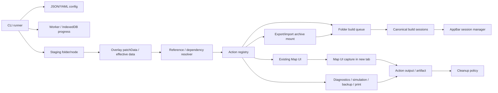

# Staged Folder Action Runner Execution Model

## 目的と対象範囲

本書は、JSON/YAML 設定から patched folder hierarchy を staging し、そこに対して action sequence を自動実行する runner の実行モデルを定義する。対象は CLI entry point、staging folder 作成、overlay、reference/dependency resolution、action registry、action 実行、既存 export/import、temporal import mount、既存 folder build queue / session manager、Map UI capture、browser 実行形態、output/artifact write、cleanup の責務境界である。

専用 route を作って通常 UI と異なる action 実装を作る案は撤回する。runner は既存の TreeConsole / AppBar session manager / Worker / IndexedDB / Map UI の正規経路を使う。

## 基本方針

CLI は以下を明示的に受け取る。

- `--source-node-id`
- `--config`
- `--output-parent-node-id`。ただし `staging.mode: permanent-copy` の場合だけ必須
- `--browser headless|headed`
- `--profile <profileName>`

CLI は source node を基準に staging target を作り、config の overlay を適用し、`actions[]` を順番に実行する。headless/headed の browser 実行形態は browser を prerequisite とする action でだけ使う。初期実装では `map-image-capture` action が該当する。

## 責務境界

| Component | 責務 | 禁止事項 |
| --- | --- | --- |
| CLI runner | 引数受け取り、config parse、progress reporting、browser/worker 起動、artifact/output write | build pipeline、plugin 処理、独自 map renderer を持つこと |
| Worker / IndexedDB progress | run progress、staging root、queue ID、phase、error を保持する | localStorage を progress SSOT にすること |
| Staging copy/import | source node/folder を `temporary-folder` または output parent 配下へ copy-on-write node tree として作成する | source を暗黙変更すること |
| Overlay engine | config の `overlay.nodes[*].data` を copy-on-write node の `patchData` または source node の committed `data` に strict merge する | missing path の推測、暗黙 default、複雑 patch の独自拡張 |
| Reference / dependency resolver | action が必要とする cross-branch reference、plugin relation、mounted content dependency を effective hierarchy 上で解決し、pending reference と hard dependency error を分離する | dependency 未解決を warning に落として実行継続すること |
| Artifact dependency lifecycle manager | build artifact が焼き込んだ dependency edge を `active/stale/rebuilding/resolved/orphaned` として管理し、target data 変更を incremental rebuild plan に接続する | 元データだけを変更して artifact を stale 管理しないこと |
| Action registry | action type ごとの schema、prerequisite、execution owner、result schema、error category を定義する | unknown action を permissive に通すこと |
| Action runner | `actions[]` を順番に実行し、action progress を Worker / IndexedDB に記録する | action ごとに別 SSOT を作ること |
| Export/import service | `export-archive` / `import-mount` action で既存 canonical export/import format を処理する | manifest 内 raw node payload を別形式として受け付けること |
| Mount lifecycle manager | `import-mount` の mount record、temporal mount、safe unmount を管理する | run 終了後に `lifetime: run` mount を残すこと |
| Folder build queue | `build` action で staging root 配下の build target を既存経路で queue 化する | 専用 CLI build queue を別に作ること |
| Session manager | build queue/session progress を WebUI に表示・操作する | export 専用 progress UI へ分断すること |
| TreeTable / node detail UI | 集合的な shape/location/route node の dependency edge 集約状態を表示し、診断/Preview へ遷移する | 個別 feature edge を集合 node row に全件展開すること |
| Preview / Map UI feature table | 個別 shape/location/route feature の dependency status icon、cell-level editing、toast/popover、編集 menu entry を提供し、edit を stale 化と incremental rebuild plan に接続する | stale/pending/orphaned を通常状態として隠すこと、表示専用 table のまま編集入口だけを別に作ること |
| Map image capture action | existing Map UI を使って地図画像を作成する | build 未完了を成功画像にすること |
| Generic action execution | diagnostics、simulation、PDF/print、backup などを registry contract に従って実行する | staging/overlay/cleanup の意味を action ごとに変えること |
| Cleanup | staging cleanup policy を実行し結果へ反映する | cleanup failure を黙殺すること |

## 実行モデル

1. CLI runner は `--source-node-id`、`--config`、`--browser`、`--profile` を検証する。
2. CLI runner は config を parse/validate し、Worker / IndexedDB progress に `validating-config` を報告する。
3. `staging.mode: permanent-copy` の場合だけ `--output-parent-node-id` を必須検証する。
4. CLI runner は指定 profile または default profile の Worker / IndexedDB progress runtime を利用可能にする。browser prerequisite を持つ action がある場合だけ browser runtime も利用可能にする。
5. `staging.mode: temporary-copy` の場合、source node/folder を system-managed `temporary-folder` 配下へ copy-on-write node tree として作成し、staging root を作る。`temporary-folder` は draft holder と同じ system holder 系列だが、draft holder ではない。通常不可視だが、temporary-copy の staging root が存在する間だけ可視化される。
6. `staging.mode: permanent-copy` の場合、source node/folder を output parent 配下へ copy-on-write node tree として作成し、staging root を作る。
7. `staging.mode: patch-source` の場合、source node/folder を staging target として扱う。
8. overlay engine は staging root から相対 path を解決し、copy-on-write node では `patchData` に strict merge を適用する。`patch-source` では各 node の committed `data` に strict merge を適用する。
9. `actions: []` の場合、CLI runner は staging root を result に出して terminal とする。
10. runner は registry で `actions[]` の各 action type と schema を検証する。unknown action は contract violation。
11. runner は `actions[]` を manifest の順序どおりに dispatch する。各 action の prerequisite と reference/dependency は実行直前にも検証する。
12. `build` action の場合、staging root に対して既存 folder build target collection を実行する。
13. `build` action は既存 `BuildJobQueue` / canonical build session を作成し、AppBar session manager から進捗を確認できる状態にする。
14. `build` action は build queue terminal state まで待つ。
15. `import-mount` action の場合、runner は archive を検証し、mount record を作成し、staging hierarchy の指定位置に mounted root を接続する。
16. `export-archive` action の場合、runner は staging hierarchy の指定 subtree を既存 export service へ渡し、artifact を書き出す。
17. browser を必要としない action は browser runtime を起動せず、staging hierarchy の effective data と action input schema だけで実行してよい。
18. `map-image-capture` action は、直前までの `build` action が completed の場合だけ capture を開始する。
19. `map-image-capture` action は `--browser headless|headed` に従い、新規 tab で通常 Map UI を開く。どちらも同じ Map UI route/component を使う。
20. `map-image-capture` action は画像を `output.path` へ書き込む。
21. action sequence が完了したら terminal result を作る。
22. runner は `lifetime: run` の import mount を safe unmount する。
23. `staging.cleanup` に従って staging root を保持または削除する。
24. CLI runner は success/error result を stdout/stderr/JSON contract に従って出す。

## Progress SSOT

progress は Worker / IndexedDB 管理を正とする。CLI は以下の phase を必ず progress API に報告する。

- config validation
- staging preparation
- overlay application
- pending reference resolution warnings/errors
- artifact dependency lifecycle updates
- dependency status UI aggregate updates
- action start / phase / terminal status
- import mount / safe unmount
- build queue creation
- build terminal status
- map-image-capture phase
- output/artifact write
- cleanup
- unexpected error

AppBar session manager は build queue/session の正規 WebUI 表示面である。CLI から起動した処理でも、同一 browser/application profile 内では staging root と build queue/session が session manager から確認できなければならない。CLI の profile 省略時は default profile を使い、`--profile <profileName>` 指定時はその profile を使う。

通常 WebUI と CLI 実行 browser profile をまたいだ progress 共有は初期仕様の保証範囲外とする。共有表示を行う場合は Worker/IndexedDB state の共有方式を別 Issue で定義する。

### Runner Progress Record

Phase 0 の runner progress は `@hierarchidb/staged-folder-action` の `StagedFolderActionRunRecord` を共有 contract とし、`@hierarchidb/runtime-worker` の IndexedDB-backed store が SSOT として保持する。

top-level run status は generic に保つ。action ごとの状態を `build-running`、`capture-running`、`diagnostics-running` のような top-level status として増やしてはならない。run が action 実行中であることは `phase: "running-action"` で表し、action-specific な詳細は `currentAction.actionType`、`currentAction.phase`、`currentAction.percentage` に格納する。

`paused`、`auth-required`、`failed`、`cancelled` は runner record に保存する。CLI stderr/stdout のみを状態の根拠にしてはならない。既存 AppBar session manager に表示するため、runtime-worker は runner record を `BuildSessionRuntimeRecord` へ投影する adapter を提供する。この投影では既存 top-level status に収まらない詳細を増やさず、`auth-required` は `paused`、`cancelled` は `failed` として表示用に写像し、詳細は runner record 側に保持する。

Phase 0 では service-level tests で IndexedDB persistence、generic `running-action`、`auth-required` の保持、BuildSessionRuntimeRecord 投影、subscribe 初期 snapshot、active run deletion guard を固定する。runtime-worker bootstrap は staged-folder-action adapter を既存 `CanonicalBuildRuntimeAdapterRegistry` に登録する。AppBar への実際の複数 nodeType 表示統合は、既存 `BuildSessionQueuePanel` が現在 `shape` nodeType を既定としているため、UI-specific follow-up として扱う。UI 統合時も専用 route や別 progress SSOT を追加してはならない。

Runner orchestration は staging preparation、overlay application、action execution、cleanup を順に行う。Phase 0 の runtime-worker runner はこれらの処理本体を注入依存として受け取り、progress store への状態遷移記録を SSOT として固定する。`actions: []` は staging/overlay 後に `completed` となり、build session を作らない。`build` action は注入された existing build session handoff だけを呼び、map capture を行わない。`build` の後に `map-image-capture` がある場合、build handoff が完了してから capture handoff に進む。

## Map Image Capture Action Boundary

`map-image-capture` action は existing Map UI を使う。専用 route や hidden capture-only route を正規経路にしない。headless 実行でも headed 実行でも、新規 tab で通常 Map UI を開く。

### Map UI Handoff Intent

runner は manifest の `map-image-capture` action をそのまま Map UI へ渡してはならない。runner は action 実行時に `MapImageCaptureIntent` を作成し、以下を含める。

- `intentId`
- `runId`
- `stagingRootNodeId`
- `browserMode: headless|headed`
- existing Map UI route target: `/map/$nodeId` の `nodeId = stagingRootNodeId`
- existing Map UI route search: `captureIntentId = intentId`
- `viewport.bbox`
- `viewport.width` / `viewport.height`
- requested `layers[]`。各 layer は staging root からの相対 path と visibility を持つ
- `output.path`

`intentId` は Map UI 側が Worker / IndexedDB state channel から capture intent を取得するための key である。route search に capture 設定本体を詰め込まない。URL search は通常 Map route 上の intent 参照だけを運び、実体は runner progress / capture intent state channel に保持する。

選定する handoff path は、`Worker / IndexedDB progress` と同じ profile 内に保持される capture intent state channel と、通常 Map route `/map/$nodeId?captureIntentId=<intentId>` の組み合わせである。この方式により、CLI から開く headless tab と、実 browser window で開く headed tab のどちらも同じ route/component/readiness contract を使う。

Phase 0 の state channel は runtime-worker の `StagedFolderActionProgressStore` に `captureIntents` table として保持する。runner は `map-image-capture` action の実行直前に `MapImageCaptureIntentRecord` を保存し、その後に browser handoff を行う。Map UI は通常 route `/map/$nodeId` の search に含まれる `captureIntentId` を使い、WorkerAPI の `getMapImageCaptureIntent(intentId)` から intent 実体を取得する。取得した intent の `stagingRootNodeId` が route の `$nodeId` と一致しない場合は contract violation として capture 実行へ進まない。

Map UI は `captureIntentId` が指定された場合だけ MapLibre の `preserveDrawingBuffer` を有効にする。intent 取得後、Map UI は `viewport.bbox` を `fitBounds` で適用し、MapLibre `idle` 後に DOM readiness marker として `data-map-image-capture-render-status="ready"` を出す。`viewport.bbox`、`viewport.width`、`viewport.height` が有限数でない場合、または bbox が `[minLng, minLat, maxLng, maxLat]` として順序を満たさない場合は contract violation として `error` を出し、capture を進めない。

runtime-worker runner は `MapImageCaptureIntentRecord` 保存後、`currentAction.phase = "handoff-created"` を記録してから browser handoff 実装を呼ぶ。browser handoff 実装は runner から渡される progress callback だけを使って `currentAction.phase` を更新する。Phase 0 で固定する `map-image-capture` action-specific phase は `opening-map-ui`、`waiting-render-ready`、`capturing-canvas`、`writing-output`、`completed` である。これらは top-level `phase` を増やさず、常に `phase: "running-action"` と `currentAction.actionType: "map-image-capture"` の下に記録する。

browser handoff は `@hierarchidb/staged-folder-action` の page port contract で表現する。port は `setViewportSize`、`goto`、`waitForRenderStatus`、`screenshot` だけを要求し、Playwright などの具体 browser 実装を shared manifest/runner contract に持ち込まない。route URL は通常 route `/map/$nodeId?captureIntentId=<intentId>` を `browser` または `hash` router mode に応じて生成する。`waitForRenderStatus` は `data-map-image-capture-render-status="ready"` を成功、`"error"` を contract failure として扱う。

terminal run を削除する場合、同じ run に属する capture intent record も削除する。active run の削除は従来どおり拒否し、実行中 capture intent を orphan にしてはならない。

却下する代替案:

- 専用 `/map-export` route: 通常 Map UI と別実装になり、既存 route/component/readiness と乖離するため採用しない。
- URL search へ bbox/layers/output などの capture 設定全体を埋め込む方式: URL 長、機密性、再試行時の状態同期、profile 境界の扱いが弱くなるため採用しない。
- CLI 側の独自 renderer: Map UI の表示ロジック、layer 解決、effective data 読み取りと二重化するため採用しない。

`map-image-capture` 成功条件:

- build queue が completed。
- requested layer path が staging root から解決できる。
- build / Map UI / capture が copy-on-write node の effective committed data を読んでいる。
- Map UI が指定 bbox / viewport / layer visibility を反映している。
- MapLibre が idle。
- canvas が nonblank。
- browser page error、unhandled rejection、WebGL context loss がない。
- image artifact write が成功している。

## Other Action Fit

同じ runner model は、地図画像作成以外にも以下の action を自然に扱える。

| Action type | Fit |
| --- | --- |
| `simulation-run` | staging / overlay 済み hierarchy を deterministic input として使える。build 成功を prerequisite にするかどうかは action schema で明示する |
| `map-pdf-render` | `map-image-capture` と同じ Map UI / browser prerequisite を共有しつつ、artifact type を PDF に変えられる |
| `map-print` | Map UI render ready 条件を共有し、output artifact ではなく print job result を action result に記録できる |
| `folder-diagnostics` | browser や build queue を不要とし、runtime-worker 側で effective data を走査して集計できる |
| `export-archive` | staging hierarchy を canonical export input として扱い、cleanup とは独立した archive artifact を生成できる |
| `import-mount` | 既存 export/import archive を action sequence 中の hierarchy として参照できる。`lifetime: run` では terminal cleanup phase で safe unmount する |
| `backup-export` | `export-archive` を基礎に backup archive artifact を生成できる |

これらを支えるため、runner は top-level phase を action 種別ごとに増やすのではなく、`running-action` と action-specific phase を progress event に分離する。

## Staging Cleanup

cleanup は action sequence の terminal point 後に実行する。

- `retain`: staging root を残す。
- `delete-on-success`: action sequence の要求範囲が成功した場合だけ staging root を削除する。
- `delete-always`: terminal result に関係なく staging root 削除を試みる。

`patch-source` では新規 staging root が存在しないため、cleanup 対象はない。`patch-source` で `delete-on-success` または `delete-always` を指定した場合は contract violation とする。

cleanup failure は result に記録する。action output/artifact が成功していても cleanup failure を完全成功として扱ってはならない。JSON result では warning ではなく structured cleanup status を含める。

## Import Mount Cleanup

`import-mount.mount.lifetime: run` は staging cleanup policy とは独立した temporal resource である。runner は action sequence の terminal result を作った後、staging root cleanup の前に safe unmount を行う。

safe unmount は以下を確認する。

- mount record から mounted root、配下 node、付随 Dexie/IndexedDB data、plugin participant data を列挙できる。
- mounted content を参照する active build session、running action、browser tab、open transaction がない。
- mounted content に未処理 write、dirty state、未保存 artifact がない。
- unmount 対象外の user-owned node、draft holder、別 staging root を削除しない。

safe unmount に失敗した場合、runner は cleanup failure として扱う。`staging.cleanup: delete-always` が指定されていても、unsafe な mounted content を暗黙削除して成功扱いにしてはならない。

## 後続 Issue との接続

- manifest parser は `docs/staged-folder-action-manifest-format.md` に従う。
- profile/cache policy は `docs/staged-folder-action-profile-cache-policy.md` を staging/copy 方針に合わせて改訂する。
- CLI logging/error は `docs/staged-folder-action-cli-logging-error-contract.md` に従う。
- 旧 dedicated route 仕様は撤回仕様として扱い、専用 route 実装を進めない。

## Rollback

本仕様のみを導入する場合、rollback は本ファイルの revert で完了する。実装 Issue では CLI entry point を未公開 command または feature flag で隔離し、既存 TreeConsole、session manager、Map UI の通常動作へ影響しないようにする。
