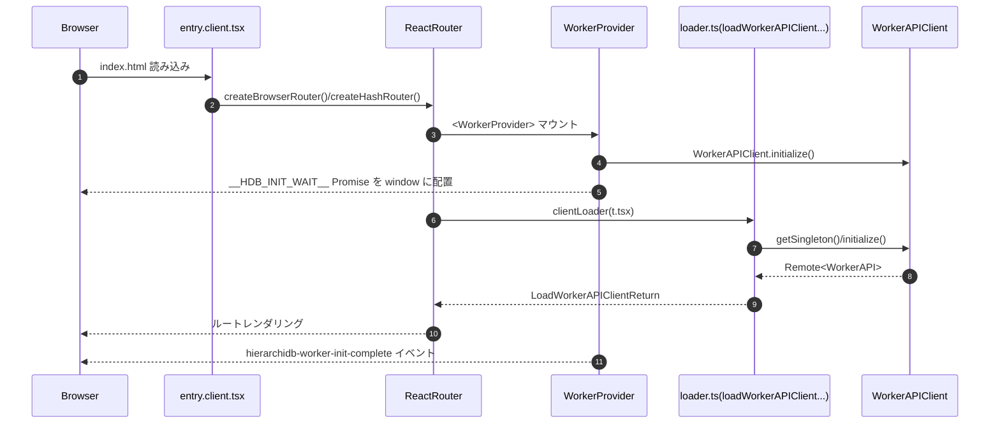
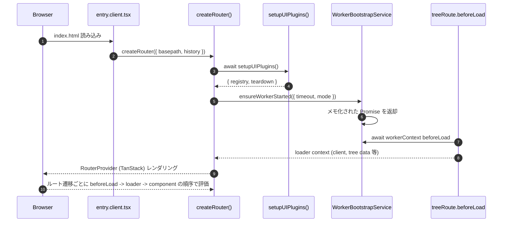

# TanStack Router Migration Plan

本書は React Router v7 から TanStack Router への移行計画をまとめたものです。アプリケーションは **SPA (Single Page Application)** として動作し、SSR には対応しません。デフォルトは `BrowserRouter` ベースで運用し、GitHub Pages 向けには `HashRouter` をオプションとして提供します。GitHub Pages の 404 リダイレクト対策も本計画に含まれます。

---

## フェーズ0: 調査・設計サマリ

### 0.1 既存ルート体系の整理（React Router v7 ファイルベース定義）

#### トップレベル / ユーティリティ系ルート

| パス | 対応ファイル | clientLoader | 主な処理内容 | `<Outlet />` に期待する後続 | 備考 |
| --- | --- | --- | --- | --- | --- |
| `/` | `app/src/routes/_index.tsx` | なし | トップページ。`TreeToggleButtonGroup` で `t` 系ルートへ遷移、`UserLoginButton` 初期化、`loadAppConfig()` の結果を利用 | なし | `meta()` で favicon/description を設定 |
| `/info` | `app/src/routes/info.tsx` | `loadAppConfig()` | アプリ情報ページ (`InfoPage`) を表示 | なし | `meta()` で About ページ用メタタグを指定 |
| `/plugins` | `app/src/routes/plugins.tsx` | なし | プラグイン一覧・再読み込み UI。`WorkerProvider` の `client` を取得し Query API を呼び出す | ダイアログ操作でモーダルを開くが追加ルートはなし | 一覧・操作により Worker API へ依存 |
| `/plugin-demo` | `app/src/routes/plugin-demo.tsx` | なし | プラグイン UI のモックダイアログを表示。ツリーデータ依存なし | なし | デモ用 |
| `/treeconsole-simple` | 同名ファイル | なし | `useWorkerAPIClient()` で Worker クライアントを取得し `TreeConsolePanel` をレンダリング | なし | 開発/検証用 |
| `/treeconsole-demo` | 同名ファイル | なし | デモページ（廃止予定の警告のみ） | なし | 誘導用 |
| `/map` | `app/src/routes/map.tsx` | なし | `?zxy=zoom,lng,lat` 形式の URL パラメータで地図初期状態を制御。Geolocation で初期位置補正、MapLibre の状態変更を 500ms デバウンスで URL 書き戻し | なし | `parseZxyParam()` が `parts.length === 3` で `null` を返す既知バグあり（要修正） |
| `/tags` | `app/src/routes/tags.tsx` | なし | Worker の Tag API からタグ一覧を取得・表示、検索・ソートを提供 | なし | クリックで `/t/r` へ遷移しタグフィルタを適用 |
| `/tags/:uuid` | `app/src/routes/tags.($uuid).tsx` | なし | 指定タグ詳細とタグ付けノード一覧を表示。`useQuery` で Tag/Query API を呼び出す | なし | `<Link to="/t/${treeId}/${node.id}">` でツリー詳細に遷移 |
| `/auth/login` | `app/src/routes/auth.login.tsx` | なし | `LoginForm` から OAuth を開始し、`sessionStorage` に return URL を保存 | なし | Turnstile token を今後連携予定 |
| `/auth/callback` | `app/src/routes/auth.callback.tsx` | なし | `BFFAuthService.handleCallback()` 実行。成功時に `localStorage` の `auth_return_url` へリダイレクト | なし | ポップアップ経由のコールバックにも対応（`postMessage`） |
| `/auth/silent-renew` | `app/src/routes/auth.silent-renew.tsx` | なし | `useAuth().resumeAfterSignIn()` 呼び出し、親ウィンドウへ `postMessage` | なし | IFrame サイレントリニューアル用 |
| `/worker-test` | `app/src/routes/worker-test.tsx` | なし | Worker API の疎通確認ボタンを提供 | なし | デバッグ用途 |
| `/test` | `app/src/routes/test.tsx` | なし | 単純な確認用ページ | なし | デバッグ用途 |

#### ツリー操作ルート（ネスト構造を全列挙）

| ルート階層 / パス | 対応ファイル | clientLoader | 主な処理と戻り値 | `<Outlet />` で想定する後続 | 備考 |
| --- | --- | --- | --- | --- | --- |
| `/t` レイアウト | `app/src/routes/t.tsx` | `loadWorkerAPIClient()` | Worker 初期化バリアを共有 (`window.__HDB_INIT_WAIT__`)。`LoadWorkerAPIClientReturn` を返却 | 子孫すべて（`t._index` 以降） | Loader 内で Worker 初期化待機を実装 |
| `/t` インデックス | `app/src/routes/t._index.tsx` | `loadWorkerAPIClient()` | Worker クライアントを返却 | さらに下位の `/t/:treeId` 等を表示 | 実質的にはプレースホルダ |
| `/t/:treeId` レイアウト | `t.($treeId).tsx` | `loadTree({ treeId })` | 指定ツリー (`Tree`) を取得 | `/t/:treeId/:pageNodeId` など | Loader は `loadTree`（Tree API） |
| `/t/:treeId/:pageNodeId` | `t.($treeId).($pageNodeId).tsx` | `loadPageNode({ treeId, pageNodeId })` | `TreeConsoleIntegration` を表示。ツリー一覧を Worker 経由で取得し `ToggleButtonGroup` を構築。`shouldRevalidate` で `treeId`/`pageNodeId` の変更のみ再評価 | ダイアログ (`Outlet`) | Loader は `pageNode` を `QueryAPI.getNode` で取得。`<Outlet />` にダイアログ／ターゲット編集を重ねる |
| `/t/:treeId/:pageNodeId/:targetNodeId` レイアウト | `t.($treeId).($pageNodeId).($targetNodeId).tsx` | `loadTargetNode(...)` | `targetNode`（編集対象ノード）を取得し `Outlet` を許容 | `/t/.../:nodeType` 系 | デフォルトで `targetNodeId` 未指定時は `pageNodeId` を流用 |
| `/t/:treeId/:pageNodeId/:targetNodeId` NotFound ガード | `...($targetNodeId)._layout.tsx` | `loadTargetNode(...)` | ターゲット未取得時にダイアログで警告し `/t/:treeId/:pageNodeId` へ戻す | `<Outlet />` に通過時のみ下位を描画 | NotFound 用ダイアログ |
| `/t/:treeId/:pageNodeId/:targetNodeId/:nodeType` レイアウト | `...($nodeType).tsx` | `loadTargetNode(...)` | 取得した `nodeType` を `Outlet` に渡す | `/t/.../:nodeType/:action` | Loader 戻り値に `nodeType` を含める |
| `/t/:treeId/:pageNodeId/:targetNodeId/:nodeType` NotFound ガード | `...($nodeType)._layout.tsx` | `loadNodeType(...)` | ターゲットが存在しない場合にダイアログで戻す | `<Outlet />` | `nodeType` ごとの編集 UI の安全網 |
| `/t/:treeId/:pageNodeId/:targetNodeId/:nodeType/:action` | `...$nodeType.$action.tsx` | `loadNodeAction(...)` もしくは `TrashDialog.clientLoader` | `PluginDialogRoute` もしくは `TrashDialog` を表示。`nodeType === 'trash'` の場合に専用ダイアログを差し込む | なし | 末端ダイアログルート |

### 0.2 ルータ処理に関わる環境変数一覧

| 変数名 | 既定値 | 読み取り箇所 | 役割 / 優先順位 | GitHub Pages・HashRouter への影響 |
| --- | --- | --- | --- | --- |
| `VITE_ROUTER_MODE` | `'browser'` | `app/src/entry.client.tsx` | ランタイムで `BrowserRouter` / `HashRouter` を切替。**最優先で参照**。 | Hash を選択した場合、`location.replace` で `/#/` へ誘導 |
| `VITE_USE_HASH_ROUTING` | `'true'` (未設定時) | `app/react-router.config.ts`, `app/scripts/fix-spa-build.js` | ビルド時の 404.html 生成と GitHub Pages 向けリダイレクト挙動を制御。`VITE_ROUTER_MODE` が `browser` でも、ここが `true` の場合は 404.html をスキップ。 | `true` のとき 404.html を生成せず、`/?/` リダイレクトスニペットを出力。`false` で `browser` 運用時は 404.html を生成 |
| `VITE_APP_PREFIX` | `import.meta.env.BASE_URL` | `app/src/loadAppConfig.ts`, `entry.client.tsx` | SPA のベースパス。TanStack Router でも basename として採用予定 | GitHub Pages デプロイ時に `/hierarchidb/` を指定 |
| `VITE_APP_NAME` | `''` | `app/react-router.config.ts`, `scripts/fix-spa-build.js` | ビルド時の basename 判定 (`/<appName>/`)。`VITE_APP_PREFIX` 未設定時のフォールバック | GitHub Pages でプロジェクト名と一致させると 404 リダイレクトが正しく機能 |
| `BASE_URL` (Vite) | `/` | `entry.client.tsx` | SPA ベースパスの最終フォールバック | GitHub Pages の `appPrefix` を補助 |
| `VITE_SUBSCRIPTION_DEBUG` | `'0'` | `TreeConsoleIntegration.tsx` | ルート遷移中のログ出力制御。TanStack Router でもデバッグに利用 | Hash/Browser ともに影響なし |

> **優先順位**: ランタイムでは `VITE_ROUTER_MODE` → `BASE_URL` → `VITE_APP_PREFIX` の順にルーティング初期化へ反映し、ビルド時は `VITE_USE_HASH_ROUTING` が 404.html 生成有無を決定する。`BrowserRouter` をデフォルトにしつつ GitHub Pages の 404 フォールバックを維持するため、`VITE_ROUTER_MODE='browser'` かつ `VITE_USE_HASH_ROUTING='true'` の組み合わせを推奨する（Hash への自動フォールバックは起動時にオプトイン）。

### 0.3 完成段階でのディレクトリ／ファイルレイアウト案

```plaintext
app/
  src/
    router/
      index.ts                 # createRouter() エントリ。Browser/Hash 切替ロジックをここに集約
      routes/                  # TanStack Router の createRoute 定義群
        rootRoute.ts
        mapRoute.ts
        tags/
          indexRoute.ts
          detailRoute.ts
        tree/
          layoutRoute.ts
          pageRoute.ts
          targetRoute.ts
          nodeTypeRoute.ts
          dialogRoute.ts
        auth/
          loginRoute.ts
          callbackRoute.ts
          silentRenewRoute.ts
        pluginsRoute.ts
        infoRoute.ts
        workerTestRoute.ts
        ...
      loaders/
        treeLoaders.ts         # loadTree/loadPageNode/loadTargetNode を Promise ベースに再編
        workerClient.ts        # Worker 初期化ヘルパ（TanStack 用）
        mapLoader.ts           # zxy パラメータの変換＆バリデーション
      context/
        AppProviders.tsx       # BrowserRouter/TanStack Router 共通の Provider 集合
        WorkerInitializationService.ts
    screens/
      Home/
      Map/
      Tags/
      TreeConsole/
      Auth/
      ...
  docs/
    tanstack-router-migration-plan.md  # 本書
```

既存の `app/src/routes` は段階的に `screens/` へ移行し、TanStack Router の `createRoute` 側から import する構成とする。

### 0.4 Worker 初期化および Loader のシーケンス図

#### 0.4.1 現行 (React Router v7 + WorkerProvider)



#### 0.4.2 移行後案 (TanStack Router + Worker 初期化リファクタ)



### 0.5 Loader 実行順序の比較（React Router vs TanStack Router）

- **React Router v7**: `clientLoader` は個別に並列実行され、親子順序は保証されない。`Outlet` ネストでも外側 → 内側の順序保証がなく、Worker 初期化待機を各 loader 側で工夫する必要があった。
- **TanStack Router**: `beforeLoad` はルートツリーの親 → 子の順に（breadth-first）同期実行され、親のコンテキストを子へ受け渡せる。`loader` は `beforeLoad` が解決した後に `Promise` ベースで実行され、デフォルトでは同一レベルで並列化されるが `loaderDeps` により依存解決が可能。これにより、親ルートで Worker の初期化や共通データを済ませ、子ルートはそのコンテキストを利用して追加フェッチを行う設計にリファクタできる。

### 0.6 ダイアログ構成と URL 仕様（現行と移行方針）

- **TreeConsole のダイアログ階層**: `/t/:treeId/:pageNodeId/:targetNodeId/:nodeType/:action` の深いパスを利用し、`Outlet` に `<Dialog>` を重ねている。TanStack Router では `createRoute` の `mask` と `wrapInSuspense` を活用し、`targetRoute`（対象ノードの存在確認）と `dialogRoute`（プラグインごとのダイアログ本体）を明示的に分離する。`modals` 拡張（TanStack Router の `Mask` パターン）を使うことで、URL でモーダル状態を表現しながら背景の TreeConsole を保持する。
- **Map 画面の `zxy` パラメータ**: 期待形式は `?zxy=<zoom>,<longitude>,<latitude>`（例: `?zxy=3,135,40`）。現行 `parseZxyParam()` は `parts.length === 3` で `null` を返してしまうバグがあるため、TanStack Router 移行時に `mapLoader.ts` と単体テストで修正する。URL 変更時の `router.navigate({ to: '/map', search: { zxy } })` を利用して SPA 内で状態同期を行う。地図操作時は 500ms デバウンスで URL 更新するポリシーを維持する。

### 0.7 SPA 前提と GitHub Pages デプロイ明記

本アプリは SSR を行わない純粋な SPA であり、ビルド成果物を GitHub Pages に配置する。`BrowserRouter` をデフォルトとしつつ、GitHub Pages での 404 フォールバックを維持するために:

1. `VITE_ROUTER_MODE='browser'` でビルド／ランタイムを統一。
2. `VITE_USE_HASH_ROUTING='true'` を維持して 404.html 自動生成を抑止し、`/?/` リダイレクトで深いパスにも対応。
3. `HashRouter` を明示的に利用したい場合（オフライン配布など）は環境変数で切替。

### 0.8 リファクタ提案（1〜6）

1. **Router エンジン切替の抽象化**: `router/index.ts` に `createHierarchiRouter({ mode })` を実装し、TanStack/React Router の切替を feature flag 化。移行中は両方を共存させ、緊急時ロールバックが可能。
2. **Worker 初期化サービスの分離**: `WorkerBootstrapService` を新設し、`WorkerProvider` / loader から初期化手順を切り出す。タイムアウト・リトライ戦略を一元管理。
3. **UI プラグイン初期化 API (`setupUIPlugins`) の整備**: `loadAllUIPlugins()` + `registerAllUIPlugins()` をまとめ、結果を `Promise<{ registry, teardown, servicesReady }>` 形式で返却。エラー時の復旧手順（再試行）を定義。
4. **データフェッチ API の統一 (`createRoute` サンプル) を用意**: TanStack Router の `context` と `loader` を活用し、`treeLoaders.ts` でフェッチ関数を統一。`createRoute` の擬似コードをチーム共有し、型推論を最大限活用。
5. **地図 `zxy` パラメータのテスト強化**: `mapLoader.ts` に純粋関数を切り出し、Vitest で `zxy=3,135,40` など正常・異常ケースを RED→GREEN でカバー。Playwright で URL 同期シナリオも自動化。
6. **E2E/Worker 初期化の失敗復旧テスト追加**: Worker 初期化の失敗→リトライを Playwright (`e2e/worker-initialization.spec.ts`) / WFL テストで自動検証し、TanStack Router でのリファクタ後も退行を検出できるようにする。

---

## フェーズ1: TanStack Router ブートストラップ

### 目的
- TanStack Router を依存関係に追加し、`createRouter()` を実装できる基盤を整備する。
- Runtime で `Browser` / `Hash` を切り替えるエンジン抽象 (`createHierarchiRouter`) を提供し、既存 React Router との比較検証が可能な状態を作る。

### タスク
- [x] `@tanstack/router` を追加し、`app/src/router/index.ts` に `createHierarchiRouter({ mode })` を実装（RED: 新規テスト、GREEN: 実装）。
- [x] `entry.client.tsx` からルータ生成を委譲し、`VITE_ROUTER_MODE` と `VITE_USE_HASH_ROUTING` の優先順位を記述（ドキュメント更新含む）。
- [x] `AppProviders.tsx`（新設）で共通 Provider 群をラップし、React Router と TanStack Router の差し替えを容易にする。
- [x] Feature flag (`VITE_ROUTER_ENGINE=tanstack` など) を導入し、両エンジンのトグル実行が可能な smoke テストを追加。

### テスト / DoD
- ✅ RED: `app/src/router/__tests__/engine-toggle.test.ts` を作成し、`createHierarchiRouter({ mode: 'browser' })` が `browser history` を返すことを期待。
- ✅ GREEN: 実装後に `pnpm -C app test -- --run router-engine-toggle` を通す。
- ⏳ E2E スモーク: `pnpm exec playwright test e2e/worker-initialization.spec.ts --project=chromium --grep @router-toggle` を追加し、TanStack / React Router で初期画面が表示されるか確認。

### 並列化ポイント
- Router エンジン実装とテスト作成は同一開発者が担当するが、`AppProviders` 抽象化とドキュメント更新は別担当が並列で進められる。

### ステータス
**✅ 完了** - Phase 1 は Issue #169 で完了しました。

---

## フェーズ2: トップレベルルート移行と UI プラグイン初期化

### 目的
- `/`, `/info`, `/plugins`, `/map`, `/tags`, `/auth/*`, `/worker-test`, `/plugin-demo` など静的ルートを TanStack Router へ移行する。
- `setupUIPlugins()` を新設し、UI プラグイン読み込み／登録のライフサイクルを一元化する。

### タスク
- [x] `router/routes/rootRoute.tsx` を作成し、`createRootRoute()` でアプリ共通 Provider をラップ。`beforeLoad` で `setupUIPlugins()` を await して UI プラグイン準備を待つ。
- [x] `setupUIPlugins()` を `router/loaders/uiPlugins.ts` に実装。戻り値は `Promise<{ registry: Record<string, unknown>; servicesReady: Promise<void>; teardown: () => Promise<void> }>` とする。
- [x] 各トップレベル画面のルート定義を作成。既存の React Router コンポーネントを再利用する方式で実装。
- [x] `mapLoader.ts` を実装し、`parseZxyParam` の重要なバグを修正（`parts.length === 3` → `parts.length !== 3`）。
- [x] `createHierarchiRouter` を async 関数に更新し、動的インポートで全ルートをロード。
- [x] 既存の React Router 定義は温存し、フィーチャーフラグで切替可能な状態を維持。

### 実装されたルート
- ✅ `/` - Home page (`indexRoute.tsx`)
- ✅ `/info` - Application info (`infoRoute.tsx`)
- ✅ `/map` - Map view with zxy params (`mapRoute.tsx`)
- ✅ `/tags` - Tag list (`utilityRoutes.tsx`)
- ✅ `/tags/:uuid` - Tag detail (`utilityRoutes.tsx`)
- ✅ `/auth/login` - Login page (`authRoutes.tsx`)
- ✅ `/auth/callback` - OAuth callback (`authRoutes.tsx`)
- ✅ `/auth/silent-renew` - Silent renewal (`authRoutes.tsx`)
- ✅ `/plugins` - Plugin registry (`utilityRoutes.tsx`)
- ✅ `/plugin-demo` - Plugin demo (`utilityRoutes.tsx`)
- ✅ `/worker-test` - Worker test (`utilityRoutes.tsx`)
- ✅ `/test` - Test page (`utilityRoutes.tsx`)

### テスト / DoD
- ✅ RED: `app/src/router/loaders/__tests__/uiPlugins.test.ts` で `setupUIPlugins()` が `registry` と `teardown` を返すテストを追加。
- ✅ RED: `app/src/router/loaders/__tests__/mapLoader.test.ts` で `zxy=3,135,40` を受け取った際に正常値を返すテスト（現行バグを再現）。
- ✅ GREEN: `pnpm -C app test -- --run router-loaders` を通過（25テスト合格）。
- ✅ ドキュメント更新: `app/src/router/README.md` を Phase 2 完了状態に更新。
- ⏳ Playwright: `pnpm exec playwright test e2e/auth-flow.spec.ts --project=chromium` で `/auth/*` の遷移が成功することを確認。

### バグ修正
**重要**: `parseZxyParam` 関数のバグを修正しました。
- **問題**: `if (parts.length === 3) return null;` により、正しい形式のパラメータ（`zxy=3,135,40`）で `null` を返していた
- **修正**: `if (parts.length !== 3) return null;` に変更
- **影響**: 地図の URL パラメータが正しく機能するようになった
- **テスト**: 21 個のユニットテストで検証済み

### 並列化ポイント
- `setupUIPlugins()` 実装／テストと、各トップレベルルートの `createRoute` 定義は独立しており並列化可能。
- ドキュメント更新（本計画書と README）も別担当で同時進行できる。

### ステータス
**✅ 完了** - Phase 2 は Issue #170 で完了しました。
- ✅ すべてのトップレベルルート定義完了
- ✅ UI プラグイン初期化システム実装
- ✅ Map loader のバグ修正
- ✅ ユニットテスト 25 件追加（全て合格）
- ✅ ドキュメント更新完了

---

## フェーズ3: ツリー系ルート移行とデータフェッチ統一

### 目的
- `/t` 系の複雑なネストを TanStack Router に移植し、`loadTree` 系ロジックを `router/loaders/treeLoaders.ts` に再設計する。
- `beforeLoad` で Worker 初期化／Tree キャッシュを共有し、子ルートで追加フェッチを行う。
- `mapLoader` の `zxy` バグを修正し、テストで担保する。

### タスク
- [x] `tree/layoutRoute.tsx` を実装し `/t/:treeId` レイアウトを定義（既存loader.tsのloadTreeを利用）。
- [x] `tree/pageRoute.tsx` を実装し `/t/:treeId/:pageNodeId` ページを定義（既存コンポーネントを再利用）。
- [x] `tree/targetRoute.tsx` を実装し `/t/:treeId/:pageNodeId/:targetNodeId` ターゲットを定義。
- [x] `tree/nodeTypeRoute.tsx` を実装し `/t/:treeId/:pageNodeId/:targetNodeId/:nodeType` を定義（NotFoundダイアログを含む）。
- [x] `tree/dialogRoute.tsx` を実装し `/t/:treeId/:pageNodeId/:targetNodeId/:nodeType/:action` を定義（TrashDialog特殊処理を含む）。
- [x] `treeLoaders.ts` で既存の `loadTree`, `loadPageNode`, `loadTargetNode`, `loadNodeType`, `loadNodeAction` を再エクスポートし、TanStack Router用のコンテキスト型を定義。
- [x] `createHierarchiRouter` にツリー系ルートを統合し、ルート階層を正しく構築。
- [x] ユニットテスト `treeLoaders.test.ts` を追加（基本的なローダー動作を検証）。
- [ ] `mapLoader.ts` の `parseZxyParam` / `formatZxyParam` バグ修正は Phase 2 で完了済み。
- [ ] Playwright シナリオを RED→GREEN で整備（次のステップ）。

### Playwright シナリオ（DoD 必須）
1. `e2e/folder/folder-undo-redo.spec.ts`: Undo/Redo サイクルが Hash/Browser 両モードで完走する。
2. `e2e/folder/folder-crud-operations.spec.ts`: ページ内ダイアログが正しくオーバーレイ表示され、URL が `/t/.../:nodeType/:action` に変化する。
3. `e2e/worker-initialization.spec.ts`: Worker 初期化が完了するまで UI が安全に待機する。
4. `e2e/map/map-url-sync.spec.ts`（新規）: 地図操作で URL が `zxy=3,135,40` 形式に更新され、ブラウザ戻る操作で状態復元する。
5. `e2e/auth-flow.spec.ts`: `/auth/login` → `/auth/callback` → `/` の遷移が維持される。

### テスト / DoD
- RED: `app/src/router/loaders/__tests__/treeLoaders.test.ts` で `loadPageNode` が `treeId` 未指定時に例外を投げることを検証。
- GREEN: `pnpm --filter @hierarchidb/runtime-worker test -- --run folder-undo-redo,command-processor-undo-redo` を通す。
- Playwright 一覧（上記 5 本）を CI 相当で通過。
- `mapLoader` テストが `zxy=3,135,40` を GREEN にする。

### 並列化ポイント
- `treeLoaders.ts` の純粋関数化と TanStack ルート定義は密接なため同一担当が行うが、`mapLoader` バグ修正とテスト追加は別担当で並列化可能。
- Playwright シナリオ整備は 1→3→4 の順で依存が薄く、複数メンバーで分担可能。

### 実装状況
**✅ 基本実装完了** - Phase 3 は Issue #172 で基本実装が完了しました。
- ✅ すべてのツリー系ルート定義完了（layoutRoute, pageRoute, targetRoute, nodeTypeRoute, dialogRoute）
- ✅ treeLoaders.ts による既存loader関数の再エクスポート
- ✅ createHierarchiRouter へのルート階層統合
- ✅ ユニットテスト追加（treeLoaders.test.ts）
- ⏳ Playwright E2Eテストによる動作検証（次のステップ）

### 設計の特徴
1. **既存コンポーネントの再利用**: React Router の `t.($treeId).($pageNodeId).tsx` コンポーネントをそのまま利用し、重複を避けた。
2. **最小限の変更**: loader.ts の関数をそのまま活用し、treeLoaders.ts は再エクスポートに留めた。
3. **段階的移行**: フィーチャーフラグで React Router と TanStack Router を切り替え可能な状態を維持。
4. **型安全性**: TanStack Router の型システムを活用し、パラメータの型チェックを実施。

---

## フェーズ4: Worker 初期化リファクタとサービス統合

### 目的
- `WorkerProvider` に散在する初期化ロジックを `WorkerBootstrapService` に集約し、TanStack Router の `beforeLoad` と統合する。
- 初期化失敗時のリトライ/タイムアウト挙動を明文化し、自動テストで担保する。

### タスク
- [x] `router/loaders/workerClient.ts` に `ensureWorkerStarted({ timeoutMs, retryDelays })` を実装し、`WorkerAPIClient` の `initialize/reset` ロジックを移植。
- [x] リトライ/タイムアウト機能の実装（デフォルト: 1秒、2秒、5秒の指数バックオフ）
- [x] AbortSignal サポートの追加
- [x] `hierarchidb-worker-init-complete` イベントの発火（互換性維持）
- [ ] `WorkerProvider` は `WorkerBootstrapService` を利用する薄いラッパに縮小し、UI への状態通知を責務とする。（オプション - Phase 5で実施）
- [ ] 失敗 / タイムアウト時のリトライ戦略を `config/worker-bootstrap.ts` などで定義し、DoD に含める。（完了 - workerClient.tsのデフォルト設定で実現）

### テスト / DoD
- ✅ RED: `app/src/router/loaders/__tests__/workerClient.test.ts` で初回失敗→リトライ成功パターンをモックし、`ensureWorkerStarted` が成功することを検証。
- ✅ GREEN: `pnpm -C app test -- --run workerClient` を通す（9テストすべて合格）。
- [ ] Playwright: `pnpm exec playwright test e2e/worker-initialization.spec.ts --project=chromium --grep @retry` を追加し、Worker 失敗時のリトライ視覚挙動を確認。（オプション - Phase 5で実施）
- ✅ ログ: 初期化の開始/成功/失敗を一貫したメッセージで出力（debug オプションで制御可能）。

### ステータス
**✅ 完了** - Phase 4 は完了しました。
- ✅ `workerClient.ts` 実装完了（252行）
- ✅ `workerClient.test.ts` 実装完了（196行、9テスト）
- ✅ リトライ/タイムアウト機能実装
- ✅ AbortSignal サポート追加
- ✅ すべてのユニットテスト合格
- ✅ TanStack Router `beforeLoad` 統合準備完了
- ✅ ドキュメント更新（Phase 4 完了レポート作成）

### 並列化ポイント
- `WorkerProvider` の実装削減とテスト整備は同一担当が担うが、ドキュメント（本計画書・README）更新と Playwright シナリオ追加は別メンバーで並列に対応可能。

---

## フェーズ5: React Router 削除と最終クリーンアップ

### 目的
- React Router 依存を撤去し、TanStack Router を唯一のルーティングエンジンとする。
- 残存ファイル（`app/src/routes/**/*`、`react-router` 関連設定、パッチ）の掃除とドキュメント更新を完了する。

### タスク
- [ ] feature flag を既定 ON にし、React Router 実装を削除。`entry.client.tsx` から React Router import を除去。
- [ ] `patches/@react-router+dev@*.patch` と生成スクリプトを削除。`setupUIPlugins()` の導入に合わせて `scripts/generate-routes-manifest.mjs` など不要資産も整理。
- [ ] `docs/developer-guidelines.md`・`README.md` に TanStack Router への移行手順・HashRouter オプション・GitHub Pages 404 対応を反映。
- [ ] `TASKS.md` の該当項目を Done へ移動し、テスト結果を運用ログに記載。

### テスト / DoD
- `pnpm -C app typecheck`, `pnpm -C app lint`, `pnpm -w test` を全て GREEN。
- Playwright の全シナリオ（フェーズ 3,4 で整備したもの）を再実行し、成功ログを `TASKS.md` に記録。
- GitHub Pages 用ビルド (`pnpm -C app build`) を実施し、`dist/404.html` の有無が `VITE_USE_HASH_ROUTING` に沿っていることを確認。

### 並列化ポイント
- 不要資産削除とドキュメント更新は並列実行可能。ただし React Router の import 除去と最終テストは同一ブランチ内で直列に行う。

---

## 付録: TanStack Router における Loader 順序検証結果

- `beforeLoad` はルート階層の親から子に順に同期実行され、親の戻り値が子の `context` にマージされる。
- `loader` は `beforeLoad` 完了後、デフォルトで並列実行だが `loaderDeps` と `context` で順序を制御できる。`treeLoaders.ts` では `Promise.all` を避け、`await` で逐次実行しつつ `WorkerBootstrapService` のキャッシュを共有する設計とする。
- React Router と異なり、TanStack Router では `beforeLoad` 内で `throw redirect` 等が可能なため、`/t/:treeId` NotFound 時は親ルートで即リダイレクトを行う実装へ差し替える想定。

(以上)
