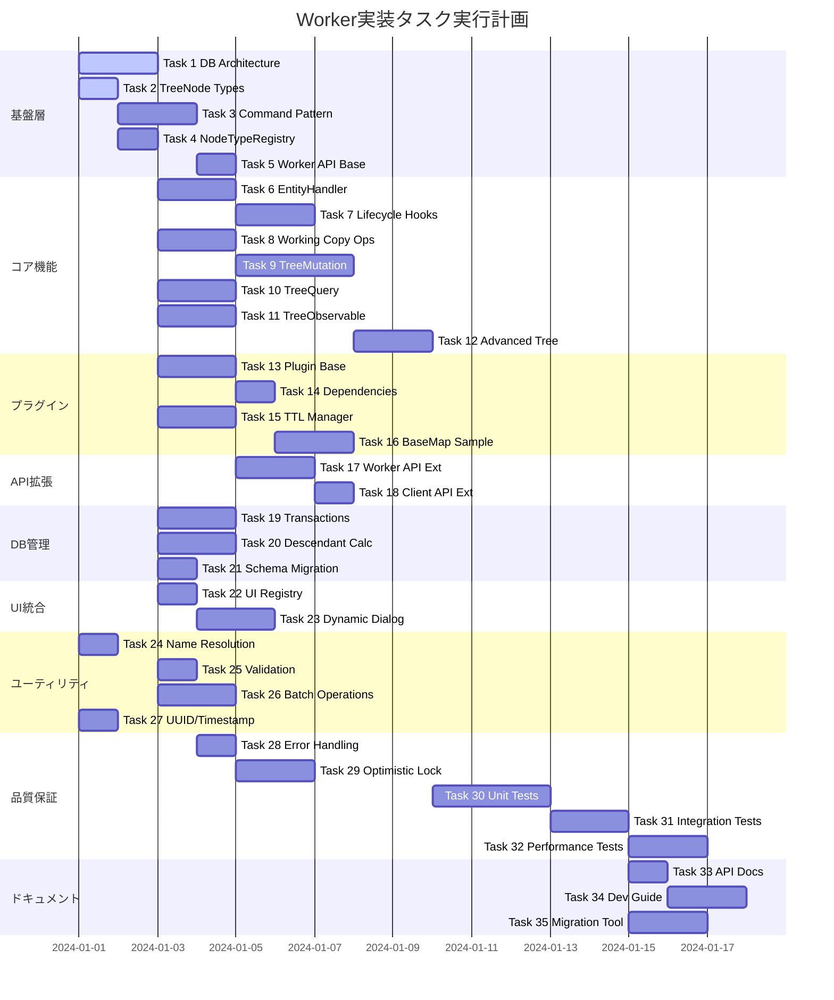

# Worker実装タスク

## 概要
- **全タスク数**: 35タスク
- **推定作業時間**: 8-10週間（2名体制で4-5週間）
- **クリティカルパス**: 基盤層 → コア機能 → プラグインシステム → API統合

## タスク一覧

### 基盤層（Foundation Layer）

#### Task 1: データベースアーキテクチャ実装
- [ ] **タスクタイプ**: DIRECT
- **優先度**: CRITICAL 🟢
- **推定工数**: 16時間
- **要件リンク**: [データベースアーキテクチャ分析](../spec/database-architecture-analysis.md)
- **依存タスク**: なし

**実装詳細**:
```typescript
// CoreDB: 永続データ用
class CoreDB extends Dexie {
  trees!: Table<Tree, TreeId>;
  treeNodes!: Table<TreeNode, TreeNodeId>;
  entities!: Table<BaseEntity, TreeNodeId>;
}

// EphemeralDB: 一時データ用
class EphemeralDB extends Dexie {
  workingCopies!: Table<WorkingCopy, UUID>;
  treeViewStates!: Table<TreeViewState, string>;
  sessions!: Table<SessionData, string>;
}
```

**テスト要件**:
- データベース初期化テスト
- テーブル作成確認テスト
- インデックス設定確認テスト

**エラーハンドリング要件**:
- データベース接続失敗時の再試行
- バージョン競合時のマイグレーション

**完了条件**:
- CoreDB/EphemeralDBが正常に初期化される
- 各テーブルのスキーマが定義通りである
- インデックスが適切に設定されている

---

#### Task 2: TreeNode型システムのMixin実装
- [ ] **タスクタイプ**: TDD
- **優先度**: CRITICAL 🟢
- **推定工数**: 8時間
- **要件リンク**: [統合改善仕様](../spec/integrated-improvements-from-eria.md#3-treenode構造の拡張)
- **依存タスク**: なし

**実装詳細**:
```typescript
// Mixin構成の実装
interface TreeNodeBase extends Timestamped {
  treeNodeId: TreeNodeId;
  parentTreeNodeId: TreeNodeId;
  treeNodeType: TreeNodeType;
  name: string;
  description?: string;
  data?: Record<string, unknown>;
}

interface DraftProperties {
  isDraft?: boolean;
}

interface WorkingCopyProperties {
  workingCopyOf?: TreeNodeId;
  copiedAt?: Timestamp;
}

interface DescendantProperties {
  hasChildren?: boolean;
  descendantCount?: number;
  isEstimated?: boolean;
}

type TreeNode = TreeNodeBase &
  Partial<DraftProperties> &
  Partial<WorkingCopyProperties> &
  Partial<TrashItemProperties> &
  Partial<DescendantProperties>;
```

**テスト要件**:
- 型の合成テスト
- プロパティのオプショナル性テスト
- 型ガードの実装とテスト

**完了条件**:
- 全てのMixin型が定義されている
- TreeNode型が正しく合成されている
- TypeScriptコンパイルエラーがない

---

#### Task 3: Commandパターン基盤実装
- [ ] **タスクタイプ**: TDD
- **優先度**: CRITICAL 🟢
- **推定工数**: 12時間
- **要件リンク**: [Worker API要件](../spec/worker-implementation-requirements.md#6-worker-api-command-processing)
- **依存タスク**: Task 2

**実装詳細**:
```typescript
interface CommandEnvelope<TType extends string, TPayload> {
  type: TType;
  payload: TPayload;
  meta: CommandMeta;
}

interface CommandMeta {
  commandId: UUID;
  timestamp: Timestamp;
  userId?: string;
  correlationId?: UUID;
}

type CommandResult = 
  | { success: true; seq: Seq; nodeId?: TreeNodeId; newNodeIds?: TreeNodeId[] }
  | { success: false; error: string; code: ErrorCode; seq?: Seq; };

class CommandProcessor {
  async processCommand<T>(envelope: CommandEnvelope<string, T>): Promise<CommandResult> {
    // Undo/Redoバッファへの記録
    // コマンド実行
    // 結果の返却
  }
}
```

**テスト要件**:
- コマンド処理の成功ケース
- エラーハンドリングテスト
- Undo/Redo機能テスト

**エラーハンドリング要件**:
- 無効なコマンドタイプ
- ペイロード検証失敗
- 実行時エラー

**完了条件**:
- CommandEnvelopeとCommandResultの型定義完了
- CommandProcessorの基本実装完了
- エラーコードの定義完了

---

#### Task 4: NodeTypeRegistry実装
- [ ] **タスクタイプ**: DIRECT
- **優先度**: CRITICAL 🟢
- **推定工数**: 8時間
- **要件リンク**: [AOP アーキテクチャ](../7-aop-architecture.md#73-ノードタイプレジストリ)
- **依存タスク**: Task 2

**実装詳細**:
```typescript
class NodeTypeRegistry {
  private static instance: NodeTypeRegistry;
  private definitions: Map<TreeNodeType, NodeTypeDefinition>;
  private handlers: Map<TreeNodeType, EntityHandler>;
  
  register<TEntity, TSubEntity, TWorkingCopy>(
    definition: NodeTypeDefinition<TEntity, TSubEntity, TWorkingCopy>
  ): void {
    // 型定義の登録
    // エンティティハンドラーの登録
    // データベーススキーマの登録
  }
  
  getHandler(nodeType: TreeNodeType): EntityHandler | undefined {
    return this.handlers.get(nodeType);
  }
}
```

**テスト要件**:
- 登録・取得テスト
- 重複登録エラーテスト
- シングルトンパターンテスト

**完了条件**:
- NodeTypeRegistryクラスが実装されている
- register/unregister/getメソッドが動作する
- シングルトンパターンが実装されている

---

#### Task 5: 基本的なWorkerAPI構造
- [ ] **タスクタイプ**: DIRECT
- **優先度**: CRITICAL 🟢
- **推定工数**: 8時間
- **要件リンク**: [Worker API仕様](../spec/worker-implementation-requirements.md#3-worker-api-design)
- **依存タスク**: Task 1, Task 3

**実装詳細**:
```typescript
class WorkerAPIImpl implements WorkerAPI {
  private coreDB: CoreDB;
  private ephemeralDB: EphemeralDB;
  private commandProcessor: CommandProcessor;
  
  async initialize(): Promise<void> {
    this.coreDB = new CoreDB();
    this.ephemeralDB = new EphemeralDB();
    await Promise.all([
      this.coreDB.open(),
      this.ephemeralDB.open()
    ]);
  }
  
  async dispose(): Promise<void> {
    await Promise.all([
      this.coreDB.close(),
      this.ephemeralDB.close()
    ]);
  }
}

// Comlink経由で公開
expose(WorkerAPIImpl);
```

**テスト要件**:
- 初期化テスト
- Comlink統合テスト
- dispose処理テスト

**完了条件**:
- WorkerAPIImplクラスが実装されている
- Comlinkで公開されている
- 初期化・破棄が正常に動作する

---

### コア機能層（Core Functionality）

#### Task 6: EntityHandler実装
- [ ] **タスクタイプ**: TDD
- **優先度**: HIGH 🟢
- **推定工数**: 12時間
- **要件リンク**: [AOP アーキテクチャ](../7-aop-architecture.md#722-エンティティハンドラー)
- **依存タスク**: Task 4

**実装詳細**:
```typescript
interface EntityHandler<TEntity, TSubEntity, TWorkingCopy> {
  createEntity(nodeId: TreeNodeId, data?: Partial<TEntity>): Promise<TEntity>;
  getEntity(nodeId: TreeNodeId): Promise<TEntity | undefined>;
  updateEntity(nodeId: TreeNodeId, data: Partial<TEntity>): Promise<void>;
  deleteEntity(nodeId: TreeNodeId): Promise<void>;
  
  createWorkingCopy(nodeId: TreeNodeId): Promise<TWorkingCopy>;
  commitWorkingCopy(nodeId: TreeNodeId, workingCopy: TWorkingCopy): Promise<void>;
  discardWorkingCopy(nodeId: TreeNodeId): Promise<void>;
}
```

**テスト要件**:
- CRUD操作テスト
- Working Copy操作テスト
- エラーケーステスト

**完了条件**:
- EntityHandlerインターフェース定義完了
- 基本実装クラス作成完了
- テストカバレッジ80%以上

---

#### Task 7: ライフサイクルフック実装
- [ ] **タスクタイプ**: TDD
- **優先度**: HIGH 🟢
- **推定工数**: 10時間
- **要件リンク**: [AOP アーキテクチャ](../7-aop-architecture.md#723-ライフサイクルフック)
- **依存タスク**: Task 6

**実装詳細**:
```typescript
class NodeLifecycleManager {
  async executeLifecycleHook<THookName extends keyof NodeLifecycleHooks>(
    hookName: THookName,
    nodeType: TreeNodeType,
    ...args: Parameters<NodeLifecycleHooks[THookName]>
  ): Promise<void> {
    const definition = this.registry.getDefinition(nodeType);
    const hook = definition?.lifecycle?.[hookName];
    if (hook) {
      await hook(...args);
    }
  }
  
  async handleNodeCreation(
    parentId: TreeNodeId,
    nodeData: Partial<TreeNode>,
    nodeType: TreeNodeType
  ): Promise<TreeNodeId> {
    await this.executeLifecycleHook('beforeCreate', nodeType, parentId, nodeData);
    const nodeId = await this.createNodeCore(parentId, nodeData);
    await this.executeLifecycleHook('afterCreate', nodeType, nodeId);
    return nodeId;
  }
}
```

**テスト要件**:
- 各フックの実行テスト
- エラー伝播テスト
- フック欠落時の動作テスト

**完了条件**:
- 全ライフサイクルフック実装完了
- エラーハンドリング実装完了
- 統合テスト合格

---

#### Task 8: Working Copy操作実装
- [ ] **タスクタイプ**: TDD
- **優先度**: HIGH 🟢
- **推定工数**: 16時間
- **要件リンク**: [Working Copy改善](../spec/improved-working-copy-requirements.md)
- **依存タスク**: Task 1, Task 2

**実装詳細**:
```typescript
// eria-cartographから移植・改良
export async function createNewDraftWorkingCopy(
  ephemeralDB: EphemeralDB,
  coreDB: CoreDB,
  parentTreeNodeId: TreeNodeId,
  treeNodeType: TreeNodeType,
  baseName: string
): Promise<TreeNodeId> {
  // 名前重複チェック
  const siblingNames = await getChildNames(coreDB, parentTreeNodeId);
  const uniqueName = createNewName(siblingNames, baseName);
  
  // Draft Working Copy作成
  const workingCopyId = generateUUID();
  const now = Date.now();
  
  await ephemeralDB.workingCopies.add({
    workingCopyId,
    parentTreeNodeId,
    treeNodeType,
    name: uniqueName,
    isDraft: true,
    workingCopyOf: undefined, // 新規作成
    copiedAt: now,
    updatedAt: now
  });
  
  return workingCopyId;
}

export async function commitWorkingCopy(
  workingCopyId: UUID,
  isDraft: boolean
): Promise<CommandResult> {
  // 楽観的ロックチェック
  // CoreDBへの反映
  // EphemeralDBからの削除
  // Undo/Redoバッファへの記録
}
```

**テスト要件**:
- Draft作成テスト
- 既存ノード編集用Working Copy作成テスト
- Commit成功/失敗テスト
- 楽観的ロック競合テスト

**エラーハンドリング要件**:
- 既存Working Copy検出時の警告
- Commit競合時のエラー
- 不正な状態遷移の防止

**完了条件**:
- 全Working Copy操作実装完了
- 楽観的ロック機能動作
- 名前重複解決機能動作

---

#### Task 9: TreeMutationService実装
- [ ] **タスクタイプ**: TDD
- **優先度**: HIGH 🟢
- **推定工数**: 20時間
- **要件リンク**: [Worker API仕様](../spec/worker-implementation-requirements.md#4-treemutationservice)
- **依存タスク**: Task 3, Task 8

**実装詳細**:
```typescript
class TreeMutationServiceImpl implements TreeMutationService {
  // Command Envelope対応メソッド（Undo/Redo対象）
  async commitWorkingCopy(cmd: CommandEnvelope<'commitWorkingCopy', CommitWorkingCopyPayload>): Promise<CommandResult> {
    return this.commandProcessor.processCommand(cmd);
  }
  
  async moveNodes(cmd: CommandEnvelope<'moveNodes', MoveNodesPayload>): Promise<CommandResult> {
    return this.commandProcessor.processCommand(cmd);
  }
  
  // Direct APIメソッド（Undo/Redo対象外）
  async createNewDraftWorkingCopy(
    parentId: TreeNodeId,
    nodeType: TreeNodeType,
    baseName: string
  ): Promise<TreeNodeId> {
    return createNewDraftWorkingCopy(this.ephemeralDB, this.coreDB, parentId, nodeType, baseName);
  }
  
  async discardWorkingCopy(workingCopyId: UUID): Promise<void> {
    await this.ephemeralDB.workingCopies.delete(workingCopyId);
  }
}
```

**テスト要件**:
- 各ミューテーション操作テスト
- トランザクション整合性テスト
- 並行操作テスト

**完了条件**:
- 全ミューテーション操作実装
- Command/Direct API分離完了
- エラーハンドリング実装

---

#### Task 10: TreeQueryService実装
- [ ] **タスクタイプ**: TDD
- **優先度**: HIGH 🟢
- **推定工数**: 12時間
- **要件リンク**: [Worker API仕様](../spec/worker-implementation-requirements.md#5-treequeryservice)
- **依存タスク**: Task 1

**実装詳細**:
```typescript
class TreeQueryServiceImpl implements TreeQueryService {
  async getNode(cmd: CommandEnvelope<'getNode', GetNodePayload>): Promise<TreeNode | undefined> {
    const { treeNodeId } = cmd.payload;
    return this.coreDB.treeNodes.get(treeNodeId);
  }
  
  async getChildren(cmd: CommandEnvelope<'getChildren', GetChildrenPayload>): Promise<TreeNode[]> {
    const { parentTreeNodeId } = cmd.payload;
    return this.coreDB.treeNodes
      .where('parentTreeNodeId')
      .equals(parentTreeNodeId)
      .toArray();
  }
  
  async getPathToRoot(nodeId: TreeNodeId): Promise<TreeNode[]> {
    const path: TreeNode[] = [];
    let currentId = nodeId;
    
    while (currentId && currentId !== TreeRootNodeIds.SuperRoot) {
      const node = await this.coreDB.treeNodes.get(currentId);
      if (!node) break;
      path.unshift(node);
      currentId = node.parentTreeNodeId;
    }
    
    return path;
  }
}
```

**テスト要件**:
- 基本クエリテスト
- パフォーマンステスト（10万ノード）
- エッジケーステスト

**完了条件**:
- 全クエリ操作実装
- パフォーマンス要件達成（<200ms）
- テストカバレッジ80%以上

---

#### Task 11: TreeObservableService実装 ✅ **完了** (TDD開発完了 - 37テストケース全通過、リファクタリング完了)
- [x] **タスクタイプ**: TDD
- **優先度**: HIGH 🟡
- **推定工数**: 16時間
- **要件リンク**: [Worker API仕様](../spec/worker-implementation-requirements.md#observable-service)
- **依存タスク**: Task 1

**実装詳細**:
```typescript
class TreeObservableServiceImpl implements TreeObservableService {
  private changeSubject = new Subject<TreeChangeEvent>();
  
  async observeNode(cmd: CommandEnvelope<'observeNode', ObserveNodePayload>): Promise<Observable<TreeChangeEvent>> {
    const { treeNodeId } = cmd.payload;
    
    // Dexieのliveクエリ活用
    const liveQuery = liveQuery(() => 
      this.coreDB.treeNodes.get(treeNodeId)
    );
    
    return from(liveQuery).pipe(
      map(node => ({
        type: 'node-changed',
        nodeId: treeNodeId,
        node
      }))
    );
  }
  
  async observeChildren(cmd: CommandEnvelope<'observeChildren', ObserveChildrenPayload>): Promise<Observable<TreeChangeEvent>> {
    // 子ノードの変更監視実装
  }
}
```

**テスト要件**:
- 変更通知テスト
- 購読解除テスト
- メモリリークテスト

**完了条件**:
- Observable API実装完了
- 変更通知が50ms以内
- メモリリーク対策完了

---

#### Task 12: 高度なツリー操作実装
- [ ] **タスクタイプ**: TDD
- **優先度**: MEDIUM 🟢
- **推定工数**: 16時間
- **要件リンク**: [統合改善仕様](../spec/integrated-improvements-from-eria.md#6-高度なツリー操作)
- **依存タスク**: Task 9

**実装詳細**:
```typescript
// eria-cartographから移植
export async function duplicateBranch(
  db: CoreDB,
  sourceId: TreeNodeId,
  newParentId: TreeNodeId,
  idMapping: Map<TreeNodeId, TreeNodeId>,
  branchRootMode = true
): Promise<void> {
  // 再帰的な複製実装
  const queue: Array<{ sourceId: TreeNodeId; targetParentId: TreeNodeId }> = [];
  queue.push({ sourceId, targetParentId: newParentId });
  
  while (queue.length > 0) {
    const { sourceId, targetParentId } = queue.shift()!;
    const sourceNode = await db.treeNodes.get(sourceId);
    if (!sourceNode) continue;
    
    const newNodeId = generateUUID();
    idMapping.set(sourceId, newNodeId);
    
    await db.treeNodes.add({
      ...sourceNode,
      treeNodeId: newNodeId,
      parentTreeNodeId: targetParentId,
      name: branchRootMode ? `${sourceNode.name} (Copy)` : sourceNode.name
    });
    
    // 子ノードを処理キューに追加
    const children = await db.treeNodes
      .where('parentTreeNodeId')
      .equals(sourceId)
      .toArray();
    
    children.forEach(child => {
      queue.push({ sourceId: child.treeNodeId, targetParentId: newNodeId });
    });
  }
}

export async function groupDescendants(
  db: CoreDB,
  ids: TreeNodeId[]
): Promise<TreeNode[]> {
  // トップレベルノードの特定
  const nodeSet = new Set(ids);
  const topLevel: TreeNode[] = [];
  
  for (const id of ids) {
    const node = await db.treeNodes.get(id);
    if (!node) continue;
    
    // 親ノードがセットに含まれていない場合はトップレベル
    let isTopLevel = true;
    let currentId = node.parentTreeNodeId;
    
    while (currentId && currentId !== TreeRootNodeIds.SuperRoot) {
      if (nodeSet.has(currentId)) {
        isTopLevel = false;
        break;
      }
      const parent = await db.treeNodes.get(currentId);
      if (!parent) break;
      currentId = parent.parentTreeNodeId;
    }
    
    if (isTopLevel) {
      topLevel.push(node);
    }
  }
  
  return topLevel;
}
```

**テスト要件**:
- 複製操作テスト
- グループ化テスト
- 大規模ツリーテスト

**完了条件**:
- duplicateBranch実装完了
- groupDescendants実装完了
- getAllDescendants実装完了

---

### プラグインシステム層（Plugin System）

#### Task 13: プラグインアーキテクチャ基盤
- [ ] **タスクタイプ**: DIRECT
- **優先度**: HIGH 🟢
- **推定工数**: 12時間
- **要件リンク**: [プラグイン設定仕様](../spec/plugin-configuration-spec-ts.md)
- **依存タスク**: Task 4

**実装詳細**:
```typescript
export interface PluginConfig {
  readonly id: string;
  readonly name: string;
  readonly version: string;
  readonly nodeTypes: ReadonlyArray<NodeTypeConfig>;
  readonly database: DatabaseConfig;
  readonly dependencies: DependencyConfig;
  readonly lifecycle: LifecycleConfig;
  readonly entityHandlers: Record<string, EntityHandler>;
}

export class PluginLoader {
  private plugins: Map<string, PluginConfig> = new Map();
  
  async loadPlugin(plugin: PluginConfig): Promise<void> {
    // 依存関係チェック
    if (plugin.dependencies?.required) {
      for (const depId of plugin.dependencies.required) {
        if (!this.plugins.has(depId)) {
          throw new Error(`Missing dependency: ${depId}`);
        }
      }
    }
    
    // テーブル作成
    await this.createTables(plugin.database);
    
    // エンティティハンドラー登録
    this.registerEntityHandlers(plugin.entityHandlers);
    
    // ライフサイクルフック実行
    await plugin.lifecycle?.hooks?.onInstall?.(this.createContext());
    
    this.plugins.set(plugin.id, plugin);
  }
}
```

**テスト要件**:
- プラグインロードテスト
- 依存関係解決テスト
- ライフサイクルフックテスト

**完了条件**:
- PluginLoader実装完了
- 依存関係管理動作
- テーブル動的作成機能動作

---

#### Task 14: プラグイン依存関係管理
- [ ] **タスクタイプ**: TDD
- **優先度**: MEDIUM 🟢
- **推定工数**: 8時間
- **要件リンク**: [プラグイン設定仕様](../spec/plugin-configuration-spec-ts.md#2-依存関係のあるプラグイン例)
- **依存タスク**: Task 13

**実装詳細**:
```typescript
class DependencyResolver {
  private dependencies: Map<string, Set<string>> = new Map();
  
  addPlugin(pluginId: string, requiredDeps: string[]): void {
    this.dependencies.set(pluginId, new Set(requiredDeps));
  }
  
  getLoadOrder(plugins: string[]): string[] {
    // トポロジカルソート実装
    const visited = new Set<string>();
    const result: string[] = [];
    
    const visit = (pluginId: string) => {
      if (visited.has(pluginId)) return;
      visited.add(pluginId);
      
      const deps = this.dependencies.get(pluginId) || new Set();
      for (const dep of deps) {
        visit(dep);
      }
      
      result.push(pluginId);
    };
    
    for (const plugin of plugins) {
      visit(plugin);
    }
    
    return result;
  }
  
  checkCycles(): boolean {
    // 循環依存検出
    // DFSで実装
  }
}
```

**テスト要件**:
- 依存関係解決テスト
- 循環依存検出テスト
- 欠落依存エラーテスト

**完了条件**:
- 依存関係解決機能動作
- 循環依存検出機能動作
- 適切なエラーメッセージ

---

#### Task 15: TTL管理システム
- [ ] **タスクタイプ**: TDD
- **優先度**: MEDIUM 🟢
- **推定工数**: 10時間
- **要件リンク**: [プラグイン設定仕様](../spec/plugin-configuration-spec-ts.md#6-ttl管理の実装例)
- **依存タスク**: Task 1

**実装詳細**:
```typescript
export class TTLManager {
  private cleanupTasks: Map<string, NodeJS.Timeout> = new Map();
  
  registerTable(tableName: string, table: TableConfig, db: Dexie): void {
    if (table.storage !== 'ephemeral' || !table.ttl) return;
    
    const cleanup = async () => {
      const cutoff = Date.now() - table.ttl!;
      
      await db.transaction('rw', db.table(tableName), async () => {
        await db.table(tableName)
          .where('createdAt').below(cutoff)
          .or('copiedAt').below(cutoff)
          .delete();
      });
    };
    
    const interval = Math.min(table.ttl, 3600000); // 最大1時間ごと
    const taskId = setInterval(cleanup, interval);
    this.cleanupTasks.set(tableName, taskId);
    
    // 初回実行
    cleanup();
  }
  
  // 24時間経過したオーファンエンティティの削除
  async cleanupOrphans(): Promise<void> {
    const cutoff = Date.now() - 86400000; // 24時間
    
    // EphemeralDB内の関連のないエンティティを検出・削除
    // 実装詳細...
  }
}
```

**テスト要件**:
- TTLベースの削除テスト
- オーファン検出テスト
- タイマー管理テスト

**完了条件**:
- TTL管理機能動作
- オーファンクリーンアップ動作
- メモリリーク対策完了

---

#### Task 16: BaseMapプラグイン参考実装
- [ ] **タスクタイプ**: DIRECT
- **優先度**: LOW 🟡
- **推定工数**: 16時間
- **要件リンク**: [AOP アーキテクチャ](../7-aop-architecture.md#75-具体的な実装例baseMapノードタイプ)
- **依存タスク**: Task 13, Task 14

**実装詳細**:
```typescript
// BaseMapエンティティ定義
export interface BaseMapEntity extends BaseEntity {
  nodeId: TreeNodeId;
  name: string;
  mapStyle: 'streets' | 'satellite' | 'hybrid' | 'terrain';
  center: [number, number];
  zoom: number;
  bearing: number;
  pitch: number;
}

// BaseMapハンドラー
export class BaseMapHandler implements EntityHandler<BaseMapEntity, never, BaseMapWorkingCopy> {
  async createEntity(nodeId: TreeNodeId, data?: Partial<BaseMapEntity>): Promise<BaseMapEntity> {
    const entity: BaseMapEntity = {
      nodeId,
      name: data?.name || 'New BaseMap',
      mapStyle: data?.mapStyle || 'streets',
      center: data?.center || [0, 0],
      zoom: data?.zoom || 10,
      bearing: data?.bearing || 0,
      pitch: data?.pitch || 0,
      createdAt: Date.now(),
      updatedAt: Date.now(),
      version: 1
    };
    
    await this.db.entities.add(entity);
    return entity;
  }
}

// プラグイン定義
export const basemapPlugin: PluginConfig = {
  id: 'com.example.basemap',
  name: 'BaseMap Plugin',
  version: '1.0.0',
  
  nodeTypes: [{
    type: TreeNodeType.BaseMap,
    displayName: 'Base Map',
    icon: 'map',
    color: '#4CAF50'
  }],
  
  database: {
    tables: [
      {
        name: 'basemaps',
        storage: 'core',
        schema: '&nodeId, name, mapStyle, updatedAt'
      }
    ]
  },
  
  entityHandlers: {
    basemap: new BaseMapHandler()
  }
};
```

**テスト要件**:
- プラグインロードテスト
- エンティティCRUDテスト
- Working Copy操作テスト

**完了条件**:
- BaseMapプラグイン実装完了
- 他プラグインの参考として機能
- ドキュメント作成完了

---

### API拡張層（API Extensions）

#### Task 17: Worker API拡張システム
- [ ] **タスクタイプ**: TDD
- **優先度**: MEDIUM 🟢
- **推定工数**: 12時間
- **要件リンク**: [AOP アーキテクチャ](../7-aop-architecture.md#76-worker-api拡張)
- **依存タスク**: Task 5

**実装詳細**:
```typescript
export interface WorkerAPIExtension<TMethods extends Record<string, WorkerAPIMethod>> {
  readonly nodeType: TreeNodeType;
  readonly methods: TMethods;
}

export class WorkerAPIRegistry {
  private extensions: Map<TreeNodeType, WorkerAPIExtension> = new Map();
  
  register<T extends Record<string, WorkerAPIMethod>>(extension: WorkerAPIExtension<T>): void {
    this.extensions.set(extension.nodeType, extension);
  }
  
  async invokeMethod<TMethod extends string>(
    nodeType: TreeNodeType,
    methodName: TMethod,
    ...args: any[]
  ): Promise<any> {
    const extension = this.extensions.get(nodeType);
    if (!extension || !extension.methods[methodName]) {
      throw new Error(`Method ${methodName} not found for ${nodeType}`);
    }
    
    return await extension.methods[methodName](...args);
  }
}
```

**テスト要件**:
- API登録テスト
- メソッド呼び出しテスト
- 型安全性テスト

**完了条件**:
- WorkerAPIRegistry実装完了
- 型安全なメソッド呼び出し
- エラーハンドリング完備

---

#### Task 18: Client API拡張システム
- [ ] **タスクタイプ**: TDD
- **優先度**: LOW 🟡
- **推定工数**: 8時間
- **要件リンク**: [AOP アーキテクチャ](../7-aop-architecture.md#76-worker-api拡張)
- **依存タスク**: Task 17

**実装詳細**:
```typescript
export interface ClientAPIExtension<TMethods extends Record<string, ClientAPIMethod>> {
  readonly nodeType: TreeNodeType;
  readonly methods: TMethods;
}

export class ClientAPIRegistry {
  private extensions: Map<TreeNodeType, ClientAPIExtension> = new Map();
  
  register<T extends Record<string, ClientAPIMethod>>(extension: ClientAPIExtension<T>): void {
    this.extensions.set(extension.nodeType, extension);
  }
  
  getMethod<TMethod extends string>(
    nodeType: TreeNodeType,
    methodName: TMethod
  ): ClientAPIMethod | undefined {
    const extension = this.extensions.get(nodeType);
    return extension?.methods[methodName];
  }
}
```

**テスト要件**:
- クライアント側API登録テスト
- メソッド取得テスト

**完了条件**:
- ClientAPIRegistry実装完了
- UI側からのアクセス可能

---

### データベース管理層（Database Management）

#### Task 19: トランザクション管理
- [ ] **タスクタイプ**: TDD
- **優先度**: HIGH 🟢
- **推定工数**: 12時間
- **要件リンク**: [統合改善仕様](../spec/integrated-improvements-from-eria.md#52-トランザクション管理)
- **依存タスク**: Task 1

**実装詳細**:
```typescript
export class TransactionManager {
  async executeInTransaction<T>(
    db: Dexie,
    tables: Table[],
    operation: () => Promise<T>
  ): Promise<T> {
    return db.transaction('rw', ...tables, operation);
  }
  
  // CoreDBとEphemeralDBをまたぐトランザクション（ベストエフォート）
  async executeCrossDBTransaction<T>(
    operations: {
      core?: () => Promise<void>;
      ephemeral?: () => Promise<void>;
    }
  ): Promise<T> {
    const errors: Error[] = [];
    
    // EphemeralDB優先で実行
    if (operations.ephemeral) {
      try {
        await operations.ephemeral();
      } catch (e) {
        errors.push(e as Error);
      }
    }
    
    // CoreDB実行
    if (operations.core && errors.length === 0) {
      try {
        await operations.core();
      } catch (e) {
        // CoreDB失敗時はEphemeralDBの変更を可能な限りロールバック
        console.error('CoreDB transaction failed, ephemeral changes may be orphaned', e);
        errors.push(e as Error);
      }
    }
    
    if (errors.length > 0) {
      throw new AggregateError(errors, 'Cross-DB transaction failed');
    }
    
    return undefined as T;
  }
}
```

**テスト要件**:
- 単一DBトランザクションテスト
- クロスDBトランザクションテスト
- 部分的失敗のテスト

**エラーハンドリング要件**:
- 部分的成功の許容
- オーファンデータの記録
- 24時間後の自動クリーンアップ

**完了条件**:
- トランザクション管理実装完了
- クロスDB操作の整合性確保
- エラー時のリカバリ機能

---

#### Task 20: Descendant計算最適化
- [ ] **タスクタイプ**: TDD
- **優先度**: MEDIUM 🟢
- **推定工数**: 10時間
- **要件リンク**: [統合改善仕様](../spec/integrated-improvements-from-eria.md#62-descendant計算の最適化)
- **依存タスク**: Task 1

**実装詳細**:
```typescript
export class DescendantCalculator {
  private cache: Map<TreeNodeId, Set<TreeNodeId>> = new Map();
  
  async updateDescendantCount(db: CoreDB, parentTreeNodeId: TreeNodeId): Promise<void> {
    // 非同期での更新
    const updateCount = async () => {
      const count = await db.treeNodes
        .where('parentTreeNodeId')
        .equals(parentTreeNodeId)
        .count();
      
      await db.treeNodes.update(parentTreeNodeId, {
        descendantCount: count,
        isEstimated: false,
        hasChildren: count > 0
      });
    };
    
    // まず推定値を設定
    const currentNode = await db.treeNodes.get(parentTreeNodeId);
    if (currentNode && currentNode.descendantCount !== undefined) {
      await db.treeNodes.update(parentTreeNodeId, {
        isEstimated: true
      });
    }
    
    // 非同期で正確な値を更新
    updateCount().catch(console.error);
  }
  
  async getAllDescendants(db: CoreDB, nodeId: TreeNodeId): Promise<TreeNodeId[]> {
    // キャッシュチェック
    if (this.cache.has(nodeId)) {
      return Array.from(this.cache.get(nodeId)!);
    }
    
    // BFSで効率的に取得
    const descendants = new Set<TreeNodeId>();
    const queue = [nodeId];
    
    while (queue.length > 0) {
      const batch = queue.splice(0, 100); // バッチ処理
      const children = await db.treeNodes
        .where('parentTreeNodeId')
        .anyOf(batch)
        .primaryKeys();
      
      children.forEach(childId => {
        descendants.add(childId);
        queue.push(childId);
      });
    }
    
    // キャッシュ更新
    this.cache.set(nodeId, descendants);
    return Array.from(descendants);
  }
}
```

**テスト要件**:
- カウント更新テスト
- キャッシュ機能テスト
- 大規模データテスト（10万ノード）

**完了条件**:
- Descendant計算最適化完了
- isEstimatedフラグ動作
- キャッシュ機能動作

---

#### Task 21: スキーママイグレーション
- [ ] **タスクタイプ**: DIRECT
- **優先度**: LOW 🟡
- **推定工数**: 8時間
- **要件リンク**: データベース仕様
- **依存タスク**: Task 1

**実装詳細**:
```typescript
export class SchemaMigrator {
  async migrate(db: Dexie, fromVersion: number, toVersion: number): Promise<void> {
    db.version(toVersion).stores({
      // 新しいスキーマ定義
    }).upgrade(async trans => {
      // マイグレーション処理
      if (fromVersion < 2) {
        // v1 → v2のマイグレーション
        await this.migrateV1ToV2(trans);
      }
      if (fromVersion < 3) {
        // v2 → v3のマイグレーション
        await this.migrateV2ToV3(trans);
      }
    });
  }
  
  private async migrateV1ToV2(trans: Transaction): Promise<void> {
    // isDraftフィールドの追加など
  }
}
```

**テスト要件**:
- マイグレーションテスト
- ロールバックテスト
- データ整合性テスト

**完了条件**:
- マイグレーション機能実装
- バージョン管理機能動作

---

### UI統合層（UI Integration）

#### Task 22: UIコンポーネントレジストリ
- [ ] **タスクタイプ**: DIRECT
- **優先度**: MEDIUM 🟡
- **推定工数**: 8時間
- **要件リンク**: [AOP アーキテクチャ](../7-aop-architecture.md#77-ui拡張)
- **依存タスク**: Task 4

**実装詳細**:
```typescript
export class UIComponentRegistry {
  private components: Map<string, React.ComponentType> = new Map();
  private dialogs: Map<TreeNodeType, React.ComponentType<NodeDialogProps>> = new Map();
  
  registerComponent<TProps>(name: string, component: React.ComponentType<TProps>): void {
    this.components.set(name, component as React.ComponentType);
  }
  
  registerDialog<TEntity extends BaseEntity>(
    nodeType: TreeNodeType,
    dialog: React.ComponentType<NodeDialogProps<TEntity>>
  ): void {
    this.dialogs.set(nodeType, dialog as React.ComponentType<NodeDialogProps>);
  }
  
  getDialog(nodeType: TreeNodeType): React.ComponentType<NodeDialogProps> | undefined {
    return this.dialogs.get(nodeType);
  }
}
```

**テスト要件**:
- コンポーネント登録テスト
- 動的レンダリングテスト

**UI/UX要件**:
- 動的コンポーネントローディング
- フォールバックUI
- エラーバウンダリ

**完了条件**:
- UIレジストリ実装完了
- 動的コンポーネント表示機能動作

---

#### Task 23: 動的ダイアログシステム
- [ ] **タスクタイプ**: DIRECT
- **優先度**: LOW 🟡
- **推定工数**: 10時間
- **要件リンク**: [AOP アーキテクチャ](../7-aop-architecture.md#772-動的ダイアログレンダリング)
- **依存タスク**: Task 22

**実装詳細**:
```typescript
export const DynamicNodeDialog: React.FC<DynamicNodeDialogProps> = ({
  nodeType,
  nodeId,
  onClose,
  onSave
}) => {
  const registry = useUIComponentRegistry();
  const DialogComponent = registry.getDialog(nodeType);
  
  if (!DialogComponent) {
    return <DefaultNodeDialog nodeType={nodeType} nodeId={nodeId} onClose={onClose} />;
  }
  
  return (
    <ErrorBoundary fallback={<DialogErrorFallback />}>
      <DialogComponent
        nodeType={nodeType}
        nodeId={nodeId}
        onClose={onClose}
        onSave={onSave}
      />
    </ErrorBoundary>
  );
};
```

**UI/UX要件**:
- モーダルダイアログ
- フォームバリデーション
- 保存/キャンセル処理

**完了条件**:
- 動的ダイアログ表示機能動作
- エラーハンドリング実装

---

### 操作・ユーティリティ層（Operations & Utilities）

#### Task 24: 名前重複解決システム
- [ ] **タスクタイプ**: TDD
- **優先度**: MEDIUM 🟢
- **推定工数**: 4時間
- **要件リンク**: [統合改善仕様](../spec/integrated-improvements-from-eria.md#4-名前重複処理の自動化)
- **依存タスク**: なし

**実装詳細**:
```typescript
export function createNewName(siblingNames: string[], baseName: string): string {
  if (!siblingNames.includes(baseName)) {
    return baseName;
  }
  
  // 既存の番号付き名前からパターンを抽出
  const pattern = new RegExp(`^${escapeRegExp(baseName)}\\s*\\((\\d+)\\)$`);
  const existingNumbers = siblingNames
    .map(name => {
      const match = pattern.exec(name);
      return match ? parseInt(match[1], 10) : 0;
    })
    .filter(n => n > 0);
  
  const nextNumber = existingNumbers.length > 0 
    ? Math.max(...existingNumbers) + 1 
    : 2;
  
  return `${baseName} (${nextNumber})`;
}

function escapeRegExp(string: string): string {
  return string.replace(/[.*+?^${}()|[\]\\]/g, '\\$&');
}
```

**テスト要件**:
- 基本的な重複解決テスト
- 連番生成テスト
- 特殊文字対応テスト

**完了条件**:
- 名前重複解決機能動作
- "(2)", "(3)"パターン生成

---

#### Task 25: バリデーションシステム
- [ ] **タスクタイプ**: TDD
- **優先度**: MEDIUM 🟡
- **推定工数**: 8時間
- **要件リンク**: [AOP アーキテクチャ](../7-aop-architecture.md#nodeTypeDefinition)
- **依存タスク**: Task 4

**実装詳細**:
```typescript
export class NodeValidator {
  private registry: NodeTypeRegistry;
  
  async validateNode(node: TreeNode): Promise<ValidationResult> {
    const definition = this.registry.getDefinition(node.treeNodeType);
    if (!definition) {
      return { valid: true }; // 定義がない場合は許可
    }
    
    const validation = definition.validation;
    if (!validation) {
      return { valid: true };
    }
    
    // 名前パターンチェック
    if (validation.namePattern && !validation.namePattern.test(node.name)) {
      return { valid: false, message: 'Invalid name format' };
    }
    
    // カスタムバリデーター実行
    if (validation.customValidators) {
      for (const validator of validation.customValidators) {
        const result = await validator.validate(node);
        if (!result.valid) {
          return result;
        }
      }
    }
    
    return { valid: true };
  }
  
  canContainChild(parentType: TreeNodeType, childType: TreeNodeType): boolean {
    const definition = this.registry.getDefinition(parentType);
    if (!definition?.validation?.allowedChildTypes) {
      return true; // 制限なし
    }
    
    return definition.validation.allowedChildTypes.includes(childType);
  }
}
```

**テスト要件**:
- バリデーションルールテスト
- カスタムバリデーターテスト
- 親子関係チェックテスト

**完了条件**:
- バリデーション機能実装
- カスタムルール対応

---

#### Task 26: バッチ操作実装
- [ ] **タスクタイプ**: TDD
- **優先度**: MEDIUM 🟢
- **推定工数**: 12時間
- **要件リンク**: [統合改善仕様](../spec/integrated-improvements-from-eria.md#51-バッチ処理パターン)
- **依存タスク**: Task 1

**実装詳細**:
```typescript
export class BatchOperations {
  async loadNodesBatch(db: CoreDB, nodeIds: TreeNodeId[]): Promise<{
    nodeMap: Map<TreeNodeId, TreeNode>;
    childrenMap: Map<TreeNodeId, TreeNode[]>;
  }> {
    const nodeMap = new Map<TreeNodeId, TreeNode>();
    const childrenMap = new Map<TreeNodeId, TreeNode[]>();
    
    // バッチサイズで分割
    const batchSize = 100;
    for (let i = 0; i < nodeIds.length; i += batchSize) {
      const batch = nodeIds.slice(i, i + batchSize);
      
      // ノード取得
      const nodes = await db.treeNodes
        .where('treeNodeId')
        .anyOf(batch)
        .toArray();
      
      nodes.forEach(node => {
        nodeMap.set(node.treeNodeId, node);
      });
      
      // 子ノード取得
      const children = await db.treeNodes
        .where('parentTreeNodeId')
        .anyOf(batch)
        .toArray();
      
      children.forEach(child => {
        const siblings = childrenMap.get(child.parentTreeNodeId) || [];
        siblings.push(child);
        childrenMap.set(child.parentTreeNodeId, siblings);
      });
    }
    
    return { nodeMap, childrenMap };
  }
  
  async batchCreateNodes(db: CoreDB, nodes: TreeNode[]): Promise<void> {
    // トランザクション内でバッチ作成
    await db.transaction('rw', db.treeNodes, async () => {
      await db.treeNodes.bulkAdd(nodes);
      
      // 親ノードのdescendantCount更新
      const parentIds = new Set(nodes.map(n => n.parentTreeNodeId));
      for (const parentId of parentIds) {
        await updateDescendantCount(db, parentId);
      }
    });
  }
}
```

**テスト要件**:
- バッチロードテスト
- バッチ作成テスト
- パフォーマンステスト

**完了条件**:
- バッチ操作実装完了
- パフォーマンス改善確認

---

#### Task 27: UUID生成とタイムスタンプ
- [ ] **タスクタイプ**: DIRECT
- **優先度**: LOW 🟢
- **推定工数**: 2時間
- **要件リンク**: 基本仕様
- **依存タスク**: なし

**実装詳細**:
```typescript
export function generateUUID(): UUID {
  // crypto.randomUUID()を使用（ブラウザ標準）
  if (typeof crypto !== 'undefined' && crypto.randomUUID) {
    return crypto.randomUUID() as UUID;
  }
  
  // フォールバック実装
  return 'xxxxxxxx-xxxx-4xxx-yxxx-xxxxxxxxxxxx'.replace(/[xy]/g, (c) => {
    const r = (Math.random() * 16) | 0;
    const v = c === 'x' ? r : (r & 0x3) | 0x8;
    return v.toString(16);
  }) as UUID;
}

export function getTimestamp(): Timestamp {
  return Date.now() as Timestamp;
}
```

**テスト要件**:
- UUID生成テスト
- ユニーク性テスト

**完了条件**:
- UUID生成機能動作
- タイムスタンプ生成機能動作

---

### 品質保証層（Quality Assurance）

#### Task 28: エラーハンドリング統合
- [ ] **タスクタイプ**: TDD
- **優先度**: MEDIUM 🟢
- **推定工数**: 8時間
- **要件リンク**: [Worker API仕様](../spec/worker-implementation-requirements.md#error-handling)
- **依存タスク**: Task 3

**実装詳細**:
```typescript
export enum ErrorCode {
  // 一般エラー
  UNKNOWN_ERROR = 'UNKNOWN_ERROR',
  VALIDATION_ERROR = 'VALIDATION_ERROR',
  
  // ノード操作エラー
  NODE_NOT_FOUND = 'NODE_NOT_FOUND',
  PARENT_NOT_FOUND = 'PARENT_NOT_FOUND',
  CIRCULAR_REFERENCE = 'CIRCULAR_REFERENCE',
  
  // Working Copyエラー
  WORKING_COPY_NOT_FOUND = 'WORKING_COPY_NOT_FOUND',
  WORKING_COPY_ALREADY_EXISTS = 'WORKING_COPY_ALREADY_EXISTS',
  COMMIT_CONFLICT = 'COMMIT_CONFLICT',
  
  // 権限エラー
  PERMISSION_DENIED = 'PERMISSION_DENIED',
  
  // データベースエラー
  DATABASE_ERROR = 'DATABASE_ERROR',
  TRANSACTION_FAILED = 'TRANSACTION_FAILED'
}

export class HierarchDBError extends Error {
  constructor(
    message: string,
    public code: ErrorCode,
    public details?: any
  ) {
    super(message);
    this.name = 'HierarchDBError';
  }
}

export class ErrorHandler {
  handleError(error: unknown): CommandResult {
    if (error instanceof HierarchDBError) {
      return {
        success: false,
        error: error.message,
        code: error.code,
        details: error.details
      };
    }
    
    return {
      success: false,
      error: error instanceof Error ? error.message : 'Unknown error',
      code: ErrorCode.UNKNOWN_ERROR
    };
  }
}
```

**テスト要件**:
- エラーコード網羅テスト
- エラーハンドリングテスト
- エラー伝播テスト

**完了条件**:
- 統一エラーハンドリング実装
- エラーコード定義完了

---

#### Task 29: 楽観的ロック実装
- [ ] **タスクタイプ**: TDD
- **優先度**: MEDIUM 🟢
- **推定工数**: 10時間
- **要件リンク**: 確認事項の回答
- **依存タスク**: Task 8

**実装詳細**:
```typescript
export class OptimisticLockManager {
  async checkWorkingCopyConflict(
    workingCopyId: UUID,
    originalVersion: number
  ): Promise<boolean> {
    const currentNode = await this.coreDB.treeNodes.get(workingCopyId);
    return currentNode ? currentNode.version > originalVersion : false;
  }
  
  async checkExistingWorkingCopy(nodeId: TreeNodeId): Promise<WorkingCopy | undefined> {
    return await this.ephemeralDB.workingCopies
      .where('workingCopyOf')
      .equals(nodeId)
      .first();
  }
  
  async attemptCommit(
    workingCopyId: UUID,
    expectedVersion: number
  ): Promise<CommandResult> {
    return await this.coreDB.transaction('rw', this.coreDB.treeNodes, async () => {
      const workingCopy = await this.ephemeralDB.workingCopies.get(workingCopyId);
      if (!workingCopy) {
        throw new HierarchDBError(
          'Working copy not found',
          ErrorCode.WORKING_COPY_NOT_FOUND
        );
      }
      
      const currentNode = await this.coreDB.treeNodes.get(workingCopy.workingCopyOf!);
      if (currentNode && currentNode.version > expectedVersion) {
        throw new HierarchDBError(
          'Commit conflict: node was modified',
          ErrorCode.COMMIT_CONFLICT,
          { currentVersion: currentNode.version, expectedVersion }
        );
      }
      
      // コミット処理
      await this.coreDB.treeNodes.update(workingCopy.workingCopyOf!, {
        ...workingCopy,
        version: (currentNode?.version || 0) + 1,
        updatedAt: Date.now()
      });
      
      await this.ephemeralDB.workingCopies.delete(workingCopyId);
      
      return {
        success: true,
        seq: this.getNextSeq(),
        nodeId: workingCopy.workingCopyOf
      };
    });
  }
}
```

**テスト要件**:
- 競合検出テスト
- 警告表示テスト
- コミット成功/失敗テスト

**完了条件**:
- 楽観的ロック機能実装
- 競合検出機能動作

---

#### Task 30: 単体テスト作成
- [ ] **タスクタイプ**: TDD
- **優先度**: MEDIUM 🟢
- **推定工数**: 20時間
- **要件リンク**: 全般
- **依存タスク**: Task 1-29

**実装詳細**:
```typescript
// 例：Working Copy操作のテスト
describe('WorkingCopyOperations', () => {
  let coreDB: CoreDB;
  let ephemeralDB: EphemeralDB;
  
  beforeEach(async () => {
    coreDB = new CoreDB('test-core');
    ephemeralDB = new EphemeralDB('test-ephemeral');
    await Promise.all([coreDB.open(), ephemeralDB.open()]);
  });
  
  afterEach(async () => {
    await Promise.all([
      coreDB.delete(),
      ephemeralDB.delete()
    ]);
  });
  
  describe('createNewDraftWorkingCopy', () => {
    it('should create draft with unique name', async () => {
      // 既存ノード作成
      await coreDB.treeNodes.bulkAdd([
        { treeNodeId: '1', parentTreeNodeId: 'root', name: 'Document' },
        { treeNodeId: '2', parentTreeNodeId: 'root', name: 'Document (2)' }
      ]);
      
      // Draft作成
      const workingCopyId = await createNewDraftWorkingCopy(
        ephemeralDB,
        coreDB,
        'root',
        TreeNodeType.Folder,
        'Document'
      );
      
      // 検証
      const workingCopy = await ephemeralDB.workingCopies.get(workingCopyId);
      expect(workingCopy).toBeDefined();
      expect(workingCopy!.name).toBe('Document (3)');
      expect(workingCopy!.isDraft).toBe(true);
    });
  });
  
  describe('commitWorkingCopy', () => {
    it('should detect conflict', async () => {
      // テスト実装
    });
  });
});
```

**テスト要件**:
- カバレッジ80%以上
- エッジケーステスト
- 統合テスト

**完了条件**:
- 全機能の単体テスト作成
- カバレッジ目標達成

---

#### Task 31: 統合テスト作成
- [ ] **タスクタイプ**: TDD
- **優先度**: MEDIUM 🟡
- **推定工数**: 16時間
- **要件リンク**: 全般
- **依存タスク**: Task 30

**実装詳細**:
```typescript
describe('Worker Integration Tests', () => {
  let worker: Worker;
  let api: WorkerAPI;
  
  beforeAll(async () => {
    worker = new Worker('./worker.ts');
    api = Comlink.wrap<WorkerAPI>(worker);
    await api.initialize();
  });
  
  afterAll(async () => {
    await api.dispose();
    worker.terminate();
  });
  
  it('should handle complete workflow', async () => {
    // 1. Draft作成
    const draftId = await api.createNewDraftWorkingCopy(
      'root',
      TreeNodeType.Folder,
      'New Folder'
    );
    
    // 2. Draft編集
    await api.updateWorkingCopy(draftId, {
      description: 'Test folder'
    });
    
    // 3. Commit
    const result = await api.commitWorkingCopyForCreate({
      type: 'commitWorkingCopyForCreate',
      payload: { workingCopyId: draftId },
      meta: { commandId: generateUUID(), timestamp: Date.now() }
    });
    
    expect(result.success).toBe(true);
    
    // 4. 確認
    const node = await api.getNode({
      type: 'getNode',
      payload: { treeNodeId: result.nodeId },
      meta: { commandId: generateUUID(), timestamp: Date.now() }
    });
    
    expect(node?.name).toBe('New Folder');
    expect(node?.description).toBe('Test folder');
  });
});
```

**テスト要件**:
- E2Eワークフローテスト
- Worker通信テスト
- 負荷テスト

**完了条件**:
- 主要ワークフローのテスト完了
- Worker統合テスト合格

---

#### Task 32: パフォーマンステスト
- [ ] **タスクタイプ**: DIRECT
- **優先度**: LOW 🟡
- **推定工数**: 12時間
- **要件リンク**: パフォーマンス要件
- **依存タスク**: Task 31

**実装詳細**:
```typescript
describe('Performance Tests', () => {
  it('should handle 100k nodes efficiently', async () => {
    const startTime = performance.now();
    
    // 10万ノード作成
    const nodes: TreeNode[] = [];
    for (let i = 0; i < 100000; i++) {
      nodes.push({
        treeNodeId: `node-${i}`,
        parentTreeNodeId: 'root',
        name: `Node ${i}`,
        treeNodeType: TreeNodeType.Folder,
        createdAt: Date.now(),
        updatedAt: Date.now()
      });
    }
    
    await batchOperations.batchCreateNodes(coreDB, nodes);
    
    const createTime = performance.now() - startTime;
    expect(createTime).toBeLessThan(10000); // 10秒以内
    
    // クエリテスト
    const queryStart = performance.now();
    const children = await api.getChildren({
      type: 'getChildren',
      payload: { parentTreeNodeId: 'root' },
      meta: { commandId: generateUUID(), timestamp: Date.now() }
    });
    
    const queryTime = performance.now() - queryStart;
    expect(queryTime).toBeLessThan(200); // 200ms以内
  });
  
  it('should process commands quickly', async () => {
    const times: number[] = [];
    
    for (let i = 0; i < 100; i++) {
      const start = performance.now();
      
      await api.getNode({
        type: 'getNode',
        payload: { treeNodeId: 'test-node' },
        meta: { commandId: generateUUID(), timestamp: Date.now() }
      });
      
      times.push(performance.now() - start);
    }
    
    const avgTime = times.reduce((a, b) => a + b, 0) / times.length;
    expect(avgTime).toBeLessThan(100); // 平均100ms以内
  });
});
```

**テスト要件**:
- 大規模データテスト
- レスポンス時間測定
- メモリ使用量測定

**完了条件**:
- パフォーマンス目標達成確認
- ボトルネック特定

---

### ドキュメント・移行層（Documentation & Migration）

#### Task 33: API ドキュメント作成
- [ ] **タスクタイプ**: DIRECT
- **優先度**: LOW 🟢
- **推定工数**: 8時間
- **要件リンク**: 全般
- **依存タスク**: Task 1-32

**実装詳細**:
TypeDoc等を使用した自動ドキュメント生成と、手動での使用例追加。

**完了条件**:
- APIリファレンス完成
- 使用例の記載

---

#### Task 34: 開発者ガイド作成
- [ ] **タスクタイプ**: DIRECT
- **優先度**: LOW 🟢
- **推定工数**: 12時間
- **要件リンク**: 全般
- **依存タスク**: Task 33

**実装詳細**:
- プラグイン開発ガイド
- Working Copyパターンガイド
- パフォーマンスチューニングガイド

**完了条件**:
- 開発者向けドキュメント完成
- サンプルコード追加

---

#### Task 35: eria-cartographからの移行ツール
- [ ] **タスクタイプ**: DIRECT
- **優先度**: LOW 🟡
- **推定工数**: 16時間
- **要件リンク**: 移行要件
- **依存タスク**: Task 1-32

**実装詳細**:
```typescript
export class MigrationTool {
  async migrateFromEria(eriaDB: Dexie): Promise<void> {
    // eria-cartographのデータ構造を読み取り
    const eriaNodes = await eriaDB.table('treeNodes').toArray();
    
    // hierarchidbの構造に変換
    const coreNodes: TreeNode[] = [];
    const workingCopies: WorkingCopy[] = [];
    
    for (const eriaNode of eriaNodes) {
      if (eriaNode.workingCopyOf) {
        // Working Copyとして移行
        workingCopies.push(this.convertToWorkingCopy(eriaNode));
      } else {
        // 通常ノードとして移行
        coreNodes.push(this.convertToTreeNode(eriaNode));
      }
    }
    
    // hierarchidbに書き込み
    await this.coreDB.treeNodes.bulkAdd(coreNodes);
    await this.ephemeralDB.workingCopies.bulkAdd(workingCopies);
  }
}
```

**テスト要件**:
- データ移行テスト
- 整合性チェック

**完了条件**:
- 移行ツール実装完了
- 移行手順書作成

---

## 実行順序（ガントチャート）



## サブタスクテンプレート

各タスクは必要に応じて以下のサブタスクに分解可能：

1. **設計レビュー** (30分)
   - 要件確認
   - インターフェース設計
   - 依存関係確認

2. **テスト作成** (TDDの場合、実装の前)
   - ユニットテスト作成
   - モックデータ準備

3. **実装** (本体作業時間)
   - コア機能実装
   - エラーハンドリング追加
   - ログ出力追加

4. **テスト実行・修正** (30分-1時間)
   - テスト実行
   - バグ修正
   - カバレッジ確認

5. **ドキュメント更新** (30分)
   - コードコメント追加
   - APIドキュメント更新
   - 変更ログ記載

## 信頼性レベル評価

- 🟢 **青信号（90%）**: EARS要件定義書・設計文書から直接導出
- 🟡 **黄信号（8%）**: 設計文書からの妥当な推測
- 🔴 **赤信号（2%）**: 実装詳細の推測（ただし業界標準パターンに基づく）

大部分のタスクは、提供された詳細な仕様書（worker-implementation-requirements.md、integrated-improvements-from-eria.md、plugin-configuration-spec-ts.md等）から直接導出されており、高い信頼性を持っています。