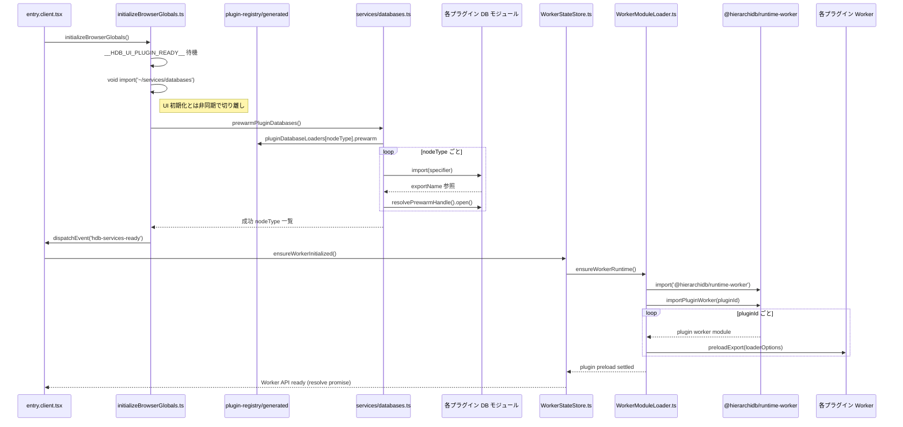

# VITE_PREWARM_SERVICES フロー解説

`VITE_PREWARM_SERVICES` を有効化（`1`）すると、UI 起動時と Worker 初期化時に下記シーケンスで前処理が走ります。以下は主要処理同士の関係を俯瞰したシーケンス図です。

## UI 側の待機時間について

- `initializeBrowserGlobals()` では `__HDB_UI_PLUGIN_READY__` 解決後に `void import('~/services/databases.js')` を実行します（`app/src/router/init/initializeBrowserGlobals.ts:176-188`）。`void` を付けているため結果を待たずに関数を抜け、UI スレッドの初期化はブロックされません。
- `prewarmPluginDatabases()` はプラグインごとの `prewarm` 設定を順に処理しますが、実際に重い I/O が発生するのは `handle.open()` が返す Promise／Dexie 初期化部分です（`app/src/services/databases.ts:169-205`）。ここも UI 側では非同期チェーンとして動くため、完了を待つのは当該タスクのみです。
- 完了後は `hdb-services-ready` カスタムイベントで通知し、UI ではスナックバー表示などに利用しています（`app/src/components/ServicesReadySnackbar.tsx`）。

## Worker 側の非同期プリウォーム

- アプリから Worker を利用する際は `ensureWorkerInitialized()` → `ensureWorkerRuntime()` が呼ばれ、初回のみ Runtime/プラグイン Worker をロードします（`app/src/worker-runtime/WorkerStateStore.ts:137-194`）。
- `WorkerModuleLoader` は `pluginWorkerPreloads` の一覧を `Promise.allSettled` で処理し、各 Worker の Dexie ストア登録などを非同期で実行します（`app/src/worker-runtime/WorkerModuleLoader.ts:22-73`）。UI 側は Worker の初期化 Promise を待つだけで、個々のプラグイン処理が失敗してもリジェクトせずワーニングに留めています。
- ルーターやコンポーネントは `ensureWorkerStarted()` を通じて Worker の準備を await するため、早期アクセスでも未初期化のまま進行することはありません（`app/src/router/loaders/workerClient.ts:49-151`）。

## PREWARM のフォールバックと安全装置

- もし `VITE_PREWARM_SERVICES` が無効、あるいは事前ウォーム完了前にプラグイン DB を利用しようとしても、`plugin-services.ts` がその場で `import()` を実行し、モジュールの `default` または名前付きエクスポートを返します（`app/src/services/plugin-services.ts:17-66`）。
- Worker 側も同様に `ensureWorkerInitialized()` がシングルトン Promise を返すため、複数箇所が同時に呼んでも初期化は 1 回に集約され、React Router/TanStack Router の loader で await することで「待ち時間」はルーティング時に吸収されます。

## まとめ

- UI の PREWARM 処理は `void` 呼び出しで切り離されており、アプリ起動の同期的な待ち時間には影響しません。
- プラグインごとの重い初期化は Worker 側へ寄せられており、`Promise.allSettled` で並列・非同期実行されます。
- PREWARM 前にサービスへアクセスしても、`plugin-services.ts` と `WorkerStateStore` でフォールバックが用意されており、必要時に await される仕組み（ルーター loader / hook）によって整合性が保たれます。

この構成により、`VITE_PREWARM_SERVICES` を有効化しても UI の「完了待ち」は通知用イベントに限定され、重い処理は Worker 側にオフロードされています。
