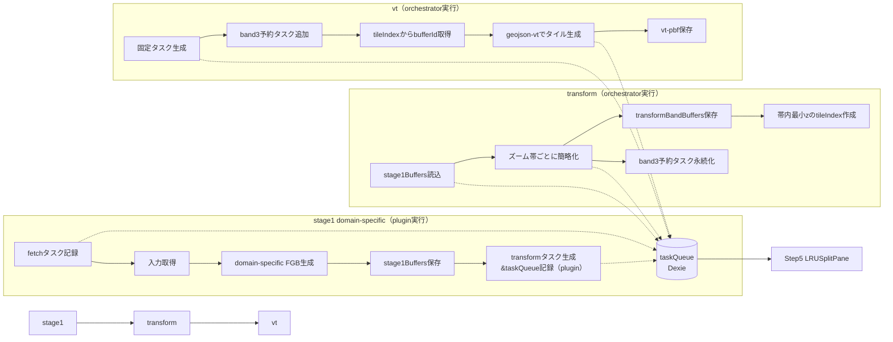

# vt パイプライン設計（共通）

本ドキュメントは、shape/route の共通パイプライン設計をまとめる。
個別差分は `docs/vt-shape-pipeline-design.md` / `docs/vt-route-pipeline-design.md` に記載する。

## 目的

- 多数のデータから高ズーム帯まで大量タイル生成を可能にする
- スケーラビリティ / I/O 効率 / メモリ制約を満たす
- shape と route の処理フローを可能な限り共通化する

## 前提

- 旧ステージ名 `vectortile` は廃止し、新ステージ名は `vt` とする
- 旧実装との併存は行わない（切替は一度きり）
- 既存データは破棄し、再生成を前提とする
- ズーム帯は以下を基本とし、band3 は条件付きで自動 ON
  - band0: z0-z2
  - band1: z3-z5
  - band2: z6-z8
  - band3: z9-z11（条件付き）

## 入力データ前提

- GeoJSON は WGS84（EPSG:4326, lon/lat）を前提とする
- タイル生成のためにはgeometryが必須であり、properties についてもホワイトリスト方式で選択的に保持する（保持するプロパティ名はデータソースのメタデータで定義）
- shape の stage1 では Polygon / MultiPolygon を生成する
- route の stage1 では LineString を生成する

## 用語

- **nodeId**: ビルド対象ノードを一意に識別する ID（全ステージの主キー軸）
- **band**: ズーム帯（band0/1/2/3）
- **zBase**: 各 band の最小ズーム（0/3/6/9）
- **buffer**: FGB で永続化した地物群
- **tileId**: `packXY(x,y,z)` の 32bit パック値
- **stage1**: `shape-fetch` / `route-fetch` のこと

## 構成要素と責務

- **shape/route plugin**
  - stage1（fetch）とドメイン固有ロジックを担当
  - smartFetch による取得・キャッシュ・リトライを実行
  - transform タスク生成（stage1 の成果に基づくタスク分割）
- **plugin → vt-orchestrator**
  - plugin が fetch タスクを **taskQueue に記録**し、自身で fetch を実行する
  - plugin が transform/vt タスクを生成し、vt-orchestrator に投入する
  - vt-orchestrator は transform/vt の実行とリソース制御を担う
- **EphemeralShapeDB / EphemeralRouteDB / EphemeralLocationDB（Location は未実装）**
  - stage1/transform の中間ストア（スキーマ + Query/Mutation）
- **ShapeDB / RouteDB / LocationDB（Location は features 永続のみ）**
  - 生成済みベクトルタイルや成果物の永続化と Query/Mutation
- **vt-orchestrator**
  - ステージ間のタスク生成と実行を統括
  - taskQueue を通じたタスクメタデータ/進捗/エラー通知を担う（Dexie 永続化）

## パッケージ構成（責務の明文化）

- `packages/`
  - ShapeDB（成果物の永続化）
  - EphemeralShapeDB（中間生成物）
- `packages/`
  - RouteDB（成果物の永続化）
  - EphemeralRouteDB（中間生成物、未実装の場合は追加）
- `packages/`
  - LocationDB（features の永続化）
  - EphemeralLocationDB（中間生成物。未実装のため必要時に新設）
- `packages/vt-orchestrator`
  - buildConfig を受け取り、transform/vt のタスクを実行
  - maxBuffersPerTask / maxVerticesPerTask / band3 予約上限を適用
- `plugins/shape-plugin`
  - shape-fetch + build UI + domain ルール
  - smartFetch を用いて GeoJSON を取得し stage1Buffers を生成
- `plugins/route-plugin`
  - route-fetch + build UI + domain ルール
  - smartFetch で外部 API を呼び出し stage1Buffers を生成
- `packages/location-store`
  - route-fetch が参照する地点 DB（LocationQuery/Mutation）

## ファイル単位の実装スケッチ（想定）

> ここでは新規作成・更新を想定するファイルを列挙する。実際の配置は既存構成に合わせて調整する。

### shape-store / route-store / location-store

- `packages//src/ShapeDB.ts`
  - ShapeDB（成果物の永続化）
- `packages//src/EphemeralShapeDB.ts`
  - EphemeralShapeDB（stage1/transform の中間生成物）
- `packages//src/RouteDB.ts`
  - RouteDB（成果物の永続化）
- `packages//src/LocationDB.ts`
  - LocationDB（features の永続化）
  - EphemeralLocationDB（未実装）

### vt-orchestrator

- `packages/vt-orchestrator/src/index.ts`
  - `runPipeline(buildConfig)`
  - `runTransform(buildConfig)`
  - `runVt(buildConfig)`
- `packages/vt-orchestrator/src/task/taskQueue.ts`
  - plugin が記録する fetch タスクと、orchestrator が実行する transform/vt タスクの永続化
  - Dexie.js 永続化によりタスクメタデータを受け渡しする
  - 進捗割合 / エラーメッセージを通知する（現行実装の責務を継承）
- `packages/vt-orchestrator/src/transform/transformBand.ts`
  - band 別簡略化 + transformBandBuffers 作成
- `packages/vt-orchestrator/src/transform/tileIndexWriter.ts`
  - zBase タイル集合の算出 + tileIndexBand への書き込み
- `packages/vt-orchestrator/src/transform/band3Reservation.ts`
  - union BBox → z9 タイル集合 → reservation 保存
- `packages/vt-orchestrator/src/vt/vtTaskBuilder.ts`
  - 固定タスク + band3 予約タスク生成
- `packages/vt-orchestrator/src/vt/vtWorker.ts`
  - geojson-vt → vt-pbf → VTMutationAPI 保存
- `packages/vt-orchestrator/src/types.ts`
  - ObsolateBuildConfig / TaskPayload / BandConfig

### shape-plugin / route-plugin

- `plugins/shape-plugin/src/services/batch/`
  - 旧実装は削除対象（vt-orchestrator に移行）
- `plugins/shape-plugin/src/worker/`
  - 旧実装は削除対象（vt-orchestrator に移行）
- `plugins/shape-plugin/src/services/build/shapeBuildConfig.ts`
  - Step4 の入力を ObsolateBuildConfig へ整形
- `plugins/shape-plugin/src/services/build/shapeBuildRunner.ts`
  - vt-orchestrator への委譲

- `plugins/route-plugin/src/services/batch/`
  - 旧実装は削除対象（vt-orchestrator に移行）
- `plugins/route-plugin/src/worker/`
  - 旧実装は削除対象（vt-orchestrator に移行）
- `plugins/route-plugin/src/services/build/routeBuildConfig.ts`
  - Step4 の入力を ObsolateBuildConfig へ整形
- `plugins/route-plugin/src/services/build/routeBuildRunner.ts`
  - vt-orchestrator への委譲
## 旧実装 → 新実装 対応表

| 旧名称 | 新名称 | 備考 |
| --- | --- | --- |
| `vectortile` ステージ | `vt` ステージ | 旧ステージは廃止 |
| `shape-store` | `EphemeralShapeDB` / `ShapeDB` | 中間生成物と成果物を分離 |
| `vectortile-store` | 各ドメインDB（ShapeDB/RouteDB/LocationDB） | ノード種別DBへ統合 |
| `vectortile-orchestrator` | `vt-orchestrator` | 内部実装を全面刷新 |
| `shape-plugin/src/services/batch` | `shape-fetch/transform/vt` へ再編 | 旧バッチは削除 |
| `shape-plugin/src/worker` | 新 vt パイプライン用に再実装 | 旧実装を削除 |
## 全体像（3ステージ）



## ステージ命名（共通）

- shape: `shape-fetch` → `transform` → `vt`
- route: `route-fetch` → `transform` → `vt`

## 責務分担と smartFetch

- 複雑なロジックは各 plugin（shape/route）に寄せる
- `vt-{shape,route}-store` は **Query/Mutation とスキーマ定義**までを責務範囲とする
- `shape-fetch` / `route-fetch` は **smartFetch を通して入出力を行う**
  - HTTP GET の認証・リトライ・chunk-store による nodeId 関連キャッシュ
  - `route-fetch` は外部 API の HTTP POST を含む場合も smartFetch を使用

## 共通データモデル（DBスキーマ）

### stage1Buffers（共通名）

- `id` (PK): `${nodeId}-${domainType}-${sourceKey}`
- `nodeId`
- `domainType` (`shape` / `route`)
- `sourceKey`（fetch 単位の識別子。再実行で同一値となることが必須）
- `countryCode`（任意、route は NULL 可）
- `adminLevel`（任意、route は NULL 可）
- `data` (FGB)
- `featureCount`
- `vertexCount`
- `timestamp`

**命名ルール**
- テーブル名は `stage1Buffers` に固定し、`domainType` で shape/route を識別する
- 以後の transform/vt は `stage1Buffers` を共通の入力として扱う
- `sourceKey` は **再実行時も同一値**になるよう決定する（idempotency 前提）

### transformBandBuffers

- `id` (PK): `${nodeId}-b${bandIndex}-${domainType}-${sourceKey}`
- `nodeId`
- `bandIndex` (0/1/2/3)
- `domainType` (`shape` / `route`)
- `sourceKey`
- `countryCode`
- `adminLevel`
- `data` (FGB)
- `featureCount`
- `vertexCount`
- `timestamp`
- `featureId` は **帯別バッファ内でユニーク**（global ではない）
  - route は `domainType + sourceKey` が唯一性を担保する

### tileIndexBand（帯内最小zのみ）

- `nodeId`
- `bandIndex`
- `zBase` (0/3/6/9)
- `tileId`
- `bufferId` (transformBandBuffers.id)

**インデックス**
- `&[nodeId+bandIndex+tileId+bufferId]`
- `[nodeId+bandIndex+tileId]`
- `[nodeId+bandIndex+bufferId]`

### vtBand3Reservations

- `nodeId`
- `tileId` (z9)
- `createdAt`

**インデックス**
- `&[nodeId+tileId]`（重複排除）

## 保存先の分担（ストア）

- `stage1Buffers` / `transformBandBuffers` / `tileIndexBand` / `vtBand3Reservations`
  - EphemeralShapeDB / EphemeralRouteDB / EphemeralLocationDB に保持する（Location は未実装）
- 生成済みタイル（vt-pbf）
  - ShapeDB / RouteDB / LocationDB に保存する（Location は features のみ）

## タイル保存キー（連結方式）

- 保存キーは `tileId` と `bufferSetHash` を **区切り文字で連結**する
  - 区切り文字は `tileId` / `bufferSetHash` に使われない文字を選ぶ
  - 例: `|` を区切りにして `${tileId}|${bufferSetHash}`

## タスク生成（固定 + band3 追加）

**固定タスク**
- band0: z0 (0/0/0) = 1タスク
- band1: z3 (3/0/0-3/7/7) = 64タスク
- band2: z6 (6/0/0-6/63/63) = 4096タスク

**band3 追加タスク**
- `vtBand3Reservations` の tileId を読み込み追加

## band3 自動ONと対象条件

### shape

- いずれかの国で自治体レベル2以上を選択した場合に自動 ON
- 実行対象は **adminLevel>=2 が選択されている国のみ**
- 判定は **Step3 の国×自治体レベル選択**に依存する

### route

- **兄弟/子孫の shape ノードのズーム帯サポート状況**に依存して自動 ON
- LineString がタイル境界を跨いでも抽出/描画が一致することを優先する

## band3 予約タスクの軽量永続化

- transform で adminLevel>=2 を扱うタスクは、
  **そのタスクが扱う地物の union BBox を z9 タイル集合へ変換**し、予約として保存
- 重複排除は `&[nodeId+tileId]` で保証
- `maxBand3Reservations` を超える場合は **安全策としてエラー**とする
  - このエラーは **リカバリー目的ではない**
  - 上限を超える利用は **サポート対象外**であることを明示する

## タスク分割ルール（上限管理）

- `maxBuffersPerTask` / `maxVerticesPerTask` を導入
- 親タイル単位で bufferIds を取得した後、以下で分割

**分割手順**
1. `bufferId -> vertexCount` を参照
2. 大きい順に greedy に詰める
3. 上限超過で新タスクを作成

## TileId / TileBBox 変換（共通）

**前提**
- zMax は通常 8、最大 11
- TileBBox は **タイル座標系**（lon/lat ではない）
 - Tile 座標は Slippy Map 形式（WebMercator）を前提とする

```ts
export type Tile = { z: number; x: number; y: number };
export type TileId = number;

export function packXY(x: number, y: number, z: number): TileId {
  if (z < 0 || z > 11) throw new Error('z out of range');
  const max = 1 << z;
  if (x < 0 || x >= max || y < 0 || y >= max) {
    throw new Error(`x/y out of range for z=${z}`);
  }
  return (((x << z) | y) >>> 0) as TileId;
}

export function unpackXY(tileId: TileId, z: number): { x: number; y: number } {
  if (z < 0 || z > 11) throw new Error('z out of range');
  const mask = (1 << z) - 1;
  const y = tileId & mask;
  const x = tileId >>> z;
  return { x, y };
}

export type TileBBox = { minX: number; minY: number; maxX: number; maxY: number };

export function parentTileToChildRange(tile: Tile, zTarget: number): { xStart: number; xEnd: number; yStart: number; yEnd: number } {
  if (zTarget < tile.z) throw new Error('zTarget must be >= tile.z');
  const d = zTarget - tile.z;
  const xStart = tile.x << d;
  const xEnd = ((tile.x + 1) << d) - 1;
  const yStart = tile.y << d;
  const yEnd = ((tile.y + 1) << d) - 1;
  return { xStart, xEnd, yStart, yEnd };
}
```

## ステージ入出力（概要）

| ステージ | 入力 | 出力 |
| --- | --- | --- |
| stage1 (shape-fetch / route-fetch) | remote GeoJSON / route metadata | `stage1Buffers` + transform タスク |
| transform | `stage1Buffers` | `transformBandBuffers` + `tileIndexBand` + `vtBand3Reservations` |
| vt | `tileIndexBand` + `transformBandBuffers` | VTMutationAPI へ vt-pbf 保存 |

## タスク payload（最小要件）

### fetch タスク（plugin → taskQueue）

stage1 は plugin が実行するが、進捗可視化のため taskQueue で管理する。
fetch の開始/進捗/完了（succeeded/reused/failed）は plugin 側が taskQueue に書き込み、
vt-orchestrator は fetch の実行は行わない。

- `nodeId`
- `domainType` (`shape` / `route`)
- `sourceKey`（fetch 単位を一意に識別）
- `countryCode` / `adminLevel`（shape の場合）
- `srcId` / `dstId`（route の場合）

**fetch 成功時のキャッシュ**
- fetch タスクが `succeeded` の場合は smartFetch でキャッシュを保存する
- 以降の同様タスクはキャッシュを用いて `reused` として処理する

### transform タスク（plugin → taskQueue）

- `nodeId`
- `bandIndex`
- `stage1BufferId`
- `domainType`
- `sourceKey`
- `stagePriority`（ステージ内実行優先度。小さいほど先に実行）
 
### vt タスク（plugin → taskQueue）

- `nodeId`
- `bandIndex`
- `zBase`
- `tileId`（zBase のタイル）
- `bufferIds[]`（上限分割後の対象バッファ）
- `domainType`
- `sourceKey`

## taskQueue の状態遷移と通知

### 状態遷移

- `queued` → `running` → `succeeded`
- `queued` → `running` → `failed`
- `queued` → `running` → `skipped`
- `queued` → `running` → `reused`

### 進捗イベント（最小フォーマット）

- `taskId`
- `nodeId`
- `stage` (`fetch` / `transform` / `vt`)
- `status` (`queued` / `running` / `succeeded` / `failed` / `skipped` / `reused`)
- `progress` (0-100)
- `message`（任意、ログ/補足）
- `error`（任意、失敗時の詳細）

> 状態/進捗/エラーは Dexie.js に永続化し、Step5 の LRUSplitPane へ通知する。
> taskQueue の UI 可視化は **現行実装を踏襲**し、LRUSplitPane は taskQueue の永続化データを参照して表示する。

**skipped の条件（例）**
- 依存タスクが不要と判定された

**reused の条件（例）**
- 重要処理（例: fetch-* の外部アクセス）を実行せず、キャッシュ等で **成功時と同等の成果**を提供する

**後段タスク/リソース提供の差**
- `reused`: 重要処理は実行しないが、後段ステージに **成功時と同等の成果**を提供する
- `skipped`: 重要処理を実行せず、後段ステージに **提供する内容がない**（エラー報告は不要）

## 再実行・再利用の判定（計画）

> 現行の ephemeral taskQueue を前提にし、状態は `completed` に統一しつつ **message 前置詞で再利用/スキップを表現**する。
> 例: `message = "reused: <reason>"` / `message = "skipped: <reason>"`（UI 側は現行の `isSkippedMessage` で判定）。

### 実装手順（taskQueue 更新の流れ）

1. **queued 登録**: taskQueue に `status=waiting` で登録（taskId は安定生成）
2. **開始**: 実処理を開始する直前に `status=running` を記録
3. **判定**:
   - reused 判定が成立した場合: `status=completed`, `message="reused: <reason>"` で更新
   - skipped 判定が成立した場合: `status=completed`, `message="skipped: <reason>"` で更新
4. **成功**: 処理が完了した場合は `status=completed`（message は任意）
5. **失敗**: 失敗時は `status=failed` + `errorMessage`

> 状態は現行の taskQueue 型に合わせ、`waiting/running/completed/failed` を使用する。
> reused/skipped は **message 前置詞**で表現し、UI 側は現行の `isSkippedMessage` 互換を維持する。

### fetch（shape-fetch / route-fetch）

- **判定キー**: `domainType + sourceKey + dataSource + requestSignature`
  - fetch-shape（geoBoundaries/GADM）は **GETのみ**で利用するため、`requestSignature` は **URLそのもの**をキーとして扱う
  - route-fetch は POST を含むため、smartFetch の requestSignature（URL/method/body/auth）に準拠
- **reused 条件**:
  - smartFetch が **外部アクセス無し**でキャッシュヒットした場合
  - route の waypoints 計算が **キャッシュヒット**した場合（大圏航路 / searoute-jp / 外部API）
- **skipped 条件**:
  - 対象が存在しない（例: 国×adminLevel の選択結果が空）
  - データ取得対象が 0 件で **後段へ渡すバッファを生成しない**と判断した場合
- **再実行トリガ**:
  - dataSource の変更
  - 取得条件（国/レベル/route 種別）の変更
  - smartFetch キャッシュ削除

### transform

- **判定キー**: `domainType + sourceKey + bandIndex + geometryConfigHash`
  - geometryConfigHash に含める項目:
    - `bandIndex`, `bandRange`（zMin/zMax）
    - `gridSnap`（extent=4096、round）
    - `simplificationTolerance`（Transform の係数）
    - `quantize`（transform の量子化）
    - `tileIndex`（geojson-vt の indexMaxZoom, buffer, extent）
- **reused 条件**:
  - `transformBandBuffers` と `tileIndexBand` が同一キーで存在し、内容が一致する場合
  - band3 予約タスクが既に登録済みで、予約上限に達していない場合
- **skipped 条件**:
  - `stage1Buffers` が無い
  - 対象 band に該当する地物が無く、後段の tileIndex を生成しない場合
- **再実行トリガ**:
  - stage1Buffer の更新/削除
  - transform 設定（簡略化強度・band・grid-snap 条件）の変更
  - band3 判定の変更

### vt

- **判定キー**: `domainType + bandIndex + zBase + tileId + bufferSetHash + tileEmitConfigHash`
  - bufferSetHash に含める項目:
    - `bufferIds[]` をソートした配列
  - tileEmitConfigHash に含める項目:
    - `extent`（4096）
    - `buffer`（tile buffer）
    - `tileSize`（256/512）
    - `vtSimplificationTolerance`（VT の係数）
    - `boundaryDedupe`（on/off + 実装バージョン）
    - `layers`（出力対象レイヤーの固定順リスト）
- **reused 条件**:
  - 各ドメインDBで同一キーのタイルが存在し、contentHash が一致する場合
- **skipped 条件**:
  - tileIndex に該当地物が無い（空タイル）
  - `bufferIds` が空、または対応バッファが欠損している場合
- **再実行トリガ**:
  - transformBandBuffers / tileIndexBand の更新
  - vt 設定（tolerance / buffer / extent / dedupe）の変更
  - 各ドメインDBの該当タイル削除

### ハッシュ生成のルール（共通）

- **順序正規化**:
  - 配列はソートしてから結合
  - オブジェクトはキー順に並べ替えてからシリアライズ
- **値の正規化**:
  - boolean は `true/false`
  - 数値は小数誤差がないよう固定精度（例: `toFixed(6)`）
  - undefined は除外、null は `null` として扱う
- **シリアライズ**:
  - JSON 文字列化（キー順固定）を基本とする
  - 文字列化後にハッシュ化（既存実装の **SHA3** を使用）

## FGB 保存先（再掲）

- **stage1Buffers**
  - テーブル: `stage1Buffers`
  - PK: `${nodeId}-${domainType}-${sourceKey}`
- **transformBandBuffers**
  - テーブル: `transformBandBuffers`
  - PK: `${nodeId}-b${bandIndex}-${domainType}-${sourceKey}`
- **tileIndexBand**
  - テーブル: `tileIndexBand`
  - インデックス: `&[nodeId+bandIndex+tileId+bufferId]`

## taskId 生成規則（現行の課題と新仕様）

**現行想定の課題（批判的検討）**
- 自動採番のみでは再実行・再起動時に同一タスクの同定が難しい
- fetch/transform/vt の粒度が異なるため、衝突回避のキー設計が必要

**新仕様（決定規則）**
- `taskId` は **安定・再現可能**であることを必須とする
- `taskId` は `nodeId` と `stage` を含み、**sourceKey ベースで一意**になるようにする

**taskId の構成（例）**
- `fetch`: `${nodeId}:fetch:${domainType}:${sourceKey}`
- `transform`: `${nodeId}:transform:${bandIndex}:${domainType}:${sourceKey}`
- `vt`: `${nodeId}:vt:${bandIndex}:${zBase}:${tileId}:${bufferSetHash}`

**拡張例（hash を含める場合）**
- `transform`: `${nodeId}:transform:${bandIndex}:${domainType}:${sourceKey}:${geometryConfigHash}`
- `vt`: `${nodeId}:vt:${bandIndex}:${zBase}:${tileId}:${bufferSetHash}:${tileEmitConfigHash}`

**補足**
- `bufferSetHash` は `bufferIds[]` の内容を安定ハッシュ化した値
- 同一タスクの重複登録を防ぐため、Dexie 側で `&[taskId]` をユニーク制約とする

## キャッシュキー規則（smartFetch / waypoints）

**現行想定の課題（批判的検討）**
- キーが曖昧だと stale データや誤再利用が発生する
- TTL/無効化条件がないとキャッシュが肥大化する

**新仕様（決定規則）**
- キャッシュキーは **入力の完全一致**で決定する
- データソースのバージョンやスキーマ変更で無効化できること

**smartFetch キー構成（例）**
- `method + url + bodyHash + authScope + dataSourceVersion`

**waypoints キー構成（例）**
- `srcId + dstId + waypointMode + optionsHash + dataSourceVersion`

**TTL / 無効化**
- `dataSourceVersion` 更新時に全 invalidation
- TTL はデータソース側で指定可能（未指定時は永続）

## tile coverage / tile index の具体 API

**現行想定の課題（批判的検討）**
- geometry 種別ごとの取り扱いが曖昧だとタイル欠落が発生する

**新仕様（決定規則）**
- tile coverage は **turf** を使用し、geometry の BBox と交差判定を行う
- tile index は **geojson-vt** を使用し、zBase タイル集合を確定する

## エラー / リトライ方針

**現行想定の課題（批判的検討）**
- 自動再試行が過剰だと I/O が過負荷になる

**新仕様（決定規則）**
- `fetch`: ネットワーク系はリトライ（回数は buildConfig の retryAttempts を使用）
- `transform`: deterministic なので基本再試行なし（失敗は failed）
- `vt`: リトライ不要（失敗は failed）

## tileIndexBand の生成ルール

- `transformBandBuffers` の地物に対して **zBase のタイル集合**を計算し、`tileIndexBand` に保存する
- tile coverage 計算は **turf** を使用する
- tile index 計算は **geojson-vt** を使用する（band3 予約は BBox ベース）

## idempotency と再実行

- `stage1Buffers` / `transformBandBuffers` / `tileIndexBand` は **同一キーで upsert**
- `vt` は `nodeId + z + x + y + layer` 単位で上書き可能にする
- タスク再実行で同一結果が得られることを前提に設計する

## 中間ストアのライフサイクル

- `vt` 完了後に `stage1Buffers` / `transformBandBuffers` / `tileIndexBand` を削除してよい
- `vtBand3Reservations` は band3 完了後に削除してよい
- 中間ストア/タスクの削除は PluginLifecycleAPI を通じて実行する
## パラメータ（初期値案）

- `maxBuffersPerTask`: 64-256
- `maxVerticesPerTask`: 50k-200k
- `maxBand3Reservations`: 要検証（初期値は 50k 程度から）

## Step4 設定（補足）

- `band3Enabled`: 自動判定（表示のみ、ユーザー操作は不可）
- `maxBuffersPerTask` / `maxVerticesPerTask` / `maxBand3Reservations`: vt タスクの分割上限（Advanced Settings 内）
- band の z 範囲は固定（表示のみ）

## Step4 入力仕様（最終参照）

> UI実装の現行値を基準に整理。後続で型/境界/既定値の確定が必要。  
> 本節が Step4 入力仕様の **最終的な参照元** であり、他文書はこの内容に従う。  
> 読み順: 1) Legacy controls → 2) 非Legacy要約 → 3) 詳細 → 4) UI構造

### 1) Legacy controls（旧Extract互換）

- 対象（shape）: `extract1Config.workers`, `extract1Config.tolerance`, `extract2Config.workers`, `extract2Config.tolerance`, `extract2Config.quantize`
- 配置: **Advanced Settings** 内に集約（UI構造ツリーも同様）
- 方針: 新設計の Transform/VT が安定するまで残置し、移行完了後に削除
- 用語: `Legacy tolerance` は段階移行（非表示化→削除）
- 削除タイミング: **旧 Extract のコードパス削除完了** + **移行後スケール適用確認**

### 2) 非Legacy項目（要約）

#### shape
- fetch: `downloadConfig.maxConcurrent`, `timeoutMs`, `retryDelay`, `retryAttempts`（fetch 設定）
- transform: `transformShapeSimplificationTolerance`, `featureFilterMethod`, `areaThreshold`, `hybridFilterConfig.*`
- vt: `tileConfig.minZoom/maxZoom`, `zoomBreakpoints`, `bufferSize`, `tileExpandFactor`, `tileExpandMargin`, `vtShapeSimplificationTolerance`
- task split: `maxBuffersPerTask`, `maxVerticesPerTask`, `maxBand3Reservations`

#### route
- fetch: `processing.apiThrottle.requestsPerSecond`, `processing.apiThrottle.maxConcurrent`
- transform: `transformRouteSimplificationTolerance`（旧 `processing.extraction.tolerance` は移行対象）
- vt: `processing.vectorTiles.minZoom/maxZoom`, `processing.vectorTiles.buffer`, `vtRouteSimplificationTolerance`
- task split: `maxBuffersPerTask`, `maxVerticesPerTask`, `maxBand3Reservations`

### 3) 移行後に有効化する項目（チェックリスト）

- [ ] `transformShapeSimplificationTolerance`（shape）
- [ ] `vtShapeSimplificationTolerance`（shape）
- [ ] `transformRouteSimplificationTolerance`（route）
- [ ] `vtRouteSimplificationTolerance`（route）
- [ ] `processing.extraction.tolerance` のスケール変更（route: 0.1〜5.0）
- 運用: 実装時は TASKS.md の運用ログに適用状況を記録する

### 4) 既存UIと新設計の差分・移行点

- `processing.extraction.tolerance`（route）
  - 現行: 0〜100 の任意スケール、既定 50
  - 移行後: 簡略化強度（係数）0.1〜5.0、既定 1.0
  - 対応: UI ラベルを「簡略化強度」に統一し、スケールを 0.1〜5.0 へ変更
  - 優先度: P1（数値の意味が互換でない）
  - 判断: **移行（置換）**
- `transformRouteSimplificationTolerance` / `vtRouteSimplificationTolerance`
  - 現行: UI 項目なし
  - 移行後: 追加（既定 1.0、範囲 0.1〜5.0）
  - 対応: Geometry extraction / Vector tile settings に追加
  - 優先度: P1 / 判断: **追加**
- `transformShapeSimplificationTolerance` / `vtShapeSimplificationTolerance`
  - 現行: UI 項目なし
  - 移行後: 追加（既定 1.0、範囲 0.1〜5.0）
  - 対応: Tile Preprocessing / Tile Generation に追加
  - 優先度: P1 / 判断: **追加**
- `extract1Config.tolerance` / `extract2Config.tolerance`（shape）
  - 現行: degree UI 表記 + 旧 extract 基準
  - 移行後: Legacy controls として残置
  - 優先度: P2 / 判断: **残置（段階移行）**

### 5) Step4 UI 表記（最終版）

- `Build Settings (shape-fetch / transform / vt)` / `ビルド設定（shape-fetch / transform / vt）`
- `shape-fetch` / `route-fetch`
- `Transform` / `Transform`
- `VT` / `VT`
- `Simplification strength` / `簡略化強度`
- `Transform preprocessing` / `Transform 前処理`
- `VT generation` / `VT 生成`
- `Delete fetch cache` / `fetch キャッシュ削除`
- `Delete transform cache` / `transform キャッシュ削除`
- `Delete vt cache` / `vt キャッシュ削除`
- `Legacy controls` 表示文: `旧 Extract 互換のため残置（Advanced Settings 内）` / `Kept for legacy Extract compatibility (Advanced Settings)`

**説明文の最終形**
- Transform: 「Transform で形状を簡略化し、以降の vt 生成に備える」
- VT: 「VT 生成設定（vt-pbf への出力と境界線のデデュープ）」
- Simplification: 「簡略化強度を調整し、RDP の許容誤差へ変換」
- Fetch: 「shape-fetch / route-fetch でデータ取得（smartFetch 経由）」

### 6) Step4 入力仕様（詳細）

#### shape

##### fetch（shape-fetch）

- `downloadConfig.maxConcurrent`（Rating, fetch 設定）
  - 形式: number（整数）
  - 単位: workers
  - バリデーション: min=1, max=4, step=1
  - 既定値出典: `DEFAULT_PROCESSING_CONFIG.downloadConfig.maxConcurrent`（未設定時は 2）
- `downloadConfig.timeoutMs`（TextField, fetch 設定）
  - 形式: number
  - 単位: ms
  - バリデーション: min=0
  - 既定値出典: `DEFAULT_PROCESSING_CONFIG.downloadConfig.timeoutMs`（未設定時は 300000）
- `downloadConfig.retryDelay`（TextField, fetch 設定）
  - 形式: number
  - 単位: ms
  - バリデーション: min=0
  - 既定値出典: `DEFAULT_PROCESSING_CONFIG.downloadConfig.retryDelay`（未設定時は 1000）
- `downloadConfig.retryAttempts`（Rating, fetch 設定）
  - 形式: number（整数）
  - 単位: 回数
  - バリデーション: max=10
  - 既定値出典: `DEFAULT_PROCESSING_CONFIG.downloadConfig.retryAttempts`（未設定時は 3）

##### transform

- `extract1Config.workers`（Rating）
  - 形式: number（整数）
  - 単位: workers
  - バリデーション:
    - 現行: min=1, max=8, step=1
    - 移行後: 変更なし（Legacy controls に固定）
  - 既定値出典:
    - 現行: `DEFAULT_PROCESSING_CONFIG.extract1Config.workers`（未設定時は 2）
    - 移行後: Legacy controls（同値維持）
  - 注記: **Legacy controls**（Advanced Settings 内）
- `extract1Config.tolerance`（Slider）
  - 形式: number
  - 単位:
    - 現行: degree（UI表記）
    - 移行後: Legacy controls（互換維持）
  - バリデーション:
    - 現行: min=0, max=1, step=0.01
    - 移行後: 変更なし（Legacy controls に固定）
  - 既定値出典:
    - 現行: `DEFAULT_PROCESSING_CONFIG.extract1Config.tolerance`（未設定時は 0.02）
    - 移行後: Legacy controls（同値維持）
  - 注記: **Legacy controls**（Advanced Settings 内）
- `extract1Config.featureFilterMethod`（Radio）
  - 形式: enum（none/bbox_only/polygon_only/hybrid）
  - 既定値出典: `DEFAULT_PROCESSING_CONFIG.extract1Config.featureFilterMethod`（未設定時は hybrid）

- `extract2Config.workers`（Rating）
  - 形式: number（整数）
  - 単位: workers
  - バリデーション:
    - 現行: min=1, max=8, step=1
    - 移行後: 変更なし（Legacy controls に固定）
  - 既定値出典:
    - 現行: `DEFAULT_PROCESSING_CONFIG.extract2Config.workers`（未設定時は 2）
    - 移行後: Legacy controls（同値維持）
  - 注記: **Legacy controls**（Advanced Settings 内）
- `extract2Config.tolerance`（Slider）
  - 形式: number
  - 単位:
    - 現行: degree（UI表記）
    - 移行後: Legacy controls（互換維持）
  - バリデーション:
    - 現行: min=0, max=1, step=0.05
    - 移行後: 変更なし（Legacy controls に固定）
  - 既定値出典:
    - 現行: `DEFAULT_PROCESSING_CONFIG.extract2Config.tolerance`（未設定時は 0.1）
    - 移行後: Legacy controls（同値維持）
  - 注記: **Legacy controls**（Advanced Settings 内）
- `extract2Config.enablePerFeatureExtraction`（Switch）
  - 形式: boolean
  - 既定値出典: `DEFAULT_PROCESSING_CONFIG.extract2Config.enablePerFeatureExtraction`（未設定時は true）
- `extract2Config.quantize`（Rating）
  - 形式: number（選択肢）
  - 単位:
    - 現行: quantize 値
    - 移行後: Legacy controls（互換維持）
  - バリデーション:
    - 現行: `quantizeOptions` 内に丸め
    - 移行後: 変更なし（Legacy controls に固定）
  - 既定値出典:
    - 現行: `DEFAULT_PROCESSING_CONFIG.extract2Config.quantize`（未設定時は 200000）
    - 移行後: Legacy controls（同値維持）
  - 注記: **Legacy controls**（Advanced Settings 内）
- `transformShapeSimplificationTolerance`（Slider）
  - 形式: number
  - 単位: 係数（簡略化強度）
  - バリデーション: min=0.1, max=5.0, step=0.1
  - 既定値出典: 新設計で追加予定（仕様値は 1.0）

##### vt

- `tileConfig.workers`（Rating）
  - 形式: number（整数）
  - 単位: workers
  - バリデーション: min=1, max=8, step=1
  - 既定値出典: `DEFAULT_PROCESSING_CONFIG.tileConfig.workers`（未設定時は 4）
- `tileConfig.minZoom/maxZoom`（Range Slider）
  - 形式: number（整数）
  - 単位: zoom
  - バリデーション: min=0, max=12, step=1
  - 既定値出典: `DEFAULT_PROCESSING_CONFIG.tileConfig.minZoom/maxZoom`（未設定時は 0/7）
- `tileConfig.zoomBreakpoints`（Slider）
  - 形式: number[]（segments+1）
  - 単位: zoom
  - バリデーション: 範囲内・昇順に正規化
  - 既定値出典: `DEFAULT_PROCESSING_CONFIG.tileConfig.zoomBreakpoints`（未設定時は [0,4,7]）
- `tileConfig.bufferSize`（Slider）
  - 形式: number
  - 単位: px
  - バリデーション: min=0, max=512, step=32
  - 既定値出典: `DEFAULT_PROCESSING_CONFIG.tileConfig.bufferSize`（未設定時は 256）
- `tileConfig.tileExpandFactor`（Slider）
  - 形式: number
  - 単位: 倍率
  - バリデーション: min=0, max=3, step=0.1
  - 既定値出典: `DEFAULT_PROCESSING_CONFIG.tileConfig.tileExpandFactor`（未設定時は 1）
- `tileConfig.tileExpandMargin`（Slider）
  - 形式: number
  - 単位: tile units
  - バリデーション: min=0, max=2, step=0.1
  - 既定値出典: `DEFAULT_PROCESSING_CONFIG.tileConfig.tileExpandMargin`（未設定時は 0）
- `vtShapeSimplificationTolerance`（Slider）
  - 形式: number
  - 単位: 係数（簡略化強度）
  - バリデーション: min=0.1, max=5.0, step=0.1
  - 既定値出典: 新設計で追加予定（仕様値は 1.0）

##### task split

- `maxBuffersPerTask`（TextField）
  - 形式: number
  - 単位: 件数
  - バリデーション: min=1
  - 既定値出典: 新設計で追加予定（仕様値は 64-256）
  - 注記: UI 構造ツリーでは **Advanced Settings** に配置する
- `maxVerticesPerTask`（TextField）
  - 形式: number
  - 単位: 頂点数
  - バリデーション: min=1
  - 既定値出典: 新設計で追加予定（仕様値は 50k-200k）
  - 注記: UI 構造ツリーでは **Advanced Settings** に配置する
- `maxBand3Reservations`（TextField）
  - 形式: number
  - 単位: 件数
  - バリデーション: min=0
  - 既定値出典: 新設計で追加予定（仕様値は 50k 目安）
  - 注記: UI 構造ツリーでは **Advanced Settings** に配置する

#### route

##### fetch（route-fetch）

- `processing.apiThrottle.requestsPerSecond`（Slider）
  - 形式: number（整数）
  - 単位: req/sec
  - バリデーション: min=1, max=20, step=1
  - 既定値出典: `DEFAULT_CONFIG.apiThrottle.requestsPerSecond`（未設定時は 5）
- `processing.apiThrottle.maxConcurrent`（TextField）
  - 形式: number
  - 単位: 同時リクエスト数
  - バリデーション: min=1, max=10
  - 既定値出典: `DEFAULT_CONFIG.apiThrottle.maxConcurrent`（未設定時は 2）

##### transform

- `processing.extraction.tolerance`（Slider）
  - 形式: number
  - 単位:
    - 現行: 任意スケール（legacy）
    - 移行後: 簡略化強度（係数）
  - バリデーション:
    - 現行: min=0, max=100, step=1
    - 移行後: min=0.1, max=5.0, step=0.1
  - 既定値出典:
    - 現行: `DEFAULT_CONFIG.extraction.tolerance`（未設定時は 50）
    - 移行後: 新設計で追加予定（仕様値は 1.0）
- `transformRouteSimplificationTolerance`（Slider）
  - 形式: number
  - 単位: 係数（簡略化強度）
  - バリデーション: min=0.1, max=5.0, step=0.1
  - 既定値出典: 新設計で追加予定（仕様値は 1.0）

##### vt

- `processing.vectorTiles.minZoom/maxZoom`（TextField）
  - 形式: number
  - 単位: zoom
  - バリデーション: min=0, max=22
  - 既定値出典: `DEFAULT_CONFIG.vectorTiles.minZoom/maxZoom`（未設定時は 4/12）
  - 備考: sharedZoomRange で上書き、UIは disabled
- `processing.vectorTiles.buffer`（TextField）
  - 形式: number
  - 単位: px
  - バリデーション: min=0, max=128
  - 既定値出典: `DEFAULT_CONFIG.vectorTiles.buffer`（未設定時は 8）
- `vtRouteSimplificationTolerance`（Slider）
  - 形式: number
  - 単位: 係数（簡略化強度）
  - バリデーション: min=0.1, max=5.0, step=0.1
  - 既定値出典: 新設計で追加予定（仕様値は 1.0）

##### task split

- `maxBuffersPerTask`（TextField）
  - 形式: number
  - 単位: 件数
  - バリデーション: min=1
  - 既定値出典: 新設計で追加予定（仕様値は 64-256）
  - 注記: UI 構造ツリーでは **Advanced Settings** に配置する
- `maxVerticesPerTask`（TextField）
  - 形式: number
  - 単位: 頂点数
  - バリデーション: min=1
  - 既定値出典: 新設計で追加予定（仕様値は 50k-200k）
  - 注記: UI 構造ツリーでは **Advanced Settings** に配置する
- `maxBand3Reservations`（TextField）
  - 形式: number
  - 単位: 件数
  - バリデーション: min=0
  - 既定値出典: 新設計で追加予定（仕様値は 50k 目安）
  - 注記: UI 構造ツリーでは **Advanced Settings** に配置する

### 7) Step4 入力項目（説明対応）

#### shape

- `downloadConfig.maxConcurrent` : smartFetch の同時実行数を制限する（fetch）
- `downloadConfig.timeoutMs` : 外部API呼び出しのタイムアウト（ms, fetch）
- `downloadConfig.retryDelay` : リトライ間隔（ms, fetch）
- `downloadConfig.retryAttempts` : リトライ回数（fetch）
- `extract1Config.workers` : Transform 前段の並列数（Legacy controls / Advanced Settings）
- `extract1Config.tolerance` : 旧 Extract 互換の許容誤差（Legacy controls / Advanced Settings）
- `extract2Config.workers` : Transform 後段の並列数（Legacy controls / Advanced Settings）
- `extract2Config.tolerance` : 旧 Extract 互換の許容誤差（Legacy controls / Advanced Settings）
- `extract2Config.quantize` : 旧 Extract 互換の量子化（Legacy controls / Advanced Settings）
- `transformShapeSimplificationTolerance` : Transform 簡略化強度（RDP 係数）
- `tileConfig.minZoom/maxZoom` : VT 出力のズーム範囲
- `tileConfig.zoomBreakpoints` : band の分割位置（固定レンジ確認）
- `tileConfig.bufferSize` : タイル境界のバッファ幅
- `vtShapeSimplificationTolerance` : VT 生成時の簡略化強度

#### route

- `processing.apiThrottle.requestsPerSecond` : 外部APIの呼び出し頻度制御
- `processing.apiThrottle.maxConcurrent` : 外部APIの同時リクエスト上限
- `processing.extraction.tolerance` : 旧UI互換の簡略化強度（移行完了後に新スケールへ統一）
- `transformRouteSimplificationTolerance` : Transform 簡略化強度（RDP 係数）
- `processing.vectorTiles.minZoom/maxZoom` : VT 出力のズーム範囲
- `processing.vectorTiles.buffer` : タイル境界のバッファ幅
- `vtRouteSimplificationTolerance` : VT 生成時の簡略化強度

## Step4 設定のUI構造（4階層ツリー）

### shape

- Step4（処理設定）
  - Accordion: Fetch / Cache Management
    - Card/Paper: WorkerNumberConfigCard
      - Form: Rating（downloadConfig.maxConcurrent）
    - Card/Paper: Retain intermediate outputs
      - Form: Switch（cleanupConfig.deleteFetchApiCache）
      - Form: Switch（cleanupConfig.deleteFetchFilteredCache）
      - Form: Switch（cleanupConfig.deleteTransformCache）
      - Form: Switch（cleanupConfig.deleteVTCache）
    - Card/Paper: Delete stage outputs immediately
      - Form: Button（API cache / Filtered cache / Simplified cache / Tile index + tile data cache / Metadata / Reset）
    - Card/Paper: DownloadRetryControls
      - Form: TextField（timeoutMs）
      - Form: TextField（retryDelay）
      - Form: Rating（retryAttempts）
  - Accordion: Primary Extraction
    - Card/Paper: AreaFilterPanel
      - Form: RadioGroup（featureFilterMethod）
      - Form: Slider（minVertexCountForAreaFilter）
      - Form: Slider（areaThreshold）
      - Form: Slider（hybridFilterConfig.quickRejectThreshold）
      - Form: Slider（hybridFilterConfig.simpleShapeVertexThreshold）
      - Form: Slider（hybridFilterConfig.elongatedShapeCorrectionFactor）
  - Accordion: Tile Preprocessing
    - Card/Paper: Simplification (Transform)
      - Form: Slider（transformShapeSimplificationTolerance）
    - Card/Paper: ExtractionPanel
      - Form: Switch（extract2Config.enablePerFeatureExtraction）
  - Accordion: Tile Generation
    - Card: WorkerNumberConfigCard
      - Form: Rating（tileConfig.workers）
    - Card: Zoom Range
      - Form: Slider（minZoom/maxZoom）
      - Form: Slider（zoomSegments）
      - Form: Slider（zoomBreakpoints）
    - Card: Tile Margin
      - Form: Slider（tileConfig.bufferSize）
    - Card: Tile Expansion Factor
      - Form: Slider（tileConfig.tileExpandFactor）
    - Card: Tile Expansion Margin
      - Form: Slider（tileConfig.tileExpandMargin）
    - Card: Simplification (VT)
      - Form: Slider（vtShapeSimplificationTolerance）
  - Accordion: Advanced Settings
    - Card/Paper: Task Split Limits
      - Form: TextField（maxBuffersPerTask）
      - Form: TextField（maxVerticesPerTask）
      - Form: TextField（maxBand3Reservations）
    - Card/Paper: Legacy controls (Extract compatibility)
      - Form: Rating（extract1Config.workers）
      - Form: Slider（extract1Config.tolerance）
      - Form: Rating（extract2Config.workers）
      - Form: Slider（extract2Config.tolerance）
      - Form: Rating（extract2Config.quantize）

### route

- Step4（処理設定）
  - Section: API throttling
    - Form: Slider（requestsPerSecond）
    - Form: TextField（maxConcurrent）
  - Section: Geometry extraction
    - Form: Slider（extraction.tolerance）
    - Form: Slider（transformRouteSimplificationTolerance）
  - Section: Vector tile settings
    - Form: TextField（vectorTiles.minZoom）
    - Form: TextField（vectorTiles.maxZoom）
    - Form: Slider（vtRouteSimplificationTolerance）
    - Form: TextField（vectorTiles.buffer）
  - Section: Cleanup
    - Form: Button（Delete route line data）
  - Section: Advanced Settings
    - Form: TextField（maxBuffersPerTask）
    - Form: TextField（maxVerticesPerTask）
    - Form: TextField（maxBand3Reservations）
    - Note: route は Legacy controls なし（task split のみ）

## Step4 設定の対応区分（新仕様との整合）

### shape

**(A) 新仕様でもこのまま使える項目**
- downloadConfig.maxConcurrent（fetch 並列数として維持）
- downloadConfig.timeoutMs / retryDelay / retryAttempts（fetch の I/O 失敗対策）
- featureFilterMethod / minVertexCountForAreaFilter / areaThreshold / hybridFilterConfig.*（transform 前のフィルタとして継続）
- extract1Config.tolerance（旧 Extract 互換の許容誤差として残置。Advanced Settings 内）
- extract2Config.enablePerFeatureExtraction（feature 単位処理の許容）
- extract2Config.quantize（旧 Extract 互換の量子化として残置。Advanced Settings 内）
- tileConfig.bufferSize / tileExpandFactor / tileExpandMargin（vt 生成パラメータ）
- tileConfig.minZoom/maxZoom + zoomSegments + zoomBreakpoints（vt 範囲の基準）

**(B) 不要となって削除すべき項目**
- extractionMode（off/topojson/geojson）
  - 理由: 新仕様では transform 出力は FGB 固定で、抽出モード分岐を採用しないため。

**(C) ラベル/変数名の微調整が必要な項目**
- Download → Fetch（ステージ名の統一）
- Extract1/Extract2 → Transform（2段抽出を統合）
- vectorTiles → vt（ステージ名の統一）
- extract1Config / extract2Config → geometryConfig（実装名は残っても UI 表記は統一）

**(D) 新規に追加すべき項目**
- maxBuffersPerTask（vt タスク分割の上限）
- maxVerticesPerTask（vt タスク分割の上限）
- maxBand3Reservations（band3 予約の上限）
- band3Enabled（自動判定の表示のみ）

### route

**(A) 新仕様でもこのまま使える項目**
- apiThrottle.requestsPerSecond / maxConcurrent（route-fetch の I/O 速度制御）
- extraction.tolerance（LineString の簡略化）
- vectorTiles.buffer（vt 出力のシーム対策）

**(B) 不要となって削除すべき項目**
- 現時点では該当なし

**(C) ラベル/変数名の微調整が必要な項目**
- vectorTiles → vt（ステージ名の統一）
- 「Build Settings」配下の文言を route-fetch/transform/vt 前提に合わせて改名

**(D) 新規に追加すべき項目**
- maxBuffersPerTask（vt タスク分割の上限）
- maxVerticesPerTask（vt タスク分割の上限）
- maxBand3Reservations（band3 予約の上限）
- band3Enabled（自動判定の表示のみ）

## 簡略化（transform）

- 各 band で **ズーム帯内の最詳細タイル**に合わせた格子スナップを行う
  - 格子点はタイル境界線上にも配置する
  - 格子解像度は **MVT の内部座標（extent=4096）** を基準にする
- 256/512 は描画タイルのピクセル寸法であり、**印刷/表示の解像度は tileSize と pixelRatio/DPI で制御**する
- `maplibre-gl-export` の高解像度出力は **tileSize=512 + pixelRatio を上げる**運用で担保する

**印刷向けガイド（maplibre-gl-export）**
- 画質は **tileSize と pixelRatio** で制御する（geometry 側は extent=4096 で固定）
- 推奨: **tileSize=512** を基本にし、pixelRatio を用途に応じて上げる
- 目安:
  - 4K 画面出力（約3840px幅）: `tileSize=512`, `pixelRatio=2`
  - A4/A3 印刷（高精細）: `tileSize=512`, `pixelRatio=3`（必要なら 4）
  - ポスター級（高密度）: `tileSize=512`, `pixelRatio=4` + 余裕のある zoom
- 注意: pixelRatio を上げるほどレンダリング負荷・メモリ消費が増えるため、必要最小限で運用する
- 丸めは **round** を用い、**境界線上に収束**させる
- 座標系は **WebMercator（meters）** を使用する
- 格子スナップ後に RDP による簡略化を適用する
- 各 band で **zMax に合わせた簡略化**を実行する
- アルゴリズムは deterministic（同一入力で同一出力）であること
- `simplifyPx`（UI 設定値）を基準に band ごとの許容誤差へ変換する
- 簡略化は turf の Ramer–Douglas–Peucker を使用する
- 計算量が問題になる場合に備え、簡略化処理は差し替え可能な境界（adapter）で実装する
- 許容誤差などのパラメータは Step4 の設定で与える

## 簡略化 tolerance の設計（補足）

Polygon/LineString の単純化は turf を経由し、その内部で simplify-js を使用する。
simplify-js の `tolerance` は 1.0 がデフォルトで、設定範囲は 0.1〜5.0 を想定する。

単純化で扱う座標系には以下の2種類があり、`tolerance` の意味が異なる。

- 実座標（緯度・経度）での単純化
- ベクトルタイル解像度（4096x4096）の座標系で表現された LineString の単純化

この差分を埋めるため、**元データの分解能**と**対象タイルの緯度経度範囲を 4096 分割した解像度**を
橋渡しする数式を用意し、その係数として UI から入力される tolerance を使う。

### 4種類の tolerance

- **TransformShapeSimplificationTolerance**
  - fetch-shape の生データを入力として、transform ステージでズーム帯ごとの単純化を行う
  - 各ズーム帯の **高いズーム側**を基準に、上記の数式で simplify-js の `tolerance` を決める
  - 係数として **ShapeSimplificationTolerance** を使用する
  - band3 が必要な場合: `生データ → band3 → band2 → band1 → band0`
  - band3 が不要な場合: `生データ → band2 → band1 → band0`
  - 最上位バンドは生データから開始し、以降は直前バンド出力を入力にして計算量を下げる

- **TransformRouteSimplificationTolerance**
  - fetch-route の生 LineString を入力として、transform ステージでズーム帯ごとの単純化を行う
  - 数式と係数の考え方は TransformShape と同様

- **VTShapeSimplificationTolerance**
  - vt ステージで shape レイヤ（admin0/1/2）を vt-pbf へエンコードする際の `tolerance`

- **VTRouteSimplificationTolerance**
  - vt ステージで route レイヤを vt-pbf へエンコードする際の `tolerance`

### WebMercator（meters）での tolerance 計算（採用）

**式**

- `R = 6378137`
- `E = 4096`（MVT extent）
- `z = zTarget`（band 内の zMax を使う）
- `metersPerPixel(z) = 2 * Math.PI * R / (E * 2^z)`
- `toleranceMeters = k * metersPerPixel(z)`（`k` は 0.1〜5.0）

**具体コード（例）**

```ts
const EARTH_RADIUS = 6378137;
const MVT_EXTENT = 4096;

function metersPerPixel(z: number): number {
  return (2 * Math.PI * EARTH_RADIUS) / (MVT_EXTENT * Math.pow(2, z));
}

function toleranceMeters(z: number, k: number): number {
  return k * metersPerPixel(z);
}

function lonLatToMercator([lon, lat]: [number, number]): [number, number] {
  const x = (lon * Math.PI * EARTH_RADIUS) / 180;
  const y = EARTH_RADIUS * Math.log(Math.tan(Math.PI / 4 + (lat * Math.PI) / 360));
  return [x, y];
}

function mercatorToLonLat([x, y]: [number, number]): [number, number] {
  const lon = (x / EARTH_RADIUS) * (180 / Math.PI);
  const lat = (2 * Math.atan(Math.exp(y / EARTH_RADIUS)) - Math.PI / 2) * (180 / Math.PI);
  return [lon, lat];
}
```

**運用例（TransformShapeSimplificationTolerance）**

1. `zTarget = band.zMax` を採用する  
2. UI からの係数 `k = TransformShapeSimplificationTolerance` を受け取る  
3. `toleranceMeters(zTarget, k)` を RDP の `tolerance` に渡す  
4. 単純化は WebMercator meters 座標で行い、必要に応じて lon/lat に戻す  

```ts
const zTarget = band.zMax;
const k = transformShapeTolerance;
const tol = toleranceMeters(zTarget, k);

const mercatorCoords = coords.map(lonLatToMercator);
const simplified = simplify(mercatorCoords, tol, true);
const lonLatCoords = simplified.map(mercatorToLonLat);
```

### 重要な制約

- shape のアウトライン（admin0/1/2 boundary）は **shape 本体とズレなく描画される必要がある**
  - アウトライン単独での追加単純化は行わない

### UI での扱い（確定事項）

- tolerance の UI ラベルは **「簡略化強度」** とする
- Transform/VT の既定係数 `k` は **1.0**
- route の `processing.extraction.tolerance` は **段階移行**とし、移行完了時に **0.1〜5.0** へ統一する

## vertexCount の算出ルール

- 各 feature の geometry に含まれる座標数の合計
- ポリゴンは外周 + 内周の合計座標数
- LineString/Point も座標数を合算

## vt 生成（処理詳細）

1. `bufferIds[]` の FGB をロードして GeoJSON に戻す
2. geojson-vt で対象 band のタイルを生成
3. タイル内の boundary LineString を **デデュープ**してから vt-pbf を実行
3. vt-pbf でエンコードし `VTMutationAPI` へ保存
4. 子タイルの生成は `parentTileToChildRange` で範囲を算出して走査

**デデュープ実装メモ（例）**

```ts
function canonicalLineKey(coords: number[][]) {
  const a = coords.map(p => (p[0] << 16) ^ p[1]).join(",");
  const b = [...coords].reverse().map(p => (p[0] << 16) ^ p[1]).join(",");
  return a < b ? a : b;
}
function dedupeTileLines(tile: any) {
  const seen = new Set<string>();
  const out = [];

  for (const f of tile.features) {
    if (f.type !== 2) { // LineString以外はそのまま
      out.push(f);
      continue;
    }

    // geometry は複数パートを持ちうる
    const newGeom = [];

    for (const line of f.geometry) {
      const key = canonicalLineKey(line);
      if (!seen.has(key)) {
        seen.add(key);
        newGeom.push(line);
      }
    }

    if (newGeom.length > 0) {
      out.push({ ...f, geometry: newGeom });
    }
  }

  tile.features = out;
  return tile;
}

const tile = tileIndexBound.getTile(z, x, y);
if (tile) {
  dedupeTileLines(tile);
}

const buf = vtpbf.fromGeojsonVt({
  admin2_boundary: tile,
});
```

## transform / vt での境界ライン生成と利用

- transform ステージで、簡略化後の **面情報（Polygon/MultiPolygon）** を保存する
- 併せて、admin0/1/2 の境界リングを **LineString/MultiLineString** として保存する
  - feature 名: `admin0-boundary` / `admin1-boundary` / `admin2-boundary`
  - 属性: `level=0/1/2` を付与してフィルタ可能にする
- vt ステージでは、タイル内の地物を選定し、**面情報と線情報を併せて抽出**してタイル生成する

## 関連タスク（UI）

- ui-map のベクトルタイル描画で `admin?-boundary` を描画できるようにする
  - admin レベルごとに線幅を設定し、ズームが上がるほど細くする
  - 指定色で描画できるようにする

## ObsolateBuildConfig（最小要件）

- `nodeId`
- `domainType`
- `selectedCountries` / `adminLevels`（shape）
- `routeTypes` / `originCountries` / `destCountries`（route）
- `band3Enabled`（adminLevel>=2 が含まれる場合に自動 ON）
- `maxBuffersPerTask`
- `maxVerticesPerTask`

## transform タスクの優先順位（adminLevel の順序制御）

- transform タスクは **adminLevel 昇順（admin0 → admin1 → admin2 …）**で実行する
- admin1 は **全ての admin0 完了後**に実行する
- admin2 は **全ての admin1 完了後**に実行する
- これを実現するため、**task payload に `stagePriority` を持たせる**（小さいほど優先）
- stage1 で transform タスクを生成する際に `stagePriority` を設定する
- **同一の `stagePriority` を持つタスクは実行順を保証しない**
- **band 跨ぎの並列制御は行わず、同一優先度内で並列実行を許可する**
