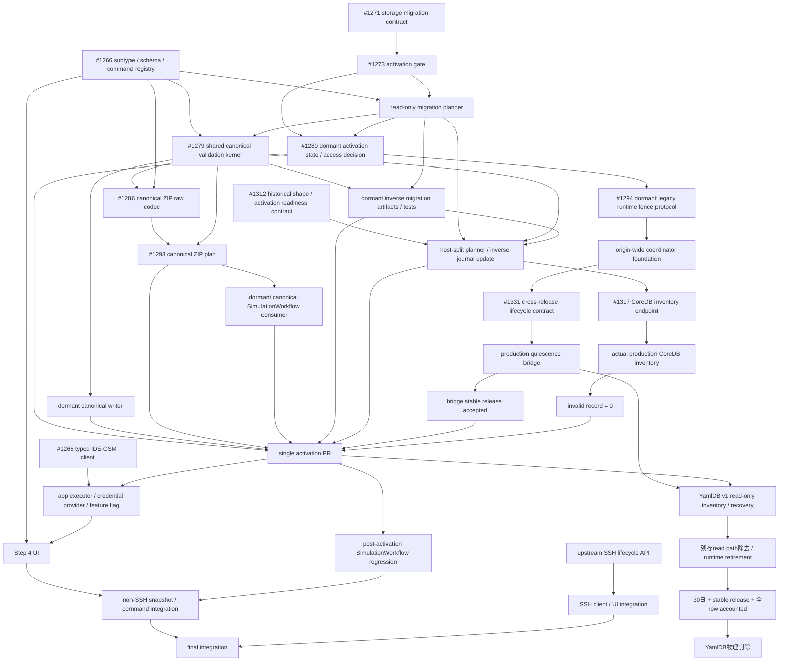
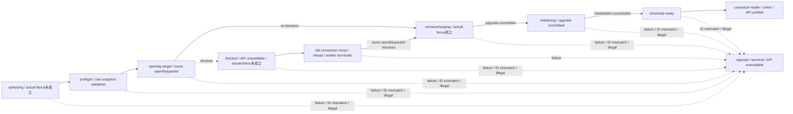

# YAML plugin IDE-GSM Step 4 契約

## 位置付け

本書は YAML plugin の subtype、IDE-GSM command、draft 同期、認証、実行状態に関する正規仕様である。親 Epic [#1162](https://github.com/kubohiroya/hierarchidb/issues/1162)、仕様 Issue [#1253](https://github.com/kubohiroya/hierarchidb/issues/1253)、storage migration契約Issue [#1271](https://github.com/kubohiroya/hierarchidb/issues/1271)、storage activation gate Issue [#1273](https://github.com/kubohiroya/hierarchidb/issues/1273)、historical CoreDB shape / activation readiness訂正Issue [#1312](https://github.com/kubohiroya/hierarchidb/issues/1312)、cross-release coordinator lifecycle Issue [#1331](https://github.com/kubohiroya/hierarchidb/issues/1331) に基づく。

型、DB migration、client、executor、UI の実装は本書に従う。本書と `.kiro/specs/yaml-file-node` または `.kiro/specs/ide-gsm-client` が矛盾する場合、本書を優先する。

## Upstream 契約

- Repository: `kubohiroya/ide-gsm`
- Revision: `353a81edd4635e70913b778ae7d2aa6833ae1de1`
- GraphQL mutation と task status は上記 revision の `FrontendResource` と `TaskStatus` を基準とする。
- mutation は task ID を文字列で返す。task ID を受け取った command は subscription で terminal status まで追跡する。
- `check` command は `checkAll` だけに対応する。`checkProject` は別の upstream command であり、代替として呼び出さない。

## YAML subtype と永続化契約

```ts
type YamlSubtype =
  | 'sources'
  | 'scenario'
  | 'scenario-base'
  | 'calib'
  | 'remote'
  | 'remote-base'
  | 'ssh'
  | 'ssh-base'
  | 'ec2'
  | 'ec2-base'
  | 'rsync'
  | 'git';
```

- ファイル名は `TreeNode.metadata.name` / `TreeNode.draftMetadata.name` を唯一の SSOT とする。
- `YamlFileNodeData` / `draftData` は `subtype`、`schemaId`、`content` を持ち、`name` を重複保存しない。
- subtype、schemaId、canonical filename の組合せは次表の registry で検証する。
- template 選択後の filename は canonical filename と一致しなければならない。任意の別名を受け入れない。
- 通常の読み込み・編集・command 実行時に、filename や schemaId から subtype を推測しない。

| subtype | schemaId | canonical filename | command |
| --- | --- | --- | --- |
| `sources` | `ide-gsm/sources` | `sources.yml` | あり |
| `scenario` | `ide-gsm/scenario` | `scenario.yml` | あり |
| `scenario-base` | `ide-gsm/scenario` | `scenario-base.yml` | なし |
| `calib` | `ide-gsm/calib` | `calib.yml` | なし |
| `remote` | `ide-gsm/remote` | `remote.yml` | あり |
| `remote-base` | `ide-gsm/remote` | `remote-base.yml` | なし |
| `ssh` | `ide-gsm/ssh` | `ssh.yml` | あり |
| `ssh-base` | `ide-gsm/ssh` | `ssh-base.yml` | なし |
| `ec2` | `ide-gsm/ec2` | `ec2.yml` | あり |
| `ec2-base` | `ide-gsm/ec2` | `ec2-base.yml` | なし |
| `rsync` | `ide-gsm/rsync` | `rsync.yml` | あり |
| `git` | `ide-gsm/git` | `git.yml` | あり |

`scenario-base`、`calib`、`remote-base`、`ssh-base`、`ec2-base` は editor-only subtype であり、command 集合は明示的な空集合とする。

## 追加 template の content 契約

### `rsync.yml`

- YAML root は mapping とする。
- 許可する property は optional な `include: string[]` と `exclude: string[]` だけとする。
- `additionalProperties` は許可しない。
- `connectionType`、`projectRelativePath`、push/pull 方向を YAML に保存しない。
- `connectionType` は Step 4 で `remote`、`ssh`、`ec2` のいずれかを必須 runtime input として受け取る。
- client は検証済み YAML を解析し、`include` / `exclude` が存在するときだけ GraphQL variables へ配列として渡す。server が `rsync.yml` を暗黙に読むことを前提にしない。
- property の欠落を空配列で補完しない。省略と空配列を区別して upstream へ渡す。

### `git.yml`

- YAML root は mapping とし、repository `url` を必須 property とする。
- `additionalProperties` は許可しない。
- GitHub token と `projectRelativePath` を YAML に保存しない。いずれも runtime input とする。

## Subtype と command の対応

| subtype | command ID | GraphQL mutation |
| --- | --- | --- |
| `sources` | `install` | `install` |
| `scenario` | `check` | `checkAll` |
| `scenario` | `check-merge` | `checkMerge` |
| `scenario` | `preview-events` | `previewEvents` |
| `scenario` | `calib` | `calibrate` |
| `scenario` | `sim` | `simulate` |
| `scenario` | `purge-cache` | `purgeCache` |
| `remote` | `calib-remote` | `calibrateRemote` |
| `remote` | `sim-remote` | `simulateRemote` |
| `remote` | `start-container-remote` | `startContainerRemote` |
| `remote` | `stop-container-remote` | `stopContainerRemote` |
| `ssh` | `calib-ssh` | `calibrateSsh` |
| `ssh` | `sim-ssh` | `simulateSsh` |
| `ec2` | `calib-ec2` | `calibrateEc2` |
| `ec2` | `sim-ec2` | `simulateEc2` |
| `ec2` | `start-container-ec2` | `startContainerEc2` |
| `ec2` | `stop-container-ec2` | `stopContainerEc2` |
| `rsync` | `rsync-push` | `rsyncPush` |
| `rsync` | `rsync-pull` | `rsyncPull` |
| `git` | `init` | `init` |

- `start-daemon-*` は無効な旧名称とし、alias を設けない。
- `start-container-ssh` と `stop-container-ssh` は upstream Frontend GraphQL API に存在しないため、registry と UI に追加しない。
- `gitClone` と `gitPull` は本契約の command ではない。`init` からの fallback 先としても使用しない。
- 未定義 subtype、または subtype に許可されていない command は network request 前に契約違反としてエラーにする。

## Command input

`projectRelativePath` はすべての command で非空の必須 runtime context とする。絶対 path、`..`、未設定値を拒否する。container lifecycle mutation 自体は GraphQL input を持たないが、その前段の snapshot import には runtime `projectRelativePath` を使用する。

| mutation | input |
| --- | --- |
| `install` | `projectRelativePath`; optional runtime `force` |
| `checkAll`, `checkMerge`, `purgeCache` | `projectRelativePath` |
| `previewEvents` | `projectRelativePath`; optional runtime `profile`, `yearFilter` |
| `simulate` | `projectRelativePath`; optional runtime `profile`, `compute`, `apsp`, `purgeCache`, `reset` |
| `calibrate` | `projectRelativePath`; optional runtime `profile`, `compute`, `apsp`, `purgeCache`, `purgeCalib`, `reset` |
| `simulateRemote`, `simulateSsh`, `simulateEc2` | `projectRelativePath`; optional runtime `compute`, `apsp`, `purgeCache`, `reset`, `downloadCache` |
| `calibrateRemote`, `calibrateSsh`, `calibrateEc2` | `projectRelativePath`; optional runtime `compute`, `apsp`, `purgeCache`, `purgeCalib`, `reset`, `downloadCache` |
| `startContainerRemote`, `stopContainerRemote`, `startContainerEc2`, `stopContainerEc2` | GraphQL input なし |
| `rsyncPush`, `rsyncPull` | runtime `projectRelativePath`, required runtime `connectionType`; optional YAML `include`, `exclude` |
| `init` | runtime `projectRelativePath`, runtime GitHub token, required `git.yml.url` |

optional input は未指定のまま送信し、client 側で値を補完しない。入力値の意味と upstream default を UI 側の default で上書きしない。

## Dialog、draft、runtime state

- YAML plugin は app の汎用 `PluginDialogHost` と `PluginStepRegistry` を使用する。専用 `YamlDialog` を追加しない。
- Basic Info は host が `draftMetadata` として管理する。
- plugin 固有の永続 draft は `draftData` の `subtype`、`schemaId`、`content` だけとする。
- single activation前の現行3-stepはBasic Infoのfilenameを`draftMetadata.name`へ保存し、hostがplugin dataから`name`、`description`、`tags`を除去してから`draftData`へ保存する。このため履歴上のCoreDBにはexact own keyが`schemaId`、`content`だけの`host-split-legacy` payloadが存在し得る。これはactivation後の永続化契約ではなく、migration inputとしてだけ受理する履歴形式とする。
- Step 4 の選択 command、task ID、status、result、error は UI-only state とする。`draftMetadata`、`draftData`、TreeNode、IndexedDB へ保存しない。
- endpoint と JWT は app-level の認証済み executor/provider に閉じ込める。step props、draft、TreeNode、IndexedDB、URL、localStorage、ログへ token を渡さない。
- command 実行は暗黙の save/commit ではない。ダイアログを閉じる、または再読み込みすると UI-only state は破棄される。

### Dormant canonical dialog writer

`@hierarchidb/yaml-plugin/canonical-writer`は、single activationでproduction dialog connectorを追加する前にmergeする独立subpathとする。`writeYamlCanonicalDialogDraft(input, writePort)`は`unknown`のinputとcaller注入の単一write portを受け取り、production dialog、TreeNode updater、CoreDB、YamlDB、worker、plugin preloadへ直接接続しない。

- inputは`nodeId`、`mode`、`filename`、`description`、`tags`、`payload`のexact own data propertyだけを持つplain objectとする。symbolを含む余分なkey、missing、`undefined`、accessor、配列、non-plain object、Proxy reflection failureをfail-closedにし、getterを実行しない。
- `nodeId`は非空string、`mode`は`save-draft | save`、`description`はstring、`tags`は追加keyやaccessorを持たないstring arrayとする。値をtrim、補完、coerceしない。
- `filename`と`payload`の検証は`@hierarchidb/yaml-api/validation`の`validateYamlCanonicalPayload`だけに委譲する。writer側へregistry、YAML parser、Ajv、subtype/schema/filename推論を複製しない。
- validation成功後だけ、`nodeId`、`mode`、`draftMetadata`、`draftData`、`onNameConflict`の5 fieldだけを持つfresh requestを作る。`draftMetadata`は`{ name: filename, description, tags: copiedTags }`、`draftData`は検証済み`{ subtype, schemaId, content }`、`onNameConflict`は`error`固定とする。
- payloadへ`name`を保存しない。metadataとdataを別々のport callへ分割せず、write portを1回だけ呼ぶ。validation/input failureでは呼ばず、port failure後にretry、auto-rename、overwrite、legacy writerまたは別portへfallbackしない。
- public resultはstableなdiscriminated unionとする。input、validation、port failureへraw input、YAML本文、parser/Ajv error、thrown message、endpoint、token、credentialを含めない。
- subpathをpackage root、UI、workerから再exportせず、production sourceからimportしない。既存3-step、legacy `YamlDraft`、`YAML_TEMPLATES` 10件、manifest、preload、storage routeはsingle activationまで変更しない。

## Snapshot と command 実行順序

### 通常 command

`git/init` 以外は次の順序を固定する。

1. subtype、schemaId、canonical filename、YAML content、runtime input をすべて検証する。
2. 対象 folder について既存 folder export 契約が選ぶ YAML ノードを収集し、編集中ノードは保存済み payload ではなく現在の検証済み draft で置き換える。
3. immutable `ProjectSnapshot` を生成する。
4. `importProject` を実行し、task status が `FINISHED` になるまで待つ。
5. 対象 command mutation を1回だけ送信する。

validation、serialization、`importProject` のいずれかが失敗した場合、対象 command を送信しない。部分 snapshot、保存済み payload への切替、retry、別 mutation への fallback を行わない。

### `git/init` bootstrap 例外

`git/init` は clone 先を新規作成する bootstrap command であり、`importProject` を前置しない。

1. `git.yml` の subtype、schemaId、canonical filename、content、`url` を検証する。
2. runtime `projectRelativePath` と GitHub token を検証する。
3. clone 先が存在しないことを確認する。空であっても既存の clone 先はエラーにする。
4. `init(projectRelativePath, token, url)` を直接1回だけ送信する。

既存 path の削除・上書き・内容退避、別 destination の生成、`gitClone` への fallback を禁止する。

## Task status

| upstream status | UI 契約 |
| --- | --- |
| `REGISTERED`, `READY`, `LEASED` | active。subscription を継続する |
| `FINISHED` | success。subscription を終了する |
| `FAILED`, `CANCELED` | failure。詳細を表示して subscription を終了する |
| `DELETED` | unsupported terminal state。成功扱いせずエラーにする |
| その他 | unknown status。契約違反としてエラーにする |

- WebSocket が terminal status 前に完了・切断した場合はエラーにする。
- 実行中の同一 command の二重開始を拒否する。
- 自動 retry、status の読み替え、unknown status の無視を行わない。
- error 表示とログには endpoint や token 等の credential を含めない。

## Feature flag

- 論理 flag 名は `yamlIdeGsmStep4Enabled` とする。
- typed app-level config を唯一の読取元とし、既定値は `false` とする。
- app composition / `PluginDialogHost` 境界が flag を1回だけ読み、YAML step composition へ boolean capability として注入する。
- YAML plugin、step component、executor は app config や environment variable を直接読まない。
- flag が OFF の場合、Step 4 を effective step config に含めず、既存の3ステップ構成を維持する。
- environment variable や複数 config 経路への fallback を設けない。
- 実装ファイルの配置は executor/flag 実装 Issue で命名規約に従って確定する。本書は公開契約、単一読取責務、注入境界、既定値の SSOT とする。

## Migration と import

### Storage authority

- CoreDB `TreeNode` を YAML domain data の唯一の authoritative store とする。
- committed filename と payload の組は `metadata.name` / `data`、draft filename と payload の組は `draftMetadata.name` / `draftData` とする。各 slot は対応する metadata とだけ照合し、committed と draft の間で値を補完しない。
- 独立した YamlDB v1 は authoritative store、cache、dual-write 先ではない。既存 row の回復可否を調べるための frozen legacy recovery source とし、新規 write、自動 merge、自動 copy、自動 delete を禁止する。
- CoreDB と YamlDB は別の IndexedDB database であり、単一 transaction に含められない。CoreDB migration、YamlDB inventory/recovery、YamlDB runtime path 廃止、物理 database 削除は別の Issue と atomic boundary で扱う。
- CoreDB migration 中は YamlDB を変更しない。YamlDB recovery が CoreDB record を作る場合も、先に source snapshot 全体を fencing と preflight で固定し、write は CoreDB だけの単一 transaction で行う。YamlDB row の削除を同じ成功条件に含めない。

### Nonempty interrupted CoreDB preservation classification

- productionでliteral `hidb-core`がexact logical-v1 / native-v10かつnonemptyと判明した場合、既存activationまたはcorrective recoveryの受理条件を拡張しない。別のsource-controlled diagnosticが全5 storeを1 readonly transactionで読み、全recordをaccountしてから後続設計を判断する。
- persisted initializer cohortのauthorityは現行`CoreDB.initialize()`が実際に保存するtrees 2件、nodes 4件、rootStates 6件のexact identityとfield契約とする。古いinitializer recordで現行fieldが欠ける場合は値を補完せず、identityと当時のraw fieldを保持した`modified-default-identity`として分類する。dynamic timestampを固定値へ推測せず、現行initializerの`metadata.description: undefined`と`visible` property absentも別の値へ補完しない。新しいTypeScript declarationとの差分を理由にrecordを書き換えない。
- default identityを持つrecordはinitializer field契約と一致する`exact-default`、CoreDB recordとしてvalidだがinitializer field契約と異なる`modified-default-identity`、record契約自体が不正な`invalid`を区別する。default identityを持たないvalid recordは`additional`とする。全分類件数の合計は全store record countとexactly一致しなければならない。
- historical logical-v1 `nodes` recordでは、`draftData: null`を`draftData` property absent / `undefined`と同じ「draft slotなし」の永続表現として読む。これは値補完ではなくreadonly classification上のslot presence判定であり、recordを書き換えず、`version`、`id`、`nodeType`、`metadata`、committed `data`などmigration guardに必要なfieldの欠落は引き続きfail-closedにする。default identity recordに`draftData: null`がある場合は現行initializer exact shapeとは一致しないため`modified-default-identity`であり、`exact-default`へ丸めない。
- historical logical-v1 writerがown propertyとして永続化した`references: undefined`は、`references` property absentと同じ「参照なし」の表現としてreadonly graph classification上だけで読む。これは`[]`の補完、canonical recordへの正規化、runtime writer契約の緩和ではなく、input recordのproperty presence/valueを変更しない。default identity recordにown `references: undefined`がある場合は現行initializer exact shapeと一致しないため`modified-default-identity`、default identityを持たないvalid recordは`additional`とする。`references: null`、非配列、疎配列、非文字列要素、accessor property、symbol propertyは引き続きfail-closedにする。
- `tagAssociations`のhistorical logical-v1 topologyは`createdAt` indexを持つ一方、record contractのtimestamp fieldは`assignedAt`である。classifierは`assignedAt`を必須record fieldとして検証し、`createdAt`を生成、copy、alias、fallbackしない。associationのnode/tag参照とscopeもexactに検証する。
- YAML nodeの分類は既存migration plannerを唯一のauthorityとし、canonical、legacy-with-name、host-split-legacy、placeholderのaggregateだけを返す。raw record、record ID、metadata name、YAML本文、timestamp、個別digest、native errorをpublic resultへ含めない。YAML受理条件を拡張する前の再診断では、additional nodeの`nodeType`とpayload形状を固定bucketの件数としてだけ公開する。bucketは既知literalまたは`otherString`、およびlegacy/host-split/canonical/mixed/incomplete/other/no-payload形状の件数に限定し、raw literal、filename、schemaId、content、node IDを公開しない。
- fixed bucketはsource-only設計判断の入力であり、それ自体をYAML受理条件にしない。`otherString`は公開可能な既知literal集合外のnodeTypeが存在することだけを示し、`otherPayload`はYAML slot候補形状ではないことだけを示す。`otherString / otherPayload`の組合せを、filename、schemaId、metadata、payload body、件数、既定rootとの差分からYAMLとして推測してはならない。明示的なhistorical nodeType literalとpayload contractが別Issueで仕様化されるまで、当該additional nodeはgraph-preserved non-YAMLとして扱い、migration plannerへ渡さず、recovery write authorityを付与しない。
- diagnosticはDB作成、versionchange、copy、merge、rename、delete、repair、claim、activation、retryを行わない。全recordがvalidかつ保全可能という結果もwrite authorityではなく、source fencingとtarget-only atomic writeを定義する別Issueの入力に限る。

### Record shape と共通 validation

各 payload slot は次のいずれかに分類する。

| classification | payload shape | 処理 |
| --- | --- | --- |
| legacy | `name`、`schemaId`、`content` があり、`subtype` がない | 対応 metadata name と payload name が完全一致し、registry の単一 entry に一致するときだけ canonical shape へ変換する |
| host-split-legacy | exact own keyが`schemaId`、`content`であり、`name`と`subtype`がない | 対応 metadata name とpayload `schemaId`がregistryの単一entryに一致するときだけcanonical shapeへ変換する |
| canonical | `subtype`、`schemaId`、`content` があり、`name` がない | strict validation 後に変更しない |
| mixed | `name` と `subtype` の両方がある | contract error として migration 全体を失敗させる |
| incomplete | 必須 field、対応 metadata、または有効な文字列値が欠ける | contract error として migration 全体を失敗させる |
| unknown | registry にない subtype、schemaId、filename、または余分な field がある | contract error として migration 全体を失敗させる |

- legacy record は、対応 metadata name、payload `name`、`schemaId` がすべて存在し、両 name が完全一致し、その組が registry の単一 subtype に一致する場合だけ変換対象にする。
- host-split-legacy recordは、payloadのexact own keyが`schemaId`と`content`だけで、対応metadata nameとpayload `schemaId`がregistryの単一subtypeに完全一致する場合だけ変換対象にする。payload `name`の欠落を許すのはこのexact shapeの分類時だけとし、`data.name ?? metadata.name`、partial payload、別slot、filenameだけによる一般fallbackへ拡張しない。
- canonical record は subtype、schemaId、対応 metadata name の組が同じ registry entry と完全一致しなければならない。already-canonical record を legacy へ戻したり書き直したりしない。
- legacy、host-split-legacy、canonicalのいずれについても`content`をYAMLとしてparseし、root shapeと選択されたregistry schemaのJSON Schemaに対して検証する。parse error、schema mismatch、必須property欠落、追加禁止propertyを検出した場合は全体を失敗させる。
- 同一 payload に `name` と `subtype` が併存する mixed shape だけを禁止する。committed slot と draft slot は独立分類し、同じ `TreeNode` の `data` が canonical、`draftData` が legacyまたはhost-split-legacyの場合は、committed slotをvalidated no-op、draft slotをmigration対象とする。
- legacy / host-split-legacy / canonicalの`content`は検証のためにparseするだけとし、migrationで本文を整形、serialize、補完、変更しない。error reportまたはlogにも本文を含めない。
- error report は source、node ID、slot、typed error code を含める。YAML本文、認証情報、endpoint、token を含めない。
- host-split-legacyのexact分類に該当しないmissing legacy `name`、metadata/payload name不一致、`schemaId: ''`、missing `content`、unknown/ambiguous mappingをfilename、schemaId、別slot、既存recordから推測または補完しない。特に`{ schemaId }`、`{ content }`、余分なfieldを持つshapeをhost-split-legacyとして受け入れず、一般的なmetadata fallbackを禁止する。
- strict validationの実装authorityは`@hierarchidb/yaml-api` package内部のneutral kernelとする。kernelはown data property、plain object、registry tuple、YAML 1.2の単一plain mapping、current `YAML_SCHEMAS`をcoercion、default、property除去なしで検証する。
- public `@hierarchidb/yaml-api/validation` facadeはcanonical filenameとcanonical payloadだけを同時に検証し、legacy payloadを成功させない。成功時は検証済みの`subtype`、`schemaId`、`content`を新しい値として返し、callerにraw objectのcastまたは再readを要求しない。
- migration plannerはpackage-internal adapterから同じkernelのlegacy / host-split-legacy / canonical分類を使用し、neutral errorを既存migration contextへ再構成する。既存のerror code、precedence、source index、node ID、slot、sorting、redactionを変更しない。
- parser、Ajv、getter、Proxyが投げたmessage、raw payload、YAML本文をpublic errorまたはmigration errorへ含めない。public facade、migration adapterのどちらもinput/contentを変更、normalize、serializeしない。

### CoreDB slot 決定表

raw recordの`data`はproperty missing、`undefined`、`null`をcommitted payload absentとして扱う。`draftMetadata`はproperty missing、`undefined`、`null`をdraft metadata absent、`draftData`はproperty missingまたは`undefined`をdraft payload absentとして扱う。normalizerでこれらを別の値へ変換してから分類しない。

| `TreeNode` の状態 | 判定と処理 |
| --- | --- |
| `data` があり `metadata` がある | committed slot として両者だけを共通 validation にかける |
| `data` があり `metadata` がない | incomplete。migration 全体を失敗させる |
| `data` がなく、base `metadata`と完全な `draftMetadata` / 非空`draftData` がある | `isTemporary`に関係なくcommitted slotは未作成としてskipし、draft slotだけを検証・migrationする |
| `isTemporary === true`、`data === null`、base `metadata`とnon-null `draftMetadata`があり、`draftData`がown-key 0のplain object | uninitialized placeholderとしてwriteせずskipする。値を補完しない |
| `data` がなく、上記の完全なdraft pairまたは厳密なplaceholder条件を満たさない | incomplete record。migration全体を失敗させる |
| 非空`draftData`がlegacy/host-split-legacy/canonicalの完全shapeでない | incomplete partial draft。`{ schemaId }`を含め、`isTemporary`に関係なくmigration全体を失敗させる |
| `draftMetadata === null` かつ `draftData === undefined` | active draftなし。draft slotをskipする |
| `draftMetadata` と `draftData` の両方がある | draft slotとして両者だけを共通 validation にかける |
| `draftMetadata` だけがある rename-only draft | committed slotを独立に検証した後、`draftMetadata.name === metadata.name`のmetadata-only draftだけをno-opにする。name差分は全体を失敗させる |
| `draftData` だけがある | metadataをcommitted slotから補わず incomplete として全体を失敗させる |

- `isTemporary` の例外は `data === null`、base metadata、non-null draftMetadata、own-key 0のplain `draftData`を同時に満たすuninitialized placeholderだけとする。property missing、`undefined`、配列、prototype由来keyだけのobjectをplaceholderとして扱わない。非空payloadについて必須fieldやschema validationを緩和せず、partial draftをskipまたはdefault補完しない。
- rename-only draftの判定ではcommitted payloadをdraftへcopyせず、subtype、schemaId、filenameを推測しない。metadata nameが同一であることだけを検証する。
- committed slotとdraft slotは別々のsubtypeを持ち得るが、それぞれが対応metadataを含む完全なregistry tupleでなければならない。
- migration成功時だけlegacy payloadの`name`を除去し、host-split-legacyではpayloadへ`name`を追加せず、対応metadata nameを唯一のfilename SSOTとする。どちらも`schemaId`と`content`は値を変更せず、registryから得た明示的な`subtype`を追加する。

### Merge gate と runtime activation gate

実装をmainへ取り込む順序と、production storageをcanonical shapeへ切り替える順序を分離する。後続実装順序のmerge DAGはPR間の依存、runtime activation DAGは1つのactivation release内で必ず連続して実行する処理を表す。片方を他方の代わりに使用しない。

- read-only plannerはproduction DBへ接続せず、`unknown`のraw record snapshotを入力としてmigration planまたはsanitized typed error reportを返すpure boundaryにする。CoreDB / Dexieのopen、schema version登録、transaction、write、journal table作成、worker bootstrapへの接続を含めない。1件でも不正ならpartial planを返さず、YAML本文、token、credential、endpointをreportまたはlogへ含めない。
- production database prefixはapplication buildが供給する単一のexact値をauthorityとする。DB名生成は明示prefixと明示suffixを必須とするpure functionだけを使用し、package側でglobal、runtime environment、application name、base path、`hidb`その他のfallbackを参照しない。missing、空文字、whitespace、malformed値をnormalizeまたはdefaultせず、IndexedDB openより前にerrorとする。
- CoreDB version authorityはDexie logical versionとnative IndexedDB versionを明示的に分離する。migration state、planner、journalの`fromCoreDbVersion` / `toCoreDbVersion`はlogical v1 / v2だけを使用し、`IDBDatabase.version`、`IDBDatabaseInfo.version`、raw `indexedDB.open()`、`oldVersion` / `newVersion`はDexieが永続化するnative v10 / v20だけを使用する。対応はexact `logical v1 = native v10`、`logical v2 = native v20`とし、任意versionの算術変換、logical/nativeの比較、native v1/v2へのfallbackを行わない。
- [#1279](https://github.com/kubohiroya/hierarchidb/issues/1279)のshared canonical validation kernelは、canonical payloadのstrict validation authorityとmigration adapterを独立subpathで提供するdormant artifactとする。dormant canonical writer、canonical ZIP、inverse migration artifactはこのauthorityへ収束し、validationを複製しない。
- [#1280](https://github.com/kubohiroya/hierarchidb/issues/1280)のdormant activation state machine / access decisionは、後続production legacy reader / writer fence mechanismとは別artifactとする。CoreDB、WorkerService、bootstrap、production reader / writerへ未接続のまま先行mergeし、production fence成立またはactivation完了として扱わない。
- canonical writer、canonical ZIP import / export、canonical SimulationWorkflow consumer、inverse migration artifact、pure legacy fence protocolは、production writer、dialog step、worker API、ZIP path、SimulationWorkflow entry point、bootstrapから到達不能なdormant implementationとしてのみ先行mergeできる。production quiescence bridgeは別のpre-activation releaseでmessage transportとresponderを配備するが、有効なactivation requestを受け取るまでは既存legacy entry pointの挙動を変更しない。既存legacy writerとcanonical writerを同時に選べるflag、environment fallback、dual-write、read-time fallbackを追加しない。
- activation PRより前にproduction `CoreDB.version(2)`を登録しない。CoreDBのtarget versionが別変更で先に進んだ場合は、本仕様とactivation Issueでtarget versionを再確定してから登録する。read-only plannerを`CoreDB.getSingleton()`、plugin preload、storage write、activation bootstrapへ接続しない。例外は[#1317](https://github.com/kubohiroya/hierarchidb/issues/1317)のon-demand inventory endpointだけとし、既にopen済みのCoreDBを持つ`WorkerService`からpure plannerを呼び出し、app worker bootstrapはそのendpointをComlinkへ転送するだけとする。endpointをworker startup時に自動実行せず、plannerのplan、postimage、journal value、digestをproduction APIへ公開しない。
- [#1312](https://github.com/kubohiroya/hierarchidb/issues/1312)で確定したhost-split-legacyをread-only planner、shared validation adapter、inverse migration journalへ反映し、同じ分類契約を使うproduction CoreDB read-only inventoryをactivationより前のreleaseで実行する。全`yaml-file` slotをaccountし、invalid recordが0件であることを受入条件とする。inventoryはwrite、repair、migration、publicationを行わず、activation時のauthoritative preflightを省略させない。
- [#1294](https://github.com/kubohiroya/hierarchidb/issues/1294)のpure protocolだけではparticipant discovery、transport、production responder、entrypoint revoke、owned connection closeを提供しない。[#1326](https://github.com/kubohiroya/hierarchidb/issues/1326)のfoundationと[#1331](https://github.com/kubohiroya/hierarchidb/issues/1331)のcross-release契約に従ってこれらを接続するproduction quiescence bridgeをactivationより前のstable releaseで配備する。stable acceptanceは全対象runtimeのprotocol version 2 / bridge capabilityを確認する非破壊censusとし、production entrypoint revoke、storage close、typed ackを実行または捏造しない。actual ackはbridge integration testと後続single activationでだけ実行する。bridge releaseをactual storage fenceまたはcanonical activationとして扱わない。
- activation PRは、read-only planner、host-split-legacy対応validation adapter、#1280 activation state machine、dormant canonical writer、dormant canonical ZIP import / export、dormant canonical SimulationWorkflow consumer、exact / release inverse migration artifact、failure-path testがmainへmerge済みで、CoreDB read-only inventoryのinvalid recordが0件であり、production quiescence bridgeを含むstable releaseが受入済みの場合だけ開始できる。versionchange migration、CoreDB / worker boot接続、canonical reader / writer / API publishを同じrelease boundaryで有効化し、一部だけを先行公開しない。
- `yamlIdeGsmStep4Enabled`はStep 4 compositionの表示契約であり、storage activationまたはrollback gateとして使用しない。flag OFF、旧binary、legacy writerをmigration後のfallbackとして起動しない。
- optional plugin preloadは例外をworker-ready failureとして伝播できないため、preflight、migration、storage readinessのgateとして使用しない。CoreDB `open()` / upgradeの成功をawaitするworker bootだけがquery / mutation APIをreadyにできる。
- migrationのblockedまたはrejectを、全IndexedDB削除を案内するgeneric recoveryへ変換しない。`@hierarchidb/runtime-worker/yaml-storage-activation`のtyped stateをauthorityとし、`blocked`は同じ`openRequestId`のtarget open requestを待つ非ready状態、`rejected`はretry、reset、別request、legacy fallbackを受け付けないterminal worker boot failureとして通知する。`quiescing`と`blocked`ではactual versionchange fenceが未成立であり、自動DB削除またはv1 reopenを行わない。

#### Read-only migration planner contract

- plannerは`@hierarchidb/yaml-api/migration`の独立subpathだけから公開し、package rootから再exportしない。production DB、reader、writer、worker bootstrapから到達不能なdormant artifactとしてmainへmergeする。
- callerはCoreDBから選択した全`yaml-file` raw recordの`readonly unknown[]`、opaqueで空でないmigration ID、正の整数で`to > from`を満たすCoreDB version pair、SHA-256 digest portを明示的に渡す。plannerはmigration ID、version、digest実装をrandom生成、推測、default補完しない。candidateに`nodeType !== 'yaml-file'`のrecordが含まれる場合は無視せずcontract errorにする。
- plannerはTreeNode normalizer、型cast、JSON round-tripを入力前処理に使用しない。raw own data propertyを基準にmissing、`undefined`、`null`、empty plain object、array、non-empty objectを区別し、accessorを実行せず、record、metadata、payloadの不正shapeをfail-closedにする。各candidateの`version`はown data propertyのnon-negative safe integerを必須とし、`0`を有効なtemporary node versionとして扱う。
- plannerは各non-empty payload slotをlegacy、host-split-legacy、canonical、mixed、incomplete、unknownのいずれかへ分類する。host-split-legacyはexact own keyが`schemaId`、`content`だけの場合に限定し、対応metadata nameとregistryを使ってcanonical postimageを計画する。`{ schemaId }`、missing content、余分なfield、ambiguous mappingをpartial migrationまたはmetadata fallbackで受理しない。
- YAML contentはYAML 1.2 core schemaでstrictにparseし、単一documentのplain mappingだけを受け入れる。duplicate key、parse error、複数document、scalar、sequenceを失敗させる。parse結果をserializeし直さず、入力contentを変更しない。
- current revisionの`YAML_SCHEMAS`に宣言されたconstraintsをauthoritative validation inputとする。Ajvはstrict mode、all errors、type coercionなし、default追加なし、property除去なしで使用する。schemaにない`additionalProperties: false`やrequired propertyをplanner側で注入せず、未宣言制約を推測しない。
- migration contextが同一の場合、plan entryとerrorはnode ID昇順、同一node内はcommitted、draftの順に固定する。1件でもvalidationまたはdigest failureがあればsuccess plan、postimage、journal entry、partial resultを返さない。
- canonical postimage digestはfilename、subtype、schemaId、contentの順に各UTF-8 byte列へ8-byte unsigned big-endian lengthを前置して連結し、injected portから得た64文字のSHA-256 lowercase hexだけを受け入れる。不正なdigest outputまたはport failureをtyped errorにし、別hashへfallbackしない。
- error reportはsource index、取得できた場合のnode ID、slot、stable error code、安全なcontract contextだけを含める。YAML本文、raw parser / Ajv error、preimage、postimage、token、credential、endpointをerror、message、console、snapshotへ含めない。
- success planは全candidateをnode ID順に1件ずつ対応付ける`sourceIndex`、node ID、expected node versionのguardを含める。activation coordinatorはplanner inputのimmutable raw snapshotをplanと同じlifetimeで非公開に保持し、serialize、log、journal保存しない。versionchange transaction内では選択されたYAML node集合の追加、欠落、重複を照合し、各nodeのID / version、metadata name、draft metadataのown presence / name、data / draftDataのown presenceと全payload key / value、`isTemporary`のown presence / valueを同じsnapshotと完全比較する。normalizer、reparse、JSON round-trip、fallbackを使用せず、1件の差分でtransaction全体をabortする。snapshotを保持せずplanを永続化または別runtimeへ転送する将来設計では、同じ比較材料をplan内のself-contained guardへ仕様化するまで実装しない。

runtime activationは次の順序で実行する。

1. 新runtimeのlegacy / canonical YAML reader、writer、ZIP、SimulationWorkflow、command入口を未公開のまま保ち、事前配備済みproduction quiescence bridgeを介して旧tabと旧workerへentrypoint停止・connection closeを要求する。新runtime内のlegacy create / edit / commit / ZIP import / export / SimulationWorkflow entry pointは開始しない。この時点の協調停止だけをwrite fence成立とみなさない。
2. CoreDB logical v1 / native v10 raw snapshotへread-only preflightを実行し、migration plan、migration ID、postimage digest、journal valueを確定する。事前inventoryの結果やversion markerを代用せず、quiescence完了後の現在snapshotを全件再分類する。失敗時はversionchangeを開始しない。
3. preflightに使用したconnectionを閉じてtarget versionの`open()`を1回だけ開始する。旧connectionが残る間はblockedとしてAPIをreadyにせず、旧tabのreloadと旧workerのterminateによって同じrequestをresumeする。
4. versionchange transaction内でraw recordを再読し、preflight snapshotとの完全一致を確認してからnodesとjournalをatomicに更新する。差分または1件の失敗でtransaction全体をabortする。
5. upgrade commitとCoreDB initializationが成功した後だけ、canonical query / mutation API、dialog writer、ZIP import / export、SimulationWorkflow consumer、command入口を公開する。commit前またはfailure後にlegacy / canonical readerまたはwriterを公開しない。

#### Single executor と post-activation bootstrap

single activation releaseは初回upgradeを実行するbootstrapと、upgrade成功後の全後続bootstrapを区別する。fixed coordinatorのdurable gateを`allowed`へ戻さず、coordinator artifactまたはstatic import graphを変更せずに次の順序を守る。

- durable gateが`allowed`の場合、activation-capable windowはbrowser globals、plugin preload、router、WorkerService、SharedWorker、legacy / canonical YAML routeを開始しない。Web Cryptoが発行したattempt固有の`activationId`と`quiescenceRequestId`を明示してquiescenceを要求し、coordinator DBのatomic `allowed`から`revoked/quiescing`への遷移に成功した1 contextだけをexecutorとする。同時attemptは別identityを使用し、claim loserは`QUIESCENCE_IDENTITY_MISMATCH`で停止してpreflight、target `open()`、versionchangeを開始しない。identity生成不能を固定値、時刻、release ID、tab-local counterで補完しない。
- executorは`ready-for-preflight`を受け取った後だけCoreDB discoveryを1回行う。exact logical v1 / native v10が存在する場合だけraw preflightとlogical v1-to-v2 / native v10-to-v20 migrationを実行する。databaseが存在しない場合だけ同じexecutorがfresh logical v2 / native v20 createへ進み、既存native versionがv10以外、重複名、unknown/future version、schema mismatchの場合はterminal failureとする。missingをv1とみなす、空v1を先に作る、既存DBを削除する、別executorへ引き継ぐことを禁止する。
- fresh-v2 createは同じquiescence identityと1件の`openRequestId`を保持し、1回のtarget `open(name, 20)`の`oldVersion === 0` / `newVersion === 20` versionchangeでexact logical v2 topologyと空の`yamlMigrationJournal`を作る。v1 snapshot、migration planner、node/journal migration writeを実行しない。commit後にCoreDB initializationと全current YAML slotのcanonical-only validationを行い、成功時だけ`same-activation-fresh-create` proofを持つ`canonical-ready`へ進む。既存v1 migrationのproofは`same-activation-upgrade`のまま区別する。
- executorはmigrationまたはfresh create、CoreDB initialization、canonical validationが成功して同じactivation stateが`canonical-ready`へ到達した場合だけ、現在windowのmonotonic legacy client-creation revokeを解除せずsuccess-only reload handoffを要求する。このreloadは旧cohortのquiescenceを省略する手段、target openのretry、state reset、failure recoveryではない。
- `LEGACY_YAML_ACCESS_REVOKED` HELLOはactive quiescence中にも返るため、それだけを`revoked/ready-for-preflight`へ読み替えない。後続windowはHELLO後にcoordinator DBのexisting recordをstrict readerでread-onlyに1回確認し、exact `revoked/ready-for-preflight`の場合だけsuccessorへ進む。`quiescing`、`rejected`、invalid、missing、version mismatch、read failureはpoll、retry、state mutation、participant identity公開を行わないterminal boot failureとする。
- successor durable readはapplication-only moduleに置き、fixed coordinator Service Workerのstate DB moduleまたはvalidator moduleをimportしない。application側のsuccessor pathを変更しても、production acceptanceではfixed coordinator artifact hashとstatic import graph hashがaccepted releaseと完全一致することを要求する。
- durable gateがexact `revoked/ready-for-preflight`の後続windowはlegacy bootstrapを開始しない。exact CoreDB logical v2 / native v20、exact production store topology、exact `yamlMigrationJournal` schema、全`yaml-file` raw slotのcanonical-only validationを確認し、当該runtimeのCoreDB / WorkerService initializationが成功した場合だけpost-activation boot用のfreshなissued `canonical-ready` stateを作る。CoreDB logical v1 / native v10、missingまたはfuture native version、schema mismatch、legacy / host-split-legacy / invalid slot、initialization failureではterminal boot failureとし、migrationを再実行しない。
- React rootはcoordinator gateを実行する最小bootstrap containerだけを先にmountできる。`AppRoot`、`AppProviders`、`WorkerProvider`、`RouterProvider`は`runtime-ready`確定後に1つのprovider treeとして初めてmountする。`root.tsx`のimportはbrowser globals、WorkerAPIClient、SharedWorker、plugin preloadを開始するside effectを持たない。successorの順序はcanonical WorkerAPIClientのprepare、browser globals初期化、router作成、provider tree mountで固定し、`WorkerProvider`はprepare済みの同一client singletonを再利用して別のlegacy Workerを作成しない。static hydrate fallbackはprovider treeのcommit後だけ除去し、`reload-requested`またはbootstrap failureではprovider treeをmountせずfallbackを維持する。reload、failure、successorのいずれにもretry、legacy fallback、第二のruntime初期化を追加しない。
- `WorkerProvider`は初回mount時のauth bridge検証後にprovider treeを公開し、`hierarchidb:auth-session-changed`受信時はprepare済みの同一canonical clientへbridgeを再登録する。session変更を理由に第二のWorkerを作成しない。
- auth bridge再登録はevent順に直列化し、先行失敗で後続の明示eventを失敗扱いにしない。再登録失敗時はprovider treeを無表示にせずretry/reload可能なterminal overlayを表示し、後続登録成功時は先行errorを解除する。
- production SharedWorker entryはVite生成URLにrelease / gate queryを付与して起動するため、worker内の動的chunkからqueryなしの`shared-worker.js`を再importしてはならない。singletonを含む共有moduleは副作用を持つentryとは別のneutral chunkへ出力し、entryと動的chunkが同一module URLを参照する。production buildはentry以外のworker artifactによる`shared-worker.js` importをcontract violationとして失敗させる。
- post-activation bootはversion markerだけをauthorityにしない。CoreDB version / schema、全current raw YAML slot、current runtime initializationの3つを毎boot検証し、1件でも失敗した場合はgeneric Worker API、dialog、ZIP、Simulation routeを公開しない。coordinator `rejected`をpost-activation stateとして受理しない。
- production Worker entryはfresh `canonical-ready` access decisionを保持し、generic query / mutation、dialog writer、ZIP、Simulationを各callで同じdecisionによりguardする。windowが`revoked`を観測したことだけ、Workerがv2をopenできたことだけ、journal rowが1件以上あることだけでは公開しない。migration対象0件ではjournalが空でもよいため、journal row countをready markerに使用しない。
- activation claim後、v2 commit前にexecutorが失われた場合はv1を再openしてlegacyを公開せずterminal stopとする。別contextによる再claim、coordinatorの`allowed`復元、DB reset、同一または別`openRequestId`の再作成を行わない。復旧が必要な場合は別Issueでdurable state、CoreDB version、snapshotを再検証する明示的なrecovery releaseを仕様化し、事前承認を得る。
- durable gateが既に`revoked/ready-for-preflight`のsuccessor bootではmissing CoreDBをfresh createへ読み替えない。fresh createを許すのは`allowed`からquiescenceを完了した唯一の同一activation executorだけであり、successorのmissingは引き続きterminal failureとする。
- #1388のcorrective recoveryは、上記一般規則を変更しないversioned incident releaseとする。通常buildはbuild-time exact mode `disabled`を必須としfingerprintを持たない。recovery buildだけがexact `incident-1388-v1`と事前read-only inventoryで取得した64文字lowercase coordinator fingerprintを固定する。exact `revoked/ready-for-preflight` fingerprint、canonical `<prefix>-core` missing、historical `hidb-core` absentまたはexact logical-v2 topology/native-v2かつ全store 0 record、YamlDB absentまたはexact v1 snapshot、recovery DB missingの全条件を満たす場合だけclaimへ進む。unknown/nonempty/mismatchを補完・推測・skipしない。
- #1388 production follow-upでhistorical `hidb-core`がexact logical-v1 / native-v10 / nonemptyであり、preservation classifier上はvalidだがadditional nodeが`otherString / otherPayload`のgraph-preserved non-YAMLと確定した場合も、`incident-1388-v1`の受理条件を拡張しない。この状態は#1388のaccepted setに対してnonempty/mismatchであり、canonical `<prefix>-core` missingをfresh createへ読み替えず、`hidb-core`をskip、delete、copy、rename、merge、repairしない。別Issueで明示historical nodeType literalとpayload contractを仕様化しない限り、recovery write authorityは発生しない。
- origin-wide executorは`<prefix>-yaml-storage-recovery` native v1、exact `recovery-state` store、exact `claimed` recordをoldVersion 0の同一versionchange transactionで作成できた1 contextだけとする。既存recovery DB/record、claim後の失敗、canonical targetの既存/mismatchはterminalでありretryしない。claimantだけがcanonical exact nameへ`open(name, 20)`を1回発行し、`oldVersion === 0`、exact logical-v2 topology、CoreDB initialize、canonical raw validationを全て満たした後に同じrecordを`completed`へ更新しsuccess-only reloadする。coordinator reset、DB delete、`hidb-core`/YamlDBのcopy・rename・mutation、lower version reopen、別openRequestId retryを禁止する。acceptance後はmode `disabled`で再build/deployし、fixed coordinator artifact/static graphはbyte-identicalを維持する。
- concurrent activation、success-only reload、new tab、browser restart、revoked + v1、revoked + invalid v2、coordinator rejectedをautomated regressionで検証する。concurrent claimではexecutorがexactly 1、post-activation bootではcanonical routeだけがreadyとなり、generic IndexedDB reset UIを表示しない。

#### Dormant activation phase contract

`@hierarchidb/runtime-worker/yaml-storage-activation` は、activation releaseが後から接続するためのpureなstate machineとaccess decisionだけを公開する独立subpathとする。このartifact自体はCoreDB、WorkerService、bootstrap、production reader / writer / APIへ接続せず、importしてもstorage routeや現行legacy entry pointを変更しない。

| phase | actual versionchange fence | legacy publication | canonical publication | YamlDB domain |
| --- | --- | --- | --- | --- |
| `quiescing` | 未成立 | deny | deny | deny |
| `preflight` | 未成立 | deny | deny | deny |
| `opening-target` | 未成立 | deny | deny | deny |
| `blocked` | 未成立。同じ`openRequestId`のrequestを待機 | deny | deny | deny |
| `versionchanging` | 成立 | deny | deny | deny |
| `initializing` | 成立。upgrade commit済み | deny | deny | deny |
| `canonical-ready` | 成立。upgrade commitとinitialization成功済み | deny | query / mutation / reader / writerをallow | deny |
| `rejected` | rejection前の成立状態を保持 | deny | deny | deny |

- activation開始時にcallerが空でない`activationId`、現在version、default補完しないtarget versionを渡す。target versionは現在versionより大きい正のsafe integerでなければならない。
- target openに関わるeventは空でない`openRequestId`を必須とする。`blocked`から`versionchanging`へ進めるのは同じ`openRequestId`のrequestがresumeした場合だけとし、別request IDはtyped terminal rejectionにする。
- forward activationで`canonical-ready`へ進めるのは、同じactivationでupgrade commitを確認して`initializing`へ遷移した後、initialization成功を受け取った場合だけとする。post-activation bootでは別のstrict constructorを使用し、coordinator gateがexact `revoked/ready-for-preflight`、observed CoreDB versionがtarget versionと完全一致、production schemaと全raw YAML slotがcanonical-only、current initialization成功という完全なevidenceを要求する。constructorはforward upgradeを捏造せず`readinessProof: post-activation-boot`を記録する。順序外event、identity不一致、不完全なboot evidenceはstableなcodeとstageだけを持つ`rejected`へ遷移し、reader / writerを公開しない。
- publication判定はこのsubpathのcreate / reducerが発行してfreezeしたstateだけを正規stateとして扱う。公開されたstructural typeから捏造したstate、正規stateのclone、mutable stateを`canonical-ready`として信頼せず、typed denyにする。捏造stateをreducerへ渡して正規stateへ昇格させない。
- access requestはown data propertyだけからdomain、representation、operationの完全な組を検証する。`null`、配列、non-plain object、accessor、Proxy reflection failure、余分なfield、unknown representation / operation / domainはthrowまたはlegacy扱いせず`INVALID_ACCESS_REQUEST`でdenyする。
- `rejected`はterminalとし、retry、reset、新request、legacy fallbackを受け付けない。error stateへraw error、YAML content、credential、endpointを格納しない。
- このdormant契約のreducerとaccess decisionはI/O、timer、random、時刻、environment、storageへ依存しない。独立したYamlDB domainは全phaseで常にdenyする。

#### Dormant legacy runtime fence protocol

`@hierarchidb/runtime-worker/yaml-storage-legacy-fence`は、activation releaseがproduction停止connectorを接続する前にmergeするpureかつdormantなquiescence protocol専用subpathとする。runtime-worker package rootから再exportせず、CoreDB、WorkerService、bootstrap、maintenance、BroadcastChannel、MessagePort、SharedWorker、YamlDB、plugin preloadへ接続しない。

- callerは空でない`activationId`と`quiescenceRequestId`、1件以上の明示的なparticipant snapshotを渡す。participantは`tab | worker`のkindと空でないglobal uniqueなparticipant IDを持ち、protocolはkind順を`tab`、`worker`、同kind内をparticipant IDのcode-unit昇順に固定する。participantを自動探索、skip、追加、default補完しない。
- `quiescenceRequestId`は旧runtimeへの協調停止要求だけを識別し、target IndexedDBの`openRequestId`とは別identityとする。ackまたはstateへ`openRequestId`を含めず、target open requestを生成、保持、resumeしない。後続activation connectorだけがpreflight成功後にtarget open requestを1回作成して#1280へ渡す。
- ackは`activationId`、`quiescenceRequestId`、participant kind / IDをexpected snapshotへ完全一致させ、`legacyYamlEntrypointsRevoked === true`と`ownedStorageHandlesClosed === true`を明示する。後続bridge extensionの`participant-context-discarded` eventは同じidentityを必須とし、Service Workerが`clients.get(expectedClientId) === undefined`を確認した場合だけ作成できる。expected participant全件がvalid ackまたはbrowser-proven discardのどちらか1件を持つまでは`readyForPreflight: false`、全件が満たされた場合だけ`true`とする。
- quiescence完了はpreflight開始条件であってactual storage fence成立の証拠ではない。quiescing、ready-for-preflight、rejectedの全stateでdecisionは`actualFenceEstablished: false`を返し、実際のfenceは#1280の`versionchanging` phaseだけで成立する。
- unknown participant、duplicate ack/discard、同一participantへのackとdiscardの重複、staleまたはmismatchしたidentity、false evidence、明示failure、malformed input / event、ready後のeventはstable codeだけを持つterminal rejectionとする。rejected stateからretry、reset、新request、participant追加、timeout recovery、legacy fallbackへ遷移しない。
- create / reducerが発行してdeep freezeしたmodule-private provenance付きstateだけを正規stateとして扱う。structural typeから作ったstate、clone、mutable state、accessor、symbol / extra property、Proxy reflection failureをfail-closedにし、getterを実行しない。state、decision、errorへraw ack、runtime message、YAML content、credential、endpointを格納しない。
- protocolはI/O、timer、TTL、random、時刻、environment、storageへ依存しない。既存maintenance shutdownはtyped participant ackまたはactual fenceのauthorityとして再利用しない。production quiescence bridgeはpre-activation Issueでprotocolをtransport / responderへ接続し、target versionchange connectorはsingle activation Issueでだけ#1280へ接続する。
- #1294のpure protocolはparticipant discovery、transport、production message handler、legacy YAML entrypoint revoke、owned storage handle closeを実装しない。production quiescence bridgeはこれらを所有する別artifact / releaseとし、activation releaseより前に全対象runtimeへ配備する。bridge implementationはpure reducerへbrowser-proven discard eventを追加するが、protocol stateをserialize、hydrate、捏造しない。対象participant snapshotとtyped ack/discardだけをcreate/reducerへ渡し、`versionchanging`前のactual fence成立を主張しない。
- bridge releaseより古くprotocol version 2 / exact bridge capabilityへ応答できないtab / workerをparticipant snapshotから除外しない。silence、timeout、`postMessage` failure、`messageerror`、`clients.get` failure、closed portをdiscardまたはackへ変換しない。`clients.get(expectedClientId)`が成功して`undefined`を返すbrowser proofがないpre-bridge context、unaccounted participant、ack timeoutはquiescence failureとしてactivationを停止し、skipまたは暗黙の成功へ変換しない。

#### Origin-wide coordinator foundation

production quiescence bridgeより前に、release-scoped SharedWorkerの外側へ固定URL / 固定scopeのService Worker coordinatorを配備する。現行SharedWorkerはVite生成URLと`appVersion` queryによりrelease間で別instanceになり得るため、そのport集合をorigin-wide participant directoryとして扱わない。詳細設計は[origin-wide coordinator design](./yaml-origin-coordinator-design.md)を正規参照とする。

- coordination domainは同じbrowser profile / storage partition / exact Service Worker registration scopeとする。別profile、private partition、device、origin、scopeは別CoreDB / coordinator domainであり、server leaseで統合しない。
- production coordinator scriptはapplication base直下の固定名`hdb-origin-coordinator.js`とし、registration scopeを同じbase pathへ固定する。`fetch` listener、asset cache、offline fallback、request interception、client auto-navigationを追加しない。
- coordinatorは`clients.claim()`後、`clients.matchAll({ includeUncontrolled: true, type: 'all' })`で同一origin clientを列挙し、registration scope外をexact URL checkで除外する。window、dedicated worker、SharedWorkerを対象とし、browser-issued `Client.id`をparticipant identityに使用する。IDをrandom生成、永続化、推測、default補完しない。ChromiumはSharedWorker内の`navigator.serviceWorker`を公開しないため、SharedWorkerへdirect `Client.postMessage()` responderを仮定しない。Service Workerはstrict relay envelopeをscope内windowへ送り、windowは現在ownedなSharedWorker URLがtarget client URLへ完全一致する場合だけ、そのowned `MessagePort`へtransferする。同一exact URLのSharedWorker clientが複数列挙された場合はportとbrowser-issued IDを一意に対応付けられないためincompatibleとする。
- foundation protocol version 1のHELLO / readiness messageはliteral protocol version、coordinator buildへ埋め込んだexact 40-character source SHAと一致するrelease ID、explicit foundation capability、readiness request ID / timeoutをstrict own-property validationする。別buildのvalid SHA、accessor、symbol / extra property、unknown literal、missing field、invalid timeoutを拒否し、retryまたは既存runtime continuationへ変換しない。このSHA equalityは#1326 foundation releaseだけの契約であり、production bridgeへ互換分岐として残さない。
- Service Worker module memoryはauthorityにしない。専用`hierarchidb-origin-coordinator` IndexedDBのversion 1 / `coordinator-state` storeへfirst upgrade時だけexact `{ key: 'yaml-storage', protocolVersion: 1, phase: 'allowed' }`を作成する。existing storeのrecord欠落、shape破損、unknown phase、version不一致、IDB failureを`allowed`へ補完しない。foundationはstate mutation APIを公開しない。
- app windowはcoordinator registration、active worker、durable gate HELLO acceptanceの後だけbrowser globals、YamlDB preload、router、SharedWorker bootstrapへ進む。window、SharedWorker、dedicated runtime worker、stage worker、GEOS worker、country availability worker、tabular filter workerは共有`@hierarchidb/origin-coordinator` contractを使用し、各runtime bootstrap / message handlerより前にfoundation readiness responderをinstallする。SharedWorkerは全connected portへ単一のlogical responderをinstallし、windowはowned portとexact worker URLを保持してstrict relayだけを転送する。coordinator unavailable、unsupported、timeout、invalid stateではvisible boot failureとし、legacy bootstrap、BroadcastChannel、Web Locksへfallbackしない。
- responder message targetはruntimeごとに固定する。Windowは`navigator.serviceWorker`、Dedicated Workerはそのruntimeのexact worker global (`self` / `globalThis`)、SharedWorkerはowned port relay targetを使用し、相互に代用しない。Dedicated Worker entryは共有strict requirementでself identity、`addEventListener`、`removeEventListener`、direct `postMessage`、`document`不在を検証してからinstallする。target欠落またはshape不一致は`origin-coordinator-invalid-dedicated-worker-target`で停止し、Service Worker target、port、Window、no-op responderへfallbackしない。
- country availability WorkerのownerはUI storage bridge要求前に`error` / `messageerror`を監視し、明示的な有限timeoutを適用する。construction、script startup、message deserialization、bridge rejection、timeoutはsanitizedなvisible UI errorとし、失敗Workerをterminate・owned-client inventoryから解除・shared handleから除去する。metadata / availability loadingを必ず終了し、無限loading、別transport、別data sourceへのfallbackを行わない。明示的なユーザーretryだけがfresh Workerを作成できる。
- country availability WorkerはShape UI entryとは別のJavaScript realmである。metadata / availability API公開前に、Worker自身のcomposition entryがimmutable build prefixからexact `shape-chunks` database名を構成し、inertなShape chunk-store参照を一度だけ初期化する。UI realmでの初期化をWorker初期化とみなさず、未初期化または別名での再初期化はmetadata access前にfail closedとする。
- readiness censusはscope内clientごとのstrict responseを要求し、incompatible / unresponsive clientをskipしない。browserが`Client`消滅を確認した場合だけdiscardedとして別集計し、silenceをterminationまたはackに変換しない。外部resultにはclient type別countとstable codeだけを含め、Client ID、URL、raw message、credential、endpoint、storage contentを含めない。
- foundation releaseは#1294 reducer、quiescence request / ack、entrypoint revoke、storage close、CoreDB / YamlDB access、#1280、target `open()`、versionchangeへ接続しない。後続production responder Issueがdurable gateのmonotonic revokeとtyped ackを追加する。
- origin-wide coordinator readiness、後続quiescence成功のどちらもactual fenceではない。`actualFenceEstablished`は後続single activationのCoreDB `versionchanging`だけで成立する。

#### Cross-release production quiescence coordinator lifecycle

正規詳細は[origin-wide coordinator design](./yaml-origin-coordinator-design.md#cross-release-bridge-identity)とし、production bridgeは次を同時に満たす。

- bridge protocol versionは2とする。client `releaseId`はexact 40-character lowercase source SHAとしてstrictに検証するが、coordinator build SHAとの同値をcompatibility authorityにしない。compatibilityはliteral protocol version 2とexact ordered capability tuple `origin-coordinator-foundation-v1` / `yaml-storage-quiescence-bridge-v1`だけで決定する。SHA allowlist、version range、minimum release、protocol v1 fallbackを追加しない。
- bridge stable acceptance後からsingle activation完了まで、fixed coordinator scriptと全static import graphをbyte-for-byte固定し、application build SHA、unrelated app asset hash、activation-only sourceをgraphへ含めない。activation releaseはbyte-differentなwaiting coordinatorを作らない。将来protocol更新は別Issueでexact `allowed` gate、他のin-scope clientが残らないdrain evidence、明示的なunregister/database upgrade手順を先に確定し、`skipWaiting()`、navigate、reload、terminateで旧active cohortを迂回しない。
- stable acceptanceはdurable gateが`allowed`のまま行う非破壊capability censusである。1件以上のwindowとproduction bootstrapが実際に作る全runtime contextを確認し、現行bootstrapのSharedWorkerを必須にしてincompatible / unresponsiveを0件とする。alternative dedicated runtime Workerとutility worker entryごとのbridge responderはautomated test matrixで検証し、production censusに存在する場合は必ずaccountする。quiescence request、entrypoint revoke、storage close、ack、CoreDB / YamlDB accessを実行しない。
- coordinator DB version 2はexact `allowed | revoked | rejected` recordだけを持つ。exact version 1 `allowed`からだけupgradeでき、有効なactivation requestはexplicit positive safe integer timeoutを要求し、complete participant snapshotを保存した`revoked/quiescing`を最初の`postMessage`より前にatomic commitする。state、request、participants、ack/discard progressをdefault補完せず、claim後に`allowed`へ戻さない。IDB transaction failureはpersist済みrejectionと偽らず、last committed stateを保持したsanitized storage failureとして全dispatch/progressを停止する。
- persistent stateから#1294 reducer stateをhydrateしない。restart時はdurable request / participant snapshotでcreateし、persisted ack/discard eventを決定的順序でreplayする。ready stateは同じready decisionを再現しなければならず、quiescing中のrestartはdeadlineを延長またはrequestを再送せず、同じrequestをterminal `rejected`にする。
- window responderはlegacy YAML UI/ZIP/Simulation/command launchと新runtime client作成を停止し、owned Worker portsに加えてlegacy folder YAML importがwindowで開いた既存YamlDB connectionを閉じる。close確認のために未作成のYamlDB singletonを生成またはopenせず、portだけのcloseをtrue evidenceにしない。dedicated runtime Workerはexposed API全体を停止してWorkerService CoreDB / plugin YamlDB handleを閉じる。SharedWorkerはwindow-owned port relayでrequestを受け、新connectを停止し、全portと同じstorage handlesを閉じる。quiescence dispatchはSharedWorker relayをwindow participant requestより先に送信し、windowがowned portを閉じる前にresponse portをSharedWorkerへtransferする。stage、GEOS、country-availability、tabular-filter workerはlegacy YAML entrypointと対象storage handleを所有しないことを明示確認してからempty ownershipへのtrue evidenceを返す。unclassified runtimeをimplicit no-op responderにしない。
- 非serializableなWorker / SharedWorker port等はruntimeごとのlocal registryへ生成直後に登録し、通常close時に解除する。quiescence claim後は同じruntime内の新規handle生成をmonotonicに拒否し、registry全件のclose完了後だけackする。このregistryはhandle inventoryに限定し、durable authority、participant identity、coordinator DBの代替にしない。
- 全expected participantがvalid ackまたはbrowser-proven discardを1件ずつ持つ場合だけ`ready-for-preflight`とする。coordinator readiness、stable acceptance、quiescence progress/completionのすべてで`actualFenceEstablished: false`を維持し、#1280、target `open()`、CoreDB versionchangeへ接続しない。

#### Source-controlled production preflight evidence

- actual single activationのpre/post evidenceは、独立したproduction build entry `yaml-storage-preflight.html`からだけ取得する。会話内生成script、DevTools paste、clipboard payloadを正規証跡にしない。entryはapplication bootstrap、Worker bootstrap、Service Worker registration/message、coordinator static graphをimportまたは実行しない。
- page loadではstorageを読まず、exact single `mode=pre | post | recovery-pre | recovery-post | recovery-interrupted-core | recovery-interrupted-core-v1`とユーザーのbutton click 1回でread-only inspectionを正確に1回だけ開始する。自動実行、poll、retry、reload、root navigation、localStorage/sessionStorage/cookie/clipboard write、network送信を禁止する。
- database名はbuild-time exact `VITE_APP_PREFIX`と固定suffixだけから決定する。production値は通常CI buildとdeployment shellの両方で同じ値になるよう`app/.env.production`へ明記する。missing/invalid prefixはbuild failureとし、`hidb`、hostname、path、既存database名からの推測またはfallbackを禁止する。
- `indexedDB.databases()`でcoordinator native v2、mode別CoreDB logical v1 / native v10またはlogical v2 / native v20、YamlDB native v1のexact single catalog entryを全件確認してからだけopenする。1件でもmissing、duplicate、version mismatchなら対象3 databaseを1件もopenしない。openはexact native versionとし、`onupgradeneeded`をabortする。全transactionは`readonly`に固定する。
- preはcoordinator native v2 exact single `allowed` record、CoreDB logical v1 / native v10 exact topology、YamlDB native v1 exact topologyを要求する。postはcoordinator native v2 exact single `revoked/ready-for-preflight` recordとparticipant/evidence 1:1 ordered accounting、CoreDB logical v2 / native v20 exact topology/journal schema、YamlDB native v1 exact topologyを要求する。
- YamlDBはprimary keyと全rowを同じreadonly transactionで読み、決定的encodingのSHA-256とrow countだけを返す。raw row、YAML、node/parent/client/participant identity、database prefix、native errorを返さない。公開resultはmode、accepted/rejected status、stable code、exact release version、timestamp、coordinator/YamlDBのnative database version、CoreDBの`logicalVersion` / `nativeVersion`、protocol version、phase/status、topology status、sanitized count、digestだけに限定する。
- 本entryはactivation authority、fence、executor、census participant、retry/recovery surfaceではない。pre acceptanceはquiescence claimを開始せず、post acceptanceはactivation success、canonical publication、YamlDB deletionを代行しない。
- `recovery-pre`は#1388専用のsanitized coordinator fingerprintとstrict inventoryを返し、canonical CoreDB/recovery claim DB missingを要求する。`recovery-post`はexact logical-v2/native-v20 canonical validation、preと同一のhistorical `hidb-core`/YamlDB baseline、current source SHAに一致するexact `completed` claimを要求する。両modeはread-onlyでclaim作成またはrecovery開始を行わず、raw record、identity、native errorを返さない。
- `recovery-interrupted-core`はrecovery authorityから独立した診断専用modeとする。catalogを1回だけ読み、literal `hidb-core`のexact single entryと正のsafe integer native versionを要求し、そのobserved versionでupgradeをabortするexact openを1回だけ行う。logical-v2 store/index topologyはnative versionと独立に検証し、全store合計record countは1 readonly transactionで取得する。公開resultはsource SHA、timestamp、native version、topology status、total record count、stable codeだけに限定し、raw record、store別count、database prefix、identity、YAML、native errorを返さない。本modeは`incident-1388-v1`の受理version、claim、recovery executor、application bootstrapを変更しない。
- `recovery-interrupted-core-v1`は前項のretryまたは受理分岐ではなく、別のread-only診断専用modeとする。catalogを1回だけ読み、literal `hidb-core`のexact single native-v10 entryだけを要求し、exact native version 10でupgradeをabortするopenを1回だけ行う。runtime-workerの正規logical-v1 schema validatorをstore/index/keyPathのSSOTとして再利用し、validatorを複製しない。exact logical-v1の場合だけ全store合計record countを1 readonly transactionで取得し、wrong version、missing、duplicate、blocked、upgrade、topology mismatchではcountしない。公開resultはsource SHA、timestamp、native version、`exact-logical-v1 | mismatch`、total record count、stable codeだけに限定する。本modeも`incident-1388-v1`の受理条件、claim schema、recovery executor、application bootstrapを変更せず、raw record、store別count、database prefix、identity、YAML、native errorを返さない。
- `recovery-interrupted-core-preservation`はlogical-v1 snapshotの保全分類専用modeとする。literal `hidb-core`、exact single native-v10 catalog、no-upgrade open、runtime-worker logical-v1 topology validator、1 readonly transactionの全5 store readを維持する。公開resultはsource SHA、timestamp、native version、topology status、store別count、aggregate classification、additional YAML/non-YAML count、graph/YAML planning status、YAML slot count、invalidのstore別count、coarse stable reason-code count、`defaultIdentity | additionalIdentity | unavailableIdentity`のidentity-class countだけに限定する。identity値、raw record、record ID、name、metadata body、YAML本文、timestamp field、個別digest、database prefix、native errorを返さない。raw recordのaccessor、symbol property、non-plain objectは値を読み出さず`record-shape`としてfail-closedにする。app境界はruntime-worker summaryをexact allowlistへ再構築してcounter consistencyを再検証し、余分なfieldまたは矛盾をsanitized internal failureにする。`SNAPSHOT_INVALID`はinvalid diagnosticsを含んでもrejectedのままで、recovery authorityやwrite authorityへ昇格しない。全counterはstore total / classification total / invalid totalと一致しなければならず、矛盾時は丸めずsanitized internal failureにする。
- pre evidenceを記録した後はproduction rootをload/reloadする前に診断タブを閉じる。診断documentはcensus responderではないため、同じService Worker scope内で開いたままならnon-responsive windowとしてactivationをfail-closedに阻害する。自動closeやroot navigationは行わない。
- multi-page entry追加でRollupのimporter-sensitive hashが変わってもfixed coordinatorのstatic import文字列を変えないため、validator chunk output filenameはaccepted filenameへ固定する。これはcontent acceptanceの代替ではなく、coordinator scriptとvalidator chunkの双方を別々のexact SHA-256 gateで検証し続ける。

### CoreDB activation readiness inventory

- [#1317](https://github.com/kubohiroya/hierarchidb/issues/1317)は、既にopen済みのproduction CoreDBを持つ`WorkerService`へon-demand read-only inventory endpointを追加する。endpointは`CoreDB.getSingleton()`または`initialize()`を呼ばず、`nodes`のraw snapshotをDexieの`r` transactionで1回だけ取得する。app worker bootstrapは明示的なAPI callを転送するだけとし、worker startup、ready判定、activation stateへ自動接続しない。
- endpointはexact own data propertyの`nodeType`が`yaml-file`である全raw recordをmigration plannerへ渡す。plannerと同じslot決定、legacy / host-split-legacy / canonical分類、registry、YAML/schema validation、error precedence、redactionを使用し、別の受入規則を持たない。TreeNode normalizer、JSON round-trip、type cast、filename/schema fallbackを入力前処理に使用しない。
- accepted reportは全slotを`legacy-with-name`、`host-split-legacy`、`canonical`、`temporary-placeholder`、`metadata-only-draft`へaccountし、YAML node総数、slot総数、各classification件数、`invalidRecordCount: 0`、`errorCount: 0`だけを返す。
- rejected reportはpartial planまたは成功classification件数を返さない。`invalidRecordCount`はplanner errorの`sourceIndex >= 0`を重複除外したraw source record数、`errorCount`はsanitized typed error総数とする。errorはnode ID、slot、stable error code、安全なcontextだけを出力し、YAML本文、raw payload、preimage、postimage、journal value、digest、parser / Ajv / exception message、credential、endpointを出力しない。DB snapshot取得またはunexpected planning failureは`invalidRecordCount: 0`へ変換せず、別のstable execution failureとして返す。
- actual production acceptanceはendpoint実装testと分離し、deployment後に明示的にendpointを実行して`invalidRecordCount`と`errorCount`がexactly `0`である証跡を別gateへ記録する。endpointのmergeまたはtest成功だけでこのgateを満たしたと扱わない。
- inventoryはCoreDB / YamlDBへのwrite、repair、normalization、migration、journal作成、canonical publicationを行わない。invalid recordをskip、default補完、自動修復せず、0件にならない場合はactivationをblockedにする。
- inventory成功はそのsnapshotを固定せず、quiescence、actual `versionchanging` fence、activation preflightの代替証拠にならない。activationは事前配備済みbridgeでquiescenceを完了した後、同じ契約で全raw snapshotを再読・再検証する。

### CoreDB preflight、atomicity、fencing

1. activation gateに従い、migration対象versionを開く前に旧runtimeのYAML create、edit、commit、ZIP import writerを停止する。
2. 全CoreDB `yaml-file` nodeのcommitted slotとdraft slotを列挙し、決定的な順序でmigration planまたはerror reportを作る。read-only preflight中にmigration IDと各canonical postimage digestを計算し、journalへ書く値をplanへ固定する。digest対象のfilenameはcommitted slotでは`metadata.name`、draft slotでは`draftMetadata.name`とし、filename、subtype、schemaId、contentの順に各UTF-8 byte列へ8-byte unsigned big-endian byte lengthを前置して連結し、SHA-256 lowercase hexを計算する。全件preflightが成功するまでwriteを開始しない。
3. CoreDB schema versionを上げる`versionchange`だけをwrite fenceとする。旧connectionへcloseを要求し、旧tabはreload、旧workerはterminateを必要とする。connectionが残る間は明示的なblocked状態とし、worker/APIをreadyにせず、同じ`open()` requestだけを待機させる。connectionがcloseしたら同じrequestでupgradeをresumeし、別requestによるretry、強制継続、v1 fallbackを行わない。
4. 同じCoreDB versionchange transaction内で`nodes` tableのraw recordを全件再読する。normalizerやread-time fallbackを通さず、全slotを再分類・再検証し、preflight時のnode ID、version、slot shape、値との完全一致を確認する。差分または検証失敗があればtransactionをabortする。
5. raw recordがpreflight snapshotと完全一致した後、同じtransaction内でlegacyとhost-split-legacy slotを一括更新し、専用migration journalへpreflight planで固定した値を保存する。already-canonical slotとplaceholderはjournalまたはwrite対象へ追加しない。YAML本文をjournalへ複製しない。
6. validation、raw再読、journal保存、または一括更新の1件でも失敗した場合はtransaction全体をabortし、CoreDB `open()` / upgradeをrejectしてworker bootを失敗させる。commit後にだけchange notificationを発行する。
7. blocked中またはreject後にquery/mutation APIと新runtimeのYAML writerを公開しない。legacy writer、dual-write、lazy migration、read-time fallbackへ切り替えない。

CoreDB versionchange transaction内ではnetwork、WebCrypto、その他の外部asyncをawaitしない。migration ID、digest、postimage、journal valueはread-only preflightで準備する。将来、transaction外promiseの待機が不可避になった場合は、対象と上限時間を本仕様で追加確定し、明示的な`Dexie.waitFor`と失敗時abortを実装するまで導入しない。

already-canonical slotは毎回strict validationし、write対象へ追加しない。成功済みmigrationを同じ入力へ再実行した場合は、全slotがvalid canonicalであることを確認したno-opにする。migration済みversion markerだけを根拠にvalidationを省略しない。

migration journalのproduction schemaはCoreDB logical v2 / native v20 table `yamlMigrationJournal`とし、Dexie schema stringを`&[migrationId+nodeId+slot],[migrationId+fromCoreDbVersion+toCoreDbVersion]`に固定する。primary keyは`[migrationId+nodeId+slot]`、cohort query indexは`[migrationId+fromCoreDbVersion+toCoreDbVersion]`であり、別key、単一field scan、nodes tableへの埋込みを使用しない。

journal valueのexact own data propertyは`migrationId`、`fromCoreDbVersion`、`toCoreDbVersion`、`nodeId`、`slot`、`preimageRepresentation`、`legacyName`、`canonicalPostimageDigest`だけとする。`slot`は`committed | draft`、`preimageRepresentation`は`legacy-with-name | host-split-legacy`とする。`legacyName`はlegacyでは検証済みpayload / metadata共通name、host-split-legacyでは検証済み対応metadata nameを保存する。YAML本文、payload preimage、canonical postimage、description、tagsを保存しない。

### YamlDB v1 inventory と recovery

- YamlDB v1の全rowをread-onlyでinventoryし、`nodeId`、`parentId`、name、schemaId、対応CoreDB node/parentの有無を検証する。
- 各rowのcontentをYAML parseしてregistry schemaで検証し、CoreDB parentの存在とfolder型、同一node IDの既存target、`parentId + metadata.name`のsibling index targetを調べる。
- 各rowを`duplicate/no-op`、`recoverable`（recoverable orphan）、`orphan/blocked`、`conflict`、`invalid`、`explicitly discarded`のいずれかとしてaccountする。`duplicate/no-op`はYamlDB rowから構成するcanonical targetと既存CoreDB nodeのnode ID、node type、parent ID、`metadata.name`、canonical subtype、schemaId、contentがすべて一致し、string fieldがbyte-for-byteで同一の場合だけとする。その他の既存node IDまたはsibling index衝突は`conflict`とする。CoreDBにtarget nodeがなく、node IDとsibling indexが衝突せず、回復先parentが存在してfolder型の場合だけ`recoverable`とし、この状態をrecoverable orphanと定義する。target nodeがなくても、回復先parentがmissingまたはfolder型でない場合は`orphan/blocked`とし、推測したparentへ付け替えない。discardは対象rowと理由をユーザーが明示承認した場合だけ許可し、inventory側で自動判断しない。
- orphan、CoreDBとのnode ID / parent / payload conflict、`schemaId: ''`、missing name、invalid content、unknown/ambiguous mappingをskip、filename-only分類、自動copyで処理しない。全対象とtyped errorを報告する。
- CoreDB migrationの成功はYamlDB inventoryのrowを削除または移動したことを意味しない。回復は別Issueで明示的に承認された規則だけを使う。
- recovery sourceを確定する前にproduction YamlDB writerを除去してfenceし、read-only inventoryを作る。inventory snapshotが変化した場合はCoreDB write前に全体を失敗させる。cross-DB transactionがないため、snapshot固定を証明できない場合はrecoveryを開始しない。
- ユーザーが明示承認したrecovery batchだけを対象に、全rowとtargetを再preflightした後、CoreDBの単一transactionで一括commitする。1件の失敗でbatch全体をabortし、source YamlDBは成功時も変更しない。
- YamlDB runtime pathを廃止しても物理databaseを直ちに削除しない。CoreDB migrationの本番適用後、少なくとも30日かつ後続のstable releaseが1回受け入れ済みになるまで保持し、全row accountedとrollback不要を確認する別Issueでのみ削除できる。

### Canonical ZIP import / export boundary

- exportはCoreDBから選んだ`yaml-file` nodeだけを読む。callerがcommitted slotを明示した場合は`metadata.name + data`、draft slotを明示した場合は`draftMetadata.name + draftData`だけを同じslotのpairとして使う。filenameまたはpayloadが欠けても別slotから補完せず、YamlDBを参照しない。
- ZIP importは全entryをdecodeしてから、registryにあるcanonical filenameだけを受け入れる。canonical filenameから対応するsubtypeとschemaIdを明示設定する処理は、このimport boundaryに限って許可する。
- unknown filename、重複canonical filename、duplicate target、invalid UTF-8、invalid YAML、schema mismatch、parent不在、sibling name conflictを全entryについて検出する。拡張子だけによる受入や`generic` subtypeを禁止する。
- 全entry、生成するnode ID、target parent、parent更新をpreflightした後、CoreDBのnodesと必要なparent更新を単一transactionでcommitする。1件でも失敗した場合はnodeとparentの両方をrollbackする。
- ZIP importはYamlDBへwriteしない。CoreDB write後にYamlDBへcopyする処理も追加しない。

#### Dormant canonical ZIP raw codec profile

- raw codecは`@hierarchidb/folder-plugin/canonical-yaml-zip-codec`からだけ公開するpure/dormant artifactとし、folder root、UI、worker、legacy ZIP、CoreDB、YamlDB、SimulationWorkflow、production routingから到達不能に保つ。
- 入力は`Uint8Array`またはstandard padded Base64に限定する。Base64のwhitespace、data URL、URL-safe alphabet、non-canonical paddingを拒否する。
- decoded archiveは16 MiB以下、central entryは12件以下、1 entry contentは4 MiB以下、全content合計は16 MiB以下とする。上限超過時にpartial decode、skip、retryを行わない。
- single-disk、non-ZIP64、non-encrypted、STOREだけを受け入れる。directory entry、archive/file comment、extra field、data descriptor、unknown flag、unknown root entryを拒否する。
- EOCDはarchive末尾の固定位置に1件だけ存在し、central directory末尾はEOCD先頭と一致しなければならない。local entry rangeはoffset順に`[0, centralDirectoryOffset)`を隙間なく完全被覆し、leading bytes、entry間gap、最後のlocal entryとcentral directory間のjunk、range overlap、central-directory侵入、trailing dataを拒否する。
- central recordは出現順とoccurrence indexを保持した配列として監査し、duplicate filename検査より前にfilename-keyed `Map` / objectまたはJSZip公開結果へ変換しない。同一local header offsetを複数central recordから参照するarchiveも全体errorとする。
- central/local headerのfilename bytes、UTF-8 flag、method、CRC32、compressed/uncompressed sizeを一致させる。filenameとcontentはfatal UTF-8でdecodeし、BOMは`U+FEFF`として保持してbyte-for-byte round-tripを要求する。replacement、normalization、sanitize、safe-name fallbackを行わない。
- filenameはslash/backslash、absolute path、drive prefix、dot/dot-dot、NUL、非NFCを含まず、#1266 registryの12 canonical root filenameのいずれかとbyte-for-byteで一致しなければならない。
- 検証順はraw EOCD / central / local bounds、raw duplicateとheader/range、CRC/content length、fatal UTF-8、filenameからregistry tuple構築、`validateYamlCanonicalPayload(filename, payload)`によるYAML/schema validationとする。各phaseはarchive全entryに対して完了してから次phaseへ進み、先行entryのYAML/schema errorで後続entryのfatal UTF-8 errorを隠さない。validation authorityをcodec内へ複製しない。
- encodeはcanonical filenameのUTF-8 byte昇順、STORE、固定DOS timestamp、comment/extraなしで行い、同じvalidated input集合から同一bytesとBase64を生成する。raw bytes、content、payloadをnormalize、serializeし直さず、errorへarchive、Base64、YAML content、parser errorを含めない。
- このcodecはnode ID、parent/sibling、transaction、write planを扱わない。後続のdormant import/export planが全entryをdecode/preflightしてからinjected CoreDB write portへ単一transactionを要求し、single activationまではproductionへ接続しない。

#### Dormant canonical ZIP import / export plan

`@hierarchidb/folder-plugin/canonical-yaml-zip-plan`は、raw codecとstorage connectorの間に置くpure/dormantなplan専用subpathとする。folder package root、legacy ZIP helper、UI、worker、CoreDB、YamlDB、SimulationWorkflow、production routingから再exportまたはimportせず、single activationまで到達不能に保つ。

- export inputは明示的な`committed | draft` slotと全candidate node snapshotを受ける。candidateはown data propertyだけからnode ID、`nodeType === 'yaml-file'`、non-negative safe integer version、対応metadata、対応payloadを検証し、accessor、symbol/extra property、array、non-plain object、Proxy reflection failureをfail-closedにする。
- committed exportは`metadata.name + data`、draft exportは`draftMetadata.name + draftData`だけを`validateYamlCanonicalPayload`へ渡す。cross-slot fallback、filename推測、payload castを行わず、全candidate成功後だけ#1286 codecで1つのarchiveを生成する。
- import inputは1件以上のentryを持つarchive、target parent raw snapshot、全sibling raw snapshot、parent/siblingを含む全existing node ID snapshot、codec occurrence indexと1対1に対応するcaller生成node ID、caller timestampを明示する。node ID、timestamp、slot、parentをrandom、`Date`、default値から生成または補完しない。
- importは#1286 codecによる全archive validation成功後、parentがfolder型であること、parent version/depth、全node ID、全existing ID snapshotがparent/siblingを被覆すること、`parentId + metadata.name` sibling index、canonical filenameの衝突をpreflightする。1件でも失敗した場合はnode、parent patch、partial planを返さない。
- imported nodeは`nodeType: 'yaml-file'`、codec entryのcanonical filenameを持つmetadata、検証済みcanonical data、`draftMetadata: null`、draftDataなし、`depth: parent.depth + 1`、caller timestampと同じcreatedAt/updatedAt、`version: 1`、`visible: true`とする。metadataのdescriptionは空文字、tagsは空配列をcreation contractとして固定し、legacy payload `name`を追加しない。
- parentの`hasChildren !== true`の場合だけ、`hasChildren: true`、caller timestampのupdatedAt、`version + 1`を持つparent patch intentを作る。既にtrueの場合はparentをwrite対象にしない。version incrementがsafe integerでなければ全体を失敗させる。
- success planは全source、parent、siblingのsource index / node ID / expected version guard、全existing node ID guard、決定的なwrite順を持つ。callerは元snapshotをplanと同じlifetimeで非公開保持し、後続transactionで集合とown valueを完全再比較する。raw object、YAML本文、archive bytesをguard/error/logへ複製しない。
- `commitCanonicalYamlZipImportPlan`は本subpathが発行したimmutable planとcaller注入のtransaction portだけを受ける。valid planではparent/sibling/existing-ID guard、全node insert、必要なparent patchを1つのrequestとしてportへ正確に1回渡し、invalid/fabricated/consumed planまたはpreflight errorでは0回とする。port failure後に同じplanを再利用せず、retry、partial commit、別port、legacy/YamlDB fallbackを使わない。
- plan/commit artifactはCoreDB、Dexie、IndexedDB、YamlDB、filesystem、network、timer、random、environmentへ依存しない。storage transactionの実装とsnapshot再読はsingle activation connectorだけが所有する。

#### Dormant canonical SimulationWorkflow consumer

`@hierarchidb/simulation-workflow/canonical-yaml-snapshot`は、#1293のcanonical export planとIDE-GSM clientの間に置くdormant consumer専用subpathとする。package root、現行`SimulationWorkflow.runSimulation`、app、worker、plugin、production routingから再exportまたはimportせず、single activationまで到達不能に保つ。

- `CanonicalYamlSnapshotWorkflow`はcaller注入のclient portを受け、canonical node snapshot、`projectRelativePath`、optional export filter、optional step callbackを入力とする。Step 4 executor、storage reader、credential providerの責務を持たない。
- snapshotは`planCanonicalYamlZipExport({ slot: 'committed', nodes })`だけで生成する。draft slot、committed/draft混在、legacy serializer、registry/YAML/ZIP validationの複製を行わない。
- planning成功後だけplanの`archive.base64`を`importProject`へ1回渡す。planning failureではclient callとstep callbackを0回とし、raw node、YAML本文、archive bytes/Base64をerrorへ含めない。
- workflow順はimport、calibrate、simulate、exportで固定し、各task IDをterminal successまで待ってから次へ進む。task ID欠落、client/await failureでは該当stepをfailedとして停止し、後続step、retry、別mutation、legacy fallbackを実行しない。
- export filterはcallerが指定した場合だけ渡し、defaultを補完しない。step callbackにはstepと`running | done | failed`だけを渡し、callback failureはsanitized typed errorとして停止する。
- public methodはinput archive、IDE-GSM export payload、task resultを返さず`void`で完了する。errorはstable code、該当step、folder planのsanitized errorだけを持ち、client、callback、parserのraw error messageを公開しない。
- dormant subpathはCoreDB、Dexie、IndexedDB、YamlDB、app config、feature flag、environment、timer、randomへ依存しない。production publishは次項のsingle activation boundaryでだけ行う。

### Canonical publication boundary

single activationのupgrade commitとCoreDB initializationが成功し、同じactivation stateが`canonical-ready`へ到達した後だけ、次のproduction contractを一括公開する。一部だけの先行公開、旧entrypointとのflag切替、read-time fallback、dual routingを行わない。

#1340ではこのboundaryを実装し、pure codec / plan subpathは維持したままproduction folder workerから明示importする。canonical dialog writerは`TreeNodeUpdaterService`へ接続し、旧folder ZIP helper、YamlDB mutationのpackage-root export、YAML preload、旧Simulation serializer、`canonical-yaml-snapshot` subpathを削除する。production Simulation consumerはpackage-root `SimulationWorkflow`そのものであり、互換aliasを持たない。

- `@hierarchidb/yaml-api` package rootの`YamlFileNodeData`をexact `{ subtype, schemaId, content }`へ変更し、`name`を型とpayloadから除去する。filenameは対応する`TreeNode.metadata.name` / `draftMetadata.name`だけから読む。
- generic Worker query / mutation APIはcanonical-readyのaccess decisionを通過した後だけYAML nodeを公開・更新する。YAML専用のbootstrap迂回API、version markerだけを信頼するreader、legacy payload serializerを追加しない。
- YAML dialogのproduction connectorをYAML save / save-draftの唯一のrouteとする。shared hostからのouter requestはexact own data properties `mode`、`draftMetadata`、`draftData`、`dialogUIState`を持ち、connectorは`dialogUIState`を同じunchecked updater operationへ引き渡す。canonical writerだけがexact `nodeId`、`mode`、`draftMetadata`、`draftData`、`onNameConflict: 'error'`を発行し、metadata、data、UI stateを1回の`TreeNodeUpdater` operationでcommitする。汎用hostからyaml-fileだけvalidationを迂回して直接writeせず、port failure後にlegacy dialog writerへ戻さない。
- YAML createはCoreDBのexact uninitialized temporary placeholder作成後にdialog routeへ直接遷移し、split draft metadata / data mutationを実行しない。最初のsave / save-draftだけが上記canonical connectorを通してplaceholderを更新する。
- Workerのdebug logはYAML `data` / `draftData`およびcanonical writerへ渡すpayloadを出力しない。terminal errorもraw YAML本文、credential、endpointを含まないstable codeだけをwindowへ公開する。
- `@hierarchidb/folder-plugin` package rootからlegacy `exportYamlNodesToSnapshot`と`importYamlNodesFromSnapshot`を除去し、production ZIP routeはcanonical plan / connectorだけを使用する。legacy helperへのalias、wrapper、runtime fallbackを残さない。
- `SimulationWorkflow.runSimulation`はcanonical committed node snapshotだけをconsumerへ渡し、return contractを`Promise<void>`に変更する。IDE-GSM `exportProject`の`paramsJson`、raw task result、input archiveをcallerへ返さない。`runSimulationWithRsync`はsnapshotを扱わない別APIとして維持できるが、legacy YAML serializerまたはZIP routeへfallbackさせない。
- activation前のdormant subpathはpackage rootから未公開のまま保ち、activation時にroot exportまたはrootからの明示wrapperへ置き換える。activation後のproduction sourceとtestsはlegacy root APIをimportせず、到達不能なlegacy implementationを互換aliasとして保持しない。

### Inverse rollback

`@hierarchidb/yaml-api/inverse-migration`は、CoreDBへ接続しないpureかつdormantなinverse plan artifact専用subpathとする。package rootから再exportせず、CoreDB、Dexie、IndexedDB、YamlDB、worker、feature flag、writer、timer、random、environmentへ依存しない。公開APIは`planExactYamlCoreDbInverseMigration`と`planReleaseYamlCoreDbInverseMigration`の別関数・別input/output typeとし、generic mode、default、exactからreleaseへのfallbackを提供しない。

- exact callerはnon-empty rollback IDとforward migration ID、`rollbackTargetVersion > currentCoreDbVersion`を満たすsafe integer version pair、全CoreDB YAML nodeのimmutable raw snapshot、対象forward migrationの全raw journal snapshot、forward plannerと同じSHA-256 digest port、literal `canonical-writer-never-published`を明示する。
- release callerはnon-empty rollback ID、同じversion pair、全CoreDB YAML nodeのimmutable raw snapshot、literal `canonical-writer-published-or-unknown`を明示する。artifactはactivation phase、feature flag、runtime stateからpublication事実を推測しない。
- top-level input、raw snapshot配列、raw node、raw journalはown data propertyだけをdescriptorで読む。missing、`undefined`、accessor、symbol/extra property、sparse/拡張array、non-plain record、Proxy reflection failure、duplicate node IDをfail-closedで拒否し、getterを実行しない。
- success planは全candidateについて`sourceIndex`、`nodeId`、`expectedVersion`を決定的順序で保持する。exact planはさらにjournalの全fieldを複製したguardを保持し、migration ID、from/to version cohort、`nodeId + slot` compound key、node/slot存在、`preimageRepresentation`、legacy nameとslot metadata nameの一致、canonical postimage digestの再計算一致を全件検証する。
- exact planはjournal対象slotだけをlegacy化する。journal対象外のstrict canonical slot、temporary placeholder、metadata-only draftは検証済みno-opとし、変更対象へ昇格しない。release planはjournalを使わず、存在する全committed/draft slotをstrict canonical validationし、legacy、mixed、incomplete、unknown、metadata不一致を1件でも検出した場合は全体を失敗させる。
- exact planはjournal `preimageRepresentation`が`legacy-with-name`なら検証済みjournal `legacyName`をpayload `name`として復元し、`host-split-legacy`ならpayload `name`を追加せずexact `{ schemaId, content }`へ復元する。release planは対応するmetadata nameだけをpayload `name`のsourceとし、全対象をlegacy-with-nameへ変換する。両planとも`schemaId`と`content`をbyte-for-byteで維持し、canonical `subtype`だけを除去する。
- resultはdeeply immutableなcomplete planまたはstable code/contextだけのsanitized errorsのいずれかとする。partial entries/guards、raw object、YAML本文、pre/postimage、parser/Ajv/Proxy message、credentialをerrorへ含めず、input/raw snapshotをmutate、normalize、serialize、log出力しない。
- planは適用許可ではない。後続coordinatorはpublication requirementを実publication事実へ結び付け、planner inputと同じlifetimeでimmutable raw snapshotsを非公開保持する。より新しいCoreDB versionのversionchange transaction内で全node/journalをraw再読し、version、own slot presence/value、journal guardをsnapshotと完全比較してから、all-or-none writeを実行する。

- canonical writer公開前のexact rollbackは、同じCoreDB upgrade transactionで保存したmigration journalに記録されたslotだけを対象にし、migration直前のlegacy-with-nameまたはhost-split-legacy preimageをrepresentationも含めてexactに復元する。canonical postimage digestを全件照合し、strict validation後にjournalどおりnameの有無を復元する。already-canonicalだったslotとplaceholderを変更せず、exact rollbackを全canonical slotのlegacy化として扱わない。
- canonical writer公開後のrelease rollbackは、すべてのYAML writerをfenceし、対象となる全CoreDB canonical slotをraw再読してstrict validationする。mixed、incomplete、unknown、metadata不一致を検出した場合はrollback全体を失敗させる。
- どちらのrollbackもDB versionを下げず、より新しいCoreDB versionの単一versionchange transactionでstrict canonicalからlegacy representationへのmigrationとして実行する。対象canonical payloadから`subtype`を除去し、exact rollbackはjournalの`preimageRepresentation`どおり`name`を復元または省略し、release rollbackは対応metadata nameを`name`として設定する。`schemaId`と`content`は変更しない。
- rollback transactionの1件でも失敗した場合は全変更をabortする。YamlDBはCoreDB rollbackの対象に含めず、保持中のlegacy sourceを変更しない。
- runtime rollbackは後続依存グラフの逆順で行う。旧binaryをinverse migrationより先に起動せず、fallbackまたはdual-writeでrollbackしない。
- exact rollback後にlegacy runtimeを起動できるのは、migration preimageにcanonical slotが0件だった場合、または対象旧runtimeがそのmixed preimageをstrictに処理できることを検証済みの場合だけとする。通常のlegacy runtime復帰は、全valid canonical slotを変換するrelease rollbackが成功した後に限る。

CoreDB / runtime laneのrollback順は次で固定する。

1. final integration、SSH integration、non-SSH integrationを停止し、全YAML writerとcommand実行をfenceする。
2. Step 4 UIを無効化する。
3. executor、credential provider、feature flag compositionを無効化する。
4. SimulationWorkflowのcanonical snapshot consumer変更をrevertする。
5. canonical folder ZIP import / exportを無効化する。
6. canonical dialog writerを無効化する。
7. 次のCoreDB versionchange transactionでstrict canonicalからlegacyへのinverse migrationを完了する。
8. inverse migration成功後に限り、必要なlegacy type consumerを起動する。
9. production quiescence bridgeはinverse migrationとlegacy runtime復帰が完了するまで維持する。全activation-era contextが終了した後にだけ別releaseで無効化または除去でき、rollback途中で先にrevertしない。

YamlDB laneのrollbackはCoreDB laneと別に扱う。物理databaseを保持している間にrevertできるのはread-only inventory / recovery accessだけとし、YamlDB writer、SSOT、cache、dual-writeを再有効化しない。物理database削除後はgit revertでrowを復元できないため、削除Issueで明示承認された検証済みbackupがなければrollbackをblockedとして停止する。別sourceからの自動copy、CoreDBからの逆生成、fallback、dual-writeで復元しない。

## Upstream blocker

SSH で公開されている mutation は `simulateSsh` と `calibrateSsh` だけである。upstream task runner 内部に lifecycle command が存在しても、Frontend GraphQL API に mutation がない限り UI から実行しない。将来追加する場合は upstream revision と本仕様を先に更新する。

## 後続実装順序

### PR merge DAG



### Runtime activation DAG



- subtype、template、schema、strict command registryは[#1266](https://github.com/kubohiroya/hierarchidb/issues/1266)、typed IDE-GSM clientは[#1265](https://github.com/kubohiroya/hierarchidb/issues/1265)、shared canonical validation kernelは[#1279](https://github.com/kubohiroya/hierarchidb/issues/1279)、dormant activation state machine / access decisionは[#1280](https://github.com/kubohiroya/hierarchidb/issues/1280)で先行済みとする。#1279と#1280は独立artifactであり、相互依存させない。
- read-only planner、validation kernel、activation state machine、dormant canonical writer、dormant canonical ZIP、dormant canonical SimulationWorkflow consumer、inverse migration artifact、[#1294](https://github.com/kubohiroya/hierarchidb/issues/1294)のlegacy runtime fence protocolは別Issue、別branch、別worktreeで実装する。#1280をproduction fence mechanismとして扱わず、#1294のpure protocolだけをproduction quiescence bridgeとして扱わない。mainへmergeできるdormant artifactはproduction DB / reader / writerへ未接続の状態だけとし、`CoreDB.version(2)`登録、migration実行、canonical reader / writer / API publishはsingle activation PRまで禁止する。
- [#1312](https://github.com/kubohiroya/hierarchidb/issues/1312)の後、planner / validation adapter / inverse journalをhost-split-legacyへ更新し、[#1317](https://github.com/kubohiroya/hierarchidb/issues/1317)で同じ契約を使うon-demand CoreDB read-only inventory endpointをproduction runtimeへ接続する。endpointのmerge後、actual production inventoryを別gateとして実行する。これはYamlDB v1 inventoryとは別gateであり、`invalidRecordCount`と`errorCount`が0件になるまでsingle activationを開始しない。inventory成功後もactivation preflightを省略しない。
- validation収束後はdormant canonical writer、canonical ZIP、inverse migration artifactを相互非依存のIssueとして並列実装できる。dormant canonical SimulationWorkflow consumerはcanonical ZIP API確定後に実装する。production quiescence bridgeは#1326 / #1331を前提に#1294をtab / worker transportとresponderへ接続する別Issueとし、activationより前のstable releaseへ配備する。stable acceptanceは非破壊capability censusに限定し、actual ackはautomated integrationとsingle activationだけで実行する。#1280との接続とtarget `open()`生成はsingle activation coordinatorだけが行う。
- activation release内では`quiescing`で旧tab / workerの停止とcloseを要求するがactual fence成立とはみなさず、read-only preflight後に同じ`openRequestId`でtarget versionを開く。`blocked`では同じrequestだけを待機し、`versionchanging`でactual fence成立、upgrade commit後に`initializing`、initialization成功後に`canonical-ready`へ進み、その後だけcanonical reader / writer / APIを公開する。failure、ID mismatch、illegal transitionはterminal `rejected`とし、retry、reset、別request、legacy fallback、v1 reopenを行わない。
- migration commit成功前にcanonical `YamlFileNodeData`、dialog、ZIP、SimulationWorkflowまたはWorker APIを公開せず、各処理を別releaseへ分離しない。`SimulationWorkflow.runSimulation`のproduction return contractは同じactivationで`Promise<void>`へ切り替える。
- activation前にdormant canonical SimulationWorkflow consumerの回帰を完了し、activation後にもproduction routingを対象とする回帰を行う。executor / Step 4と合わせたnon-SSH integrationを、SSH lifecycleを含むfinal integrationから分離する。
- YamlDB laneはproduction write除去 / fence、read-only inventory / recovery、残存read path除去 / runtime retirementの順とする。物理database削除はruntime廃止、30日、後続stable release受入、全row accountedのすべてを満たす別Issueとする。
- SSH client / UI integrationはupstream API公開と本仕様のrevision更新までblockedとし、完了後にfinal integrationへ進む。
