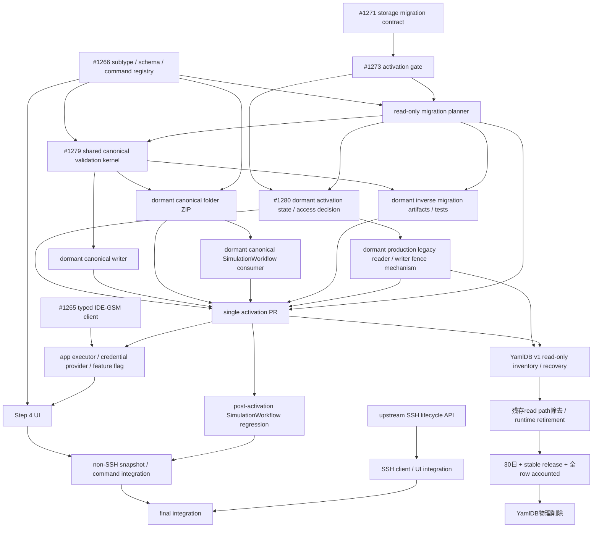
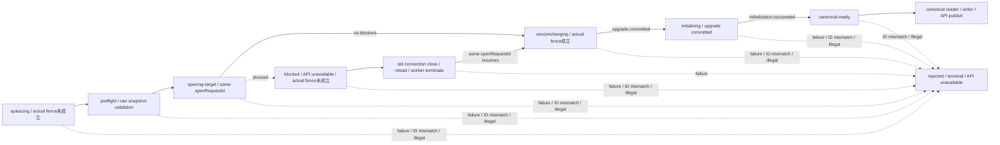

# YAML plugin IDE-GSM Step 4 契約

## 位置付け

本書は YAML plugin の subtype、IDE-GSM command、draft 同期、認証、実行状態に関する正規仕様である。親 Epic [#1162](https://github.com/kubohiroya/hierarchidb/issues/1162)、仕様 Issue [#1253](https://github.com/kubohiroya/hierarchidb/issues/1253)、storage migration契約Issue [#1271](https://github.com/kubohiroya/hierarchidb/issues/1271)、storage activation gate Issue [#1273](https://github.com/kubohiroya/hierarchidb/issues/1273) に基づく。

型、DB migration、client、executor、UI の実装は本書に従う。本書と `.kiro/specs/yaml-file-node` または `.kiro/specs/ide-gsm-client` が矛盾する場合、本書を優先する。

## Upstream 契約

- Repository: `kubohiroya/ide-gsm`
- Revision: `353a81edd4635e70913b778ae7d2aa6833ae1de1`
- GraphQL mutation と task status は上記 revision の `FrontendResource` と `TaskStatus` を基準とする。
- mutation は task ID を文字列で返す。task ID を受け取った command は subscription で terminal status まで追跡する。
- `check` command は `checkAll` だけに対応する。`checkProject` は別の upstream command であり、代替として呼び出さない。

## YAML subtype と永続化契約

```ts
type YamlSubtype =
  | 'sources'
  | 'scenario'
  | 'scenario-base'
  | 'calib'
  | 'remote'
  | 'remote-base'
  | 'ssh'
  | 'ssh-base'
  | 'ec2'
  | 'ec2-base'
  | 'rsync'
  | 'git';
```

- ファイル名は `TreeNode.metadata.name` / `TreeNode.draftMetadata.name` を唯一の SSOT とする。
- `YamlFileNodeData` / `draftData` は `subtype`、`schemaId`、`content` を持ち、`name` を重複保存しない。
- subtype、schemaId、canonical filename の組合せは次表の registry で検証する。
- template 選択後の filename は canonical filename と一致しなければならない。任意の別名を受け入れない。
- 通常の読み込み・編集・command 実行時に、filename や schemaId から subtype を推測しない。

| subtype | schemaId | canonical filename | command |
| --- | --- | --- | --- |
| `sources` | `ide-gsm/sources` | `sources.yml` | あり |
| `scenario` | `ide-gsm/scenario` | `scenario.yml` | あり |
| `scenario-base` | `ide-gsm/scenario` | `scenario-base.yml` | なし |
| `calib` | `ide-gsm/calib` | `calib.yml` | なし |
| `remote` | `ide-gsm/remote` | `remote.yml` | あり |
| `remote-base` | `ide-gsm/remote` | `remote-base.yml` | なし |
| `ssh` | `ide-gsm/ssh` | `ssh.yml` | あり |
| `ssh-base` | `ide-gsm/ssh` | `ssh-base.yml` | なし |
| `ec2` | `ide-gsm/ec2` | `ec2.yml` | あり |
| `ec2-base` | `ide-gsm/ec2` | `ec2-base.yml` | なし |
| `rsync` | `ide-gsm/rsync` | `rsync.yml` | あり |
| `git` | `ide-gsm/git` | `git.yml` | あり |

`scenario-base`、`calib`、`remote-base`、`ssh-base`、`ec2-base` は editor-only subtype であり、command 集合は明示的な空集合とする。

## 追加 template の content 契約

### `rsync.yml`

- YAML root は mapping とする。
- 許可する property は optional な `include: string[]` と `exclude: string[]` だけとする。
- `additionalProperties` は許可しない。
- `connectionType`、`projectRelativePath`、push/pull 方向を YAML に保存しない。
- `connectionType` は Step 4 で `remote`、`ssh`、`ec2` のいずれかを必須 runtime input として受け取る。
- client は検証済み YAML を解析し、`include` / `exclude` が存在するときだけ GraphQL variables へ配列として渡す。server が `rsync.yml` を暗黙に読むことを前提にしない。
- property の欠落を空配列で補完しない。省略と空配列を区別して upstream へ渡す。

### `git.yml`

- YAML root は mapping とし、repository `url` を必須 property とする。
- `additionalProperties` は許可しない。
- GitHub token と `projectRelativePath` を YAML に保存しない。いずれも runtime input とする。

## Subtype と command の対応

| subtype | command ID | GraphQL mutation |
| --- | --- | --- |
| `sources` | `install` | `install` |
| `scenario` | `check` | `checkAll` |
| `scenario` | `check-merge` | `checkMerge` |
| `scenario` | `preview-events` | `previewEvents` |
| `scenario` | `calib` | `calibrate` |
| `scenario` | `sim` | `simulate` |
| `scenario` | `purge-cache` | `purgeCache` |
| `remote` | `calib-remote` | `calibrateRemote` |
| `remote` | `sim-remote` | `simulateRemote` |
| `remote` | `start-container-remote` | `startContainerRemote` |
| `remote` | `stop-container-remote` | `stopContainerRemote` |
| `ssh` | `calib-ssh` | `calibrateSsh` |
| `ssh` | `sim-ssh` | `simulateSsh` |
| `ec2` | `calib-ec2` | `calibrateEc2` |
| `ec2` | `sim-ec2` | `simulateEc2` |
| `ec2` | `start-container-ec2` | `startContainerEc2` |
| `ec2` | `stop-container-ec2` | `stopContainerEc2` |
| `rsync` | `rsync-push` | `rsyncPush` |
| `rsync` | `rsync-pull` | `rsyncPull` |
| `git` | `init` | `init` |

- `start-daemon-*` は無効な旧名称とし、alias を設けない。
- `start-container-ssh` と `stop-container-ssh` は upstream Frontend GraphQL API に存在しないため、registry と UI に追加しない。
- `gitClone` と `gitPull` は本契約の command ではない。`init` からの fallback 先としても使用しない。
- 未定義 subtype、または subtype に許可されていない command は network request 前に契約違反としてエラーにする。

## Command input

`projectRelativePath` はすべての command で非空の必須 runtime context とする。絶対 path、`..`、未設定値を拒否する。container lifecycle mutation 自体は GraphQL input を持たないが、その前段の snapshot import には runtime `projectRelativePath` を使用する。

| mutation | input |
| --- | --- |
| `install` | `projectRelativePath`; optional runtime `force` |
| `checkAll`, `checkMerge`, `purgeCache` | `projectRelativePath` |
| `previewEvents` | `projectRelativePath`; optional runtime `profile`, `yearFilter` |
| `simulate` | `projectRelativePath`; optional runtime `profile`, `compute`, `apsp`, `purgeCache`, `reset` |
| `calibrate` | `projectRelativePath`; optional runtime `profile`, `compute`, `apsp`, `purgeCache`, `purgeCalib`, `reset` |
| `simulateRemote`, `simulateSsh`, `simulateEc2` | `projectRelativePath`; optional runtime `compute`, `apsp`, `purgeCache`, `reset`, `downloadCache` |
| `calibrateRemote`, `calibrateSsh`, `calibrateEc2` | `projectRelativePath`; optional runtime `compute`, `apsp`, `purgeCache`, `purgeCalib`, `reset`, `downloadCache` |
| `startContainerRemote`, `stopContainerRemote`, `startContainerEc2`, `stopContainerEc2` | GraphQL input なし |
| `rsyncPush`, `rsyncPull` | runtime `projectRelativePath`, required runtime `connectionType`; optional YAML `include`, `exclude` |
| `init` | runtime `projectRelativePath`, runtime GitHub token, required `git.yml.url` |

optional input は未指定のまま送信し、client 側で値を補完しない。入力値の意味と upstream default を UI 側の default で上書きしない。

## Dialog、draft、runtime state

- YAML plugin は app の汎用 `PluginDialogHost` と `PluginStepRegistry` を使用する。専用 `YamlDialog` を追加しない。
- Basic Info は host が `draftMetadata` として管理する。
- plugin 固有の永続 draft は `draftData` の `subtype`、`schemaId`、`content` だけとする。
- Step 4 の選択 command、task ID、status、result、error は UI-only state とする。`draftMetadata`、`draftData`、TreeNode、IndexedDB へ保存しない。
- endpoint と JWT は app-level の認証済み executor/provider に閉じ込める。step props、draft、TreeNode、IndexedDB、URL、localStorage、ログへ token を渡さない。
- command 実行は暗黙の save/commit ではない。ダイアログを閉じる、または再読み込みすると UI-only state は破棄される。

## Snapshot と command 実行順序

### 通常 command

`git/init` 以外は次の順序を固定する。

1. subtype、schemaId、canonical filename、YAML content、runtime input をすべて検証する。
2. 対象 folder について既存 folder export 契約が選ぶ YAML ノードを収集し、編集中ノードは保存済み payload ではなく現在の検証済み draft で置き換える。
3. immutable `ProjectSnapshot` を生成する。
4. `importProject` を実行し、task status が `FINISHED` になるまで待つ。
5. 対象 command mutation を1回だけ送信する。

validation、serialization、`importProject` のいずれかが失敗した場合、対象 command を送信しない。部分 snapshot、保存済み payload への切替、retry、別 mutation への fallback を行わない。

### `git/init` bootstrap 例外

`git/init` は clone 先を新規作成する bootstrap command であり、`importProject` を前置しない。

1. `git.yml` の subtype、schemaId、canonical filename、content、`url` を検証する。
2. runtime `projectRelativePath` と GitHub token を検証する。
3. clone 先が存在しないことを確認する。空であっても既存の clone 先はエラーにする。
4. `init(projectRelativePath, token, url)` を直接1回だけ送信する。

既存 path の削除・上書き・内容退避、別 destination の生成、`gitClone` への fallback を禁止する。

## Task status

| upstream status | UI 契約 |
| --- | --- |
| `REGISTERED`, `READY`, `LEASED` | active。subscription を継続する |
| `FINISHED` | success。subscription を終了する |
| `FAILED`, `CANCELED` | failure。詳細を表示して subscription を終了する |
| `DELETED` | unsupported terminal state。成功扱いせずエラーにする |
| その他 | unknown status。契約違反としてエラーにする |

- WebSocket が terminal status 前に完了・切断した場合はエラーにする。
- 実行中の同一 command の二重開始を拒否する。
- 自動 retry、status の読み替え、unknown status の無視を行わない。
- error 表示とログには endpoint や token 等の credential を含めない。

## Feature flag

- 論理 flag 名は `yamlIdeGsmStep4Enabled` とする。
- typed app-level config を唯一の読取元とし、既定値は `false` とする。
- app composition / `PluginDialogHost` 境界が flag を1回だけ読み、YAML step composition へ boolean capability として注入する。
- YAML plugin、step component、executor は app config や environment variable を直接読まない。
- flag が OFF の場合、Step 4 を effective step config に含めず、既存の3ステップ構成を維持する。
- environment variable や複数 config 経路への fallback を設けない。
- 実装ファイルの配置は executor/flag 実装 Issue で命名規約に従って確定する。本書は公開契約、単一読取責務、注入境界、既定値の SSOT とする。

## Migration と import

### Storage authority

- CoreDB `TreeNode` を YAML domain data の唯一の authoritative store とする。
- committed filename と payload の組は `metadata.name` / `data`、draft filename と payload の組は `draftMetadata.name` / `draftData` とする。各 slot は対応する metadata とだけ照合し、committed と draft の間で値を補完しない。
- 独立した YamlDB v1 は authoritative store、cache、dual-write 先ではない。既存 row の回復可否を調べるための frozen legacy recovery source とし、新規 write、自動 merge、自動 copy、自動 delete を禁止する。
- CoreDB と YamlDB は別の IndexedDB database であり、単一 transaction に含められない。CoreDB migration、YamlDB inventory/recovery、YamlDB runtime path 廃止、物理 database 削除は別の Issue と atomic boundary で扱う。
- CoreDB migration 中は YamlDB を変更しない。YamlDB recovery が CoreDB record を作る場合も、先に source snapshot 全体を fencing と preflight で固定し、write は CoreDB だけの単一 transaction で行う。YamlDB row の削除を同じ成功条件に含めない。

### Record shape と共通 validation

各 payload slot は次のいずれかに分類する。

| classification | payload shape | 処理 |
| --- | --- | --- |
| legacy | `name`、`schemaId`、`content` があり、`subtype` がない | 対応 metadata name と payload name が完全一致し、registry の単一 entry に一致するときだけ canonical shape へ変換する |
| canonical | `subtype`、`schemaId`、`content` があり、`name` がない | strict validation 後に変更しない |
| mixed | `name` と `subtype` の両方がある | contract error として migration 全体を失敗させる |
| incomplete | 必須 field、対応 metadata、または有効な文字列値が欠ける | contract error として migration 全体を失敗させる |
| unknown | registry にない subtype、schemaId、filename、または余分な field がある | contract error として migration 全体を失敗させる |

- legacy record は、対応 metadata name、payload `name`、`schemaId` がすべて存在し、両 name が完全一致し、その組が registry の単一 subtype に一致する場合だけ変換対象にする。
- canonical record は subtype、schemaId、対応 metadata name の組が同じ registry entry と完全一致しなければならない。already-canonical record を legacy へ戻したり書き直したりしない。
- legacy と canonical のどちらについても `content` を YAML として parse し、root shape と選択された registry schema の JSON Schema に対して検証する。parse error、schema mismatch、必須 property 欠落、追加禁止 property を検出した場合は全体を失敗させる。
- 同一 payload に `name` と `subtype` が併存する mixed shape だけを禁止する。committed slot と draft slot は独立分類し、同じ `TreeNode` の `data` が canonical、`draftData` が legacy の場合は、committed slotをvalidated no-op、draft slotをmigration対象とする。
- legacy / canonicalの`content`は検証のためにparseするだけとし、migrationで本文を整形、serialize、補完、変更しない。error reportまたはlogにも本文を含めない。
- error report は source、node ID、slot、typed error code を含める。YAML本文、認証情報、endpoint、token を含めない。
- missing legacy `name`、metadata/payload name 不一致、`schemaId: ''`、unknown/ambiguous mapping を filename、schemaId、別 slot、既存 record から推測または補完しない。`data.name ?? metadata.name` のような fallback を禁止する。
- strict validationの実装authorityは`@hierarchidb/yaml-api` package内部のneutral kernelとする。kernelはown data property、plain object、registry tuple、YAML 1.2の単一plain mapping、current `YAML_SCHEMAS`をcoercion、default、property除去なしで検証する。
- public `@hierarchidb/yaml-api/validation` facadeはcanonical filenameとcanonical payloadだけを同時に検証し、legacy payloadを成功させない。成功時は検証済みの`subtype`、`schemaId`、`content`を新しい値として返し、callerにraw objectのcastまたは再readを要求しない。
- migration plannerはpackage-internal adapterから同じkernelのlegacy/canonical分類を使用し、neutral errorを既存migration contextへ再構成する。既存のerror code、precedence、source index、node ID、slot、sorting、redactionを変更しない。
- parser、Ajv、getter、Proxyが投げたmessage、raw payload、YAML本文をpublic errorまたはmigration errorへ含めない。public facade、migration adapterのどちらもinput/contentを変更、normalize、serializeしない。

### CoreDB slot 決定表

raw recordの`data`はproperty missing、`undefined`、`null`をcommitted payload absentとして扱う。`draftMetadata`はproperty missing、`undefined`、`null`をdraft metadata absent、`draftData`はproperty missingまたは`undefined`をdraft payload absentとして扱う。normalizerでこれらを別の値へ変換してから分類しない。

| `TreeNode` の状態 | 判定と処理 |
| --- | --- |
| `data` があり `metadata` がある | committed slot として両者だけを共通 validation にかける |
| `data` があり `metadata` がない | incomplete。migration 全体を失敗させる |
| `data` がなく、base `metadata`と完全な `draftMetadata` / 非空`draftData` がある | `isTemporary`に関係なくcommitted slotは未作成としてskipし、draft slotだけを検証・migrationする |
| `isTemporary === true`、`data === null`、base `metadata`とnon-null `draftMetadata`があり、`draftData`がown-key 0のplain object | uninitialized placeholderとしてwriteせずskipする。値を補完しない |
| `data` がなく、上記の完全なdraft pairまたは厳密なplaceholder条件を満たさない | incomplete record。migration全体を失敗させる |
| 非空`draftData`がlegacy/canonicalの完全shapeでない | incomplete partial draft。`isTemporary`に関係なくmigration全体を失敗させる |
| `draftMetadata === null` かつ `draftData === undefined` | active draftなし。draft slotをskipする |
| `draftMetadata` と `draftData` の両方がある | draft slotとして両者だけを共通 validation にかける |
| `draftMetadata` だけがある rename-only draft | committed slotを独立に検証した後、`draftMetadata.name === metadata.name`のmetadata-only draftだけをno-opにする。name差分は全体を失敗させる |
| `draftData` だけがある | metadataをcommitted slotから補わず incomplete として全体を失敗させる |

- `isTemporary` の例外は `data === null`、base metadata、non-null draftMetadata、own-key 0のplain `draftData`を同時に満たすuninitialized placeholderだけとする。property missing、`undefined`、配列、prototype由来keyだけのobjectをplaceholderとして扱わない。非空payloadについて必須fieldやschema validationを緩和せず、partial draftをskipまたはdefault補完しない。
- rename-only draftの判定ではcommitted payloadをdraftへcopyせず、subtype、schemaId、filenameを推測しない。metadata nameが同一であることだけを検証する。
- committed slotとdraft slotは別々のsubtypeを持ち得るが、それぞれが対応metadataを含む完全なregistry tupleでなければならない。
- migration成功時だけlegacy payloadの`name`を除去し、対応metadata nameを唯一のfilename SSOTとする。`schemaId`と`content`は値を変更せず、registryから得た明示的な`subtype`を追加する。

### Merge gate と runtime activation gate

実装をmainへ取り込む順序と、production storageをcanonical shapeへ切り替える順序を分離する。後続実装順序のmerge DAGはPR間の依存、runtime activation DAGは1つのactivation release内で必ず連続して実行する処理を表す。片方を他方の代わりに使用しない。

- read-only plannerはproduction DBへ接続せず、`unknown`のraw record snapshotを入力としてmigration planまたはsanitized typed error reportを返すpure boundaryにする。CoreDB / Dexieのopen、schema version登録、transaction、write、journal table作成、worker bootstrapへの接続を含めない。1件でも不正ならpartial planを返さず、YAML本文、token、credential、endpointをreportまたはlogへ含めない。
- [#1279](https://github.com/kubohiroya/hierarchidb/issues/1279)のshared canonical validation kernelは、canonical payloadのstrict validation authorityとmigration adapterを独立subpathで提供するdormant artifactとする。dormant canonical writer、canonical ZIP、inverse migration artifactはこのauthorityへ収束し、validationを複製しない。
- [#1280](https://github.com/kubohiroya/hierarchidb/issues/1280)のdormant activation state machine / access decisionは、後続production legacy reader / writer fence mechanismとは別artifactとする。CoreDB、WorkerService、bootstrap、production reader / writerへ未接続のまま先行mergeし、production fence成立またはactivation完了として扱わない。
- canonical writer、canonical ZIP import / export、canonical SimulationWorkflow consumer、inverse migration artifact、legacy reader / writer fence mechanismは、production writer、dialog step、worker API、ZIP path、SimulationWorkflow entry point、bootstrapから到達不能なdormant implementationとしてのみ先行mergeできる。activation releaseまでは既存legacy entry pointの挙動を変更しない。既存legacy writerとcanonical writerを同時に選べるflag、environment fallback、dual-write、read-time fallbackを追加しない。
- activation PRより前にproduction `CoreDB.version(2)`を登録しない。CoreDBのtarget versionが別変更で先に進んだ場合は、本仕様とactivation Issueでtarget versionを再確定してから登録する。read-only plannerを`CoreDB.getSingleton()`、`WorkerService`、plugin preload、app bootstrapへ接続しない。
- activation PRは、read-only planner、#1279 validation kernel、#1280 activation state machine、dormant canonical writer、dormant canonical ZIP import / export、dormant canonical SimulationWorkflow consumer、exact / release inverse migration artifact、failure-path test、production legacy reader / writer fence mechanismがmainへmerge済みである場合だけ開始できる。versionchange migration、CoreDB / worker boot接続、canonical reader / writer / API publishを同じrelease boundaryで有効化し、一部だけを先行公開しない。
- `yamlIdeGsmStep4Enabled`はStep 4 compositionの表示契約であり、storage activationまたはrollback gateとして使用しない。flag OFF、旧binary、legacy writerをmigration後のfallbackとして起動しない。
- optional plugin preloadは例外をworker-ready failureとして伝播できないため、preflight、migration、storage readinessのgateとして使用しない。CoreDB `open()` / upgradeの成功をawaitするworker bootだけがquery / mutation APIをreadyにできる。
- migrationのblockedまたはrejectを、全IndexedDB削除を案内するgeneric recoveryへ変換しない。`@hierarchidb/runtime-worker/yaml-storage-activation`のtyped stateをauthorityとし、`blocked`は同じ`openRequestId`のtarget open requestを待つ非ready状態、`rejected`はretry、reset、別request、legacy fallbackを受け付けないterminal worker boot failureとして通知する。`quiescing`と`blocked`ではactual versionchange fenceが未成立であり、自動DB削除またはv1 reopenを行わない。

#### Read-only migration planner contract

- plannerは`@hierarchidb/yaml-api/migration`の独立subpathだけから公開し、package rootから再exportしない。production DB、reader、writer、worker bootstrapから到達不能なdormant artifactとしてmainへmergeする。
- callerはCoreDBから選択した全`yaml-file` raw recordの`readonly unknown[]`、opaqueで空でないmigration ID、正の整数で`to > from`を満たすCoreDB version pair、SHA-256 digest portを明示的に渡す。plannerはmigration ID、version、digest実装をrandom生成、推測、default補完しない。candidateに`nodeType !== 'yaml-file'`のrecordが含まれる場合は無視せずcontract errorにする。
- plannerはTreeNode normalizer、型cast、JSON round-tripを入力前処理に使用しない。raw own data propertyを基準にmissing、`undefined`、`null`、empty plain object、array、non-empty objectを区別し、accessorを実行せず、record、metadata、payloadの不正shapeをfail-closedにする。各candidateの`version`はown data propertyのnon-negative safe integerを必須とし、`0`を有効なtemporary node versionとして扱う。
- YAML contentはYAML 1.2 core schemaでstrictにparseし、単一documentのplain mappingだけを受け入れる。duplicate key、parse error、複数document、scalar、sequenceを失敗させる。parse結果をserializeし直さず、入力contentを変更しない。
- current revisionの`YAML_SCHEMAS`に宣言されたconstraintsをauthoritative validation inputとする。Ajvはstrict mode、all errors、type coercionなし、default追加なし、property除去なしで使用する。schemaにない`additionalProperties: false`やrequired propertyをplanner側で注入せず、未宣言制約を推測しない。
- migration contextが同一の場合、plan entryとerrorはnode ID昇順、同一node内はcommitted、draftの順に固定する。1件でもvalidationまたはdigest failureがあればsuccess plan、postimage、journal entry、partial resultを返さない。
- canonical postimage digestはfilename、subtype、schemaId、contentの順に各UTF-8 byte列へ8-byte unsigned big-endian lengthを前置して連結し、injected portから得た64文字のSHA-256 lowercase hexだけを受け入れる。不正なdigest outputまたはport failureをtyped errorにし、別hashへfallbackしない。
- error reportはsource index、取得できた場合のnode ID、slot、stable error code、安全なcontract contextだけを含める。YAML本文、raw parser / Ajv error、preimage、postimage、token、credential、endpointをerror、message、console、snapshotへ含めない。
- success planは全candidateをnode ID順に1件ずつ対応付ける`sourceIndex`、node ID、expected node versionのguardを含める。activation coordinatorはplanner inputのimmutable raw snapshotをplanと同じlifetimeで非公開に保持し、serialize、log、journal保存しない。versionchange transaction内では選択されたYAML node集合の追加、欠落、重複を照合し、各nodeのID / version、metadata name、draft metadataのown presence / name、data / draftDataのown presenceと全payload key / value、`isTemporary`のown presence / valueを同じsnapshotと完全比較する。normalizer、reparse、JSON round-trip、fallbackを使用せず、1件の差分でtransaction全体をabortする。snapshotを保持せずplanを永続化または別runtimeへ転送する将来設計では、同じ比較材料をplan内のself-contained guardへ仕様化するまで実装しない。

runtime activationは次の順序で実行する。

1. 新runtimeのlegacy / canonical YAML reader、writer、ZIP、SimulationWorkflow、command入口を未公開のまま保ち、旧tabと旧workerへ停止・connection closeを要求する。新runtime内のlegacy create / edit / commit / ZIP import / export / SimulationWorkflow entry pointは開始しない。この時点の協調停止だけをwrite fence成立とみなさない。
2. CoreDB v1 raw snapshotへread-only preflightを実行し、migration plan、migration ID、postimage digest、journal valueを確定する。失敗時はversionchangeを開始しない。
3. preflightに使用したconnectionを閉じてtarget versionの`open()`を1回だけ開始する。旧connectionが残る間はblockedとしてAPIをreadyにせず、旧tabのreloadと旧workerのterminateによって同じrequestをresumeする。
4. versionchange transaction内でraw recordを再読し、preflight snapshotとの完全一致を確認してからnodesとjournalをatomicに更新する。差分または1件の失敗でtransaction全体をabortする。
5. upgrade commitとCoreDB initializationが成功した後だけ、canonical query / mutation API、dialog writer、ZIP import / export、SimulationWorkflow consumer、command入口を公開する。commit前またはfailure後にlegacy / canonical readerまたはwriterを公開しない。

#### Dormant activation phase contract

`@hierarchidb/runtime-worker/yaml-storage-activation` は、activation releaseが後から接続するためのpureなstate machineとaccess decisionだけを公開する独立subpathとする。このartifact自体はCoreDB、WorkerService、bootstrap、production reader / writer / APIへ接続せず、importしてもstorage routeや現行legacy entry pointを変更しない。

| phase | actual versionchange fence | legacy publication | canonical publication | YamlDB domain |
| --- | --- | --- | --- | --- |
| `quiescing` | 未成立 | deny | deny | deny |
| `preflight` | 未成立 | deny | deny | deny |
| `opening-target` | 未成立 | deny | deny | deny |
| `blocked` | 未成立。同じ`openRequestId`のrequestを待機 | deny | deny | deny |
| `versionchanging` | 成立 | deny | deny | deny |
| `initializing` | 成立。upgrade commit済み | deny | deny | deny |
| `canonical-ready` | 成立。upgrade commitとinitialization成功済み | deny | query / mutation / reader / writerをallow | deny |
| `rejected` | rejection前の成立状態を保持 | deny | deny | deny |

- activation開始時にcallerが空でない`activationId`、現在version、default補完しないtarget versionを渡す。target versionは現在versionより大きい正のsafe integerでなければならない。
- target openに関わるeventは空でない`openRequestId`を必須とする。`blocked`から`versionchanging`へ進めるのは同じ`openRequestId`のrequestがresumeした場合だけとし、別request IDはtyped terminal rejectionにする。
- `canonical-ready`へ進めるのは、同じactivationでupgrade commitを確認して`initializing`へ遷移した後、initialization成功を受け取った場合だけとする。順序外event、activation ID不一致、open request ID不一致はstableなcodeとstageだけを持つ`rejected`へ遷移し、reader / writerを公開しない。
- publication判定はこのsubpathのcreate / reducerが発行してfreezeしたstateだけを正規stateとして扱う。公開されたstructural typeから捏造したstate、正規stateのclone、mutable stateを`canonical-ready`として信頼せず、typed denyにする。捏造stateをreducerへ渡して正規stateへ昇格させない。
- access requestはown data propertyだけからdomain、representation、operationの完全な組を検証する。`null`、配列、non-plain object、accessor、Proxy reflection failure、余分なfield、unknown representation / operation / domainはthrowまたはlegacy扱いせず`INVALID_ACCESS_REQUEST`でdenyする。
- `rejected`はterminalとし、retry、reset、新request、legacy fallbackを受け付けない。error stateへraw error、YAML content、credential、endpointを格納しない。
- このdormant契約のreducerとaccess decisionはI/O、timer、random、時刻、environment、storageへ依存しない。独立したYamlDB domainは全phaseで常にdenyする。

### CoreDB preflight、atomicity、fencing

1. activation gateに従い、migration対象versionを開く前に旧runtimeのYAML create、edit、commit、ZIP import writerを停止する。
2. 全CoreDB `yaml-file` nodeのcommitted slotとdraft slotを列挙し、決定的な順序でmigration planまたはerror reportを作る。read-only preflight中にmigration IDと各canonical postimage digestを計算し、journalへ書く値をplanへ固定する。digest対象のfilenameはcommitted slotでは`metadata.name`、draft slotでは`draftMetadata.name`とし、filename、subtype、schemaId、contentの順に各UTF-8 byte列へ8-byte unsigned big-endian byte lengthを前置して連結し、SHA-256 lowercase hexを計算する。全件preflightが成功するまでwriteを開始しない。
3. CoreDB schema versionを上げる`versionchange`だけをwrite fenceとする。旧connectionへcloseを要求し、旧tabはreload、旧workerはterminateを必要とする。connectionが残る間は明示的なblocked状態とし、worker/APIをreadyにせず、同じ`open()` requestだけを待機させる。connectionがcloseしたら同じrequestでupgradeをresumeし、別requestによるretry、強制継続、v1 fallbackを行わない。
4. 同じCoreDB versionchange transaction内で`nodes` tableのraw recordを全件再読する。normalizerやread-time fallbackを通さず、全slotを再分類・再検証し、preflight時のnode ID、version、slot shape、値との完全一致を確認する。差分または検証失敗があればtransactionをabortする。
5. raw recordがpreflight snapshotと完全一致した後、同じtransaction内でlegacy slotを一括更新し、専用migration journalへpreflight planで固定したmigration ID、from/to CoreDB version、node ID、slot、legacy name、canonical postimage digestを保存する。already-canonical slotとplaceholderはjournalまたはwrite対象へ追加しない。YAML本文をjournalへ複製しない。
6. validation、raw再読、journal保存、または一括更新の1件でも失敗した場合はtransaction全体をabortし、CoreDB `open()` / upgradeをrejectしてworker bootを失敗させる。commit後にだけchange notificationを発行する。
7. blocked中またはreject後にquery/mutation APIと新runtimeのYAML writerを公開しない。legacy writer、dual-write、lazy migration、read-time fallbackへ切り替えない。

CoreDB versionchange transaction内ではnetwork、WebCrypto、その他の外部asyncをawaitしない。migration ID、digest、postimage、journal valueはread-only preflightで準備する。将来、transaction外promiseの待機が不可避になった場合は、対象と上限時間を本仕様で追加確定し、明示的な`Dexie.waitFor`と失敗時abortを実装するまで導入しない。

already-canonical slotは毎回strict validationし、write対象へ追加しない。成功済みmigrationを同じ入力へ再実行した場合は、全slotがvalid canonicalであることを確認したno-opにする。migration済みversion markerだけを根拠にvalidationを省略しない。

### YamlDB v1 inventory と recovery

- YamlDB v1の全rowをread-onlyでinventoryし、`nodeId`、`parentId`、name、schemaId、対応CoreDB node/parentの有無を検証する。
- 各rowのcontentをYAML parseしてregistry schemaで検証し、CoreDB parentの存在とfolder型、同一node IDの既存target、`parentId + metadata.name`のsibling index targetを調べる。
- 各rowを`duplicate/no-op`、`recoverable`（recoverable orphan）、`orphan/blocked`、`conflict`、`invalid`、`explicitly discarded`のいずれかとしてaccountする。`duplicate/no-op`はYamlDB rowから構成するcanonical targetと既存CoreDB nodeのnode ID、node type、parent ID、`metadata.name`、canonical subtype、schemaId、contentがすべて一致し、string fieldがbyte-for-byteで同一の場合だけとする。その他の既存node IDまたはsibling index衝突は`conflict`とする。CoreDBにtarget nodeがなく、node IDとsibling indexが衝突せず、回復先parentが存在してfolder型の場合だけ`recoverable`とし、この状態をrecoverable orphanと定義する。target nodeがなくても、回復先parentがmissingまたはfolder型でない場合は`orphan/blocked`とし、推測したparentへ付け替えない。discardは対象rowと理由をユーザーが明示承認した場合だけ許可し、inventory側で自動判断しない。
- orphan、CoreDBとのnode ID / parent / payload conflict、`schemaId: ''`、missing name、invalid content、unknown/ambiguous mappingをskip、filename-only分類、自動copyで処理しない。全対象とtyped errorを報告する。
- CoreDB migrationの成功はYamlDB inventoryのrowを削除または移動したことを意味しない。回復は別Issueで明示的に承認された規則だけを使う。
- recovery sourceを確定する前にproduction YamlDB writerを除去してfenceし、read-only inventoryを作る。inventory snapshotが変化した場合はCoreDB write前に全体を失敗させる。cross-DB transactionがないため、snapshot固定を証明できない場合はrecoveryを開始しない。
- ユーザーが明示承認したrecovery batchだけを対象に、全rowとtargetを再preflightした後、CoreDBの単一transactionで一括commitする。1件の失敗でbatch全体をabortし、source YamlDBは成功時も変更しない。
- YamlDB runtime pathを廃止しても物理databaseを直ちに削除しない。CoreDB migrationの本番適用後、少なくとも30日かつ後続のstable releaseが1回受け入れ済みになるまで保持し、全row accountedとrollback不要を確認する別Issueでのみ削除できる。

### Canonical ZIP import / export boundary

- exportはCoreDBから選んだ`yaml-file` nodeだけを読み、filenameは`metadata.name`、contentはstrict validation済み`data`または明示的に選んだ検証済みdraft slotから取得する。YamlDBを参照しない。
- ZIP importは全entryをdecodeしてから、registryにあるcanonical filenameだけを受け入れる。canonical filenameから対応するsubtypeとschemaIdを明示設定する処理は、このimport boundaryに限って許可する。
- unknown filename、重複canonical filename、duplicate target、invalid UTF-8、invalid YAML、schema mismatch、parent不在、sibling name conflictを全entryについて検出する。拡張子だけによる受入や`generic` subtypeを禁止する。
- 全entry、生成するnode ID、target parent、parent更新をpreflightした後、CoreDBのnodesと必要なparent更新を単一transactionでcommitする。1件でも失敗した場合はnodeとparentの両方をrollbackする。
- ZIP importはYamlDBへwriteしない。CoreDB write後にYamlDBへcopyする処理も追加しない。

#### Dormant canonical ZIP raw codec profile

- raw codecは`@hierarchidb/folder-plugin/canonical-yaml-zip-codec`からだけ公開するpure/dormant artifactとし、folder root、UI、worker、legacy ZIP、CoreDB、YamlDB、SimulationWorkflow、production routingから到達不能に保つ。
- 入力は`Uint8Array`またはstandard padded Base64に限定する。Base64のwhitespace、data URL、URL-safe alphabet、non-canonical paddingを拒否する。
- decoded archiveは16 MiB以下、central entryは12件以下、1 entry contentは4 MiB以下、全content合計は16 MiB以下とする。上限超過時にpartial decode、skip、retryを行わない。
- single-disk、non-ZIP64、non-encrypted、STOREだけを受け入れる。directory entry、archive/file comment、extra field、data descriptor、unknown flag、unknown root entryを拒否する。
- EOCDはarchive末尾の固定位置に1件だけ存在し、central directory末尾はEOCD先頭と一致しなければならない。local entry rangeはoffset順に`[0, centralDirectoryOffset)`を隙間なく完全被覆し、leading bytes、entry間gap、最後のlocal entryとcentral directory間のjunk、range overlap、central-directory侵入、trailing dataを拒否する。
- central recordは出現順とoccurrence indexを保持した配列として監査し、duplicate filename検査より前にfilename-keyed `Map` / objectまたはJSZip公開結果へ変換しない。同一local header offsetを複数central recordから参照するarchiveも全体errorとする。
- central/local headerのfilename bytes、UTF-8 flag、method、CRC32、compressed/uncompressed sizeを一致させる。filenameとcontentはfatal UTF-8でdecodeし、BOMは`U+FEFF`として保持してbyte-for-byte round-tripを要求する。replacement、normalization、sanitize、safe-name fallbackを行わない。
- filenameはslash/backslash、absolute path、drive prefix、dot/dot-dot、NUL、非NFCを含まず、#1266 registryの12 canonical root filenameのいずれかとbyte-for-byteで一致しなければならない。
- 検証順はraw EOCD / central / local bounds、raw duplicateとheader/range、CRC/content length、fatal UTF-8、filenameからregistry tuple構築、`validateYamlCanonicalPayload(filename, payload)`によるYAML/schema validationとする。各phaseはarchive全entryに対して完了してから次phaseへ進み、先行entryのYAML/schema errorで後続entryのfatal UTF-8 errorを隠さない。validation authorityをcodec内へ複製しない。
- encodeはcanonical filenameのUTF-8 byte昇順、STORE、固定DOS timestamp、comment/extraなしで行い、同じvalidated input集合から同一bytesとBase64を生成する。raw bytes、content、payloadをnormalize、serializeし直さず、errorへarchive、Base64、YAML content、parser errorを含めない。
- このcodecはnode ID、parent/sibling、transaction、write planを扱わない。後続のdormant import/export planが全entryをdecode/preflightしてからinjected CoreDB write portへ単一transactionを要求し、single activationまではproductionへ接続しない。

### Inverse rollback

`@hierarchidb/yaml-api/inverse-migration`は、CoreDBへ接続しないpureかつdormantなinverse plan artifact専用subpathとする。package rootから再exportせず、CoreDB、Dexie、IndexedDB、YamlDB、worker、feature flag、writer、timer、random、environmentへ依存しない。公開APIは`planExactYamlCoreDbInverseMigration`と`planReleaseYamlCoreDbInverseMigration`の別関数・別input/output typeとし、generic mode、default、exactからreleaseへのfallbackを提供しない。

- exact callerはnon-empty rollback IDとforward migration ID、`rollbackTargetVersion > currentCoreDbVersion`を満たすsafe integer version pair、全CoreDB YAML nodeのimmutable raw snapshot、対象forward migrationの全raw journal snapshot、forward plannerと同じSHA-256 digest port、literal `canonical-writer-never-published`を明示する。
- release callerはnon-empty rollback ID、同じversion pair、全CoreDB YAML nodeのimmutable raw snapshot、literal `canonical-writer-published-or-unknown`を明示する。artifactはactivation phase、feature flag、runtime stateからpublication事実を推測しない。
- top-level input、raw snapshot配列、raw node、raw journalはown data propertyだけをdescriptorで読む。missing、`undefined`、accessor、symbol/extra property、sparse/拡張array、non-plain record、Proxy reflection failure、duplicate node IDをfail-closedで拒否し、getterを実行しない。
- success planは全candidateについて`sourceIndex`、`nodeId`、`expectedVersion`を決定的順序で保持する。exact planはさらにjournalの全fieldを複製したguardを保持し、migration ID、from/to version cohort、`nodeId + slot` compound key、node/slot存在、legacy nameとslot metadata nameの一致、canonical postimage digestの再計算一致を全件検証する。
- exact planはjournal対象slotだけをlegacy化する。journal対象外のstrict canonical slot、temporary placeholder、metadata-only draftは検証済みno-opとし、変更対象へ昇格しない。release planはjournalを使わず、存在する全committed/draft slotをstrict canonical validationし、legacy、mixed、incomplete、unknown、metadata不一致を1件でも検出した場合は全体を失敗させる。
- exactのlegacy `name`は検証済みjournal `legacyName`、releaseのlegacy `name`は対応するmetadata nameだけをsourceとする。両planとも`schemaId`と`content`をbyte-for-byteで維持し、canonical `subtype`だけを除去する。
- resultはdeeply immutableなcomplete planまたはstable code/contextだけのsanitized errorsのいずれかとする。partial entries/guards、raw object、YAML本文、pre/postimage、parser/Ajv/Proxy message、credentialをerrorへ含めず、input/raw snapshotをmutate、normalize、serialize、log出力しない。
- planは適用許可ではない。後続coordinatorはpublication requirementを実publication事実へ結び付け、planner inputと同じlifetimeでimmutable raw snapshotsを非公開保持する。より新しいCoreDB versionのversionchange transaction内で全node/journalをraw再読し、version、own slot presence/value、journal guardをsnapshotと完全比較してから、all-or-none writeを実行する。

- canonical writer公開前のexact rollbackは、同じCoreDB upgrade transactionで保存したmigration journalに記録されたslotだけを対象にし、migration直前のlegacy preimageだけを復元する。canonical postimage digestを全件照合し、strict validation後にlegacy nameを戻す。already-canonicalだったslotとplaceholderを変更せず、exact rollbackを全canonical slotのlegacy化として扱わない。
- canonical writer公開後のrelease rollbackは、すべてのYAML writerをfenceし、対象となる全CoreDB canonical slotをraw再読してstrict validationする。mixed、incomplete、unknown、metadata不一致を検出した場合はrollback全体を失敗させる。
- どちらのrollbackもDB versionを下げず、より新しいCoreDB versionの単一versionchange transactionでstrict canonicalからlegacyへのmigrationとして実行する。対象canonical payloadから`subtype`を除去し、exact rollbackはjournalのlegacy name、release rollbackは対応metadata nameを`name`として設定する。`schemaId`と`content`は変更しない。
- rollback transactionの1件でも失敗した場合は全変更をabortする。YamlDBはCoreDB rollbackの対象に含めず、保持中のlegacy sourceを変更しない。
- runtime rollbackは後続依存グラフの逆順で行う。旧binaryをinverse migrationより先に起動せず、fallbackまたはdual-writeでrollbackしない。
- exact rollback後にlegacy runtimeを起動できるのは、migration preimageにcanonical slotが0件だった場合、または対象旧runtimeがそのmixed preimageをstrictに処理できることを検証済みの場合だけとする。通常のlegacy runtime復帰は、全valid canonical slotを変換するrelease rollbackが成功した後に限る。

CoreDB / runtime laneのrollback順は次で固定する。

1. final integration、SSH integration、non-SSH integrationを停止し、全YAML writerとcommand実行をfenceする。
2. Step 4 UIを無効化する。
3. executor、credential provider、feature flag compositionを無効化する。
4. SimulationWorkflowのcanonical snapshot consumer変更をrevertする。
5. canonical folder ZIP import / exportを無効化する。
6. canonical dialog writerを無効化する。
7. 次のCoreDB versionchange transactionでstrict canonicalからlegacyへのinverse migrationを完了する。
8. inverse migration成功後に限り、必要なlegacy type consumerを起動する。

YamlDB laneのrollbackはCoreDB laneと別に扱う。物理databaseを保持している間にrevertできるのはread-only inventory / recovery accessだけとし、YamlDB writer、SSOT、cache、dual-writeを再有効化しない。物理database削除後はgit revertでrowを復元できないため、削除Issueで明示承認された検証済みbackupがなければrollbackをblockedとして停止する。別sourceからの自動copy、CoreDBからの逆生成、fallback、dual-writeで復元しない。

## Upstream blocker

SSH で公開されている mutation は `simulateSsh` と `calibrateSsh` だけである。upstream task runner 内部に lifecycle command が存在しても、Frontend GraphQL API に mutation がない限り UI から実行しない。将来追加する場合は upstream revision と本仕様を先に更新する。

## 後続実装順序

### PR merge DAG



### Runtime activation DAG



- subtype、template、schema、strict command registryは[#1266](https://github.com/kubohiroya/hierarchidb/issues/1266)、typed IDE-GSM clientは[#1265](https://github.com/kubohiroya/hierarchidb/issues/1265)、shared canonical validation kernelは[#1279](https://github.com/kubohiroya/hierarchidb/issues/1279)、dormant activation state machine / access decisionは[#1280](https://github.com/kubohiroya/hierarchidb/issues/1280)で先行済みとする。#1279と#1280は独立artifactであり、相互依存させない。
- read-only planner、validation kernel、activation state machine、dormant canonical writer、dormant canonical ZIP、dormant canonical SimulationWorkflow consumer、inverse migration artifact、production legacy reader / writer fence mechanismは別Issue、別branch、別worktreeで実装する。#1280をproduction fence mechanismとして扱わない。mainへmergeできるのはproduction DB / reader / writerへ未接続の状態だけとし、`CoreDB.version(2)`登録、migration実行、canonical reader / writer / API publishはsingle activation PRまで禁止する。
- validation収束後はdormant canonical writer、canonical ZIP、inverse migration artifactを相互非依存のIssueとして並列実装できる。dormant canonical SimulationWorkflow consumerはcanonical ZIP API確定後、production fence mechanismは#1280を使用する別Issueとして実装する。
- activation release内では`quiescing`で旧tab / workerの停止とcloseを要求するがactual fence成立とはみなさず、read-only preflight後に同じ`openRequestId`でtarget versionを開く。`blocked`では同じrequestだけを待機し、`versionchanging`でactual fence成立、upgrade commit後に`initializing`、initialization成功後に`canonical-ready`へ進み、その後だけcanonical reader / writer / APIを公開する。failure、ID mismatch、illegal transitionはterminal `rejected`とし、retry、reset、別request、legacy fallback、v1 reopenを行わない。
- migration commit成功前にcanonical dialog、ZIP、SimulationWorkflowまたはAPIを公開せず、各処理を別releaseへ分離しない。
- activation前にdormant canonical SimulationWorkflow consumerの回帰を完了し、activation後にもproduction routingを対象とする回帰を行う。executor / Step 4と合わせたnon-SSH integrationを、SSH lifecycleを含むfinal integrationから分離する。
- YamlDB laneはproduction write除去 / fence、read-only inventory / recovery、残存read path除去 / runtime retirementの順とする。物理database削除はruntime廃止、30日、後続stable release受入、全row accountedのすべてを満たす別Issueとする。
- SSH client / UI integrationはupstream API公開と本仕様のrevision更新までblockedとし、完了後にfinal integrationへ進む。
