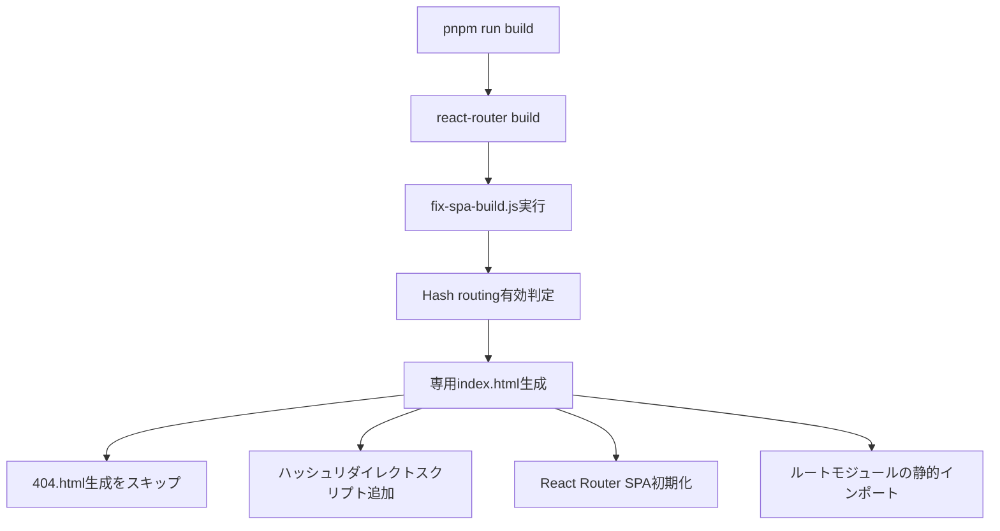
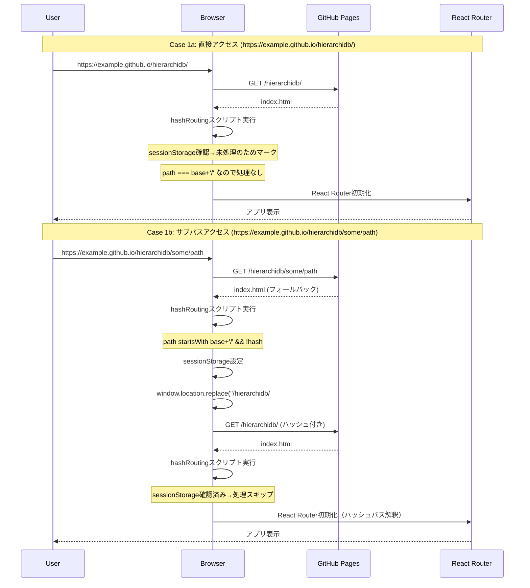
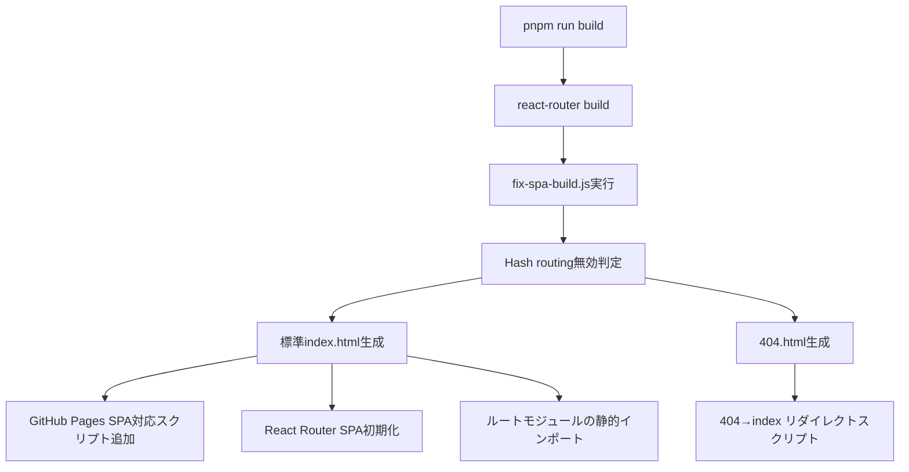
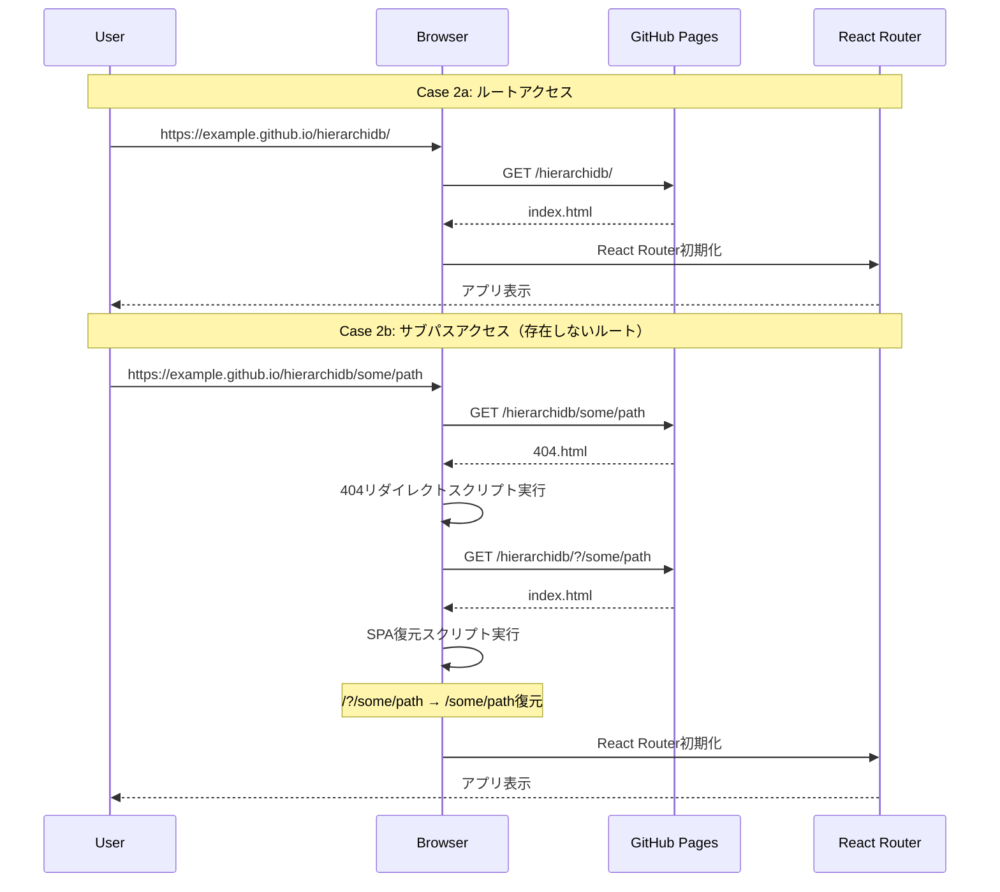
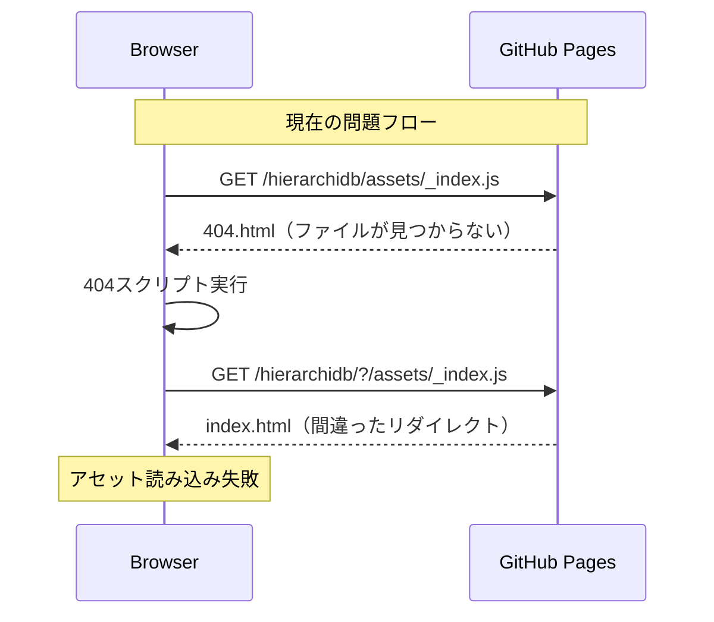

# Hash Routing Flow Documentation

## 概要
HierarchiDBアプリケーションのハッシュルーティング対応について、有効化・無効化それぞれの場合の動作フローを説明します。

## 設定

### 環境変数
- `VITE_USE_HASH_ROUTING`: ハッシュルーティングの有効/無効を制御
  - `'true'` または未設定: ハッシュルーティング有効（デフォルト）
  - `'false'`: ハッシュルーティング無効（ブラウザルーティング）
- `VITE_APP_NAME`: アプリケーションのベースパス（例: 'hierarchidb'）

## ケース1: ハッシュルーティング有効（VITE_USE_HASH_ROUTING !== 'false'）

### ビルド時の動作



### 生成されるindex.html構造

```html
<!DOCTYPE html>
<html lang="en">
<head>
    <script type="text/javascript">
        // 1. Hash routing handler (初回のみ実行)
        // パスベースURL → ハッシュベースURLにリダイレクト
    </script>
</head>
<body>
    <div id="root"></div>
    <script>
        // 2. React Router SPA初期化
        window.__reactRouterContext = { 
            basename: "/hierarchidb/",
            isSpaMode: true
        };
    </script>
    <script type="module">
        // 3. 静的モジュールインポート
        import "/hierarchidb/assets/manifest-xxx.js";
        import * as route0 from "/hierarchidb/assets/root.js";
        import * as indexRoute from "/hierarchidb/assets/_index.js";
        
        window.__reactRouterRouteModules = {
            "root": route0,
            "routes/_index": indexRoute
        };
    </script>
</body>
</html>
```

### 実行時の動作フロー



## ケース2: ハッシュルーティング無効（VITE_USE_HASH_ROUTING === 'false'）

### ビルド時の動作



### 実行時の動作フロー



## 現在の問題点と解決策

### 問題: アセットファイルアクセス時の404.html実行



### 解決策

1. **404.htmlを削除**: ハッシュルーティングでは不要
2. **アセットパスの検証**: fix-spa-build.jsでアセットファイル存在確認
3. **ビルド後検証**: 必要なアセットファイルが正しく生成されているか確認

## 設定変更手順

### ハッシュルーティング有効化
```bash
# .env.production
VITE_USE_HASH_ROUTING=true  # または未設定
```

### ハッシュルーティング無効化
```bash
# .env.production
VITE_USE_HASH_ROUTING=false
```

### ビルド・デプロイ
```bash
pnpm run build  # 設定に応じたindex.html/404.html生成
```

## トラブルシューティング

### ハッシュルーティング有効時のチェック項目
- [ ] 404.htmlが生成されていない
- [ ] index.htmlにハッシュリダイレクトスクリプトが含まれている  
- [ ] 必要なアセットファイル（manifest-*.js, _index.js等）が存在する
- [ ] React Router contextの設定が正しい

### ハッシュルーティング無効時のチェック項目  
- [ ] 404.htmlが生成されている
- [ ] 404.htmlにSPAリダイレクトスクリプトが含まれている
- [ ] index.htmlにSPA復元スクリプトが含まれている