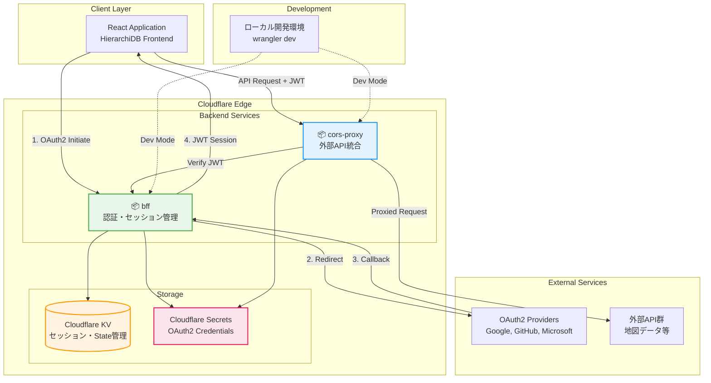

# Backend Services

HierarchiDB のサーバーサイド機能を提供するCloudflare Workers基盤のマイクロサービス群です。認証・認可システムとCORS対応APIプロキシを通じて、セキュアなクライアント-サーバー間通信を実現します。

## サービス概要

### 🔐 [@hierarchidb/bff](./bff/)
**Backend for Frontend - 認証・セッション管理サービス**

- **役割**: OAuth2/OIDC認証プロバイダーとの統合・セッションJWT管理
- **実装**: Cloudflare Workers + Hono フレームワーク
- **認証プロバイダー**:
  - Google OAuth2 + PKCE
  - GitHub OAuth2  
  - Microsoft OAuth2 + PKCE
  - OpenID Connect Discovery サポート
- **技術スタック**: Hono、JOSE（JWT）、Turnstile（ボット対策）

### 🌐 [@hierarchidb/cors-proxy](./cors-proxy/)
**CORS Proxy - 外部API統合サービス**

- **役割**: 外部API呼び出し時のCORS制限回避・認証統合
- **実装**: Cloudflare Workers + Hono フレームワーク  
- **特徴**:
  - セキュアなJWT検証
  - リクエスト・レスポンスの透過的プロキシ
  - レート制限・エラーハンドリング
- **用途**: 地図データAPI、外部データソースアクセス

## アーキテクチャ



## 認証システム詳細

### OAuth2 + PKCE フロー

**BFFサービス**は複数のOAuth2プロバイダーとPKCE（Proof Key for Code Exchange）セキュリティ拡張をサポート:

```typescript
// 認証フロー例（Google OAuth2 + PKCE）
const authFlow = {
  // Step 1: 認証開始
  'GET /auth/google/authorize': {
    parameters: ['code_challenge', 'code_challenge_method', 'scope', 'state'],
    response: 'redirect to Google OAuth2 endpoint'
  },
  
  // Step 2: コールバック処理  
  'GET /auth/callback': {
    parameters: ['code', 'state'],
    response: 'redirect to client with authorization code'
  },
  
  // Step 3: トークン交換
  'POST /auth/token': {
    body: ['code', 'code_verifier'],
    response: 'JWT session token + user info'
  }
};
```

### セッション管理

```typescript
// JWT セッショントークンの構造
interface SessionPayload {
  sub: string;        // User ID
  email: string;      // Email address  
  name: string;       // Display name
  picture: string;    // Avatar URL
  provider: 'google' | 'github' | 'microsoft';
  iat: number;        // Issued at
  exp: number;        // Expires at
  iss: string;        // Issuer
}
```

### OpenID Connect Discovery

**react-oidc-context** 統合のための標準的なOIDC Discovery エンドポイント:

```json
// GET /.well-known/openid-configuration
{
  "issuer": "https://your-bff-worker.workers.dev",
  "authorization_endpoint": "https://your-bff-worker.workers.dev/auth/authorize",
  "authorization_endpoints": {
    "google": "https://your-bff-worker.workers.dev/auth/google/authorize",
    "github": "https://your-bff-worker.workers.dev/auth/github/authorize",
    "microsoft": "https://your-bff-worker.workers.dev/auth/microsoft/authorize"
  },
  "token_endpoint": "https://your-bff-worker.workers.dev/auth/token",
  "userinfo_endpoint": "https://your-bff-worker.workers.dev/auth/userinfo",
  "code_challenge_methods_supported": ["S256"],
  "providers_supported": ["google", "github", "microsoft"]
}
```

## CORS Proxy システム

### プロキシ機能

```typescript
// CORS Proxy の典型的な使用パターン
const proxyRequest = {
  endpoint: 'https://cors-proxy-worker.workers.dev/proxy',
  headers: {
    'Authorization': 'Bearer <jwt-session-token>',
    'X-Target-URL': 'https://external-api.example.com/data',
    'X-Target-Method': 'GET'
  }
};

// プロキシされたレスポンス
{
  data: { /* 外部APIからの実際のデータ */ },
  headers: { /* 必要なCORSヘッダーが追加される */ },
  status: 200
}
```

### セキュリティ機能

1. **JWT検証**: BFFサービス発行のJWTトークン必須
2. **オリジン検証**: 許可されたドメインからのみアクセス可能
3. **レート制限**: API乱用防止
4. **ヘッダーフィルタリング**: セキュリティヘッダーの適切な処理

## 技術スタック

### Cloudflare Workers プラットフォーム
- **ランタイム**: V8 Isolates（Node.js 互換）
- **エッジコンピューティング**: 世界中のエッジロケーションでの低レイテンシ実行
- **スケーラビリティ**: 自動スケーリング・ゼロコールドスタート

### フレームワーク・ライブラリ
- **Hono**: 高速・軽量Web フレームワーク
- **JOSE**: JWT作成・検証ライブラリ（ES2022 準拠）
- **@cloudflare/workers-types**: TypeScript型定義

### ストレージ・セキュリティ
- **Cloudflare KV**: 分散キーバリューストレージ（セッション管理）
- **Cloudflare Secrets**: 暗号化された環境変数管理
- **Turnstile**: Cloudflareのボット対策ソリューション

## 開発・デプロイメント

### ローカル開発環境

```bash
# BFFサービス開発
cd packages/backend/bff
wrangler dev

# CORS Proxyサービス開発
cd packages/backend/cors-proxy  
wrangler dev

# シークレット設定（開発環境）
wrangler secret put GOOGLE_CLIENT_SECRET --env development
wrangler secret put JWT_SECRET --env development
```

### 環境設定

**BFFサービス環境変数:**
```bash
# OAuth2 設定
GOOGLE_CLIENT_ID=your-google-client-id
GOOGLE_CLIENT_SECRET=your-google-client-secret  # Cloudflare Secret
GITHUB_CLIENT_ID=your-github-client-id
GITHUB_CLIENT_SECRET=your-github-client-secret  # Cloudflare Secret

# JWT設定  
JWT_SECRET=your-jwt-secret                       # Cloudflare Secret
JWT_ISSUER=https://your-bff-domain.workers.dev
SESSION_DURATION_HOURS=24

# CORS設定
ALLOWED_ORIGINS=http://localhost:4200,https://your-app-domain.com

# セキュリティ
TURNSTILE_SECRET_KEY=your-turnstile-secret      # Cloudflare Secret
```

**CORS Proxy環境変数:**
```bash
# JWT検証
BFF_JWT_SECRET=your-jwt-secret                   # Cloudflare Secret（BFFと同じ）
JWT_ISSUER=https://your-bff-domain.workers.dev

# CORS設定
ALLOWED_ORIGINS=http://localhost:4200,https://your-app-domain.com
```

### デプロイメント設定

```toml
# wrangler.toml（BFF）
name = "hierarchidb-bff"
main = "src/RuntimeWorkerService.ts"
compatibility_date = "2024-08-21"

[env.production]
name = "hierarchidb-bff-prod"
vars = { 
  JWT_ISSUER = "https://hierarchidb-bff-prod.workers.dev",
  ALLOWED_ORIGINS = "https://your-production-domain.com"
}

[[env.production.kv_namespaces]]
binding = "AUTH_KV"
id = "your-production-kv-id"

# Rate limiting
[env.production.limits]
cpu_ms = 50
```

### デプロイコマンド

```bash
# プロダクションデプロイ
cd packages/backend/bff
wrangler deploy --env production

cd packages/backend/cors-proxy
wrangler deploy --env production

# シークレット設定（プロダクション）
wrangler secret put GOOGLE_CLIENT_SECRET --env production
wrangler secret put JWT_SECRET --env production
wrangler secret put TURNSTILE_SECRET_KEY --env production
```

## セキュリティ設計

### 認証・認可
1. **OAuth2 + PKCE**: コード横取り攻撃対策
2. **State Parameter**: CSRF攻撃対策  
3. **HMAC署名**: State改ざん対策
4. **短期セッション**: JWT有効期限管理

### CORS・オリジン制御
1. **動的CORS**: リクエストオリジンベースの制御
2. **許可リスト**: 厳格なドメイン制限
3. **プリフライト対応**: OPTIONS リクエスト適切処理

### レート制限・ボット対策
1. **Turnstile統合**: 人間検証
2. **IP制限**: 異常トラフィック検出
3. **リクエスト制限**: API乱用防止

## 監視・運用

### ログ・メトリクス
```typescript
// 構造化ログ例
console.log(JSON.stringify({
  timestamp: new Date().toISOString(),
  level: 'info',
  service: 'bff',
  event: 'oauth_success',
  userId: payload.sub,
  provider: 'google',
  duration: Date.now() - startTime
}));
```

### エラーハンドリング
- **認証エラー**: 401 Unauthorized（詳細なエラー情報非公開）
- **設定エラー**: 501 Not Implemented（未設定プロバイダー）
- **サーバーエラー**: 500 Internal Server Error（ログ記録・アラート）

### パフォーマンス監視
- **レスポンス時間**: OAuth2フロー完了時間監視
- **エラー率**: 認証失敗率・プロキシエラー率  
- **スループット**: 同時認証数・プロキシリクエスト数

## トラブルシューティング

### よくある問題

**1. CORS エラー**
```bash
# 原因: ALLOWED_ORIGINSの設定不備
# 解決: wrangler secretでORIGINS設定確認
wrangler secret list
```

**2. JWT検証失敗**
```bash  
# 原因: BFFとCORS ProxyのJWT_SECRETが異なる
# 解決: 同一シークレット設定確認
wrangler secret put JWT_SECRET --env production
```

**3. OAuth2コールバックエラー**
```bash
# 原因: プロバイダー側のRedirect URI設定不一致
# 解決: Google/GitHub/Microsoft側の設定確認
# 正しいURI: https://your-bff-worker.workers.dev/auth/google/callback
```

### デバッグ手順
1. **wrangler tail**: リアルタイムログ監視
2. **Cloudflare Dashboard**: リクエスト・エラー統計確認
3. **Browser DevTools**: Network タブでHTTPフロー確認

## 関連ドキュメント

- [認証システム](../../docs/9-oauth-auth.md)
- [基盤モジュール](../../docs/5-base-module.md)
- [開発ガイドライン](../../docs/4-development-guidelines.md)
- [Cloudflare Workers Documentation](https://developers.cloudflare.com/workers/)