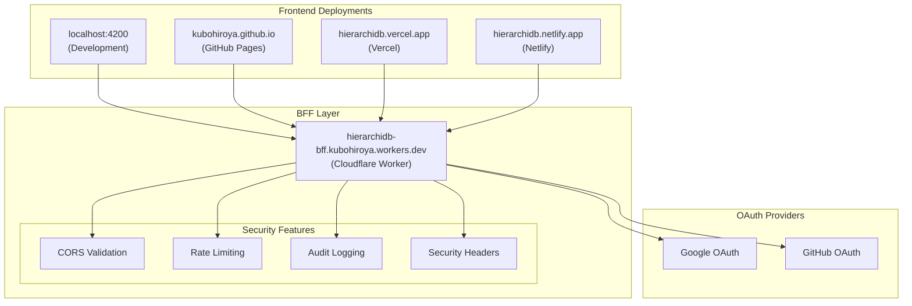
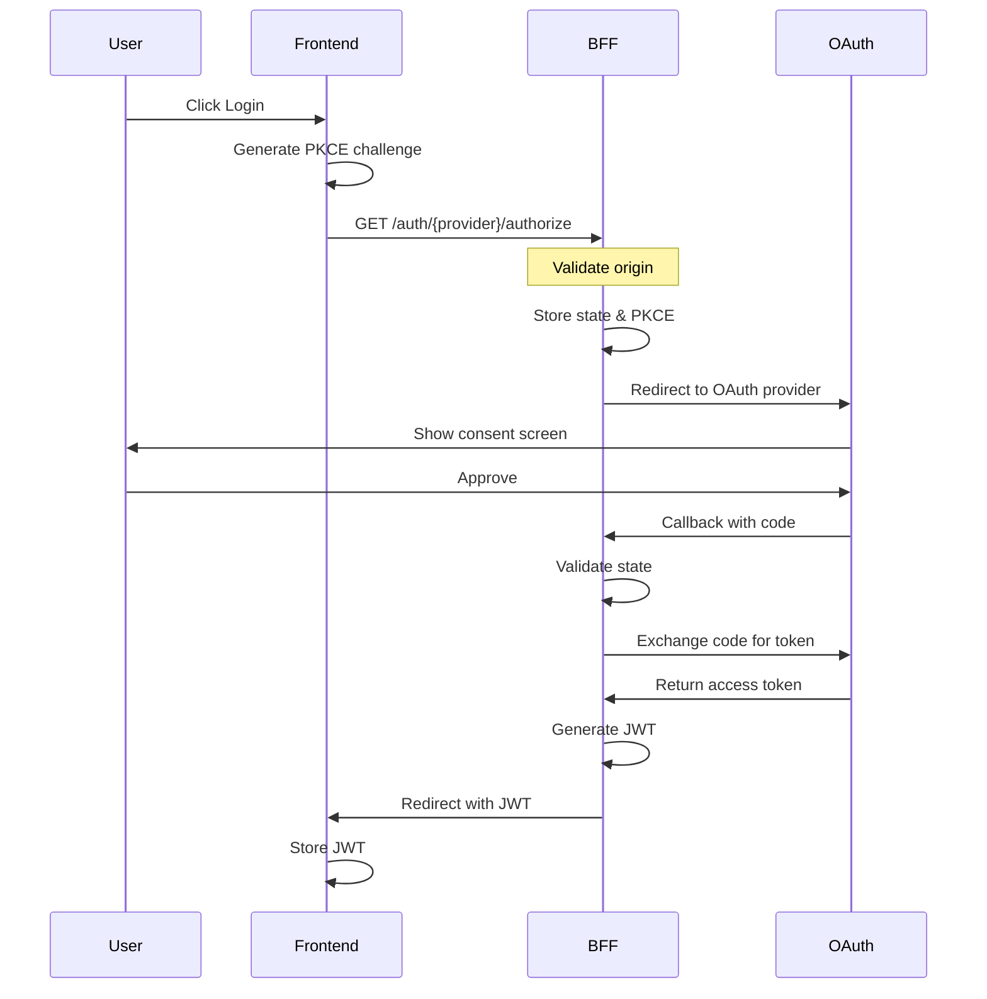

# HierarchiDB BFF Specification

## Architecture Overview

HierarchiDB BFF (Backend for Frontend) is a Cloudflare Workers-based authentication service that implements a **single BFF, multiple frontends** architecture. This design enables centralized authentication management while supporting multiple deployment targets.



## Core Features

### 1. Multi-Origin Support

The BFF validates and accepts requests from multiple trusted origins:

- **Development**: `http://localhost:4200`, `http://localhost:5173`
- **Production**: 
  - `https://kubohiroya.github.io`
  - `https://hierarchidb.vercel.app`
  - `https://hierarchidb.netlify.app`

### 2. Environment-Aware Configuration

The BFF automatically detects the request origin and applies appropriate settings:

| Setting | Development | Production |
|---------|-------------|------------|
| JWT Expiry | 24 hours | 2 hours |
| Rate Limit | 100 req/min | 20 req/min |
| Log Level | debug | warn |
| Security Headers | Basic | Strict |

### 3. Security Layers

#### Origin Validation
- Strict whitelist of allowed origins
- Automatic CORS header configuration
- Request rejection for unauthorized origins

#### Rate Limiting
- Per-IP rate limiting using Cloudflare KV
- Environment-specific limits
- Automatic reset windows (60 seconds)

#### Audit Logging
- Comprehensive logging of authentication events
- Suspicious activity detection
- KV-based log storage with TTL

#### Security Headers
- Content Security Policy (CSP)
- XSS Protection
- Frame Options
- Content Type Options

## OAuth2 Flow Implementation

### Authorization Flow with PKCE



### Supported OAuth Providers

#### Google OAuth
- OAuth 2.0 with PKCE support
- Required scopes: `openid`, `profile`, `email`
- Token endpoint: `https://oauth2.googleapis.com/token`
- User info endpoint: `https://www.googleapis.com/oauth2/v2/userinfo`

#### GitHub OAuth
- OAuth 2.0 (no PKCE)
- Required scopes: `user:email`
- Token endpoint: `https://github.com/login/oauth/access_token`
- User info endpoint: `https://api.github.com/user`

## API Endpoints

### Authentication Endpoints

| Endpoint | Method | Description |
|----------|--------|-------------|
| `/auth/{provider}/authorize` | GET | Initiate OAuth flow |
| `/auth/{provider}/callback` | GET | Handle OAuth callback |
| `/auth/token` | POST | Exchange code for JWT |
| `/auth/userinfo` | GET | Get user information |
| `/auth/verify` | POST | Verify JWT token |
| `/auth/refresh` | POST | Refresh JWT token |
| `/auth/logout` | POST | Invalidate session |

### Health & Discovery

| Endpoint | Method | Description |
|----------|--------|-------------|
| `/health` | GET | Health check |
| `/.well-known/openid-configuration` | GET | OpenID Connect discovery |

## JWT Token Structure

### Token Claims

```json
{
  "sub": "user-unique-id",
  "email": "user@example.com",
  "name": "User Name",
  "picture": "https://example.com/photo.jpg",
  "provider": "google",
  "iss": "hierarchidb-bff",
  "iat": 1234567890,
  "exp": 1234567890,
  "aud": "hierarchidb"
}
```

### Token Security

- **Signing Algorithm**: HS256
- **Secret Storage**: Cloudflare Secrets
- **Rotation Policy**: Quarterly rotation recommended
- **Expiry**: Environment-specific (2-24 hours)

## Configuration

### Environment Variables

#### Required Variables

| Variable | Description | Example |
|----------|-------------|---------|
| `GOOGLE_CLIENT_ID` | Google OAuth client ID | `123456.apps.googleusercontent.com` |
| `GOOGLE_CLIENT_SECRET` | Google OAuth client secret | Stored as secret |
| `JWT_SECRET` | JWT signing secret | Generated with `openssl rand -base64 32` |
| `JWT_ISSUER` | JWT issuer identifier | `hierarchidb-bff` |
| `ALLOWED_ORIGINS` | Comma-separated allowed origins | `http://localhost:4200,https://kubohiroya.github.io` |

#### Optional Variables

| Variable | Description | Default |
|----------|-------------|---------|
| `GITHUB_CLIENT_ID` | GitHub OAuth client ID | - |
| `GITHUB_CLIENT_SECRET` | GitHub OAuth client secret | - |
| `SESSION_DURATION_HOURS` | Session duration | `48` |
| `ENABLE_RATE_LIMIT` | Enable rate limiting | `true` |
| `RATE_LIMIT_PER_MINUTE` | Requests per minute | `30` |
| `ENABLE_AUDIT_LOG` | Enable audit logging | `true` |
| `LOG_LEVEL` | Logging level | `info` |

### KV Namespaces

| Namespace | Binding | Purpose |
|-----------|---------|---------|
| RATE_LIMIT | `RATE_LIMIT_KV` | Rate limiting data |
| AUDIT_LOG | `AUDIT_LOG_KV` | Audit logs |
| SESSION | `SESSION_KV` | Session storage |

## Security Considerations

### CORS Policy

```typescript
// Allowed origins are strictly validated
const allowedOrigins = [
  "http://localhost:4200",
  "https://kubohiroya.github.io",
  "https://hierarchidb.vercel.app",
  "https://hierarchidb.netlify.app"
];

// Only exact matches are allowed
if (!allowedOrigins.includes(origin)) {
  return new Response("Forbidden", { status: 403 });
}
```

### Content Security Policy

```
default-src 'self';
script-src 'self' 'unsafe-inline' 'unsafe-eval';
style-src 'self' 'unsafe-inline';
img-src 'self' data: https:;
font-src 'self' data:;
connect-src 'self' https://hierarchidb-bff.kubohiroya.workers.dev;
frame-ancestors 'none';
```

### Rate Limiting Strategy

```typescript
// Per-IP rate limiting
const limits = {
  development: { perMinute: 100, perHour: 1000 },
  production: { perMinute: 20, perHour: 300 }
};

// Exponential backoff for repeated failures
if (failureCount > 5) {
  blockDuration = Math.min(3600, 60 * Math.pow(2, failureCount - 5));
}
```

## Error Handling

### Error Response Format

```json
{
  "error": "invalid_request",
  "error_description": "The request is missing a required parameter",
  "error_uri": "https://docs.hierarchidb.com/errors#invalid_request"
}
```

### Common Error Codes

| Code | Description | HTTP Status |
|------|-------------|-------------|
| `invalid_request` | Missing or invalid parameters | 400 |
| `unauthorized_client` | Client not authorized | 401 |
| `access_denied` | Resource access denied | 403 |
| `unsupported_response_type` | Response type not supported | 400 |
| `invalid_scope` | Invalid scope requested | 400 |
| `server_error` | Internal server error | 500 |
| `temporarily_unavailable` | Service temporarily unavailable | 503 |

## Performance Optimization

### Caching Strategy

- **Static Assets**: Cached at CDN edge (1 hour)
- **User Info**: Cached in KV (5 minutes)
- **OAuth Config**: Cached in memory (1 hour)

### Response Times

| Operation | Target | Maximum |
|-----------|--------|---------|
| Health Check | < 50ms | 100ms |
| OAuth Redirect | < 100ms | 200ms |
| Token Exchange | < 500ms | 1000ms |
| User Info | < 200ms | 500ms |

## Monitoring & Observability

### Metrics to Track

- Authentication success/failure rates
- Average response times
- Rate limit violations
- Origin distribution
- Provider usage distribution

### Logging Levels

| Level | Usage |
|-------|-------|
| `debug` | Detailed debugging information |
| `info` | General informational messages |
| `warn` | Warning messages |
| `error` | Error messages |

### Audit Log Format

```json
{
  "timestamp": "2025-08-25T10:00:00Z",
  "type": "auth_success",
  "userId": "user-123",
  "email": "user@example.com",
  "provider": "google",
  "origin": "https://kubohiroya.github.io",
  "environment": "production",
  "ip": "192.168.1.1",
  "userAgent": "Mozilla/5.0...",
  "level": "info"
}
```

## Testing Strategy

### Unit Tests
- JWT generation and validation
- CORS validation logic
- Rate limiting calculations
- Security header generation

### Integration Tests
- OAuth flow with mock providers
- Token exchange process
- Session management
- Error handling

### E2E Tests
- Complete authentication flow
- Multi-origin support
- Rate limiting behavior
- Security header validation

## Future Enhancements

### Planned Features

1. **Additional OAuth Providers**
   - Microsoft/Azure AD
   - Apple Sign In
   - SAML 2.0 support

2. **Advanced Security**
   - Web Application Firewall (WAF)
   - DDoS protection
   - Behavioral analysis

3. **Performance**
   - Cloudflare Durable Objects for sessions
   - Response caching optimization
   - Geographic routing

4. **Observability**
   - Cloudflare Analytics integration
   - Custom dashboards
   - Real-time alerting