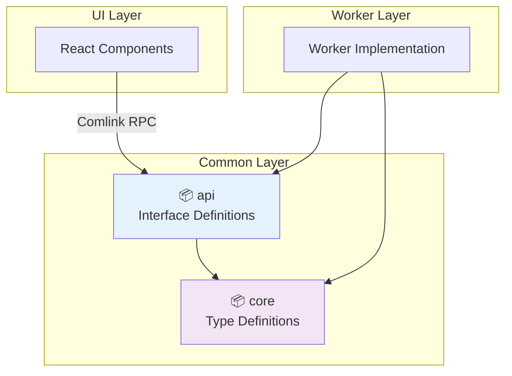

# Common Packages

HierarchiDB の基盤となる共通ライブラリ群です。UI層とWorker層の境界を定義し、プロジェクト全体で使用される型定義とインターフェースを提供します。

## パッケージ概要

### 📦 [@hierarchidb/core](./core/)
**基本データモデル・型定義パッケージ**

- **役割**: プロジェクト全体で共通する型定義、列挙型、基本パターン
- **特徴**: 
  - ランタイム依存なし（純粋TypeScript）
  - ブランド型システムによる型安全性
  - ツリー構造データモデル
  - プラグインシステム基盤型
- **利用例**: `NodeId`, `TreeId`, `TreeNode`, `PluginDefinition`

### 📦 [@hierarchidb/api](./api/)
**UI-Worker間通信インターフェース**

- **役割**: UI層とWorker層をComlink RPC経由で接続するためのインターフェース定義
- **特徴**:
  - Comlink対応型定義
  - Worker API契約
  - プラグインAPI拡張ポイント
  - 非同期処理対応
- **利用例**: `WorkerAPI`, `PluginAPI`, `TreeQueryAPI`

## アーキテクチャ



## 依存関係

### 依存パッケージ
```
api → core
(他パッケージはすべてこれらに依存)
```

### 被依存パッケージ
- **runtime/worker**: データベース操作実装
- **ui系全パッケージ**: UIコンポーネント実装
- **plugin系全パッケージ**: プラグイン実装

## 開発ガイドライン

### 型定義の追加
```typescript
// core/src/types/RuntimeWorkerService.ts
export interface NewEntity {
  id: EntityId;
  name: string;
  createdAt: number;
}
```

### API インターフェースの追加
```typescript
// api/src/NewAPI.ts
export interface NewAPI {
  createEntity(data: Partial<NewEntity>): Promise<NewEntity>;
  getEntity(id: EntityId): Promise<NewEntity | null>;
}
```

## 設計方針

1. **Pure TypeScript**: coreパッケージはランタイム依存を持たない
2. **Interface First**: 実装前にインターフェースを定義
3. **Brand Types**: 型安全性のためブランド型を積極利用
4. **Backward Compatibility**: 破壊的変更時は@deprecatedで移行期間設定

## 関連ドキュメント

- [アーキテクチャ詳細](../../docs/5-base-module.md)
- [プラグインシステム](../../docs/6-plugin-modules.md)
- [API設計](../../docs/7-aop-architecture.md)