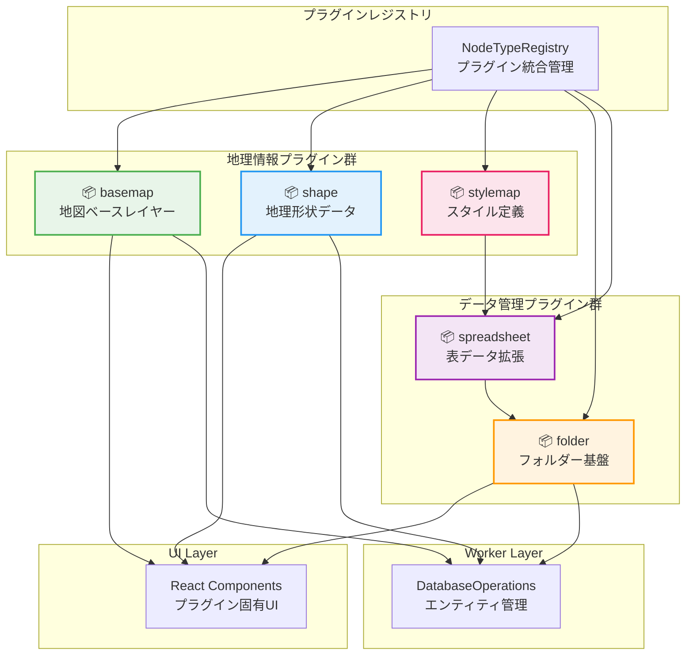

# Node Type Plugin Packages

HierarchiDB のノードタイプ拡張を実現するプラグインパッケージ群です。地理情報システム、データ管理、フォルダ構造管理など、様々なドメインに特化したノードタイプを提供します。

## パッケージ概要

### 🗺️ [@hierarchidb/node-type-basemap-plugin](./basemap/)
**地理的ベースレイヤープラグイン**

- **機能**: MapLibreGL JSを使用した地図の基本レイヤー設定・管理
- **アーキテクチャ**: 3層アーキテクチャ（shared/ui/worker）
- **特徴**:
  - 地図スタイルプリセット管理
  - ビューポート状態の保持
  - リアルタイムプレビュー
  - MapLibreGL統合
- **エクスポート**: UI/Worker分離による効率的な型安全性

### 📊 [@hierarchidb/node-type-shape-plugin](./shape/)
**地理形状データ管理プラグイン**

- **機能**: GeoJSON、TopoJSONベースの地理的形状データの管理
- **特徴**:
  - ベクトルタイル生成・最適化
  - Turf.jsによる地理的演算
  - 大容量データの段階的読み込み
  - 国・地域選択UI統合
- **処理能力**: 
  - データ圧縮（pako）
  - ジオハッシュインデックス
  - LRU分割ビューによる効率的表示

### 📁 [@hierarchidb/node-type-folder-plugin](./folder/)
**拡張可能フォルダープラグイン**

- **機能**: 階層的フォルダー構造と他プラグインへの拡張基盤
- **拡張システム**:
  - `ExtensibleFolderHandler` - プラグイン拡張API
  - `FolderExtensionRegistry` - 拡張プラグイン管理
  - `BaseFolderPlugin` - 拡張プラグインの基底クラス
- **特徴**:
  - マルチステップダイアログ拡張
  - エンティティフィールド動的追加
  - カスタムバリデーション統合

### 📈 [@hierarchidb/node-type-spreadsheet-plugin](./spreadsheet/)
**スプレッドシート拡張プラグイン**

- **機能**: フォルダープラグインを継承したデータソース管理
- **実装状況**: 開発中（extension定義完成）
- **特徴**:
  - CSV/TSV/Excelファイル対応
  - データソース選択（ファイル/URL/手動入力）
  - 行・列フィルタリング機能
  - フォルダー基盤の階層管理継承

### 🎨 [@hierarchidb/node-type-stylemap-plugin](./stylemap/)
**スタイルマップ設定プラグイン**

- **機能**: CSVデータに基づく地図スタイル定義
- **特徴**:
  - スタイルルール設定
  - カラーマップ管理
  - MapLibreGLスタイル統合
- **データ統合**: スプレッドシートプラグインとの連携

## アーキテクチャ



## 技術スタック

### 共通基盤
- **TypeScript**: 厳密な型安全性
- **Branded Types**: ID型システム（NodeId, EntityId等）
- **Comlink RPC**: UI-Worker間通信
- **Dexie.js**: IndexedDBラッパー

### UI技術
- **React 18+**: コンポーネントベースUI
- **Material-UI v5/6**: UIコンポーネントライブラリ
- **TanStack Virtual**: 大容量データ仮想化
- **Allotment**: 分割ペインレイアウト

### 地理情報処理
- **MapLibreGL JS**: 地図レンダリングエンジン
- **Turf.js**: 地理的演算ライブラリ
- **GeoJSON/TopoJSON**: 地理データ標準
- **Vector Tiles**: 効率的地図データ配信

### データ処理
- **pako**: データ圧縮
- **pbf**: Protocol Buffersデコーダ
- **csv-parser**: CSVデータ処理

## プラグイン開発パターン

### 基本プラグイン構造
```typescript
// プラグイン定義例（BaseMapプラグイン）
export const BaseMapDefinition: NodeTypeDefinition<BaseMapEntity, never, BaseMapWorkingCopy> = {
  nodeType: 'basemap',
  name: 'BaseMap Plugin',
  
  // データベーススキーマ
  database: {
    entityStore: 'basemaps',
    schema: { /* Dexieスキーマ */ },
    version: 1
  },
  
  // エンティティハンドラー
  entityHandler: new BaseMapEntityHandler(),
  
  // ライフサイクルフック
  lifecycle: {
    afterCreate: async (node, context) => { /* 初期化処理 */ },
    beforeDelete: async (node, context) => { /* クリーンアップ */ }
  },
  
  // UI統合
  ui: {
    dialogComponent: BaseMapDialog,
    panelComponent: BaseMapPanel
  }
};
```

### 3層アーキテクチャ実装
```typescript
// メインエクスポート（index.ts）
export * from './shared';  // 型定義、定数、ユーティリティ
export * as UI from './ui';        // UI環境専用
export * as Worker from './worker'; // Worker環境専用

// 使用例
import { BaseMapEntity } from '@hierarchidb/node-type-basemap-plugin';
import { UI } from '@hierarchidb/node-type-basemap-plugin';
import { Worker } from '@hierarchidb/node-type-basemap-plugin';
```

### プラグイン拡張パターン
```typescript
// フォルダープラグイン拡張例（SpreadsheetPlugin）
export const SpreadsheetExtension: ExtendableNodeTypeDefinition<
  FolderEntity,
  SpreadsheetEntity, 
  SpreadsheetWorkingCopy
> = {
  extends: 'folder',  // 基底プラグイン指定
  nodeType: 'spreadsheet',
  
  // 追加UIステップ
  extendedSteps: [
    {
      stepNumber: 2,
      title: 'データソース選択',
      component: DataSourceStep,
      validation: { /* バリデーションロジック */ }
    }
  ],
  
  // 追加フィールド定義  
  extendedFields: [
    {
      name: 'dataSource',
      type: 'object',
      required: true,
      schema: { /* フィールドスキーマ */ }
    }
  ]
};
```

## 開発ガイドライン

### 新規プラグイン開発手順

1. **プラグイン構造作成**
   ```bash
   cd packages/node-type-plugin/
   mkdir my-plugin
   cd my-plugin
   npm init -y
   ```

2. **パッケージ設定**
   ```json
   // package.json
   {
     "name": "@hierarchidb/node-type-my-plugin",
     "type": "module",
     "main": "dist/index.js",
     "types": "dist/index.d.ts",
     "dependencies": {
       "@hierarchidb/common-core": "workspace:*",
       "@hierarchidb/common-api": "workspace:*",
       "@hierarchidb/ui-core": "workspace:*"
     }
   }
   ```

3. **型定義実装**
   ```typescript
   // src/types/MyEntity.ts
   export interface MyEntity extends BaseEntity {
     id: EntityId;
     nodeId: NodeId;
     customField: string;
     // ... カスタムフィールド
   }
   ```

4. **エンティティハンドラー実装**
   ```typescript
   // src/handlers/MyEntityHandler.ts
   export class MyEntityHandler extends BaseEntityHandler<MyEntity> {
     async createEntity(nodeId: NodeId, data: Partial<MyEntity>): Promise<MyEntity> {
       // エンティティ作成ロジック
     }
   }
   ```

5. **UI コンポーネント実装**
   ```typescript
   // src/components/MyDialog.tsx
   export function MyDialog({ nodeId, onClose }: MyDialogProps) {
     // プラグイン固有のダイアログUI
   }
   ```

6. **プラグイン登録**
   ```typescript
   // アプリケーション初期化
   import { MyPlugin } from '@hierarchidb/node-type-my-plugin';
   
   NodeTypeRegistry.getInstance().register(MyPlugin);
   ```

### テスト戦略

```typescript
// プラグインテスト例
describe('MyPlugin', () => {
  beforeEach(async () => {
    // fake-indexeddb初期化
    // プラグイン登録
  });
  
  it('should create entity correctly', async () => {
    const nodeId = 'test-node' as NodeId;
    const entity = await handler.createEntity(nodeId, { customField: 'test' });
    
    expect(entity.nodeId).toBe(nodeId);
    expect(entity.customField).toBe('test');
  });
});
```

### パフォーマンス最適化

1. **遅延読み込み**
   ```typescript
   // UIコンポーネントの遅延読み込み
   const MyDialog = lazy(() => import('./components/MyDialog'));
   ```

2. **メモ化**
   ```typescript
   // 計算コストの高い処理
   const processedData = useMemo(() => 
     expensiveProcessing(rawData), [rawData]
   );
   ```

3. **仮想化**
   ```typescript
   // 大容量リスト表示
   import { useVirtualizer } from '@tanstack/react-virtual';
   ```

## 依存関係管理

### パッケージ間依存
```
基盤:
- common-core (型定義)
- common-api (インターフェース)
- ui-core (UI基盤)

拡張:
- folder → spreadsheet (継承関係)
- spreadsheet → stylemap (データ連携)

統合:
- すべて → NodeTypeRegistry (登録)
```

### 外部ライブラリ
- 地理情報: MapLibreGL, Turf.js
- データ処理: pako, pbf, csv-parser  
- UI: Material-UI, TanStack Virtual
- テスト: Vitest, Testing Library

## 配布・運用

### ビルド設定
```json
// tsup.config.ts（共通設定）
export default {
  entry: ['src/index.ts'],
  format: ['esm'],
  dts: true,
  clean: true,
  external: ['react', '@mui/material']
};
```

### npm パッケージ配布
```bash
# プラグインビルド
pnpm build

# パッケージ公開
npm publish --access public
```

### プラグイン管理
- バージョン互換性チェック
- 依存関係解決
- 動的プラグインローディング（将来計画）

## 関連ドキュメント

- [プラグインシステム](../../docs/6-plugin-modules.md)
- [AOPアーキテクチャ](../../docs/7-aop-architecture.md)  
- [基盤モジュール](../../docs/5-base-module.md)
- [開発ガイドライン](../../docs/4-development-guidelines.md)