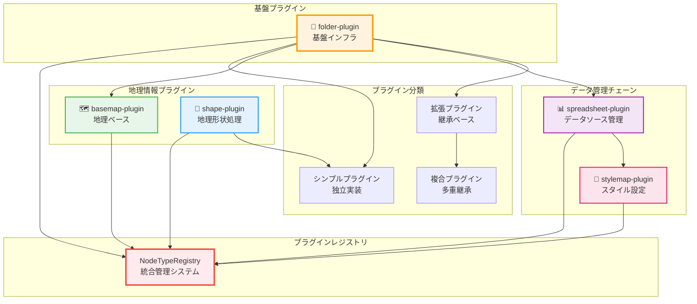

# HierarchiDB Node Type Plugin System

HierarchiDBの拡張可能なノードタイププラグインシステムです。地理情報処理、データ管理、階層構造管理など、様々なドメインに特化したノードタイプを提供し、アプリケーションの機能を拡張します。

## 🏗️ アーキテクチャ概要

### プラグインシステムの特徴

| 特徴 | 説明 | 実装レベル |
|------|------|-----------|
| **UI/Worker分離** | ComlinK RPCによる完全な層分離 | ✅ 完成 |
| **型安全性** | TypeScript Branded Typesによる厳密な型管理 | ✅ 完成 |
| **動的登録** | 実行時プラグイン登録・管理 | ✅ 完成 |
| **拡張システム** | 基盤プラグインを継承した拡張パターン | ✅ 完成 |
| **ライフサイクル** | プラグインレベルのライフサイクルフック | ✅ 完成 |
| **依存管理** | プラグイン間依存関係の自動解決 | ✅ 完成 |
| **データベース抽象化** | Dexie.jsベースの自動スキーマ管理 | ✅ 完成 |

### 3層アーキテクチャ

```
┌─────────────────────────────────────────────────────────────┐
│                    UI Layer (React)                        │
│  ┌──────────────┐ ┌──────────────┐ ┌──────────────────────┐ │
│  │ Plugin Dialog │ │ Plugin Panel │ │ Plugin Icon/Actions  │ │
│  └──────────────┘ └──────────────┘ └──────────────────────┘ │
└─────────────────────────────────────────────────────────────┘
                              ↕ Comlink RPC
┌─────────────────────────────────────────────────────────────┐
│                  Worker Layer (TypeScript)                 │
│  ┌──────────────┐ ┌──────────────┐ ┌──────────────────────┐ │
│  │Entity Handler│ │Lifecycle Hook│ │ Database Operations   │ │
│  └──────────────┘ └──────────────┘ └──────────────────────┘ │
└─────────────────────────────────────────────────────────────┘
                              ↕ Dexie Transaction
┌─────────────────────────────────────────────────────────────┐
│               Database Layer (IndexedDB/Dexie)             │
│  ┌──────────────┐ ┌──────────────┐ ┌──────────────────────┐ │
│  │   CoreDB     │ │ EphemeralDB  │ │   Plugin Databases   │ │
│  └──────────────┘ └──────────────┘ └──────────────────────┘ │
└─────────────────────────────────────────────────────────────┘
```

## 📦 現在のプラグインポートフォリオ

### 基盤プラグイン

#### 📁 [folder-plugin](./folder-plugin/) - **基盤プラグイン**
**階層構造の基礎インフラ**

- **機能**: 階層的フォルダ構造と拡張システム基盤
- **アーキテクチャ**: シンプルプラグイン（UI/Worker分離）
- **拡張システム**:
  - `ExtensibleFolderHandler` - プラグイン拡張API
  - `FolderExtensionRegistry` - 拡張プラグイン管理
  - `BaseFolderPlugin` - 拡張プラグインの基底クラス
- **特徴**:
  - マルチステップダイアログ拡張
  - エンティティフィールド動的追加
  - カスタムバリデーション統合
- **依存関係**: なし（基盤プラグイン）
- **状態**: ✅ プロダクション完成

### データ管理プラグイン

#### 📊 [spreadsheet-plugin](./spreadsheet-plugin/) - **データソース拡張**
**表形式データの統合管理**

- **機能**: CSV/TSV/Excel対応のデータソース管理
- **継承**: folder-plugin → spreadsheet-plugin
- **実装パターン**: Folder拡張プラグイン
- **特徴**:
  - データソース選択（ファイル/URL/手動入力）
  - 行・列フィルタリング機能
  - フォルダ階層管理継承
  - マルチステップフォーム（2ステップ追加）
- **依存関係**: folder-plugin
- **状態**: 🔄 開発中（拡張定義完成、UI実装中）

#### 🎨 [stylemap-plugin](./stylemap-plugin/) - **スタイル設定拡張**
**データ可視化スタイル管理**

- **機能**: CSVデータに基づく地図スタイル定義
- **継承**: folder-plugin → spreadsheet-plugin → stylemap-plugin
- **実装パターン**: Spreadsheet拡張プラグイン
- **特徴**:
  - スタイルルール設定
  - カラーマップ管理
  - MapLibreGLスタイル統合
  - スプレッドシートデータ参照
- **依存関係**: folder-plugin, spreadsheet-plugin
- **状態**: 🔄 開発中（拡張定義完成、UI実装予定）

### 地理情報プラグイン

#### 🗺️ [basemap-plugin](./basemap-plugin/) - **地理ベース拡張**
**地理的ベースレイヤー設定**

- **機能**: MapLibreGL JSベースの地図基盤設定・管理
- **継承**: folder-plugin → basemap-plugin
- **実装パターン**: Folder拡張プラグイン
- **特徴**:
  - 地図スタイルプリセット管理
  - ビューポート状態保持（center, zoom, bearing, pitch）
  - リアルタイムプレビュー
  - MapLibreGL統合
  - マルチステップフォーム（4ステップ追加）
- **依存関係**: folder-plugin
- **状態**: ✅ プロダクション完成（3層分離済み）

#### 📊 [shape-plugin](./shape-plugin/) - **地理形状処理**
**高性能地理データ処理エンジン**

- **機能**: GeoJSON/TopoJSONベースの地理的形状データ管理
- **アーキテクチャ**: 独立プラグイン（フォルダ継承なし）
- **特徴**:
  - ベクトルタイル生成・最適化
  - Turf.jsによる地理的演算
  - 大容量データの段階的読み込み
  - 国・地域選択UI統合
  - Worker Pool並列処理
- **処理能力**:
  - データ圧縮（pako）
  - ジオハッシュインデックス
  - LRU分割ビューによる効率的表示
- **依存関係**: なし（独立プラグイン）
- **状態**: ✅ プロダクション完成（高度最適化済み）

## 🔧 プラグインアーキテクチャ詳細

### プラグイン分類とパターン



### プラグイン定義パターン

#### 1. シンプルプラグイン（独立実装）
```typescript
// 例: folder-plugin, shape-plugin
export const SimplePlugin: PluginDefinition<MyEntity, never, MyWorkingCopy> = {
  nodeType: 'my-plugin',
  name: 'My Plugin',
  entityHandler: new MyEntityHandler(),
  database: { /* スキーマ定義 */ },
  ui: { /* UI設定 */ },
  lifecycle: { /* ライフサイクル */ }
};
```

#### 2. 拡張プラグイン（継承ベース）
```typescript
// 例: basemap-plugin, spreadsheet-plugin
export const ExtendingPlugin: ExtendableNodeTypeDefinition<
  FolderEntity,
  MyExtendedEntity,
  MyWorkingCopy
> = {
  extends: 'folder-plugin',
  nodeType: 'my-extended-plugin',
  
  extendedSteps: [
    { stepNumber: 2, title: '拡張ステップ', component: MyStep }
  ],
  
  extendedFields: [
    { name: 'customField', type: 'string', required: true }
  ],
  
  extendedValidation: {
    extendedRules: { /* カスタムバリデーション */ }
  }
};
```

#### 3. 複合プラグイン（多重継承）
```typescript
// 例: stylemap-plugin（folder → spreadsheet → stylemap）
export const ComplexPlugin: ExtendableNodeTypeDefinition<
  SpreadsheetEntity,
  StyleMapEntity,
  StyleMapWorkingCopy
> = {
  extends: 'spreadsheet-plugin',
  nodeType: 'stylemap-plugin',
  // さらなる拡張定義...
};
```

### データベース統合パターン

#### 自動スキーマ管理
```typescript
export const MyPluginDefinition: PluginDefinition<MyEntity, never, MyWorkingCopy> = {
  database: {
    entityStore: 'my_entities',  // テーブル名
    schema: {                    // Dexieスキーマ
      '&id': 'EntityId',         // 主キー（Branded Type）
      'nodeId': 'NodeId',        // 外部キー
      'name, description': '',   // インデックス付きフィールド
      'createdAt, updatedAt, version': '',
    },
    version: 1                   // スキーマバージョン
  }
};

// 自動的に作成される専用データベース
// - プラグイン登録時に自動作成
// - 依存関係に基づく初期化順序
// - バージョン管理によるマイグレーション
```

#### 依存関係データベースアクセス
```typescript
export class StyleMapEntityHandler extends BaseEntityHandler<StyleMapEntity> {
  async createEntity(nodeId: NodeId, data: Partial<StyleMapEntity>): Promise<StyleMapEntity> {
    // 依存先（Spreadsheet）のデータベースにアクセス
    const registry = NodeDefinitionRegistry.getInstance();
    const spreadsheetDB = registry.getDependencyDatabase('stylemap-plugin', 'spreadsheet-plugin');
    
    if (spreadsheetDB) {
      const spreadsheetTable = spreadsheetDB.getEntityTable();
      const spreadsheetData = await spreadsheetTable.where('nodeId').equals(nodeId).first();
      
      // スプレッドシートデータに基づいてスタイルマップを作成
      data.sourceDataId = spreadsheetData?.id;
    }
    
    return super.createEntity(nodeId, data);
  }
}
```

## 🔧 技術スタック

### コア技術基盤

| 技術 | 用途 | バージョン | 説明 |
|------|------|-----------|------|
| **TypeScript** | 型システム | 5.0+ | 厳密な型安全性、Branded Types |
| **Dexie.js** | データベース | 4.0+ | IndexedDBラッパー、トランザクション管理 |
| **Comlink** | Worker通信 | 4.4+ | 型安全なRPC、プロキシベース通信 |
| **React 18+** | UI基盤 | 18.2+ | コンポーネントベースUI |
| **Material-UI** | UIライブラリ | 5.0+ | UIコンポーネント、テーマシステム |

### 地理情報処理

| 技術 | 用途 | プラグイン | 説明 |
|------|------|-----------|------|
| **MapLibreGL JS** | 地図レンダリング | basemap, shape | オープンソース地図エンジン |
| **Turf.js** | 地理的演算 | shape | 地理空間解析ライブラリ |
| **GeoJSON/TopoJSON** | 地理データ | shape, basemap | 地理データ標準形式 |
| **Vector Tiles** | 地図データ配信 | shape | 効率的地図データ配信 |

### データ処理・最適化

| 技術 | 用途 | プラグイン | 説明 |
|------|------|-----------|------|
| **pako** | データ圧縮 | shape | gzip圧縮・解凍 |
| **pbf** | バイナリ処理 | shape | Protocol Buffersデコーダ |
| **csv-parser** | CSVデータ処理 | spreadsheet | CSVファイル解析 |
| **TanStack Virtual** | 仮想化 | 全UI | 大容量データ仮想化 |

### 開発・テスト

| 技術 | 用途 | 説明 |
|------|------|------|
| **Vitest** | ユニットテスト | 高速テスト実行 |
| **fake-indexeddb** | テスト環境 | IndexedDBモック |
| **Turborepo** | モノレポ管理 | 高速ビルド・キャッシュ |
| **pnpm** | パッケージ管理 | ワークスペース管理 |

## 🚀 プラグイン開発ガイド

### 開発フロー


### 1. 新規プラグイン作成手順

#### ステップ 1: プロジェクト構造作成
```bash
# プラグイン構造作成
cd packages/node-type/
mkdir my-plugin
cd my-plugin

# パッケージ初期化
npm init -y
```

#### ステップ 2: パッケージ設定
```json
// package.json
{
  "name": "@hierarchidb/node-type-my-plugin",
  "version": "1.0.0",
  "type": "module",
  "main": "dist/index.js",
  "types": "dist/index.d.ts",
  "exports": {
    ".": {
      "types": "./dist/index.d.ts",
      "import": "./dist/index.js"
    },
    "./shared": {
      "types": "./dist/shared/index.d.ts",
      "import": "./dist/shared/index.js"
    },
    "./ui": {
      "types": "./dist/ui/index.d.ts", 
      "import": "./dist/ui/index.js"
    },
    "./worker": {
      "types": "./dist/worker/index.d.ts",
      "import": "./dist/worker/index.js"
    }
  },
  "dependencies": {
    "@hierarchidb/common-core": "workspace:*",
    "@hierarchidb/common-type": "workspace:*",
    "@hierarchidb/ui-core": "workspace:*"
  }
}
```

#### ステップ 3: エンティティ型定義
```typescript
// src/shared/types/MyEntity.ts
import type { PeerEntity, EntityId, NodeId } from '@hierarchidb/common-type';

export interface MyEntity extends PeerEntity {
  id: EntityId;
  nodeId: NodeId;
  customField: string;
  // ... その他のカスタムフィールド
}

export interface MyWorkingCopy extends MyEntity {
  isDraft: boolean;
  originalId?: string;
  copiedAt: number;
}
```

#### ステップ 4: エンティティハンドラ実装
```typescript
// src/worker/handlers/MyEntityHandler.ts
import { BaseEntityHandler } from '@hierarchidb/common-core';
import type { MyEntity, MyWorkingCopy } from '../../shared/types/MyEntity';

export class MyEntityHandler extends BaseEntityHandler<MyEntity, never, MyWorkingCopy> {
  async createEntity(nodeId: NodeId, data: Partial<MyEntity>): Promise<MyEntity> {
    const entityId = crypto.randomUUID() as EntityId;
    const entity: MyEntity = {
      id: entityId,
      nodeId: nodeId,
      customField: data.customField || '',
      createdAt: Date.now(),
      updatedAt: Date.now(),
      version: 1,
    };
    
    await this.table.add(entity);
    return entity;
  }

  async updateEntity(id: EntityId, updates: Partial<MyEntity>): Promise<MyEntity> {
    const existing = await this.table.get(id);
    if (!existing) {
      throw new Error(`Entity not found: ${id}`);
    }

    const updated: MyEntity = {
      ...existing,
      ...updates,
      updatedAt: Date.now(),
      version: existing.version + 1,
    };

    await this.table.put(updated);
    return updated;
  }
}
```

#### ステップ 5: プラグイン定義
```typescript
// src/worker/plugin.ts
import type { PluginDefinition } from '@hierarchidb/common-type';
import { MyEntityHandler } from './handlers/MyEntityHandler';
import type { MyEntity, MyWorkingCopy } from '../shared/types/MyEntity';

export const MyPluginDefinition: PluginDefinition<MyEntity, never, MyWorkingCopy> = {
  nodeType: 'my-plugin',
  name: 'My Plugin',
  displayName: 'マイプラグイン',
  
  // エンティティハンドラー
  entityHandler: new MyEntityHandler(),
  
  // データベーススキーマ
  database: {
    entityStore: 'my_entities',
    schema: {
      '&id': 'EntityId',
      'nodeId': 'NodeId',
      'customField': '',
      'createdAt, updatedAt, version': '',
    },
    version: 1
  },
  
  // カテゴリ設定
  category: {
    primary: 'data-management',
    secondary: 'custom',
    treeTypes: ['data-tree']
  },
  
  // ライフサイクルフック
  lifecycle: {
    afterCreate: async (node: TreeNode, context) => {
      console.log(`Created node: ${node.id}`);
    },
    beforeDelete: async (node: TreeNode, context) => {
      // クリーンアップ処理
      await context.cleanupRelatedEntities(node.id);
    }
  }
};
```

#### ステップ 6: UI コンポーネント実装
```typescript
// src/ui/components/MyDialog.tsx
import React, { useState } from 'react';
import { Dialog, DialogTitle, DialogContent, DialogActions, Button, TextField } from '@mui/material';

interface MyDialogProps {
  open: boolean;
  nodeId: NodeId;
  onClose: () => void;
  onSave: (data: { customField: string }) => Promise<void>;
}

export function MyDialog({ open, nodeId, onClose, onSave }: MyDialogProps) {
  const [customField, setCustomField] = useState('');
  
  const handleSave = async () => {
    await onSave({ customField });
    onClose();
  };

  return (
    <Dialog open={open} onClose={onClose} maxWidth="md" fullWidth>
      <DialogTitle>マイプラグイン設定</DialogTitle>
      <DialogContent>
        <TextField
          fullWidth
          label="カスタムフィールド"
          value={customField}
          onChange={(e) => setCustomField(e.target.value)}
          margin="normal"
        />
      </DialogContent>
      <DialogActions>
        <Button onClick={onClose}>キャンセル</Button>
        <Button onClick={handleSave} variant="contained">保存</Button>
      </DialogActions>
    </Dialog>
  );
}
```

#### ステップ 7: エクスポート設定
```typescript
// src/index.ts (メインエクスポート)
export * from './shared';

// src/shared/index.ts
export * from './types/MyEntity';
export * from './constants';

// src/ui/index.ts
export * from './components/MyDialog';
export * from './hooks/useMyEntity';

// src/worker/index.ts
export * from './plugin';
export * from './handlers/MyEntityHandler';
```

### 2. 拡張プラグイン作成（フォルダ継承）

#### 拡張定義パターン
```typescript
// src/extension/definition.ts
import type { FolderEntity } from '@hierarchidb/node-type-folder-plugin';
import type { ExtendableNodeTypeDefinition } from '@hierarchidb/common-type';

interface MyExtendedFields {
  customData: string;
  additionalConfig: Record<string, any>;
}

export interface MyExtendedEntity extends FolderEntity, MyExtendedFields {}

export const MyExtendedPlugin: ExtendableNodeTypeDefinition<
  FolderEntity,
  MyExtendedEntity,
  MyExtendedEntity & { isDraft: boolean }
> = {
  extends: 'folder-plugin',
  nodeType: 'my-extended-plugin',
  name: 'My Extended Plugin',
  displayName: '拡張プラグイン',
  
  // 追加ステップ
  extendedSteps: [
    {
      stepNumber: 2,
      title: 'カスタム設定',
      component: MyCustomStep,
      validation: {
        validate: async (data) => {
          if (!data.customData) {
            return { isValid: false, errors: ['カスタムデータは必須です'] };
          }
          return { isValid: true, errors: [] };
        }
      }
    }
  ],
  
  // 追加フィールド
  extendedFields: [
    {
      name: 'customData',
      type: 'string',
      required: true,
      label: 'カスタムデータ'
    },
    {
      name: 'additionalConfig',
      type: 'object',
      required: false,
      label: '追加設定'
    }
  ],
  
  // 拡張バリデーション
  extendedValidation: {
    extendedRules: {
      customDataRule: {
        validate: (data) => data.customData && data.customData.length > 0,
        message: 'カスタムデータを入力してください'
      }
    },
    chainMode: 'all',
    mergeStrategy: 'append'
  }
};
```

### 3. テスト実装

#### ユニットテスト例
```typescript
// src/__tests__/MyEntityHandler.test.ts
import { describe, it, expect, beforeEach } from 'vitest';
import 'fake-indexeddb/auto';
import { MyEntityHandler } from '../worker/handlers/MyEntityHandler';
import type { MyEntity } from '../shared/types/MyEntity';

describe('MyEntityHandler', () => {
  let handler: MyEntityHandler;
  
  beforeEach(async () => {
    handler = new MyEntityHandler();
    // fake-indexeddb初期化
  });
  
  it('should create entity correctly', async () => {
    const nodeId = 'test-node-123' as NodeId;
    const data = { customField: 'test-value' };
    
    const entity = await handler.createEntity(nodeId, data);
    
    expect(entity.nodeId).toBe(nodeId);
    expect(entity.customField).toBe('test-value');
    expect(entity.id).toBeDefined();
    expect(entity.createdAt).toBeDefined();
  });
  
  it('should update entity correctly', async () => {
    const nodeId = 'test-node-123' as NodeId;
    const entity = await handler.createEntity(nodeId, { customField: 'initial' });
    
    const updated = await handler.updateEntity(entity.id, { customField: 'updated' });
    
    expect(updated.customField).toBe('updated');
    expect(updated.version).toBe(2);
    expect(updated.updatedAt).toBeGreaterThan(entity.updatedAt);
  });
});
```

#### 統合テスト例
```typescript
// src/__tests__/plugin-integration.test.ts
import { describe, it, expect, beforeEach } from 'vitest';
import { NodeTypeRegistry } from '@hierarchidb/runtime-plugin-registry';
import { MyPluginDefinition } from '../worker/plugin';

describe('Plugin Integration', () => {
  let registry: NodeTypeRegistry;
  
  beforeEach(() => {
    registry = new NodeTypeRegistry();
  });
  
  it('should register plugin successfully', async () => {
    await registry.register(MyPluginDefinition);
    
    const registered = registry.get('my-plugin');
    expect(registered).toBeDefined();
    expect(registered?.nodeType).toBe('my-plugin');
  });
  
  it('should handle entity operations', async () => {
    await registry.register(MyPluginDefinition);
    
    const plugin = registry.get('my-plugin');
    const handler = plugin?.entityHandler;
    
    expect(handler).toBeDefined();
    expect(typeof handler?.createEntity).toBe('function');
  });
});
```

### 4. 登録と統合

#### アプリケーション統合
```typescript
// app/src/plugins/registry.ts
import { NodeTypeRegistry } from '@hierarchidb/runtime-plugin-registry';
import { MyPluginDefinition } from '@hierarchidb/node-type-my-plugin/worker';

// プラグイン登録
export async function registerPlugins() {
  const registry = NodeTypeRegistry.getInstance();
  
  // 基盤プラグイン登録
  await registry.register(FolderPluginDefinition);
  
  // カスタムプラグイン登録
  await registry.register(MyPluginDefinition);
  
  console.log('All plugins registered successfully');
}
```

### 5. ビルドとデプロイ

#### ビルド設定
```typescript
// tsup.config.ts
import { defineConfig } from 'tsup';

export default defineConfig([
  // メインビルド
  {
    entry: ['src/index.ts'],
    format: ['esm'],
    dts: true,
    clean: true,
    external: ['react', '@mui/material']
  },
  // UI専用ビルド
  {
    entry: ['src/ui/index.ts'],
    outDir: 'dist/ui',
    format: ['esm'],
    dts: true,
    external: ['react', '@mui/material']
  },
  // Worker専用ビルド
  {
    entry: ['src/worker/index.ts'],
    outDir: 'dist/worker',
    format: ['esm'],
    dts: true,
    external: ['dexie']
  }
]);
```

## 📋 プラグイン機能比較表

| プラグイン | 継承元 | 開発段階 | 主要機能 | UI拡張 | データベース | 特徴的機能 |
|-----------|--------|----------|---------|-------|-----------|-----------|
| **folder-plugin** | - | ✅ 完成 | 階層構造基盤 | シンプルフォーム | - | 拡張システム基盤 |
| **basemap-plugin** | folder | ✅ 完成 | 地図ベース設定 | 4ステップフォーム | basemaps | MapLibreGL統合 |
| **shape-plugin** | - | ✅ 完成 | 地理データ処理 | 複合ダイアログ | shapes | ベクトルタイル生成 |
| **spreadsheet-plugin** | folder | 🔄 開発中 | データソース管理 | 2ステップ拡張 | spreadsheets | CSV/Excel処理 |
| **stylemap-plugin** | spreadsheet | 🔄 開発中 | スタイル定義 | 1ステップ拡張 | stylemaps | カラーマップ |

### 機能成熟度レベル

| レベル | 説明 | 該当プラグイン | 特徴 |
|--------|------|--------------|------|
| **✅ プロダクション完成** | 本格運用可能 | folder, basemap, shape | 全機能実装、テスト完了、最適化済み |
| **🔄 開発中** | 実装進行中 | spreadsheet, stylemap | 基本機能実装、UI開発中 |
| **📋 計画中** | 設計段階 | - | 仕様策定、アーキテクチャ設計 |
| **💡 構想中** | アイデア段階 | - | コンセプト検討、要求分析 |

### 技術的複雑度

| 複雑度 | プラグイン | 理由 | 開発コスト |
|--------|-----------|------|-----------|
| **🟢 シンプル** | folder | 基本的なCRUD操作のみ | 低 |
| **🟡 標準** | basemap, spreadsheet | 拡張フォーム、外部ライブラリ統合 | 中 |
| **🟠 複合** | stylemap | 多重継承、データ連携 | 中高 |
| **🔴 高度** | shape | 大容量データ処理、最適化、並列処理 | 高 |

## 📚 詳細ドキュメント

プラグインシステムの詳細については、以下のドキュメントを参照してください：

- **[アーキテクチャ詳細](./docs/architecture.md)** - システムアーキテクチャ、データフロー、技術的詳細
- **[開発ガイド](./docs/development-guide.md)** - ステップバイステップの開発手順、ベストプラクティス
- **[プラグイン構造](./docs/plugin-structure.md)** - プラグインの内部構造、ファイル組織、コード規約
- **[API リファレンス](./docs/api-reference.md)** - API仕様、インターフェース、型定義

## 🎯 開発ロードマップ

### Phase 1: データ管理プラグイン完成 (2024 Q4)
- **spreadsheet-plugin**: UI実装完了、テスト強化
- **stylemap-plugin**: カラーマップUI実装、MapLibreGL統合

### Phase 2: 高度な地理情報機能 (2025 Q1)
- **route-plugin**: 経路データ管理（道路、鉄道、航路）
- **poi-plugin**: 地点データ管理（空港、港湾、駅）

### Phase 3: データ分析・可視化 (2025 Q2)
- **chart-plugin**: データ可視化・グラフ生成
- **dashboard-plugin**: ダッシュボード・レポート機能

### Phase 4: コラボレーション機能 (2025 Q3)
- **comment-plugin**: ノードコメント・注釈
- **sharing-plugin**: データ共有・権限管理

---

## 🤝 コントリビューション

プラグイン開発への貢献を歓迎します！

1. **Issue報告**: バグレポート、機能要求
2. **プルリクエスト**: コード改善、新機能実装
3. **ドキュメント**: 使用例、チュートリアル作成
4. **テスト**: テストケース追加、品質向上

詳細は [CONTRIBUTING.md](../../CONTRIBUTING.md) をご覧ください。

---

*Generated by HierarchiDB Plugin System Documentation Generator*  
*Version: 2.0.0 | Last Updated: 2024-12-29*