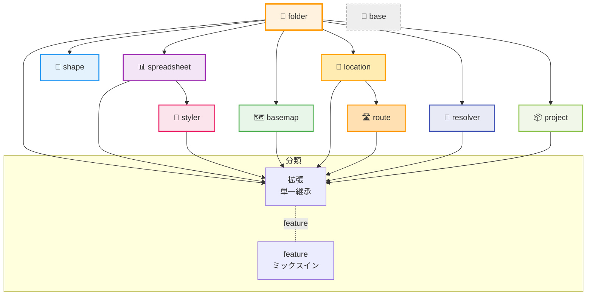

# HierarchiDB Node Type Plugin System

最終更新: 2025-09-06 00:00 UTC

HierarchiDBの拡張可能なノードタイププラグインシステムです。地理情報処理、データ管理、階層構造管理など、様々なドメインに特化したノードタイプを提供し、アプリケーションの機能を拡張します。

## 🏗️ アーキテクチャ概要

### プラグインシステムの特徴

| 特徴 | 説明 | 実装レベル |
|------|------|-----------|
| **UI/Worker分離** | Comlink RPCによる完全な層分離 | ✅ 完成 |
| **実行基盤の共有化** | @hierarchidb/batch による実行統一（shape/location/route） | ✅ 完成 |
| **ダウンロード共有** | 共有 Download アダプタ（AuthRecovery + DownloadService） | ✅ 完成 |
| **進捗/制御の共有** | AbstractBatchSession（pause/resume/cancel・ProgressEvent） | ✅ 完成 |
| **型安全性** | TypeScript Branded Typesによる厳密な型管理 | ✅ 完成 |
| **動的登録** | 実行時プラグイン登録・管理 | ✅ 完成 |
| **拡張システム** | 基盤プラグインを継承した拡張パターン | ✅ 完成 |
| **ライフサイクル** | プラグインレベルのライフサイクルフック | ✅ 完成 |
| **依存管理** | プラグイン間依存関係の自動解決 | ✅ 完成 |
| **データベース抽象化** | Dexie.jsベースの自動スキーマ管理 | ✅ 完成 |

### 3層アーキテクチャ

```
┌─────────────────────────────────────────────────────────────┐
│                    UI Layer (React)                        │
│  ┌──────────────┐ ┌──────────────┐ ┌──────────────────────┐ │
│  │ Plugin Dialog │ │ Plugin Panel │ │ Plugin Icon/Actions  │ │
│  └──────────────┘ └──────────────┘ └──────────────────────┘ │
└─────────────────────────────────────────────────────────────┘
                              ↕ Comlink RPC
┌─────────────────────────────────────────────────────────────┐
│                  Worker Layer (TypeScript)                 │
│  ┌──────────────┐ ┌──────────────┐ ┌──────────────────────┐ │
│  │Entity Handler│ │Lifecycle Hook│ │ Database Operations   │ │
│  └──────────────┘ └──────────────┘ └──────────────────────┘ │
└─────────────────────────────────────────────────────────────┘
                              ↕ Dexie Transaction
┌─────────────────────────────────────────────────────────────┐
│               Database Layer (IndexedDB/Dexie)             │
│  ┌──────────────┐ ┌──────────────┐ ┌──────────────────────┐ │
│  │   CoreDB     │ │ EphemeralDB  │ │   Plugin Databases   │ │
│  └──────────────┘ └──────────────┘ └──────────────────────┘ │
└─────────────────────────────────────────────────────────────┘
```

## 📦 プラグイン一覧と分類（最新版）

本システムのノードタイプ・プラグインは単一継承を基本とし、ケイパビリティは feature のミックスインで段階的に付与します（多重継承は行いません）。UI/Worker は Comlink 経由で疎結合となっており、定義・依存・UI エントリは PluginDefinition で一元管理します。

- 基盤（Foundation）
  - base-plugin: 継承用の基底（UI 非表示）
  - folder-plugin: ツリーのコンテナ（拡張/拡張レジストリの基盤）
- データ取り込み/変換（Data Ingest & Transform）
  - spreadsheet-plugin: CSV/TSV/Excel 等のソース管理
  - resolver-plugin: プロパティマッピング/スキーマ変換/重複解決
- 可視化/スタイリング（Visualization & Styling）
  - styler-plugin: データからスタイルを定義（Map スタイル適用など）
  - basemap-plugin: ベースマップ/スタイルの管理（MapLibre 統合）
- 地理/分析（Geo & Analysis）
  - shape-plugin: 形状処理/タイル/分析（folder 配下に統一予定）
  - location-plugin: 位置エンティティ/近接検索（Shape 連携オプション）
  - route-plugin: 経路生成/評価（Location 参照）
- メタ/領域（Meta & Project）
  - project-plugin: プロジェクト領域/メタ設定

### プラグイン分類とパターン



### 比較表（概要）

| プラグイン | nodeType（実装値・将来方針） | 継承元 | データベース名（kebab-case, 接頭辞付与） | バッチ | ベクトルタイル | Mapプレビュー | ネットワーク要件 | 備考 |
|---|---|---|---|---|---|---|---|---|
| base-plugin | base | - | - | - | - | - | なし | 継承専用（UI 非表示）/共通基盤（BaseEntityHandler 等） |
| folder-plugin | folder | - | Dexie('folder-db'), Dexie('folder-entities-db') | - | - | - | なし | 拡張レジストリ |
| spreadsheet-plugin | spreadsheet | folder | Dexie('spreadsheet-db'), Dexie('spreadsheet-entities-db') | - | - | - | なし（ローカル取り込み想定） | CSV/TSV/Excel |
| styler-plugin | styler | spreadsheet | Dexie('styler-metadata-db') | - | - | - | なし | CSVメタDB |
| basemap-plugin | basemap | folder | Dexie('basemap-db') | - | - | supported | タイルサーバ利用時は運用時に必要 | MapLibre 統合 |
| shape-plugin | shape | folder（に統一予定） | Dexie('shape-db'), Dexie('shape-entities-db') | Yes | create | supported | 作成・編集時はネット必須（運用中は不要） | 高負荷処理/バッチ |
| location-plugin | location | folder | Dexie('location-entities-db') | Yes | create | supported | 作成・編集時はネット必須（運用中は不要） | Shape 連携可 |
| route-plugin | route | folder（に統一予定） | Dexie('route-db') | Yes | create | supported | OSRM利用時は必要／searoute-jsのみならオフライン可 | BatchService/AbstractBatchSession/Lane制御 |
| resolver-plugin | resolver | folder | Dexie('resolver-db') | - | - | - | なし | Schema 検出/前処理 |
| project-plugin | project | folder | Dexie('project-db') | - | - | supported | プレビューが basemap に依存する場合あり | 領域/設定 |

注記:
- データベース名は `Dexie(getDBName('…'))` に渡すサフィックス（kebab-case）を示しています。接頭辞は `WORKER_DB_PREFIX` → `VITE_APP_PREFIX` → `hidb` の順で自動付与。複数持つ場合はカンマ区切り。
- Import/Export は CoreDB と Persistent なエンティティDBのシリアライズ/デシリアライズにより原則サポートされます（本表のカラムからは削除）。フォルダやタグ等の共通メタも対象に含まれます。
- ネットワーク要件: shape/location/route は作成・編集時にネット接続が必要なケースがあります。basemap はタイルサーバを利用する場合、運用中に外部タイルサーバへの接続が必要。その他は基本オフラインで運用可能。
- バッチは非同期一括処理の仕組み（セッション/レーン/タスク管理等）が実装されている場合に「Yes」。route は `RouteBatchManager/RouteBatchSession` に基づくバッチが実装済みです。
- ベクトルタイルは当該プラグインがベクトルタイルを生成（create）できるものを示します。
- Mapプレビューは当該プラグインの UI が地図プレビューに対応している場合に「supported」。
- nodeType の命名方針: ユーザーに露出しうる識別子のため、`-plugin` サフィックスを廃止し、`folder`/`basemap`/`location`/`project`/`resolver` などに統一します（既存実装は順次移行）。

### base-plugin の責務（役割）

base-plugin は UI に表示されない「共通基盤」です。プラグイン実装から再利用される抽象と補助型を提供します。親子継承の「親」ではなく、ライブラリ層と捉えてください。

- 提供クラス/抽象
  - `BaseEntityHandler<TEntity, TCreate, TSearch>`: CRUD とライフサイクルフック（before/after create/update/delete）を備えた共通ハンドラ基底。
  - `HierarchicalEntityHandler<...>`: 階層型（親子関係）エンティティ用の派生基底。
- 提供型
  - `BaseSearchCriteria`: 検索条件の基底（ページング/ソート拡張の前提）。
  - `PaginatedResult<T>`, `OperationResult<T>`: 結果表現の共通フォーマット。
  - `EntityLifecycleHooks<TEntity>`: ライフサイクルフックの型定義。
- 定義
  - `BasePluginDefinition`: 継承用のダミー定義（UI 非表示）。

これらは `@hierarchidb/base-plugin` から提供され、各プラグイン（folder/shape/route 等）が自前のハンドラ実装で再利用します。

#### 3x2エンティティ管理マトリクス（プラグイン別）

凡例: 列は Persistent(P-)→Ephemeral(E-) の順に、P-Peer, P-Group, P-Relational, E-Peer, E-Group, E-Relational を表します。セルには該当する永続/エフェメラルDB上のテーブル名（またはエンティティ名）を記載しています。

| プラグイン | P-Peer | P-Group | P-Relational | E-Peer | E-Group | E-Relational |
|---|---|---|---|---|---|---|
| base-plugin | - | - | - | - | - | - |
| folder-plugin | folders, workingCopies | groupEntities | relations | - | - | - |
| spreadsheet-plugin | spreadsheetEntities, workingCopies | groupEntities | relations | - | - | - |
| styler-plugin | - | - | csvMetadata | - | - | - |
| basemap-plugin | baseMaps, workingCopies | - | - | - | - | - |
| shape-plugin | shapeEntities | - | - | - | rawBuffers, simplifiedBuffers, vectorTiles, sessions, cache | - |
| location-plugin | peerEntities | groupEntities | relations | - | - | - |
| route-plugin | routes, workingCopies | - | - | - | - | - |
| resolver-plugin | resolvers, workingCopies | - | - | - | - | - |
| project-plugin | projects | - | - | - | - | - |


## 🔎 Tabular Preview（Location/Shape/Route 共通）

location / shape / route の各プラグインは、バッチ処理で正規化した“表データ”を保存してUIでプレビューできます（デフォルトOFF）。

- 有効化フラグ（環境変数 or `globalThis.FEATURE_FLAGS`）
  - `LOCATION_TABULAR=1`
  - `SHAPE_TABULAR=1`
  - `ROUTE_TABULAR=1`
- UI 機能
  - 複数条件フィルタ（AND: `eq`/`neq`/`contains`/`gt`/`gte`/`lt`/`lte`）
  - 表示列の切替（列セレクタ）
  - `eq` 条件は遅延作成される倒立インデックスで高速化
- 注意: 表プレビューは検索・検証用途です。ノード群の統合シリアライズ/デシリアライズは従来どおり Import/Export 機能をお使いください。


## 🧩 プラグイン定義（現行API）

プラグインの定義は `@hierarchidb/common-type` の `PluginDefinition` を用います。従来バージョンの
`config.category` などは廃止し、トップレベルのフィールドに整理されています。

主なフィールド（抜粋）:

- `nodeType: NodeType`（必須）: プラグインの識別子。
- `name: string`/`displayName: string`: 内部名/表示名。
- `description?: string`: 説明。
- `category: { treeId: TreeId | '*'; menuGroup?: 'basic'|'container'|'document'|'advanced'; createOrder?: number }`:
  - どのツリーで利用可能か、メニューの配置/順序を定義。
- `icon?: { muiIconName?: string; emoji?: string; color?: string }`: メニュー/UI用アイコン情報。
- `database: { dbName: string; schema: DatabaseSchema; version: number }`: DexieベースのDB設定。
- `ui?: { dialogComponentPath?: string; panelComponentPath?: string }`: UI側エントリ（動的 import 用の相対パス文字列）。
- `dependencies: string[]`: 依存プラグインの nodeType リスト（ロード順の解決に使用）。
- `priority: number`: 並び順のヒント（小さいほど先）。

この定義は Worker 層での実体（ハンドラ等）と UI 層の登録に共通して参照され、ビルド時に
`virtual:plugin-definitions`（vite プラグイン経由）として集約されます。UI のメニュー構築や
ランタイムのロード順解決は、この定義配列から導出されます。

### メニューとロード順の導出

- ロード順: `dependencies` をもとにトポロジカルソート（folder → spreadsheet → styler 等）。
- メニュー: `category.menuGroup` と `createOrder`、`displayName` から並び順/表示を決定。

## Plugin Dev MUSTs（プラグイン実装の必須事項）
- 公開TSXの戻り値型: プラグインが公開する TSX 関数/コンポーネントは `JSX.Element`（必要なら `| null`）を明示する（TS2742 回避）。
- 型エクスポート: 各パッケージの `types` と `exports.types` は `src/index.ts` を指す（prebuild typecheck を安定化）。
- パスエイリアス禁止: 公開ソースで `~/` など tsconfig の paths に依存しない。相対参照（../）またはビルド時置換のみ許可。
- React/MUI をバンドルしない: UI を含むプラグインは React/MUI を `peerDependencies` に置き、tsup では `external` 指定する（ホストアプリでの単一インスタンス維持）。
- 環境変数: ブラウザ向けコードで `process.env` は使用しない。`import.meta.env` / `VITE_*` を使用する（必要に応じて共通 `env` ヘルパーを利用）。
- 依存解決: 他パッケージの `../src` 直参照は禁止。公開API（パッケージ名）経由、または d.ts 参照に限定する。


UI 側ユーティリティでは、`virtual:plugin-definitions` を読み取り、`label = nativeName || name || nodeType`
のようなルールでメニューに整形します（実装は `app/src/plugins/menu-builders.ts` を参照）。

### プラグイン登録（ランタイム）

ビルド後、UI は `virtual:plugin-map` からプラグイン UI を動的 import し、Worker は `PluginDefinition` を
もとに必要なサービス/ハンドラを登録します（`WorkerService.getSingleton(defs)`）。

#### サンプル（最小）
```ts
import type { PluginDefinition } from '@hierarchidb/common-type';

export const MyPlugin: PluginDefinition = {
  nodeType: 'my-plugin',
  name: 'MyPlugin',
  displayName: 'My Plugin',
  description: 'Example plugin',
  category: { treeId: '*', menuGroup: 'basic', createOrder: 50 },
  icon: { muiIconName: 'Extension', color: '#607d8b' },
  database: { dbName: 'mydb', schema: {/* Dexie schema */} as any, version: 1 },
  ui: { dialogComponentPath: './ui/MyPluginDialog.tsx' },
  dependencies: ['folder'],
  priority: 100,
};
```

## 🗄️ データベース統合パターン（Dexie）

#### 自動スキーマ管理
```typescript
export const MyPluginDefinition: PluginDefinition<MyEntity, never, MyWorkingCopy> = {
  database: {
    entityStore: 'my_entities',  // テーブル名
    schema: {                    // Dexieスキーマ
      '&id': 'EntityId',         // 主キー（Branded Type）
      'nodeId': 'NodeId',        // 外部キー
      'name, description': '',   // インデックス付きフィールド
      'createdAt, updatedAt, version': '',
    },
    version: 1                   // スキーマバージョン
  }
};

// 自動的に作成される専用データベース
// - プラグイン登録時に自動作成
// - 依存関係に基づく初期化順序
// - バージョン管理によるマイグレーション
```

#### 依存関係データベースアクセス
```typescript
export class StylerEntityHandler extends BaseEntityHandler<StylerEntity> {
  async createEntity(nodeId: NodeId, data: Partial<StylerEntity>): Promise<StylerEntity> {
    // 依存先（Spreadsheet）のデータベースにアクセス
    const registry = NodeDefinitionRegistry.getInstance();
    const spreadsheetDB = registry.getDependencyDatabase('styler-plugin', 'spreadsheet-plugin');
    
    if (spreadsheetDB) {
      const spreadsheetTable = spreadsheetDB.getEntityTable();
      const spreadsheetData = await spreadsheetTable.where('nodeId').equals(nodeId).first();
      
      // スプレッドシートデータに基づいてスタイルマップを作成
      data.sourceDataId = spreadsheetData?.id;
    }
    
    return super.createEntity(nodeId, data);
  }
}
```


データベースは CoreDB（共通）とプラグイン専用 DB を分離し、Worker 内でトランザクション一貫性を担保します。

## ✅ 開発チェックリスト（最新版）

- [ ] `PluginDefinition` を用いてトップレベルに `category/icon/dependencies/priority` を定義したか
- [ ] UI/Worker ともに `virtual:plugin-definitions`（集約された定義）を前提にしているか
- [ ] 依存解決（ロード順）に `dependencies` を設定したか
- [ ] UI のメニュー表示に `displayName` と `category` を適切に設定したか
- [ ] Dexie スキーマ（`database.schema`）と `version` を更新時に整合させたか

## 🚫 ポリシー（抜粋）

- tsconfig の `paths` で他パッケージの `dist/*.d.ts` を直接参照しない（モノレポの型崩れ防止）。
- UI/Worker の境界は Comlink 経由。UI から Worker の実装を直接 import しない。

## 🔧 技術スタック

### コア技術基盤

| 技術 | 用途 | バージョン | 説明 |
|------|------|-----------|------|
| **TypeScript** | 型システム | 5.0+ | 厳密な型安全性、Branded Types |
| **Dexie.js** | データベース | 4.0+ | IndexedDBラッパー、トランザクション管理 |
| **Comlink** | Worker通信 | 4.4+ | 型安全なRPC、プロキシベース通信 |
| **React 18+** | UI基盤 | 18.2+ | コンポーネントベースUI |
| **Material-UI** | UIライブラリ | 5.0+ | UIコンポーネント、テーマシステム |

### 地理情報処理

| 技術 | 用途 | プラグイン | 説明 |
|------|------|-----------|------|
| **MapLibreGL JS** | 地図レンダリング | basemap, shape | オープンソース地図エンジン |
| **Turf.js** | 地理的演算 | shape | 地理空間解析ライブラリ |
| **GeoJSON/TopoJSON** | 地理データ | shape, basemap | 地理データ標準形式 |
| **Vector Tiles** | 地図データ配信 | shape | 効率的地図データ配信 |

### データ処理・最適化

| 技術 | 用途 | プラグイン | 説明 |
|------|------|-----------|------|
| **pako** | データ圧縮 | shape | gzip圧縮・解凍 |
| **pbf** | バイナリ処理 | shape | Protocol Buffersデコーダ |
| **csv-parser** | CSVデータ処理 | spreadsheet | CSVファイル解析 |
| **TanStack Virtual** | 仮想化 | 全UI | 大容量データ仮想化 |

### 開発・テスト

| 技術 | 用途 | 説明 |
|------|------|------|
| **Vitest** | ユニットテスト | 高速テスト実行 |
| **fake-indexeddb** | テスト環境 | IndexedDBモック |
| **Turborepo** | モノレポ管理 | 高速ビルド・キャッシュ |
| **pnpm** | パッケージ管理 | ワークスペース管理 |


## 📚 詳細ドキュメント

プラグインシステムの詳細については、以下のドキュメントを参照してください：

- **[アーキテクチャ詳細](./docs/architecture.md)** - システムアーキテクチャ、データフロー、技術的詳細
- **[開発ガイド](./docs/development-guide.md)** - ステップバイステップの開発手順、ベストプラクティス
- **[プラグイン構造](./docs/plugin-structure.md)** - プラグインの内部構造、ファイル組織、コード規約
- **[API リファレンス](./docs/api-reference.md)** - API仕様、インターフェース、型定義

*Generated by HierarchiDB Plugin System Documentation Generator*  
*Version: 2.0.0 | Last Updated: 2024-12-29*
