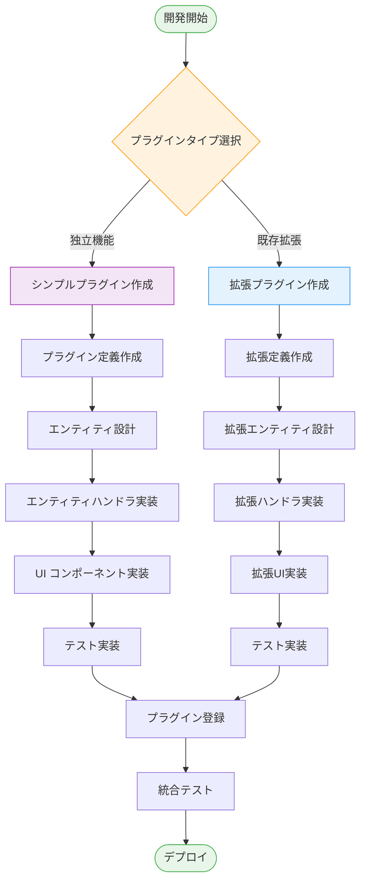

# HierarchiDB Node Type Plugin System

最終更新: 2025-09-04 22:00 UTC

HierarchiDBの拡張可能なノードタイププラグインシステムです。地理情報処理、データ管理、階層構造管理など、様々なドメインに特化したノードタイプを提供し、アプリケーションの機能を拡張します。

## 🏗️ アーキテクチャ概要

### プラグインシステムの特徴

| 特徴 | 説明 | 実装レベル |
|------|------|-----------|
| **UI/Worker分離** | Comlink RPCによる完全な層分離 | ✅ 完成 |
| **型安全性** | TypeScript Branded Typesによる厳密な型管理 | ✅ 完成 |
| **動的登録** | 実行時プラグイン登録・管理 | ✅ 完成 |
| **拡張システム** | 基盤プラグインを継承した拡張パターン | ✅ 完成 |
| **ライフサイクル** | プラグインレベルのライフサイクルフック | ✅ 完成 |
| **依存管理** | プラグイン間依存関係の自動解決 | ✅ 完成 |
| **データベース抽象化** | Dexie.jsベースの自動スキーマ管理 | ✅ 完成 |

### 3層アーキテクチャ

```
┌─────────────────────────────────────────────────────────────┐
│                    UI Layer (React)                        │
│  ┌──────────────┐ ┌──────────────┐ ┌──────────────────────┐ │
│  │ Plugin Dialog │ │ Plugin Panel │ │ Plugin Icon/Actions  │ │
│  └──────────────┘ └──────────────┘ └──────────────────────┘ │
└─────────────────────────────────────────────────────────────┘
                              ↕ Comlink RPC
┌─────────────────────────────────────────────────────────────┐
│                  Worker Layer (TypeScript)                 │
│  ┌──────────────┐ ┌──────────────┐ ┌──────────────────────┐ │
│  │Entity Handler│ │Lifecycle Hook│ │ Database Operations   │ │
│  └──────────────┘ └──────────────┘ └──────────────────────┘ │
└─────────────────────────────────────────────────────────────┘
                              ↕ Dexie Transaction
┌─────────────────────────────────────────────────────────────┐
│               Database Layer (IndexedDB/Dexie)             │
│  ┌──────────────┐ ┌──────────────┐ ┌──────────────────────┐ │
│  │   CoreDB     │ │ EphemeralDB  │ │   Plugin Databases   │ │
│  └──────────────┘ └──────────────┘ └──────────────────────┘ │
└─────────────────────────────────────────────────────────────┘
```

## 📦 プラグイン一覧と分類（最新版）

本システムのノードタイプ・プラグインは単一継承を基本とし、ケイパビリティは feature のミックスインで段階的に付与します（多重継承は行いません）。UI/Worker は Comlink 経由で疎結合となっており、定義・依存・UI エントリは PluginDefinition で一元管理します。

- 基盤（Foundation）
  - base-plugin: 継承用の基底（UI 非表示）
  - folder-plugin: ツリーのコンテナ（拡張/拡張レジストリの基盤）
- データ取り込み/変換（Data Ingest & Transform）
  - spreadsheet-plugin: CSV/TSV/Excel 等のソース管理
  - resolver-plugin: プロパティマッピング/スキーマ変換/重複解決
- 可視化/スタイリング（Visualization & Styling）
  - styler-plugin: データからスタイルを定義（Map スタイル適用など）
  - basemap-plugin: ベースマップ/スタイルの管理（MapLibre 統合）
- 地理/分析（Geo & Analysis）
  - shape-plugin: 形状処理/タイル/分析（独立プラグイン）
  - location-plugin: 位置エンティティ/近接検索（Shape 連携オプション）
  - route-plugin: 経路生成/評価（Location 参照）
- メタ/領域（Meta & Project）
  - project-plugin: プロジェクト領域/メタ設定

### 比較表（概要）

| プラグイン | nodeType（実装値） | 継承元 | 主要機能 | UI（Dialog/Panel） | DB（Entity/WC） | Import/Export | バッチ | 備考 |
|---|---|---|---|---|---|---|---|---|
| base-plugin | base | - | 基底ハンドラ/型 | - | - | - | - | 継承専用（UI 非表示） |
| folder-plugin | folder | - | コンテナ/拡張基盤 | Yes/Yes | - | - | - | 拡張レジストリ |
| spreadsheet-plugin | spreadsheet | folder | データソース管理 | Yes/Yes | Yes/Yes | Import | - | CSV/TSV/Excel |
| styler-plugin | styler | spreadsheet | スタイル定義 | Yes/Yes | Yes/Yes | - | - | カラーマップ/スタイル適用 |
| basemap-plugin | basemap | folder | ベースマップ/スタイル | Yes/Yes | Yes/Yes | - | - | MapLibre 統合 |
| shape-plugin | shape | - | 形状/分析/タイル | Yes/Yes | Yes/Yes | Import/Export | Yes | 独立/高性能処理 |
| location-plugin | location-plugin | folder | 位置/近接検索 | Yes/Yes | Yes/Yes | Import/Export | Yes | Shape 連携可 |
| route-plugin | route | location | 経路生成/評価 | Yes/Yes | Yes/Yes | Import/Export | Optional | Location 解決/統計 |
| resolver-plugin | resolver-plugin | folder | 変換/重複解決 | Yes/Yes | Yes/Yes | - | - | Schema 検出/前処理 |
| project-plugin | project-plugin | folder | プロジェクト/メタ | Yes/Yes | Yes/Yes | - | - | 領域/設定 |

注記:
- nodeType は実装上の定義値を記載（例: route は 'route'）。
- Import/Export/バッチは supports* フラグおよびコード実装を確認のうえ反映（例: location/route/shape は Export/Import/Batch の実装/サポートがある）。


## 🧩 プラグイン定義（現行API）

プラグインの定義は `@hierarchidb/common-type` の `PluginDefinition` を用います。従来バージョンの
`config.category` などは廃止し、トップレベルのフィールドに整理されています。

主なフィールド（抜粋）:

- `nodeType: NodeType`（必須）: プラグインの識別子。
- `name: string`/`displayName: string`: 内部名/表示名。
- `description?: string`: 説明。
- `category: { treeId: TreeId | '*'; menuGroup?: 'basic'|'container'|'document'|'advanced'; createOrder?: number }`:
  - どのツリーで利用可能か、メニューの配置/順序を定義。
- `icon?: { muiIconName?: string; emoji?: string; color?: string }`: メニュー/UI用アイコン情報。
- `database: { dbName: string; schema: DatabaseSchema; version: number }`: DexieベースのDB設定。
- `ui?: { dialogComponentPath?: string; panelComponentPath?: string }`: UI側エントリ（動的 import 用の相対パス文字列）。
- `dependencies: string[]`: 依存プラグインの nodeType リスト（ロード順の解決に使用）。
- `priority: number`: 並び順のヒント（小さいほど先）。

この定義は Worker 層での実体（ハンドラ等）と UI 層の登録に共通して参照され、ビルド時に
`virtual:plugin-definitions`（vite プラグイン経由）として集約されます。UI のメニュー構築や
ランタイムのロード順解決は、この定義配列から導出されます。

### メニューとロード順の導出

- ロード順: `dependencies` をもとにトポロジカルソート（folder → spreadsheet → styler 等）。
- メニュー: `category.menuGroup` と `createOrder`、`displayName` から並び順/表示を決定。

UI 側ユーティリティでは、`virtual:plugin-definitions` を読み取り、`label = nativeName || name || nodeType`
のようなルールでメニューに整形します（実装は `app/src/plugins/menu-builders.ts` を参照）。

### プラグイン登録（ランタイム）

ビルド後、UI は `virtual:plugin-map` からプラグイン UI を動的 import し、Worker は `PluginDefinition` を
もとに必要なサービス/ハンドラを登録します（`WorkerService.getSingleton(defs)`）。

#### サンプル（最小）
```ts
import type { PluginDefinition } from '@hierarchidb/common-type';

export const MyPlugin: PluginDefinition = {
  nodeType: 'my-plugin',
  name: 'MyPlugin',
  displayName: 'My Plugin',
  description: 'Example plugin',
  category: { treeId: '*', menuGroup: 'basic', createOrder: 50 },
  icon: { muiIconName: 'Extension', color: '#607d8b' },
  database: { dbName: 'mydb', schema: {/* Dexie schema */} as any, version: 1 },
  ui: { dialogComponentPath: './ui/MyPluginDialog.tsx' },
  dependencies: ['folder'],
  priority: 100,
};
```

## 🗄️ データベース統合パターン（Dexie）

#### 自動スキーマ管理
```typescript
export const MyPluginDefinition: PluginDefinition<MyEntity, never, MyWorkingCopy> = {
  database: {
    entityStore: 'my_entities',  // テーブル名
    schema: {                    // Dexieスキーマ
      '&id': 'EntityId',         // 主キー（Branded Type）
      'nodeId': 'NodeId',        // 外部キー
      'name, description': '',   // インデックス付きフィールド
      'createdAt, updatedAt, version': '',
    },
    version: 1                   // スキーマバージョン
  }
};

// 自動的に作成される専用データベース
// - プラグイン登録時に自動作成
// - 依存関係に基づく初期化順序
// - バージョン管理によるマイグレーション
```

#### 依存関係データベースアクセス
```typescript
export class StylerEntityHandler extends BaseEntityHandler<StylerEntity> {
  async createEntity(nodeId: NodeId, data: Partial<StylerEntity>): Promise<StylerEntity> {
    // 依存先（Spreadsheet）のデータベースにアクセス
    const registry = NodeDefinitionRegistry.getInstance();
    const spreadsheetDB = registry.getDependencyDatabase('styler-plugin', 'spreadsheet-plugin');
    
    if (spreadsheetDB) {
      const spreadsheetTable = spreadsheetDB.getEntityTable();
      const spreadsheetData = await spreadsheetTable.where('nodeId').equals(nodeId).first();
      
      // スプレッドシートデータに基づいてスタイルマップを作成
      data.sourceDataId = spreadsheetData?.id;
    }
    
    return super.createEntity(nodeId, data);
  }
}
```

データベースは CoreDB（共通）とプラグイン専用 DB を分離し、Worker 内でトランザクション一貫性を担保します。

## ✅ 開発チェックリスト（最新版）

- [ ] `PluginDefinition` を用いてトップレベルに `category/icon/dependencies/priority` を定義したか
- [ ] UI/Worker ともに `virtual:plugin-definitions`（集約された定義）を前提にしているか
- [ ] 依存解決（ロード順）に `dependencies` を設定したか
- [ ] UI のメニュー表示に `displayName` と `category` を適切に設定したか
- [ ] Dexie スキーマ（`database.schema`）と `version` を更新時に整合させたか

## 🚫 ポリシー（抜粋）

- tsconfig の `paths` で他パッケージの `dist/*.d.ts` を直接参照しない（モノレポの型崩れ防止）。
- UI/Worker の境界は Comlink 経由。UI から Worker の実装を直接 import しない。

## 🔧 技術スタック

### コア技術基盤

| 技術 | 用途 | バージョン | 説明 |
|------|------|-----------|------|
| **TypeScript** | 型システム | 5.0+ | 厳密な型安全性、Branded Types |
| **Dexie.js** | データベース | 4.0+ | IndexedDBラッパー、トランザクション管理 |
| **Comlink** | Worker通信 | 4.4+ | 型安全なRPC、プロキシベース通信 |
| **React 18+** | UI基盤 | 18.2+ | コンポーネントベースUI |
| **Material-UI** | UIライブラリ | 5.0+ | UIコンポーネント、テーマシステム |

### 地理情報処理

| 技術 | 用途 | プラグイン | 説明 |
|------|------|-----------|------|
| **MapLibreGL JS** | 地図レンダリング | basemap, shape | オープンソース地図エンジン |
| **Turf.js** | 地理的演算 | shape | 地理空間解析ライブラリ |
| **GeoJSON/TopoJSON** | 地理データ | shape, basemap | 地理データ標準形式 |
| **Vector Tiles** | 地図データ配信 | shape | 効率的地図データ配信 |

### データ処理・最適化

| 技術 | 用途 | プラグイン | 説明 |
|------|------|-----------|------|
| **pako** | データ圧縮 | shape | gzip圧縮・解凍 |
| **pbf** | バイナリ処理 | shape | Protocol Buffersデコーダ |
| **csv-parser** | CSVデータ処理 | spreadsheet | CSVファイル解析 |
| **TanStack Virtual** | 仮想化 | 全UI | 大容量データ仮想化 |

### 開発・テスト

| 技術 | 用途 | 説明 |
|------|------|------|
| **Vitest** | ユニットテスト | 高速テスト実行 |
| **fake-indexeddb** | テスト環境 | IndexedDBモック |
| **Turborepo** | モノレポ管理 | 高速ビルド・キャッシュ |
| **pnpm** | パッケージ管理 | ワークスペース管理 |

## 🚀 プラグイン開発ガイド

### 開発フロー



### 1. 新規プラグイン作成手順

#### ステップ 1: プロジェクト構造作成
```bash
# プラグイン構造作成
cd packages/node-type/
mkdir my-plugin
cd my-plugin

# パッケージ初期化
npm init -y
```

#### ステップ 2: パッケージ設定
```json
// package.json
{
  "name": "@hierarchidb/my-plugin",
  "version": "1.0.0",
  "type": "module",
  "main": "dist/index.js",
  "types": "dist/index.d.ts",
  "exports": {
    ".": {
      "types": "./dist/index.d.ts",
      "import": "./dist/index.js"
    },
    "./shared": {
      "types": "./dist/shared/index.d.ts",
      "import": "./dist/shared/index.js"
    },
    "./ui": {
      "types": "./dist/ui/index.d.ts", 
      "import": "./dist/ui/index.js"
    },
    "./worker": {
      "types": "./dist/worker/index.d.ts",
      "import": "./dist/worker/index.js"
    }
  },
  "dependencies": {
    "@hierarchidb/common-core": "workspace:*",
    "@hierarchidb/common-type": "workspace:*",
    "@hierarchidb/ui-core": "workspace:*"
  }
}
```

#### ステップ 3: エンティティ型定義
```typescript
// src/shared/types/MyEntity.ts
import type { PeerEntity, EntityId, NodeId } from '@hierarchidb/common-type';

export interface MyEntity extends PeerEntity {
  id: EntityId;
  nodeId: NodeId;
  customField: string;
  // ... その他のカスタムフィールド
}

export interface MyWorkingCopy extends MyEntity {
  isDraft: boolean;
  originalId?: string;
  copiedAt: number;
}
```

#### ステップ 4: エンティティハンドラ実装
```typescript
// src/worker/handlers/MyEntityHandler.ts
import { BaseEntityHandler } from '@hierarchidb/common-core';
import type { MyEntity, MyWorkingCopy } from '../../shared/types/MyEntity';

export class MyEntityHandler extends BaseEntityHandler<MyEntity, never, MyWorkingCopy> {
  async createEntity(nodeId: NodeId, data: Partial<MyEntity>): Promise<MyEntity> {
    const entityId = crypto.randomUUID() as EntityId;
    const entity: MyEntity = {
      id: entityId,
      nodeId: nodeId,
      customField: data.customField || '',
      createdAt: Date.now(),
      updatedAt: Date.now(),
      version: 1,
    };
    
    await this.table.add(entity);
    return entity;
  }

  async updateEntity(id: EntityId, updates: Partial<MyEntity>): Promise<MyEntity> {
    const existing = await this.table.get(id);
    if (!existing) {
      throw new Error(`Entity not found: ${id}`);
    }

    const updated: MyEntity = {
      ...existing,
      ...updates,
      updatedAt: Date.now(),
      version: existing.version + 1,
    };

    await this.table.put(updated);
    return updated;
  }
}
```

#### ステップ 5: プラグイン定義
```typescript
// src/worker/plugin.ts
import type { PluginDefinition } from '@hierarchidb/common-type';
import { MyEntityHandler } from './handlers/MyEntityHandler';
import type { MyEntity, MyWorkingCopy } from '../shared/types/MyEntity';

export const MyPluginDefinition: PluginDefinition<MyEntity, never, MyWorkingCopy> = {
  nodeType: 'my-plugin',
  name: 'My Plugin',
  displayName: 'マイプラグイン',
  
  // エンティティハンドラー
  entityHandler: new MyEntityHandler(),
  
  // データベーススキーマ
  database: {
    entityStore: 'my_entities',
    schema: {
      '&id': 'EntityId',
      'nodeId': 'NodeId',
      'customField': '',
      'createdAt, updatedAt, version': '',
    },
    version: 1
  },
  
  // カテゴリ設定
  category: {
    primary: 'data-management',
    secondary: 'custom',
    treeTypes: ['data-tree']
  },
  
  // ライフサイクルフック
  lifecycle: {
    afterCreate: async (node: TreeNode, context) => {
      console.log(`Created node: ${node.id}`);
    },
    beforeDelete: async (node: TreeNode, context) => {
      // クリーンアップ処理
      await context.cleanupRelatedEntities(node.id);
    }
  }
};
```

#### ステップ 6: UI コンポーネント実装
```typescript
// src/ui/components/MyDialog.tsx
import React, { useState } from 'react';
import { Dialog, DialogTitle, DialogContent, DialogActions, Button, TextField } from '@mui/material';

interface MyDialogProps {
  open: boolean;
  nodeId: NodeId;
  onClose: () => void;
  onSave: (data: { customField: string }) => Promise<void>;
}

export function MyDialog({ open, nodeId, onClose, onSave }: MyDialogProps) {
  const [customField, setCustomField] = useState('');
  
  const handleSave = async () => {
    await onSave({ customField });
    onClose();
  };

  return (
    <Dialog open={open} onClose={onClose} maxWidth="md" fullWidth>
      <DialogTitle>マイプラグイン設定</DialogTitle>
      <DialogContent>
        <TextField
          fullWidth
          label="カスタムフィールド"
          value={customField}
          onChange={(e) => setCustomField(e.target.value)}
          margin="normal"
        />
      </DialogContent>
      <DialogActions>
        <Button onClick={onClose}>キャンセル</Button>
        <Button onClick={handleSave} variant="contained">保存</Button>
      </DialogActions>
    </Dialog>
  );
}
```

#### ステップ 7: エクスポート設定
```typescript
// src/index.ts (メインエクスポート)
export * from './shared';

// src/shared/index.ts
export * from './types/MyEntity';
export * from './constants';

// src/ui/index.ts
export * from './components/MyDialog';
export * from './hooks/useMyEntity';

// src/worker/index.ts
export * from './plugin';
export * from './handlers/MyEntityHandler';
```

### 2. 拡張プラグイン作成（フォルダ継承）

#### 拡張定義パターン
```typescript
// src/extension/definition.ts
import type { FolderEntity } from '@hierarchidb/folder-plugin';
import type { ExtendableNodeTypeDefinition } from '@hierarchidb/common-type';

interface MyExtendedFields {
  customData: string;
  additionalConfig: Record<string, any>;
}

export interface MyExtendedEntity extends FolderEntity, MyExtendedFields {}

export const MyExtendedPlugin: ExtendableNodeTypeDefinition<
  FolderEntity,
  MyExtendedEntity,
  MyExtendedEntity & { isDraft: boolean }
> = {
  extends: 'folder-plugin',
  nodeType: 'my-extended-plugin',
  name: 'My Extended Plugin',
  displayName: '拡張プラグイン',
  
  // 追加ステップ
  extendedSteps: [
    {
      stepNumber: 2,
      title: 'カスタム設定',
      component: MyCustomStep,
      validation: {
        validate: async (data) => {
          if (!data.customData) {
            return { isValid: false, errors: ['カスタムデータは必須です'] };
          }
          return { isValid: true, errors: [] };
        }
      }
    }
  ],
  
  // 追加フィールド
  extendedFields: [
    {
      name: 'customData',
      type: 'string',
      required: true,
      label: 'カスタムデータ'
    },
    {
      name: 'additionalConfig',
      type: 'object',
      required: false,
      label: '追加設定'
    }
  ],
  
  // 拡張バリデーション
  extendedValidation: {
    extendedRules: {
      customDataRule: {
        validate: (data) => data.customData && data.customData.length > 0,
        message: 'カスタムデータを入力してください'
      }
    },
    chainMode: 'all',
    mergeStrategy: 'append'
  }
};
```

### 3. テスト実装

#### ユニットテスト例
```typescript
// src/__tests__/MyEntityHandler.test.ts
import { describe, it, expect, beforeEach } from 'vitest';
import 'fake-indexeddb/auto';
import { MyEntityHandler } from '../worker/handlers/MyEntityHandler';
import type { MyEntity } from '../shared/types/MyEntity';

describe('MyEntityHandler', () => {
  let handler: MyEntityHandler;
  
  beforeEach(async () => {
    handler = new MyEntityHandler();
    // fake-indexeddb初期化
  });
  
  it('should create entity correctly', async () => {
    const nodeId = 'test-node-123' as NodeId;
    const data = { customField: 'test-value' };
    
    const entity = await handler.createEntity(nodeId, data);
    
    expect(entity.nodeId).toBe(nodeId);
    expect(entity.customField).toBe('test-value');
    expect(entity.id).toBeDefined();
    expect(entity.createdAt).toBeDefined();
  });
  
  it('should update entity correctly', async () => {
    const nodeId = 'test-node-123' as NodeId;
    const entity = await handler.createEntity(nodeId, { customField: 'initial' });
    
    const updated = await handler.updateEntity(entity.id, { customField: 'updated' });
    
    expect(updated.customField).toBe('updated');
    expect(updated.version).toBe(2);
    expect(updated.updatedAt).toBeGreaterThan(entity.updatedAt);
  });
});
```

#### 統合テスト例
```typescript
// src/__tests__/plugin-integration.test.ts
import { describe, it, expect, beforeEach } from 'vitest';
import { NodeTypeRegistry } from '@hierarchidb/runtime-plugin-registry';
import { MyPluginDefinition } from '../worker/plugin';

describe('Plugin Integration', () => {
  let registry: NodeTypeRegistry;
  
  beforeEach(() => {
    registry = new NodeTypeRegistry();
  });
  
  it('should register plugin successfully', async () => {
    await registry.register(MyPluginDefinition);
    
    const registered = registry.get('my-plugin');
    expect(registered).toBeDefined();
    expect(registered?.nodeType).toBe('my-plugin');
  });
  
  it('should handle entity operations', async () => {
    await registry.register(MyPluginDefinition);
    
    const plugin = registry.get('my-plugin');
    const handler = plugin?.entityHandler;
    
    expect(handler).toBeDefined();
    expect(typeof handler?.createEntity).toBe('function');
  });
});
```

### 4. 登録と統合

#### アプリケーション統合
```typescript
// app/src/plugins/registry.ts
import { NodeTypeRegistry } from '@hierarchidb/runtime-plugin-registry';
import { MyPluginDefinition } from '@hierarchidb/my-plugin/worker';

// プラグイン登録
export async function registerPlugins() {
  const registry = NodeTypeRegistry.getInstance();
  
  // 基盤プラグイン登録
  await registry.register(FolderPluginDefinition);
  
  // カスタムプラグイン登録
  await registry.register(MyPluginDefinition);
  
  console.log('All plugins registered successfully');
}
```

### 5. ビルドとデプロイ

#### ビルド設定
```typescript
// tsup.config.ts
import { defineConfig } from 'tsup';

export default defineConfig([
  // メインビルド
  {
    entry: ['src/index.ts'],
    format: ['esm'],
    dts: true,
    clean: true,
    external: ['provider', '@mui/material']
  },
  // UI専用ビルド
  {
    entry: ['src/ui/index.ts'],
    outDir: 'dist/ui',
    format: ['esm'],
    dts: true,
    external: ['provider', '@mui/material']
  },
  // Worker専用ビルド
  {
    entry: ['src/worker/index.ts'],
    outDir: 'dist/worker',
    format: ['esm'],
    dts: true,
    external: ['dexie']
  }
]);
```


## 📚 詳細ドキュメント

プラグインシステムの詳細については、以下のドキュメントを参照してください：

- **[アーキテクチャ詳細](./docs/architecture.md)** - システムアーキテクチャ、データフロー、技術的詳細
- **[開発ガイド](./docs/development-guide.md)** - ステップバイステップの開発手順、ベストプラクティス
- **[プラグイン構造](./docs/plugin-structure.md)** - プラグインの内部構造、ファイル組織、コード規約
- **[API リファレンス](./docs/api-reference.md)** - API仕様、インターフェース、型定義

*Generated by HierarchiDB Plugin System Documentation Generator*  
*Version: 2.0.0 | Last Updated: 2024-12-29*
