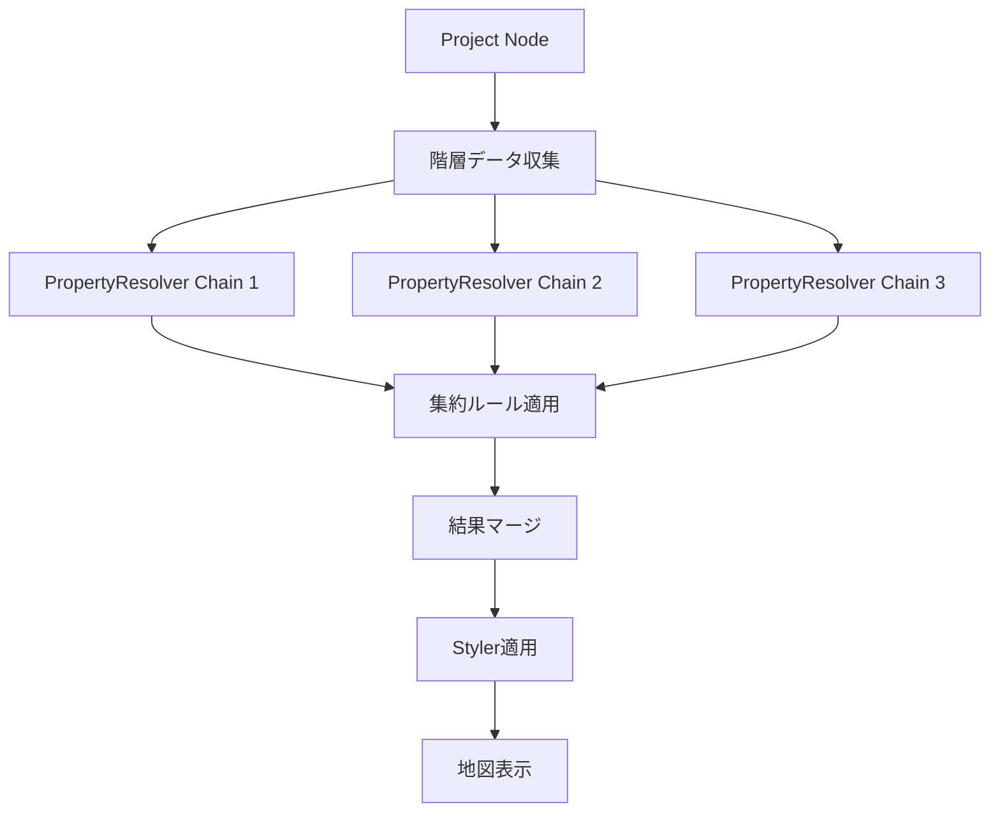
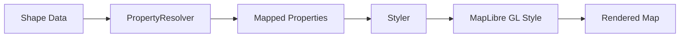

# PropertyResolver Plugin

## 概要

PropertyResolverプラグインは、異なるデータスキーマ間でプロパティをマッピングするための強力で使いやすいツールです。Stylerプラグインと連携することで、地理データのスタイリングにおいて異なるプロパティ名を持つデータセットを統一的に扱えるようになります。

## 主な特徴

### シンプルなテキストベースのマッピング記法
```
# 基本的なマッピング
source_property -> target_property

# 変換機能付きマッピング (将来拡張)
price -> display_price | format('¥{value:,}')
```

### パフォーマンス最適化
- **適応的プレビュー**: データ量に応じたプレビュー戦略の自動切り替え
- **チャンク処理**: 大量データをメモリ効率的に処理
- **差分更新**: Styler連携時の部分的な更新による高速化

### ユーザビリティの向上
- **自動スキーマ検出**: JSON サンプルデータからのスキーマ自動推論
- **インラインエラー表示**: リアルタイムでの構文エラー検出
- **マッピング統計**: カバレッジと問題の可視化

## 6ステップの設定ワークフロー

### Step 1: 基本情報の入力
- PropertyResolver の名前と説明を設定
- 使用目的やビジネスコンテキストの記録

### Step 2: スキーマ選択
- **ソーススキーマ**: 変換元のデータ構造を定義
- **ターゲットスキーマ**: 変換先のデータ構造を定義
- サンプルJSONデータからの自動検出機能

### Step 3: プロパティマッピング
```
# シンプルなテキストルールでマッピングを定義
id -> user_id
name -> full_name
age -> years
email -> email_address

# 自動補完とエラーチェック機能
# 未マッピングプロパティの警告表示
```

### Step 4: バリデーション設定（オプション）
- データ品質を保証するバリデーションルール
- 必須項目、型チェック、範囲チェック、パターンマッチング

### Step 5: 重複解決戦略
- 重複データの処理方法を設定
  - `ignore`: 重複を無視
  - `overwrite`: 上書き
  - `merge`: マージ
  - `skip`: スキップ

### Step 6: プレビューとテスト
- マッピング結果のリアルタイムプレビュー
- エラーと警告の詳細表示
- マッピングカバレッジ統計

## 階層的集約と複数PropertyResolverの適用

### 複数PropertyResolverの連鎖適用

Projectノードからの階層的なデータ集約において、複数のPropertyResolverを柔軟に組み合わせて適用できます。

#### 適用パターンと優先順位

```typescript
interface ResolverChain {
  id: string;
  name: string;
  resolvers: ResolverChainItem[];
  strategy: ChainStrategy;
  conflictResolution: ConflictResolution;
}

interface ResolverChainItem {
  resolverId: NodeId;
  order: number;              // 実行順序
  condition?: string;          // 適用条件（オプション）
  scope?: 'all' | 'partial';  // 適用範囲
  weight?: number;             // マージ時の重み
}

type ChainStrategy = 
  | 'sequential'     // 順次適用（デフォルト）
  | 'parallel'       // 並列適用後マージ
  | 'conditional'    // 条件分岐
  | 'fallback'       // フォールバック
  | 'weighted';      // 重み付きマージ

type ConflictResolution = 
  | 'last-wins'      // 最後の値を採用
  | 'first-wins'     // 最初の値を保持
  | 'merge'          // 値をマージ
  | 'error'          // エラーとして扱う
  | 'custom';        // カスタムルール
```

#### 実行例

##### 1. 順次適用パターン（Sequential）
```typescript
// データソースごとに異なるPropertyResolverを順次適用
const sequentialChain = {
  strategy: 'sequential',
  resolvers: [
    { resolverId: 'csv-normalizer', order: 1 },    // CSV正規化
    { resolverId: 'geo-enhancer', order: 2 },      // 地理情報追加
    { resolverId: 'style-mapper', order: 3 }       // スタイル適用
  ]
};

// 実行フロー: Data → Resolver1 → Resolver2 → Resolver3 → Result
```

##### 2. 条件分岐パターン（Conditional）
```typescript
// データの特性に応じて異なるResolverを適用
const conditionalChain = {
  strategy: 'conditional',
  resolvers: [
    { 
      resolverId: 'japan-resolver', 
      condition: "country === 'JP'",
      order: 1 
    },
    { 
      resolverId: 'us-resolver', 
      condition: "country === 'US'",
      order: 1 
    },
    { 
      resolverId: 'default-resolver', 
      condition: "true",  // フォールバック
      order: 2 
    }
  ]
};
```

##### 3. 並列マージパターン（Parallel + Merge）
```typescript
// 複数のResolverを並列実行して結果をマージ
const parallelMergeChain = {
  strategy: 'parallel',
  conflictResolution: 'weighted',
  resolvers: [
    { resolverId: 'primary-resolver', weight: 0.7 },
    { resolverId: 'secondary-resolver', weight: 0.3 }
  ]
};

// 競合時は重み付き平均や優先度で解決
```

##### 4. フォールバックパターン（Fallback）
```typescript
// プライマリが失敗した場合にセカンダリを使用
const fallbackChain = {
  strategy: 'fallback',
  resolvers: [
    { resolverId: 'precise-resolver', order: 1 },  // 高精度だが失敗しやすい
    { resolverId: 'fuzzy-resolver', order: 2 },    // 低精度だが安定
    { resolverId: 'basic-resolver', order: 3 }     // 最終フォールバック
  ]
};
```

### 階層的集約における適用

```typescript
interface HierarchicalAggregation {
  projectNodeId: NodeId;
  aggregationRules: AggregationRule[];
  resolverChains: Map<string, ResolverChain>;
}

interface AggregationRule {
  sourcePattern: string;      // ソースノードのパターン
  targetLevel: number;        // 集約先の階層レベル
  resolverChainId: string;    // 適用するResolverチェーン
  aggregationMethod: 'sum' | 'avg' | 'max' | 'min' | 'custom';
}
```

#### 階層的集約の実行フロー



### 設定UI

```typescript
// PropertyResolverチェーンの設定ダイアログ
interface ChainConfigDialog {
  // ドラッグ&ドロップで順序変更
  reorderableList: boolean;
  
  // 実行戦略の選択
  strategySelector: {
    options: ChainStrategy[];
    preview: boolean;  // 戦略変更のプレビュー
  };
  
  // 競合解決ルールの設定
  conflictResolver: {
    defaultRule: ConflictResolution;
    propertyOverrides: Map<string, ConflictResolution>;
  };
  
  // テスト実行
  testRunner: {
    sampleData: any[];
    showIntermediateResults: boolean;
    compareStrategies: boolean;
  };
}
```

### パフォーマンス最適化

```typescript
// チェーン全体のコンパイル最適化
class ChainCompiler {
  compileChain(chain: ResolverChain): CompiledChain {
    switch (chain.strategy) {
      case 'sequential':
        return this.compileSequential(chain);
      case 'parallel':
        return this.compileParallel(chain);
      case 'conditional':
        return this.compileConditional(chain);
      default:
        return this.compileFallback(chain);
    }
  }
  
  // 順次実行の最適化: 中間データを排除
  private compileSequential(chain: ResolverChain): CompiledChain {
    // Resolver1 + Resolver2 + Resolver3 → 単一の最適化関数
    return this.fuseResolvers(chain.resolvers);
  }
  
  // 並列実行の最適化: Web Workerで分散処理
  private compileParallel(chain: ResolverChain): CompiledChain {
    return {
      execute: async (data) => {
        const workers = chain.resolvers.map(r => 
          new Worker(`resolver-${r.resolverId}.js`)
        );
        const results = await Promise.all(
          workers.map(w => w.process(data))
        );
        return this.mergeResults(results, chain.conflictResolution);
      }
    };
  }
}
```

## Styler連携仕様

### 統合シナリオ

#### シナリオ1: 直接マッピング（styler + shape）
```javascript
// shapeデータのプロパティがStylerのキーと一致
{
  "都道府県": "東京都",
  "人口": 14000000
}
// → Stylerが直接適用可能
```

#### シナリオ2: PropertyResolver経由マッピング（styler + propertyresolver + shape）
```javascript
// shapeデータのプロパティ名が異なる
{
  "prefecture_name": "東京都",  // → PropertyResolverで "都道府県" にマッピング
  "population": 14000000         // → PropertyResolverで "人口" にマッピング
}
```

### マッピング処理フロー


## パフォーマンス最適化戦略

### コンパイルによる最適化（Phase 3以降）

#### 多段階マッピングの課題
```typescript
// 従来の処理: 各段階で全データを変換（遅い）
data → Resolver1 → temp1 → Resolver2 → temp2 → Resolver3 → result
// 10,000件 × 3段階 = 30,000回の変換処理
```

#### コンパイル最適化による解決
```typescript
// コンパイル済み処理: 単一の最適化関数（速い）
data → CompiledFunction → result
// 1回のコンパイル + 10,000回の最適化処理
// 期待される性能向上: 10倍以上
```

#### コンパイル最適化手法
1. **定数畳み込み**: `value * 1.0` → `value`
2. **共通部分式除去**: 重複計算の排除
3. **Dead code elimination**: 未使用コードの除去
4. **ループ融合**: 複数変換を単一ループで処理
5. **並列化**: 独立した変換の同時実行

### データ規模別の処理戦略

#### 小規模データ（< 1,000件）
```typescript
{
  mode: 'realtime',
  updateDelay: 500,        // 0.5秒のデバウンス
  fullPreview: true         // 全件プレビュー
}
```

#### 中規模データ（1,000-10,000件）
```typescript
{
  mode: 'ondemand',
  sampleSize: 200,          // サンプリングプレビュー
  updateDelay: 1500         // 1.5秒のデバウンス
}
```

#### 大規模データ（> 10,000件）
```typescript
{
  mode: 'background',
  sampleSize: 500,          // 限定的なサンプリング
  useWorker: true,          // Web Worker での処理
  chunkSize: 1000           // チャンク単位の処理
}
```

### IndexedDB最適化

```typescript
// チャンク処理によるメモリ効率的なデータ処理
async function* processInChunks(data: any[], chunkSize = 1000) {
  for (let i = 0; i < data.length; i += chunkSize) {
    yield data.slice(i, i + chunkSize);
    // UIスレッドに制御を戻す
    await new Promise(resolve => setTimeout(resolve, 0));
  }
}
```

### MapLibre GL JS最適化

```typescript
// 差分更新による地図の部分的な再描画
function updateMapStyle(changes: PropertyMappingChanges) {
  // 全体再描画を避け、レイヤー単位で更新
  changes.modified.forEach(change => {
    map.setPaintProperty(layerId, change.property, change.expression);
  });
}
```

## エラー処理とユーザビリティ

### インテリジェントエラー検出
```typescript
interface MappingError {
  lineNumber: number;
  severity: 'error' | 'warning' | 'info';
  message: string;
  suggestion?: string;      // 修正候補
  quickFix?: () => void;     // ワンクリック修正
}
```

### 自動補完とサジェスチョン
- プロパティ名の自動補完
- 一般的なマッピングパターンの提案
- タイポの自動検出と修正提案

### マッピング統計の可視化
```typescript
interface MappingStatistics {
  totalSourceProperties: number;
  totalTargetProperties: number;
  mappedProperties: number;
  unmappedProperties: string[];
  coverage: number;           // マッピングカバレッジ率
  conflicts: string[];        // 競合するマッピング
}
```

## 将来の拡張計画

### Phase 1: 基本機能（現在実装中）
- ✅ シンプルなプロパティマッピング
- ✅ スキーマ自動検出
- ✅ 基本的なバリデーション
- ✅ プレビュー機能

### Phase 2: 高度な変換機能
- 条件付きマッピング: `if/then/else`
- 計算式: `price * 1.1`
- 複数プロパティの結合: `first_name + last_name`
- ルックアップテーブル

### Phase 3: コンパイル機能（基本）
- **単純な連鎖マッピングのコンパイル**: 多段階マッピングを単一関数に最適化
- **メモリキャッシュ**: 高速アクセスのための実行結果キャッシュ
- **手動コンパイルボタン**: ユーザー制御によるコンパイル実行
- **コンパイル状態の可視化**: 性能向上の統計表示

### Phase 4: コンパイル最適化とキャッシュ強化
- **最適化手法の実装**:
  - 定数畳み込み (Constant folding)
  - 共通部分式除去 (CSE)
  - Dead code elimination
  - ループ融合 (Loop fusion)
- **IndexedDBキャッシュ**: 大容量データの永続化
- **自動コンパイル**: データ量に基づく自動トリガー
- **ハイブリッドキャッシュ戦略**: メモリとIndexedDBの使い分け

### Phase 5: 高度なコンパイル機能
- **インクリメンタルコンパイル**: 変更部分のみの再コンパイル
- **並列実行**: 独立した変換の並列処理
- **使用パターン学習**: MLベースの最適化予測
- **予測的コンパイル**: 使用パターンに基づく事前コンパイル
- **実行計画の可視化**: コンパイル最適化の詳細表示

### Phase 6: エンタープライズ機能
- マッピングテンプレート
- バージョン管理
- チーム共有機能
- APIアクセス
- 分散コンパイル

## 技術仕様

### 依存関係
- React 18+
- Material-UI 6+
- TypeScript 5+
- Dexie (IndexedDB)
- MapLibre GL JS（Styler連携時）

### データベーススキーマ
```typescript
interface PropertyResolverEntity {
  id: EntityId;
  nodeId: NodeId;
  name: string;
  sourceSchema: string;
  targetSchema: string;
  mappingRules: PropertyMappingRule[];
  validationRules: ValidationRule[];
  duplicateResolution: DuplicateResolutionStrategy;
  dataTransformations: DataTransformation[];
  previewConfig: PreviewConfig;
  createdAt: number;
  updatedAt: number;
  version: number;
}
```

### パッケージ構造
```
propertyresolver-plugin/
├── src/
│   ├── types/              # 型定義
│   ├── handlers/           # エンティティハンドラー
│   ├── definitions/        # プラグイン定義
│   ├── components/         # UIコンポーネント
│   │   ├── PropertyResolverDialog.tsx
│   │   ├── PropertyResolverPanel.tsx
│   │   └── steps/         # 各ステップのコンポーネント
│   ├── services/          # ビジネスロジック
│   │   ├── SchemaDetector.ts
│   │   ├── MappingValidator.ts
│   │   └── PreviewGenerator.ts
│   └── utils/             # ユーティリティ関数
└── README.md
```

## 使用例

### 基本的な使用方法
```typescript
// PropertyResolver ノードの作成
const resolver = await createPropertyResolverNode({
  name: 'CSV to Styler Mapper',
  sourceSchema: csvSchema,
  targetSchema: stylerSchema,
  mappingRules: [
    { source: 'prefecture_name', target: '都道府県' },
    { source: 'population', target: '人口' }
  ]
});

// Styler との連携
const styledData = await applyPropertyResolver(
  shapeData,
  resolver,
  styler
);
```

### 複数PropertyResolverのチェーン適用
```typescript
// Resolverチェーンの定義
const resolverChain = await propertyResolverAPI.createChain({
  name: 'Multi-source Data Pipeline',
  strategy: 'sequential',
  resolvers: [
    { resolverId: csvNormalizer.id, order: 1 },
    { resolverId: geoEnhancer.id, order: 2 },
    { resolverId: stylerper.id, order: 3 }
  ],
  conflictResolution: 'last-wins'
});

// チェーンの実行
const result = await resolverChain.execute(sourceData);

// 条件付きチェーンの例
const conditionalChain = await propertyResolverAPI.createChain({
  strategy: 'conditional',
  resolvers: [
    { 
      resolverId: japanResolver.id,
      condition: "data.country === 'JP'",
      order: 1
    },
    {
      resolverId: defaultResolver.id,
      condition: "true",
      order: 2
    }
  ]
});
```

### コンパイル機能の使用（Phase 3以降）
```typescript
// 多段階マッピングのコンパイル
const multiStageResolvers = [resolver1, resolver2, resolver3];
const compiled = await propertyResolverAPI.compile({
  resolvers: multiStageResolvers,
  optimizationLevel: 'aggressive',
  cacheStrategy: 'hybrid'
});

// コンパイル済みマッピングの実行（10倍以上高速）
const result = await compiled.execute(largeDataset);

// パフォーマンス統計の確認
console.log(`Original time: ${compiled.stats.originalTime}ms`);
console.log(`Compiled time: ${compiled.stats.compiledTime}ms`);
console.log(`Speedup: ${compiled.stats.speedup}x`);

// Resolverチェーン全体のコンパイル
const compiledChain = await propertyResolverAPI.compileChain(resolverChain);
const chainResult = await compiledChain.execute(largeDataset);
```

### インクリメンタルコンパイル（Phase 5以降）
```typescript
// マッピングルールの一部変更
resolver.updateRule('population', { 
  source: 'pop_count', 
  target: '人口' 
});

// 変更部分のみ再コンパイル（高速）
const recompiled = await compiled.incrementalCompile({
  changes: ['population'],
  reuseCache: true
});
```

### プログラマティックアクセス
```typescript
// API経由でのマッピング実行
const mappingResult = await propertyResolverAPI.execute({
  nodeId: resolverNodeId,
  sourceData: inputData,
  options: {
    validateOutput: true,
    returnStatistics: true,
    useCompiled: true  // コンパイル済み版を使用
  }
});

if (mappingResult.success) {
  console.log(`Mapped ${mappingResult.statistics.mappedCount} records`);
  console.log(`Cache hit rate: ${mappingResult.statistics.cacheHitRate}%`);
}
```

## ベストプラクティス

### 基本的な推奨事項
1. **スキーマ検証**: マッピング前に必ずスキーマの妥当性を確認
2. **段階的テスト**: 小さなサンプルでテスト後、全データに適用
3. **エラーハンドリング**: マッピング失敗時のフォールバック戦略を用意
4. **パフォーマンス考慮**: 大量データは必ずチャンク処理を使用
5. **バージョン管理**: マッピングルールの変更履歴を記録

### 複数PropertyResolverの運用
1. **チェーン設計の原則**
   - 単一責任: 各Resolverは1つの変換タスクに集中
   - 再利用性: 汎用的なResolverを作成して複数のチェーンで活用
   - テスト可能性: 各Resolverを独立してテスト可能に

2. **パフォーマンスの考慮事項**
   - 順次実行が必要でない場合は並列実行を選択
   - 頻繁に使用するチェーンはコンパイル済みバージョンをキャッシュ
   - 条件分岐は早期に評価して不要な処理をスキップ

3. **競合解決の戦略**
   - データの性質に応じて適切な解決方法を選択
   - 数値データ: 重み付き平均やmax/min
   - テキストデータ: 優先順位やマージ
   - 不確実な場合はエラーとして明示的に処理

4. **階層的集約での注意点**
   - 集約レベルごとに異なるResolverチェーンを定義可能
   - 上位階層ほどシンプルなマッピングを推奨
   - パフォーマンスのボトルネックになりやすいため、事前コンパイルを活用

## トラブルシューティング

### よくある問題と解決策

#### メモリ不足エラー
- 原因: 大量データの一括処理
- 解決: チャンクサイズを小さくし、Web Worker を有効化

#### マッピング不整合
- 原因: スキーマ変更の未反映
- 解決: スキーマを再検出し、マッピングルールを更新

#### パフォーマンス低下
- 原因: リアルタイムプレビューの頻繁な更新
- 解決: デバウンス時間を延長、サンプルサイズを削減

## ライセンス

MIT License

## サポート

問題や質問がある場合は、GitHubのIssueトラッカーでお知らせください。