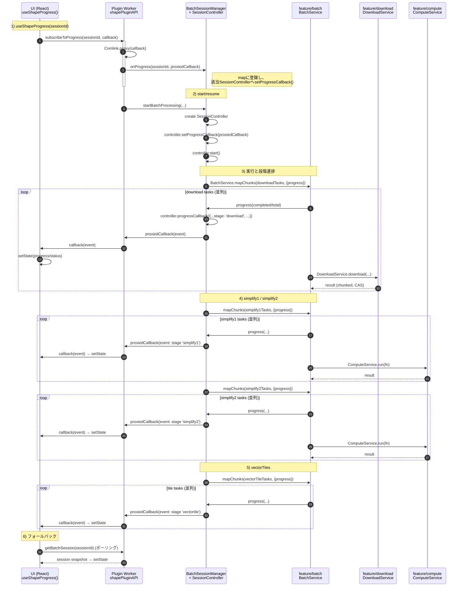

@hierarchidb/shape-plugin
=========================

Shape バッチ機能の新アーキテクチャ概要と利用メモ。

全体像（段階）
---------------
- download → simplify1 → simplify2 → vectorTiles の段階実行。
- 構成要素（feature への依存）
  - download: `@hierarchidb/download`（DownloadService, FetchNetworkPort, DexieChunkStoragePort）
  - auth: `@hierarchidb/auth-recovery`（401復帰, fetchWithAuth, setToken）
  - compute: `@hierarchidb/compute`（タスク実行）
  - batch: `@hierarchidb/batch`（段階並列・進捗）
  - source/view: `@hierarchidb/map-source`, `@hierarchidb/map-view`（任意）

ダウンロード
------------
- `DownloadWorker` は DownloadService を優先使用（Dexieへチャンク保存→ `readAll()` で解析）
- HTTP は `auth.fetchWithAuth()` 経由に統一（401時は UI 復帰後に自動再試行）

簡約処理
--------
- simplify1: Douglas–Peucker + 最小面積フィルタで `simplifiedBuffers(stage="simplify1")` に永続
- simplify2: ズーム別統計・準備（`simplifiedBuffers(stage="simplify2")`）
- vectorTiles: 必要最低限の MVT ダミー生成（テスト通過の最小実装）。本実装は今後段階的に置換可能。

認証連携（UI）
---------------
- UI 起動時に `registerAuthUIHandlers(prompt)` を登録（`@hierarchidb/ui-auth`）。
- サインイン/更新時は `setShapeAuthToken(token, 'Bearer', expiresAt)` を呼び、以後の HTTP に Authorization を付与。

進捗/通知
---------
- 各段階は `BatchSessionManager` から進捗イベントを発行（25/50/75/100%）。
- 401 発生時は `AuthRequired` 通知を UI に送出し、`AuthSuccess`/`AuthCancelled` で処理再開/中断。

進捗イベントのシーケンス（UI/Worker/feature 連携）
----------------------------------------------
以下は「プラグイン側 Worker」「プラグイン側 UI」「feature/batch」「feature/download」「feature/compute」の5者で、バッチ進捗イベントが購読・通知される仕組みを示したシーケンス図です。

要点
- 購読の起点: UIは `useShapeProgress()` が `shapePluginAPI.subscribeToProgress()` を呼び、Comlink経由のコールバックをWorkerに登録します。
- Worker→Managerの配線: `BatchSessionManager.onProgress()` がセッションIDに対するコールバックを保持し、該当セッションの `SessionController.setProgressCallback()` に接続します。
- 実行と進捗: `SessionController` は `@hierarchidb/batch` の `BatchService.mapChunks()` を段階ごとに呼び出し、並列処理の進捗（completed/total）を受け取り、保持している `progressCallback` を通じてUIへComlinkで中継します。
- 実タスク: download段は `@hierarchidb/download`（ネットワーク/チャンク保存/CAS）、simplify段は `@hierarchidb/compute`（CPU計算）を使用。WorkerPoolの各Workerはこれらを内部で利用します。
- フォールバック: Comlink購読が使えない環境でも、`useShapeProgress` は `getBatchSession()` によるポーリングでUI表示を維持します。

今後の改善余地
--------------
- vectorTiles: 本実装（MVT エンコード/圧縮）とキャッシュ（CAS）
- simplify2: タイル境界クリップの導入
- map-source: R木/LOD で抽出高速化

依存管理とインポート規約（重要）
--------------------------------
共通方針は packages/node-type/CONTRIBUTING.md を参照。要点:
- peerDependencies: react, react-dom, @mui/material, @mui/icons-material, @emotion/react, @emotion/styled, dexie, （必要時）maplibre-gl, react-i18next, i18next
- dependencies: @hierarchidb/util、必要に応じて @hierarchidb/feature/*（例: @hierarchidb/table-metadata など）
- devDependencies: typescript/tsup/vitest/@testing-library/*/@types/*
- import は公開API、型は `import type`、重い処理は dynamic import。
- tsup external は共通設定で外部化済み。
