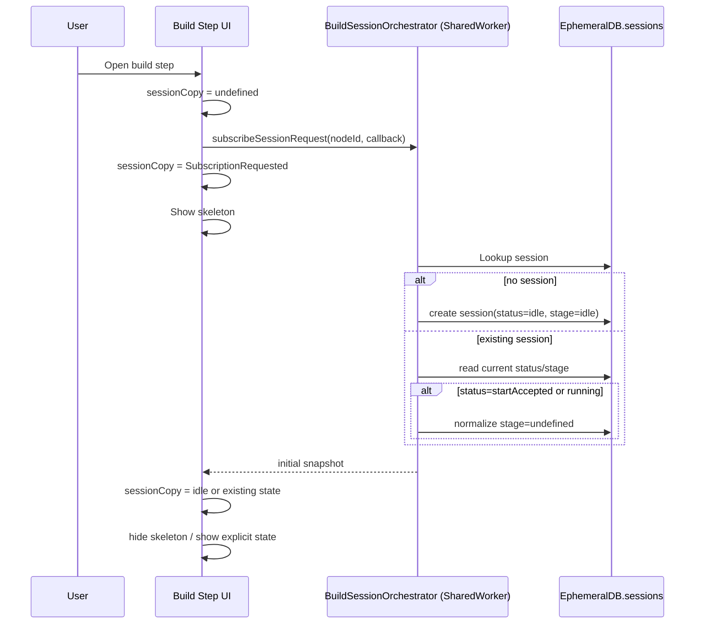
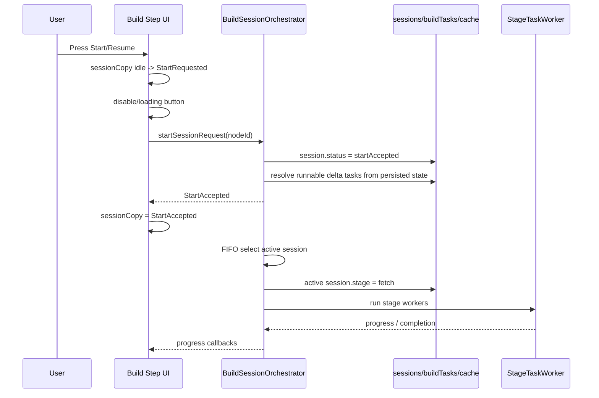
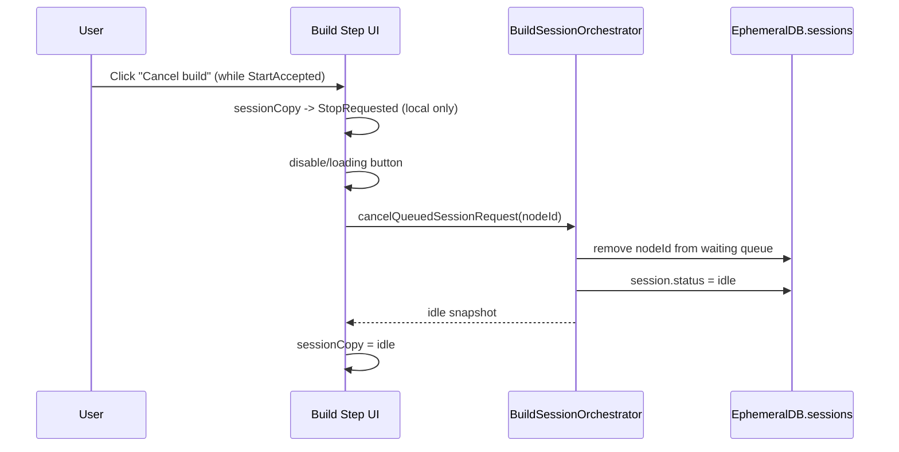
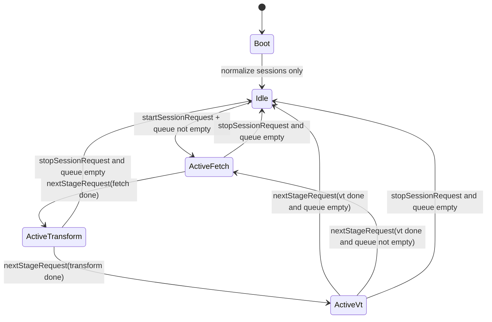

# Build Session Dialog Flow / BuildSessionOrchestrator State Transitions

## 1. Purpose

This document defines build-session state transitions as a cross-plugin runtime contract.

- UI-side copy state per dialog/tab
- Persisted session state in EphemeralDB (`sessions` table)
- SharedWorker singleton runtime state (`BuildSessionOrchestrator`)

This specification is shared by shape/route and future build-session plugins.

## 2. Scope and Assumptions

- Build execution is **SharedWorker-only**.
- Users can press `Start` for multiple nodes concurrently.
- Session is keyed by `nodeId`.
- SharedWorker remains alive while at least one tab is open.
- After `all tabs closed` or crash (`SharedWorker/Session process/browser`), runtime does not auto-resume.

## 3. Terminology (Unified)

- `BuildSessionOrchestrator`:
  - SharedWorker in-memory singleton that selects active session, advances stage, and controls StageTaskWorkers.
- `SessionCoordinator`:
  - Tab/session coordination term. Not used as the execution orchestrator name.
- `persistedStatus`:
  - Durable status in `sessions.status`.
- `runtimeStatus`:
  - In-memory status used for live UI/runtime reflection.
- `stage`:
  - Build stage (`fetch | transform | vt | idle | undefined`).
- `phase`:
  - Runtime phase (`starting`, `running`, `pausing`, ...).
- `StartAccepted`:
  - UI-visible accepted state label. Corresponding persisted value is `startAccepted`.
- `Build request`:
  - UI labels may be `Start` or `Resume`, but runtime semantics are identical.
  - There is no `full|incremental` mode split.
- `StartRequested` / `StopRequested`:
  - UI-local transient states only.
  - Not persisted to `sessions`.

## 4. Core Policy

### 4.1 No Auto Resume After Abnormal End

On SharedWorker/Session initialization:

- If persisted session is `startAccepted` or `running`, treat it as abnormal residue.
- Normalize to `status=idle` and `stage=undefined`.
- Do not enqueue/run automatically.
- User must explicitly request `Start/Resume`.

### 4.2 Start/Resume Path Is Always Incremental

`Start` and `Resume` are not separate execution paths.

- Always run the same incremental path.
- This applies to all conditions:
  - Clean initial state
  - Cache-deleted state
  - Session-reset state
- The orchestrator resolves runnable tasks from current persisted task/cache/artifact state and executes required deltas.

### 4.3 Single Entry Semantics (No Resume Mode)

- Runtime accepts one semantic entry: `startSessionRequest(nodeId)`.
- `Resume` is a UI label only; it maps to the same request path.
- Regardless of current condition (initial / cache deleted / session reset), execution route is identical:
  1. Re-evaluate persisted session/task/cache/artifact state
  2. Derive runnable delta tasks
  3. Execute stage pipeline on derived deltas

## 5. State Models

### 5.1 UI Copy State

- `undefined`
- `SubscriptionRequested`
- `idle`
- `StartRequested`
- `StartAccepted`
- `Running(fetch|transform|vt)`
- `StopRequested`
- `Stopped`
- `Completed`
- `Failed`

Notes:

- UI `idle` means subscribe negotiation is completed for that UI instance.
- It does not imply other tabs are subscribed.
- `StartRequested` and `StopRequested` exist only for immediate button UX feedback (`disabled/loading`).

### 5.2 Persisted Session State (`sessions`)

Minimum fields:

- `status`: `idle | startAccepted | running | completed | failed`
- `stage`: `undefined | idle | fetch | transform | vt`
- `updatedAt`
- `progress`

Notes:

- `stage=undefined` means normalized abnormal residue (not runnable until explicit request).
- Runnable queue source is sessions accepted for execution and not normalized out.

## 6. Build Step Initialization Sequence

## 7. Build Request Sequence (Start/Resume UI, Single Runtime Path)

## 8. Queue Cancel Sequence (Queued Session Removal)

Notes:

- This API is for queued sessions (`startAccepted`) waiting in FIFO.
- If the session has already become active (`running`), treat `cancelQueuedSessionRequest(nodeId)` as `stopSessionRequest(nodeId)`.

## 9. Multi-Node Concurrent Start

- Users can issue Start on multiple nodes concurrently.
- Each node has an independent persisted session.
- BuildSessionOrchestrator keeps a single FIFO queue across all nodes/plugins.
- Arbitration is first-come-first-served.
- Request logging is optional (debug/diagnostics), not a required runtime contract.
- Stage progression per active session: `idle -> fetch -> transform -> vt -> idle/completed`.

## 10. BuildSessionOrchestrator Responsibilities

- Provide SharedWorker-side session control APIs.
- Keep `sessions` and `buildTasks` consistent.
- Select active session (FIFO).
- Start/stop appropriate StageTaskWorkers by stage.
- Normalize abnormal residue during bootstrap.
- Advance stage/session via `nextStageRequest`.
- Publish runtime updates to subscribers.
- On `startSessionRequest`, clear existing `buildTasks` for the node and rebuild initial fetch tasks.

### 10.1 Public API (Logical Names)

- `subscribeSessionRequest`
- `startSessionRequest`
- `stopSessionRequest`
- `cancelQueuedSessionRequest`
- `nextStageRequest`

Notes:

- `stopSessionRequest` corresponds to UI-local `StopRequested` handling and completion back to `idle`.

## 11. BuildSessionOrchestrator Runtime State

## 12. StageTaskWorker Model

- Each StageTaskWorker dequeues one task from the stage queue and processes it.
- When the final task in the stage queue completes, it calls `nextStageRequest`.
- BuildSessionOrchestrator decides:
  - advance same session to next stage,
  - switch to next queued session,
  - or become idle.

## 13. Heartbeat and Progress Notification

- Heartbeat is used to represent that build execution is still alive.
- Heartbeat update triggers:
  - persisted elapsed-time update
  - UI elapsed-time refresh
- Detailed progress notification contract is intentionally not globally fixed.
- Stage/task implementations define concrete progress message granularity based on work characteristics.

## 14. Session Reset Scope and Data Deletion

- Session reset from UI includes:
  - `buildTasks`
  - caches
  - generated artifacts (e.g., vector tiles)
  - metadata
- Individual deletion menus for cache/metadata/artifacts remain explicit UI operations.
- `buildTasks` are cleared on session restart path regardless.

## 15. Tab/Dialog/Step Transition Behavior

| Action | Build Execution | Subscription | Expected Behavior |
| --- | --- | --- | --- |
| Close build dialog during build | Continues | This UI can unsubscribe | Re-open build step -> re-subscribe and sync |
| Move to non-build step during build | Continues | Build step unmount may unsubscribe | Back to build step -> re-subscribe and sync |
| Close one tab (others remain) | Continues | Only that tab unsubscribes | Other tabs continue receiving updates |
| Close all tabs during build | Stops (SharedWorker ends) | All unsubscribed | Next launch: normalize `startAccepted/running -> idle + stage=undefined`, no auto-resume |
| SharedWorker/session/browser crash | Stops | Connection lost | Next launch: same normalization, manual Start/Resume required |

## 16. Fatal Error Policy

- If UI detects Worker communication loss, treat as fatal for current runtime.
- UI fully locks continuation controls and prompts user to reload/restart browser.
- After reload, no auto-resume. User explicitly selects node and triggers Start/Resume.

## 17. Notes for Implementation Mapping

Logical API names in this spec map to concrete runtime-worker and plugin bridge APIs.
Keep naming aligned with section 3 terminology when updating code or docs.
