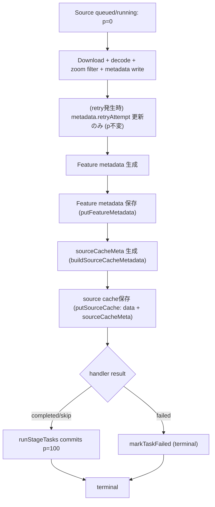
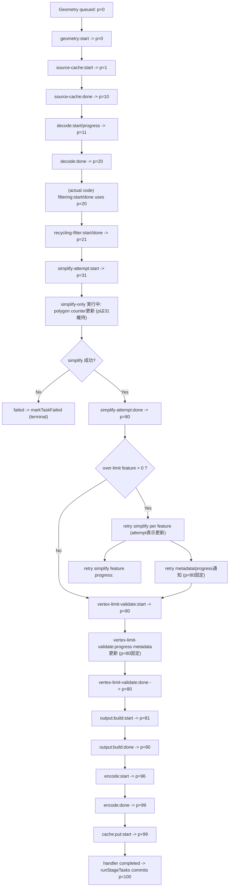
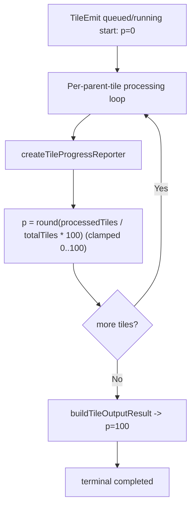
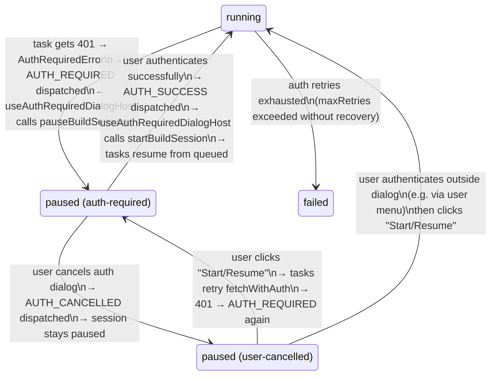

# Build Session Orchestrator State Transitions (4-Table Normalized Model)

## 1. Purpose

This document is the implementation-aligned reference for build-session state transitions,
persistence, event publication, and UI consumption.

This version is based on the normalized EphemeralDB model used in current runtime code:

- `buildSessionConfigs` (immutable config)
- `buildSessionHeartbeats` (heartbeat)
- `buildSessionStatuses` (session status)
- `buildStageStatuses` (stage status/history)

Terminology authority:

- `build-session-terminology-ssot.md`

If this file conflicts with SSOT terminology, SSOT vocabulary wins.

## 2. Scope and Assumptions

- Build execution is SharedWorker-driven.
- Session identity is `nodeId`.
- Session persistence is normalized across 4 tables, not a single `sessions` table.
- Task list persistence is separate (`buildTasks`) and is used to reconstruct progress/stage summary.
- This document describes the implementation currently used by runtime-worker + shape plugin + UI bridge.

## 3. Data Model (Normalized Persistence)

### 3.1 Tables and Responsibilities

1. `buildSessionConfigs`
- Role: immutable session configuration.
- Key fields: `nodeId`, `domainType`, selection snapshot, `startedAt`, `sourceStageMaxima`.
- Intended write pattern: create once at session upsert; no heartbeat/status churn.

2. `buildSessionHeartbeats`
- Role: high-frequency liveness timestamp.
- Key fields: `nodeId`, `lastHeartbeatAt`.
- Intended write pattern: periodic overwrite during active session.

3. `buildSessionStatuses`
- Role: session-level lifecycle status.
- Key fields: `nodeId`, `status`, `stopReason`, `completedAt`.
- Intended write pattern: status transitions.

4. `buildStageStatuses`
- Role: per-stage execution status and stage timing.
- Key fields: `id=${nodeId}:${stage}`, `stage`, `status`, `startedAt`, `completedAt`, `inactiveMs`, `stageId`.
- Intended write pattern: stage transition/completion updates.

Reference:
- `packages/gis-sdk/src/ephemeral/EphemeralDBRecordTypes.ts`

### 3.2 Canonical Read Model

Consumers that need the legacy unified session view reconstruct it from normalized tables + tasks:

- Parallel read from `buildSessionConfigs`, `buildSessionHeartbeats`, `buildSessionStatuses`, `buildStageStatuses`, `buildTasks`
- Stage summary/progress computed from task records
- Current stage resolved by latest `buildStageStatuses.startedAt`

Reference:
- `packages/gis-sdk/src/ephemeral/sessionHelpers.ts`

## 4. Persistence Lifecycle (Write/Read/Delete)

## 4.1 Session Create / Upsert

`upsertBuildSession(session)` splits one logical session into normalized rows and writes in parallel:

- `buildSessionConfigs.put(config)`
- optional `buildSessionHeartbeats.put(heartbeat)`
- `buildSessionStatuses.put(status)`
- optional `buildStageStatuses.put(stageStatus)`

Then it publishes broadcast notification (`build-session-update`).

Reference:
- `packages/runtime-worker/src/services/ShapeMutationService.ts`

## 4.2 Incremental Session Update

`updateBuildSession(nodeId, updates)` applies partial updates by table responsibility:

- Heartbeat fields -> `buildSessionHeartbeats`
- Status fields -> read current status then `put` merged `buildSessionStatuses`
- Stage fields -> read current stage status then `put` merged `buildStageStatuses`

Then it publishes broadcast notification (`build-session-update`).

References:
- `packages/runtime-worker/src/services/ShapeMutationService.ts`
- `packages/runtime-worker/src/services/buildSessionBroadcastUtils.ts`

## 4.3 Session Read

Session read APIs query normalized tables and reconstruct unified response for caller compatibility.

References:
- `packages/runtime-worker/src/services/ShapeQueryService.ts`
- `packages/gis-sdk/src/ephemeral/sessionHelpers.ts`

## 4.4 Session Delete / Cleanup

`deleteBuildSession(nodeId)` deletes from all 4 tables and publishes a `deleted` broadcast state.

- `buildSessionConfigs.delete(nodeId)`
- `buildSessionHeartbeats.delete(nodeId)`
- `buildSessionStatuses.delete(nodeId)`
- `buildStageStatuses.where('nodeId').equals(nodeId).delete()`

Node-level cleanup also clears these tables via `clearNodeData`.

References:
- `packages/runtime-worker/src/services/ShapeMutationService.ts`
- `packages/gis-sdk/src/ephemeral/EphemeralDB.ts`

## 5. Runtime/Event Model

Runtime emits/serves two groups of notifications.

## 5.1 Cross-tab BroadcastChannel (runtime-worker level)

Channel: `hdb:runtime-worker:build-sessions`

Event: `build-session-update`

Payload:
- `nodeId`
- `status`
- `updatedAt` (envelope timestamp)

Used for coarse cross-context awareness when persistence changes.

Reference:
- `packages/runtime-worker/src/services/buildSessionBroadcastUtils.ts`

## 5.2 Shape Build Session Event Channels (shape worker API)

Shape worker runtime keeps per-node callback registries for 4 channels:

1. Session state
- API: `subscribeToSessionState(nodeId, cb)`
- Payload: `SessionStateChangeEvent` including full `sessionRecord`.
- Typical trigger: `upsertBuildSessionSnapshot` status update path.

2. Stage snapshot
- API: `subscribeToStageSnapshots(nodeId, cb)`
- Payload: `StageSnapshotEvent` (`stageId`, `snapshot`).
- Typical trigger: snapshot emission path while building progress payload from tasks.

3. Heartbeat
- API: `subscribeToHeartbeat(nodeId, cb)`
- Payload: `SessionHeartbeatEvent`.
- Typical trigger: timer (`HEARTBEAT_INTERVAL_MS=1000`) while callback is registered.

4. Task progress
- API: `subscribeToTaskProgress(nodeId, cb)`
- Payload: `TaskProgressEvent` per task update.
- Typical trigger: task/status updates inside runtime metrics/update flow.

References:
- `plugins/shape-plugin/src/worker/api/shapeBuildAPI.ts`
- `plugins/shape-plugin/src/worker/api/eventEmissionConstants.ts`
- `plugins/shape-plugin/src/worker/api/shapeBuildRuntimeExecutionControl.ts`
- `plugins/shape-plugin/src/common/types/session-events.ts`

## 5.3 Canonical Shape Task Delivery

Shape UI task rendering uses the stage snapshot and task progress channels listed
above through `BuildWorkerBridge.subscribeAll`:

- `subscribeStageSnapshots(nodeType, nodeId, cb)` delivers authoritative
  `stageSnapshotUpdated` full replacements.
- `subscribeTaskProgress(nodeType, nodeId, cb)` delivers `taskProgressUpdated`.
- task progress ordering is scoped to each `taskId`; equal or lower versions are
  dropped.

`subscribeBuildTasks` is a compatibility no-op for Shape and is not a UI SSOT.

References:
- `packages/ui/worker-client/src/workerBridge.ts`
- `plugins/shape-plugin/src/ui/components/build-progress/useShapeBuildSessionStateAtomBridge.ts`

## 6. UI Consumption Model

## 6.1 Session List / Runtime Snapshot UI

`useBuildSessionSnapshots` subscribes to in-progress runtime records and deduplicates updates by signature.

Reference:
- `packages/ui/build-sessions/src/hooks/useBuildSessionSnapshots.ts`

## 6.2 Unified Progress UI

`useBuildProgressState` consumes build state supplied by the canonical session,
stage-snapshot, and task-progress delivery paths. `subscribeBuildProgress` is not a
canonical worker method.

Reference:
- `packages/ui/build-sessions/src/hooks/useBuildProgressState.ts`

## 6.3 Shape Step Task UI (primary task SSOT path)

`useShapeBuildSessionStateAtomBridge`:

- acquires the five Shape channels with `BuildWorkerBridge.subscribeAll`
- applies `stageSnapshotUpdated` as a full stage replacement
- gates `taskProgressUpdated` by monotonically increasing per-task version
- ignores callbacks after effect cancellation and disposes the acquired subscription
- requires a fresh subscription and authoritative snapshot when the build step mounts again

Reference:
- `plugins/shape-plugin/src/ui/components/build-progress/useShapeBuildSessionStateAtomBridge.ts`

## 6.4 Stage transition synchronization (`ui-initializing`)

Current Shape UI behavior for multi-stage runs (`source -> geometry -> tileEmit`):

1. Session lifecycle remains worker-driven (`session.phase`), usually `running` during execution.
2. UI maintains a stage-local sync substate:
   - `ui-initializing`: waiting for stage task snapshot acceptance.
   - `running`: snapshot accepted, normal progress rendering.
3. On stage transition detection (from progress stage or session record stageId):
   - set target stage to `ui-initializing`
   - buffer target-stage progress events without applying them
   - request/accept task snapshot
   - switch target stage to `running`
   - flush buffered progress on `requestAnimationFrame`

Rationale:

- Prevents pre-snapshot progress from being rendered against stale task lists.
- Keeps session lifecycle and UI synchronization concerns separate.
- Supports repeated transitions:
  - `running + source(ui-initializing -> running)`
  - `running + geometry(ui-initializing -> running)`
  - `running + tileEmit(ui-initializing -> running)`

### 6.4.1 Progress Value Handling Matrix (Transposed)

This matrix documents how UI task-state logic reacts to incoming `progress` values.
The primary implementation path is:

1. `p_raw` (incoming event payload)
2. `p_num = resolveProgressValue(p_raw)`
3. `status_norm = resolveTaskDisplayStatus(status_raw, p_num, ...)`
4. `progress_norm = resolveTaskProgress(status_norm, ..., p_num)`
5. update acceptance by `shouldPreferNextTask(current, next)`

Transposed matrix (rows are processing steps, columns are raw progress ranges):

| Processing step | `p_raw` is missing / NaN / non-number | `p_raw < 0` | `0 <= p_raw < 100` | `p_raw = 100` | `p_raw > 100` |
| --- | --- | --- | --- | --- | --- |
| Numeric validation (`resolveProgressValue`) | error (`invalid progress`) | error (`invalid progress`) | accept as-is | accept as-is | error (`invalid progress`) |
| Status auto-promotion (`resolveTaskDisplayStatus`, only when `status_raw=running`) | not reached (error) | not reached (error) | keeps `running` | becomes `completed` | not reached (error) |
| Status preservation (`status_raw` is not `running`) | not reached (error) | not reached (error) | keeps original status | keeps original status (but may fail next step) | not reached (error) |
| Canonical progress (`resolveTaskProgress`) | not reached (error) | not reached (error) | returns input value | returns `100` only if terminal/skipped; otherwise error (`non-running task reached 100`) | not reached (error) |
| Terminal side-effect (`onTaskTerminalProgressUpdate`) | not triggered | not triggered | triggered only if normalized task is terminal | triggered (running->completed case or already terminal) | not triggered |

Stage-specific flowcharts (`0..100` progression with concrete algorithm bands):

Geometry `31-80` (implementation-aligned detail):

- `p=31`:
  - `simplify-attempt:start` を通知して簡略化本体を開始。
- `p=31` のまま:
  - `simplifyOnlyCollection` 実行中。`processedPolygons/totalPolygons` は更新されるが、progress は増やしていない。
- `p=80`:
  - `simplify-attempt:done` / `simplify-only:done` で 80 に到達。
- `p=80` のまま:
  - `vertex-limit-retry:start`
  - `retry simplify feature progress: <attempt>`（attempt番号は message/display 用）
  - `vertex-limit-validate:start/progress/done`（進捗は metadata 側で `processedFeatures` を更新）
- この設計では `31..79` の中間値は現在使っていない（進捗の細分化は未実装）。

Notes:

- `progress` is strict-contract in UI ingest: only finite `0..100` is accepted.
- `progress=100` for non-terminal non-running status is treated as contract violation.
- Skipped display payloads are treated as terminal (`progress=100`) in the same normalization pass.

Update-acceptance matrix (next task vs current task after normalization):

| Comparison key | `next < current` | `next = current` | `next > current` |
| --- | --- | --- | --- |
| Progress monotonic guard (`shouldApplyTaskUpdate`) | reject update | tie-break by status rank / terminal promotion rule | accept update |

Additional acceptance guards:

- If current task is terminal (`completed` / `failed` / skipped), non-terminal regressions are rejected.
- Completed-at-100 tasks are preserved unless next payload provides a strictly better terminal message/display payload.
- Retry restart (`failed/skipped -> queued/running`) is explicitly allowed.

References for this section:

- `plugins/shape-plugin/src/ui/components/build-progress/useShapeBuildTaskSync/useShapeBuildTaskSync.comparisonUtils.ts`
- `plugins/shape-plugin/src/ui/components/build-progress/useShapeBuildTaskSync/useShapeBuildTaskSync.task-utils.ts`
- `plugins/shape-plugin/src/ui/components/build-progress/useShapeBuildTaskSync/useShapeBuildTaskSyncResolver.ts`
- `plugins/shape-plugin/src/ui/components/build-progress/useShapeBuildTaskSync/useShapeBuildTaskSyncEventHandlers.ts`

## 6.5 Shape Session State UI

`useShapeBuildSessionState`:

- initial load by query API (`getBuildSessionRecord`)
- subscribes to `subscribeSessionState` and updates `sessionRecord`
- subscribes to `subscribeSessionHeartbeat` for activity events

Reference:
- `plugins/shape-plugin/src/ui/components/build-progress/internal/useShapeBuildSessionState.ts`

## 7. Transition Semantics (Implementation-Aligned)

## 7.1 Start / Resume

- UI control intent (`Start`/`Resume`) maps to the same runtime command path.
- Persistence updates are applied to normalized status/stage/heartbeat tables through session snapshot upsert/update flow.
- Task stream emits `snapshot` then incremental `update` events.

## 7.2 Pause / Cancel Queued

- Pause and queue cancel are distinct control intents.
- Persistence reflects resulting status in `buildSessionStatuses` and relevant stage/timing updates.
- UI state follows worker events + reconstructed session read model.

## 7.3 Completion / Failure

- Terminal status persisted in `buildSessionStatuses`.
- Stage completion/timing persisted in `buildStageStatuses`.
- Task stream reaches terminal updates for tasks/stages.

## 7.4 Session Removal

- Explicit session deletion removes all 4 normalized rows.
- Broadcast emits a `deleted` state for cross-context awareness.

## 7.5 BFF Authentication Expiry During Build

When BFF authentication is fully expired, build tasks encounter HTTP 401 errors.
The following state transitions describe the auth-recovery flow.

### 7.5.1 State Transition Diagram

### 7.5.2 Component Responsibilities

| Layer | Component | Responsibility |
| --- | --- | --- |
| Worker (task execution) | `runStageTasks` | Catches `AuthRequiredError`, requeues task to `queued` with `metadata.authState='required'` |
| Worker (fetch) | `AuthService.fetchWithAuth` | Detects 401, calls `awaitAuth` which dispatches `AUTH_REQUIRED` and throws `AuthRequiredError` |
| Worker (fetch) | `AuthService.awaitAuth` | Dispatches `AUTH_REQUIRED` notification and throws `AuthRequiredError` |
| Worker (fetch) | `AuthService.onAuthSuccess` | Persists new token to storage via `setToken` |
| UI (root) | `useAuthRequiredDialogHost` | Receives `AUTH_REQUIRED` → calls `pauseBuildSession` → shows `AuthRequiredDialog`. Uses `activeRequestIdRef` to ensure only one dialog at a time. Uses `pendingCountBySessionRef` to track parallel requests per session. |
| UI (root) | `useAuthRequiredDialogHost` | On `AUTH_SUCCESS` → calls `startBuildSession` to resume (only when all pending requests for the session are resolved) |
| UI (root) | `useAuthRequiredDialogHost` | On `AUTH_CANCELLED` → session stays `paused`, no auto-resume |

### 7.5.3 Invariants

1. Only one `AuthRequiredDialog` is shown at a time (controlled by `activeRequestIdRef` in `useAuthRequiredDialogHost`).
2. Parallel tasks dispatching `AUTH_REQUIRED` for the same session are deduplicated by `pendingCountBySessionRef`; `pauseBuildSession` is called only on the first request.
3. Session status transitions are persisted in `buildSessionStatuses` (SSOT); no React-local state drives session lifecycle.
4. The `authDialogOpen` / `closeAuthDialog` / `handleProviderSelect` in shape plugin step logic are not used; auth dialog is hosted at root route level only.

### 7.5.4 Sequence (BFF auth expired → cancel → retry)

1. User clicks "Start Build"
2. `executeStartOrResumeFlow` → `startBuildSession` → tasks begin executing
3. Task calls `fetchWithAuth` → 401 → `awaitAuth` dispatches `AUTH_REQUIRED` → throws `AuthRequiredError`
4. `runStageTasks` catches error, requeues task with `authState: 'required'`
5. `useAuthRequiredDialogHost.onAuthRequired` calls `pauseBuildSession('auth-required')` → session status = `paused`
6. `AuthRequiredDialog` opens
7a. User authenticates successfully → `AUTH_SUCCESS` dispatched
8a. `AuthService.onAuthSuccess` persists new token via `setToken(newToken, tokenType, expiresAt)` to shared storage (uiStorage or localStorage)
9a. `useAuthRequiredDialogHost.onAuthSuccess` calls `startBuildSession` → tasks resume from queued
7b. User clicks Cancel → `AUTH_CANCELLED` dispatched
8b. `useAuthRequiredDialogHost.onAuthCancelled` closes dialog, session remains `paused`
9b. User clicks "Start Build" again → tasks retry `fetchWithAuth` → 401 → `AUTH_REQUIRED` → dialog shown again

References:

- `packages/auth/src/AuthService.ts`
- `packages/vt-orchestrator/src/runStageTasks.ts`
- `app/src/contexts/useAuthRequiredDialogHost.ts`
- `packages/ui/auth/src/components/AuthRequiredDialog.tsx`

## 8. Known Gaps and Non-Uniform Paths

1. BroadcastChannel `build-session-update` is coarse-grained and does not replace task/progress/session-detail streams.

2. This document describes the currently implemented shape-oriented session event model; route/location adoption may still differ by implementation surface.

## 9. Verification Pointers

Use these files as source of truth when updating this document:

- `packages/gis-sdk/src/ephemeral/EphemeralDBRecordTypes.ts`
- `packages/gis-sdk/src/ephemeral/sessionHelpers.ts`
- `packages/runtime-worker/src/services/ShapeMutationService.ts`
- `packages/runtime-worker/src/services/buildSessionBroadcastUtils.ts`
- `plugins/shape-plugin/src/worker/api/eventEmissionConstants.ts`
- `plugins/shape-plugin/src/worker/api/shapeBuildRuntimeExecutionControl.ts`
- `plugins/shape-plugin/src/worker/api/shapeBuildAPI.ts`
- `packages/ui/worker-client/src/workerBridge.ts`
- `packages/ui/build-sessions/src/hooks/useBuildSessionSnapshots.ts`
- `packages/ui/build-sessions/src/hooks/useBuildProgressState.ts`
- `plugins/shape-plugin/src/ui/components/build-progress/internal/useShapeBuildSessionState.ts`
- `plugins/shape-plugin/src/ui/components/build-progress/useShapeBuildSessionStateAtomBridge.ts`
- `plugins/shape-plugin/src/ui/components/build-progress/useShapeBuildTaskSync/useShapeBuildTaskSync.comparisonUtils.ts`
- `plugins/shape-plugin/src/ui/components/build-progress/useShapeBuildTaskSync/useShapeBuildTaskSync.task-utils.ts`
- `plugins/shape-plugin/src/ui/components/build-progress/useShapeBuildTaskSync/useShapeBuildTaskSyncResolver.ts`
- `plugins/shape-plugin/src/ui/components/build-progress/useShapeBuildTaskSync/useShapeBuildTaskSyncEventHandlers.ts`
