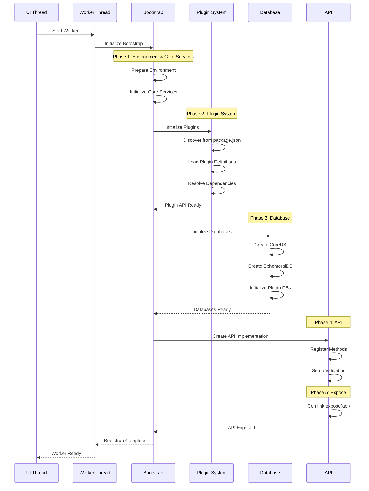

# Worker Runtime Architecture

## ディレクトリ構造と初期化フロー

```
packages/runtime/worker/src/
├── 1-bootstrap/                    # Phase 1: ブートストラップ＆コアサービス
│   ├── WorkerEntryPoint.ts            # Workerエントリーポイント
│   ├── WorkerBootstrapper.ts          # メインブートストラッパー
│   ├── InitializationSequence.ts      # 初期化シーケンス管理
│   ├── BootstrapConfig.ts             # 設定定義
│   └── core-services/                 # コアサービス（bootstrap内で初期化）
│       ├── TreeService.ts             # ツリー操作サービス
│       ├── NodeService.ts             # ノード操作サービス  
│       ├── EntityService.ts           # エンティティサービス
│       └── CommandService.ts          # コマンドサービス
│
├── 2-plugin-system/                # Phase 2: プラグインシステム
│   ├── PluginSystemInitializer.ts     # プラグイン初期化メイン
│   ├── PluginDiscoveryService.ts      # package.jsonからの探索
│   ├── PluginLoader.ts                # プラグインロード
│   └── PluginRegistration.ts          # プラグイン登録
│
├── 3-database/                     # Phase 3: データベース
│   ├── DatabaseInitializer.ts         # DB初期化メイン
│   ├── CoreDatabaseManager.ts         # CoreDB管理
│   ├── EphemeralDatabaseManager.ts    # EphemeralDB管理
│   └── PluginDatabaseInitializer.ts   # プラグインごとのDB初期化
│
├── 4-api-implementation/           # Phase 4: API実装
│   ├── WorkerAPIImpl.ts               # WorkerAPI実装
│   ├── APIMethodRegistry.ts           # APIメソッド登録
│   ├── APIValidator.ts                # API検証
│   └── ComlinkExposer.ts              # Comlink公開
│
├── 5-operations/                   # 業務ロジック実装（APIから呼ばれる）
│   ├── TreeOperations.ts              # ツリー操作の具体実装
│   ├── NodeOperations.ts              # ノード操作の具体実装
│   ├── EntityOperations.ts            # エンティティ操作の具体実装
│   └── WorkingCopyTreeNodeOperations.ts       # ワーキングコピー操作
│
├── worker.ts                       # Workerメインファイル
└── index.ts                        # パッケージエクスポート
```

## 初期化シーケンス



## 各フェーズの詳細

### Phase 1: Bootstrap & Core Services
**場所**: `1-bootstrap/`

1. **環境準備**
   - IndexedDB確認
   - Comlink準備
   - グローバル設定

2. **コアサービス初期化**
   - TreeService: ツリー構造管理
   - NodeService: ノード操作
   - EntityService: エンティティ管理  
   - CommandService: コマンド実行

### Phase 2: Plugin System
**場所**: `2-plugin-system/`

1. **プラグイン探索**
   - package.jsonから自動探索
   - 静的リストからロード

2. **プラグイン初期化**
   - 定義作成
   - 依存関係解決
   - ハンドラー登録

### Phase 3: Database
**場所**: `3-database/`

1. **CoreDB初期化**
   - 永続化データストア
   - TreeEntity, NodeEntity等

2. **EphemeralDB初期化**
   - 一時データストア
   - WorkingCopy等

3. **プラグインDB初期化**
   - 各プラグイン固有のDB
   - Dexieスキーマ適用

### Phase 4: API Implementation
**場所**: `4-api-implementation/`

1. **API実装作成**
   - WorkerAPIインターフェース実装
   - サービス連携

2. **Comlink公開**
   - API露出
   - RPC準備

### Phase 5: Operations
**場所**: `5-operations/`

APIから呼ばれる具体的な業務ロジック実装：
- 複雑なツリー操作
- トランザクション処理
- バッチ処理

## 設定

```typescript
interface BootstrapConfig {
  // デバッグ設定
  debug?: boolean;
  
  // プラグイン設定
  plugins?: {
    autoDiscover?: boolean;
    discoveryStrategy?: 'package-json' | 'static';
    staticPlugins?: string[];
  };
  
  // データベース設定
  database?: {
    coreName?: string;
    ephemeralName?: string;
    version?: number;
  };
  
  // サービス設定
  services?: {
    enableCache?: boolean;
    enableValidation?: boolean;
  };
  
  // タイムアウト設定
  timeouts?: {
    total?: number;
    plugin?: number;
    database?: number;
  };
}
```

## エラーハンドリング

各フェーズでエラーが発生した場合：

1. **ログ記録**: 詳細なエラー情報を記録
2. **通知**: メインスレッドにエラー通知
3. **クリーンアップ**: 部分的に初期化されたリソースを解放
4. **終了**: Workerを安全に終了

## デバッグ

```typescript
// デバッグモード有効化
const config: BootstrapConfig = {
  debug: true
};
```

デバッグ出力例：
```
[2024-01-01T00:00:00.000Z] [WorkerBootstrapper] ===== Worker Bootstrap Starting =====
[2024-01-01T00:00:00.100Z] [WorkerBootstrapper] Phase 1: Preparing environment...
[2024-01-01T00:00:00.200Z] [WorkerBootstrapper] Phase 2: Initializing plugin system...
[2024-01-01T00:00:00.500Z] [WorkerBootstrapper] Found 9 plugins
[2024-01-01T00:00:00.700Z] [WorkerBootstrapper] Phase 3: Initializing databases...
[2024-01-01T00:00:01.000Z] [WorkerBootstrapper] Phase 4: Initializing core services...
[2024-01-01T00:00:01.200Z] [WorkerBootstrapper] Phase 5: Creating API implementation...
[2024-01-01T00:00:01.300Z] [WorkerBootstrapper] Phase 6: Exposing API via Comlink...
[2024-01-01T00:00:01.400Z] [WorkerBootstrapper] ===== Worker Bootstrap Complete (1400ms) =====
```