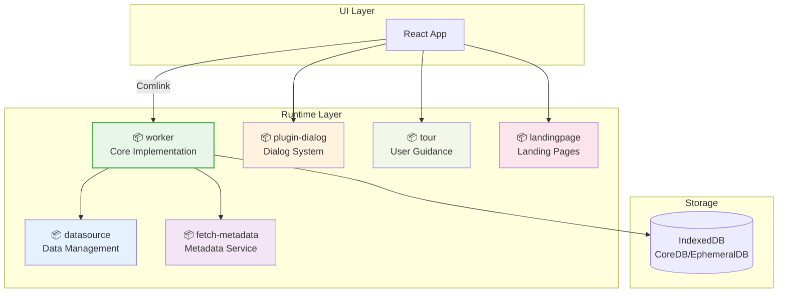

# Runtime Packages

HierarchiDB のランタイム実行環境を構成するパッケージ群です。Worker層の実装、データ管理、ユーザー体験向上機能を提供します。

## パッケージ概要

### 🧠 [@hierarchidb/worker](./worker/)
**Worker層コア実装**

- **役割**: データベース操作、コマンド実行、Pub/Sub管理
- **特徴**:
  - IndexedDB による永続化（CoreDB/EphemeralDB）
  - コマンドパターンによるundo/redo
  - プラグインライフサイクル管理
  - Comlink RPC サーバー実装
- **技術**: Dexie.js、Comlink、TypeScript

### 📊 [@hierarchidb/datasource](./datasource/)
**データソース管理**

- **役割**: 外部データソースとの連携・管理
- **特徴**:
  - 複数データソースの統一インターフェース
  - データ取得・変換・キャッシュ
  - リアルタイムデータ更新対応

### 🔍 [@hierarchidb/fetch-metadata](./fetch-metadata/)
**メタデータ取得**

- **役割**: リソースのメタデータ自動取得・解析
- **特徴**:
  - URL からの自動メタデータ抽出
  - 複数形式対応（JSON、CSV、画像等）
  - キャッシュ機能

### 💬 [@hierarchidb/plugin-dialog](plugin-dialog/)
**プラグインダイアログシステム**

- **役割**: プラグイン固有のダイアログUI管理
- **特徴**:
  - 動的ダイアログ生成
  - プラグイン間通信
  - モーダル管理

### 🎯 [@hierarchidb/tour](./tour/)
**ユーザーガイド・ツアー**

- **役割**: 新規ユーザー向けガイダンス機能
- **特徴**:
  - インタラクティブツアー
  - ヒントシステム
  - プログレス管理

### 🏠 [@hierarchidb/landingpage](./landingpage/)
**ランディングページ**

- **役割**: アプリケーション紹介・誘導ページ
- **特徴**:
  - 静的コンテンツ管理
  - SEO最適化
  - レスポンシブデザイン

## アーキテクチャ



## 主要機能

### 🗄️ データベース管理
- **CoreDB**: 長期保存データ（ツリー構造、ノード、エンティティ）
- **EphemeralDB**: 短期データ（作業コピー、UI状態、キャッシュ）
- **トランザクション**: ACID特性を保証
- **マイグレーション**: スキーマバージョン管理

### 🔄 コマンドシステム
```typescript
// コマンド実行例
await workerAPI.executeCommand({
  type: 'CreateNode',
  payload: { name: 'New Folder', nodeType: 'folder-plugin' }
});

// Undo/Redo
await workerAPI.undo();
await workerAPI.redo();
```

### 🔌 プラグイン管理
- ライフサイクルフック自動実行
- エンティティハンドラー登録・実行
- プラグイン間通信サポート

### 📡 リアルタイム通信
- PubSubシステムによるイベント配信
- UI状態の自動同期
- プラグイン間メッセージング

## 開発ガイドライン

### Worker API 拡張
```typescript
// 新しいAPIの追加
export interface CustomWorkerAPI {
  customOperation(data: CustomData): Promise<CustomResult>;
}

// プラグインでの利用
const result = await workerAPI.customOperation(data);
```

### エンティティハンドラー実装
```typescript
export class MyEntityHandler extends BaseEntityHandler<MyEntity> {
  async createEntity(nodeId: NodeId, data: Partial<MyEntity>): Promise<MyEntity> {
    // エンティティ作成ロジック
  }
  
  async updateEntity(entityId: EntityId, data: Partial<MyEntity>): Promise<MyEntity> {
    // エンティティ更新ロジック  
  }
}
```

## パフォーマンス

### 最適化ポイント
- **メモリ効率**: 大容量データの段階的読み込み
- **レスポンス**: UI操作の即座フィードバック
- **スループット**: バックグラウンド処理の並列化
- **キャッシュ**: 頻繁アクセスデータの高速化

### 監視項目
- IndexedDBトランザクション時間
- Comlinkメッセージ通信量
- メモリ使用量
- CPU使用率

## 関連ドキュメント

- [Worker層詳細](../../docs/5-base-module.md#worker-layer)
- [プラグインシステム](../../docs/6-plugin-modules.md)
- [AOPアーキテクチャ](../../docs/7-aop-architecture.md)
- [パフォーマンスガイド](../../docs/4-development-guidelines.md)