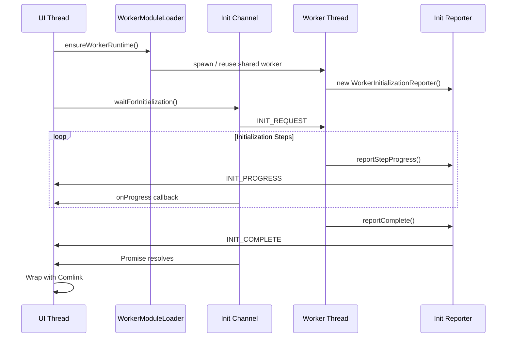

# @hierarchidb/runtime-client

A robust Worker initialization detection system for Web Workers that provides reliable, Comlink-independent initialization status reporting and React integration.

## 📋 Overview

This package solves the critical timing issue in Web Worker applications where the UI thread may attempt Comlink RPC communication before the Worker has completed its asynchronous initialization. It provides a two-way communication channel using native browser APIs (MessageChannel) to ensure proper initialization sequencing.

## 🎯 Problem It Solves

In typical Worker-based architectures:
1. UI creates a Worker instance
2. Worker starts loading and initializing (async process)
3. UI attempts to communicate via Comlink
4. **Race Condition**: If Worker hasn't finished initialization, Comlink calls fail

This package ensures that Comlink communication only begins after the Worker is fully initialized and ready.

## ✨ Features

- 🔄 **Bidirectional Communication**: Worker reports progress, UI receives updates
- 🔌 **Comlink-Independent**: Uses native MessageChannel API
- ⚡ **Progress Tracking**: Real-time initialization progress reporting
- 🛡️ **Error Handling**: Proper error propagation and recovery
- ⏱️ **Timeout Protection**: Configurable timeouts prevent indefinite waiting
- ⚛️ **React Integration**: Ready-to-use React hooks and providers
- 🔄 **Retry Logic**: Automatic retry on initialization failure
- 📊 **Detailed Status**: Step-based progress with custom messages

## 📦 Installation

```bash
# npm
npm install @hierarchidb/runtime-worker-init-notifier

# pnpm
pnpm add @hierarchidb/runtime-worker-init-notifier

# yarn
yarn add @hierarchidb/runtime-worker-init-notifier
```

## 🚀 Quick Start

> **HierarchiDB integration note**: 本モノレポでは `app/src/worker-runtime/WorkerModuleLoader.ts`
> と `@hierarchidb/runtime-shared-module-paths` が Worker の生成と初期化を統括します。
> 以下のサンプルはスタンドアロン環境向けの参考実装です。HierarchiDB では
> `WorkerModuleLoader.ensureWorkerRuntime()` と `WorkerInitializationChannel`
> を組み合わせて利用してください。

### Basic Usage (Vanilla JavaScript)

#### Worker Side
```typescript
// worker.ts
import { WorkerInitializationReporter } from '@hierarchidb/runtime-worker-init-notifier';

// Create reporter at the start of your worker
const initReporter = new WorkerInitializationReporter();

// Report progress during initialization
async function initializeWorker() {
  initReporter.reportStepProgress('Loading modules...', 25);
  await loadModules();
  
  initReporter.reportStepProgress('Connecting to database...', 50);
  await connectDatabase();
  
  initReporter.reportStepProgress('Setting up API...', 75);
  await setupAPI();
  
  // Report completion when ready
  initReporter.reportComplete();
  
  // Now expose your Worker API via Comlink
  Comlink.expose(workerAPI);
}

// Handle initialization errors
try {
  await initializeWorker();
} catch (error) {
  initReporter.reportError(error.message);
  throw error;
}
```

#### UI Side
```typescript
// main.ts (HierarchiDB での利用例)
import { WorkerInitializationChannel } from '@hierarchidb/runtime-worker-init-notifier';
import { ensureWorkerRuntime, getWorkerRuntimePromise } from '../app/src/worker-runtime/WorkerModuleLoader';
import { loadWorkerAPIClientModule } from '../app/src/worker-runtime/workerApiClientLoader';

// Ensure the runtime is booted (spawns the shared worker via WorkerModuleLoader)
await ensureWorkerRuntime();

const { WorkerAPIClient } = await loadWorkerAPIClientModule();
const rawWorker = WorkerAPIClient.getRawWorkerInstance();

// Create initialization channel
const channel = new WorkerInitializationChannel();

// Wait for worker to be ready
const result = await channel.waitForInitialization({
  worker: rawWorker,
  timeout: 10000,
  debug: true,
});

if (result.success) {
  console.log(`Worker ready in ${result.duration}ms`);
  const api = await getWorkerRuntimePromise();
  // Use your API via Comlink proxy…
} else {
  console.error('Worker initialization failed:', result.error);
}
```

## ⚛️ React Integration

### Complete Example with React

```tsx
// App.tsx
import React from 'react';
import { WorkerSingletonProvider } from '@hierarchidb/runtime-worker-init-notifier';
import { WorkerAPIClient } from './WorkerAPIClient';
import { MainApp } from './MainApp';

// Custom loading component
const LoadingScreen = ({ progress, message }) => (
  <div className="loading-screen">
    <h2>Initializing Application...</h2>
    <progress value={progress} max={100} />
    <p>{message}</p>
  </div>
);

// Custom error component
const ErrorScreen = ({ error }) => (
  <div className="error-screen">
    <h2>Initialization Failed</h2>
    <p>{error.message}</p>
    <button onClick={() => window.location.reload()}>
      Retry
    </button>
  </div>
);

function App() {
  return (
    <WorkerSingletonProvider
      getWorkerClient={async () => {
        // Initialize your worker client
        await WorkerAPIClient.initialize();
        return WorkerAPIClient.getSingleton();
      }}
      getRawWorker={() => {
        // Return the raw Worker instance for initialization detection
        return WorkerAPIClient.getRawWorkerInstance();
      }}
      loadingComponent={<LoadingScreen />}
      errorComponent={ErrorScreen}
    >
      <MainApp />
    </WorkerSingletonProvider>
  );
}
```

### Using the Hook

```tsx
// Component.tsx
import { useWorker } from '@hierarchidb/runtime-worker-init-notifier';

function MyComponent() {
  const { client, isReady, error, progress, message } = useWorker();
  
  if (!isReady) {
    return <div>Loading... {progress}%</div>;
  }
  
  if (error) {
    return <div>Error: {error.message}</div>;
  }
  
  // Worker is ready, use the client
  return (
    <button onClick={() => client.doSomething()}>
      Use Worker API
    </button>
  );
}
```

## 🔧 Advanced Configuration

### Custom Progress Steps

```typescript
// Worker side with detailed progress tracking
const reporter = new WorkerInitializationReporter();

// Define custom initialization steps
const initSteps = [
  { name: 'Core modules', weight: 20 },
  { name: 'Database connection', weight: 30 },
  { name: 'Cache warming', weight: 20 },
  { name: 'Plugin loading', weight: 20 },
  { name: 'Final setup', weight: 10 }
];

// Report progress for each step
for (let i = 0; i < initSteps.length; i++) {
  const step = initSteps[i];
  reporter.reportStepProgress(step.name, (i + 1) * 20);
  await performStep(step);
}

reporter.reportComplete();
```

### Error Recovery

```typescript
// UI side with retry logic (HierarchiDB integration)
const channel = new WorkerInitializationChannel();
const { WorkerAPIClient } = await loadWorkerAPIClientModule();
let retries = 3;

while (retries > 0) {
  const rawWorker = WorkerAPIClient.getRawWorkerInstance();
  const result = await channel.waitForInitialization({
    worker: rawWorker,
    timeout: 10000,
  });

  if (result.success) {
    break;
  }

  retries--;
  if (retries > 0) {
    console.warn(`Retrying worker init… (${retries} attempts left)`);
    WorkerAPIClient.reset();
    await ensureWorkerRuntime();
  }
}
```

## 📡 Message Protocol

The package uses a simple, robust message protocol:

| Message Type | Direction | Description |
|-------------|-----------|-------------|
| `INIT_REQUEST` | UI → Worker | Request initialization status |
| `INIT_PROGRESS` | Worker → UI | Report progress update |
| `INIT_COMPLETE` | Worker → UI | Signal successful initialization |
| `INIT_ERROR` | Worker → UI | Report initialization error |
| `PING` | UI → Worker | Health check |
| `PING_RESPONSE` | Worker → UI | Health check response |

## 🏗️ Architecture



## 🧪 Testing

The package includes comprehensive test coverage:

```bash
# Run unit tests
pnpm test

# Run E2E tests (Node.js environment)
pnpm test e2e-node.test.ts

# Run with coverage
pnpm test --coverage
```

### Example Test

```typescript
import { vi, describe, it, expect } from 'vitest';
import { WorkerInitializationChannel } from '@hierarchidb/runtime-worker-init-notifier';

describe('WorkerInitializationChannel', () => {
  it('should detect worker initialization', async () => {
    const mockWorker = {
      postMessage: vi.fn(),
      addEventListener: vi.fn(),
      removeEventListener: vi.fn()
    };
    
    const channel = new WorkerInitializationChannel();
    
    const promise = channel.waitForInitialization({
      worker: mockWorker as any,
      timeout: 1000
    });
    
    // Simulate worker ready message
    const handler = mockWorker.addEventListener.mock.calls[0][1];
    handler({
      data: {
        type: 'INIT_COMPLETE',
        payload: { progress: 100, message: 'Ready' }
      }
    });
    
    const result = await promise;
    expect(result.success).toBe(true);
  });
});
```

## 🔍 Debugging

Enable debug mode for detailed logging:

```typescript
const channel = new WorkerInitializationChannel();

const result = await channel.waitForInitialization({
  worker: worker,
  timeout: 10000,
  debug: true  // Enables console logging
});
```

Debug output includes:
- Message flow between UI and Worker
- Progress updates with timestamps
- Error details and stack traces
- Timing information

## 🚨 Common Issues and Solutions

### Issue: Worker doesn't respond to INIT_REQUEST
**Solution**: Ensure WorkerInitializationReporter is created before any async operations in your worker.

### Issue: Timeout errors during development
**Solution**: Increase timeout value during development when using HMR or slow builds.

### Issue: Multiple initialization attempts
**Solution**: Use the singleton pattern for your Worker instance.

## 📚 API Reference

### WorkerInitializationReporter

```typescript
class WorkerInitializationReporter {
  // Report progress with a message
  reportStepProgress(stepName: string, stepProgress?: number): void;
  
  // Report successful completion
  reportComplete(): void;
  
  // Report initialization error
  reportError(error: Error | string): void;
}
```

### WorkerInitializationChannel

```typescript
class WorkerInitializationChannel {
  // Wait for worker initialization
  waitForInitialization(config: WorkerInitConfig): Promise<InitializationResult>;
  
  // Clean up resources
  cleanup(): void;
}

interface WorkerInitConfig {
  worker: Worker;           // The Worker instance
  timeout?: number;         // Timeout in ms (default: 30000)
  debug?: boolean;          // Enable debug logging (default: false)
}

interface InitializationResult {
  success: boolean;         // Whether initialization succeeded
  error?: Error | string;   // Error if failed
  duration?: number;        // Time taken in ms
}
```

### React Components

```typescript
// Provider component
interface WorkerProviderProps {
  children: React.ReactNode;
  loadingComponent?: React.ReactNode;
  errorComponent?: React.ComponentType<{ error: Error }>;
  getWorkerClient: () => Promise<any>;
  getRawWorker: () => Worker | null;
}

// Hook
interface UseWorkerResult {
  client: any;              // Your worker client
  isReady: boolean;         // Whether worker is initialized
  error: Error | null;      // Any initialization error
  progress: number;         // Progress percentage (0-100)
  message: string;          // Current status message
}
```

## 🤝 Contributing

Contributions are welcome! Please read our contributing guidelines before submitting PRs.

## 📄 License

MIT © HierarchiDB Project

## 🔗 Related Packages

- [@hierarchidb/runtime-worker](../runtime/worker) - Worker implementation
- [@hierarchidb/common-api](../common/api) - API interfaces
- [Comlink](https://github.com/GoogleChromeLabs/comlink) - RPC library for Web Workers

## 💡 Best Practices

1. **Always initialize the reporter first** in your Worker before any async operations
2. **Use meaningful progress messages** to help with debugging
3. **Handle errors gracefully** with proper error reporting
4. **Set appropriate timeouts** based on your initialization complexity
5. **Use the React integration** for React apps to simplify state management
6. **Enable debug mode** during development for better visibility
7. **Test initialization failure scenarios** to ensure robustness

## 📈 Performance Considerations

- The message channel adds minimal overhead (<1ms per message)
- Progress reporting is throttled to prevent message flooding
- Channel automatically cleans up listeners after initialization
- No polling - uses event-driven architecture for efficiency

## 🆘 Support

For issues, questions, or suggestions:
- Open an issue on [GitHub](https://github.com/hierarchidb/hierarchidb)
- Check the [documentation](https://hierarchidb.github.io)
- Join our [Discord community](https://discord.gg/hierarchidb)
