# UI Packages

HierarchiDB のユーザーインターフェース層を構成するReactコンポーネントパッケージ群です。Material-UIをベースとした一貫性のあるUIシステムと、プラグイン拡張可能なアーキテクチャを提供します。

## パッケージ概要

### 🎨 基盤UIシステム

#### [@hierarchidb/ui-core](./core/)
**コアUIコンポーネント・プラグインシステム**

- **役割**: 基本的なUIコンポーネントとプラグイン統合基盤
- **特徴**:
  - Material-UI統合
  - プラグインコンポーネント登録システム
  - アイコン・テーマ統合
  - Gravatar統合
- **依存関係**: 12パッケージが依存（最も重要な基盤パッケージ）

#### [@hierarchidb/ui-theme](./theme/)
**テーマ・デザインシステム**

- **役割**: Material-UIテーマ設定とデザイントークン管理
- **特徴**:
  - ダークモード対応
  - カスタムカラーパレット
  - タイポグラフィシステム
  - レスポンシブブレークポイント

### 🔐 認証・ユーザー管理

#### [@hierarchidb/ui-auth](./auth/)
**認証システム統合**

- **役割**: OAuth2/OIDC認証フローとユーザー管理UI
- **特徴**:
  - Google OAuth2統合（@react-oauth/google）
  - OIDC Client統合（react-oidc-context）
  - 認証状態管理
  - サイレント更新対応
- **技術スタック**: oidc-client-ts、react-oidc-context

#### [@hierarchidb/ui-usermenu](./usermenu/)
**ユーザーメニュー・プロファイル**

- **役割**: 認証済みユーザー向けメニューとプロファイル管理
- **統合**: ui-auth、ui-i18n、ui-monitoring、ui-theme
- **特徴**:
  - ユーザーアバター表示
  - 設定メニュー
  - 言語切り替え
  - パフォーマンス監視情報

### 🗂️ TreeConsole システム

#### [@hierarchidb/ui-treeconsole-base](./treeconsole/base/)
**TreeConsoleオーケストレーター**

- **役割**: 階層データ表示の中核コンポーネント統合
- **アーキテクチャ**: 複数のTreeConsoleパーツを統合
- **特徴**:
  - ドラッグ&ドロップ（@dnd-kit）
  - 仮想化テーブル（@tanstack/react-table, @tanstack/react-virtual）
  - 状態管理（Jotai）
  - リアクティブデータ（RxJS）

#### TreeConsoleパーツ群
- **[@hierarchidb/ui-treeconsole-breadcrumb](./treeconsole/breadcrumb/)** - パンくずナビゲーション
- **[@hierarchidb/ui-treeconsole-footer](./treeconsole/footer/)** - フッター情報表示
- **[@hierarchidb/ui-treeconsole-speeddial](./treeconsole/speeddial/)** - フローティングアクションボタン
- **[@hierarchidb/ui-treeconsole-toolbar](./treeconsole/toolbar/)** - ツールバー操作
- **[@hierarchidb/ui-treeconsole-trashbin](./treeconsole/trashbin/)** - ごみ箱機能
- **[@hierarchidb/ui-treeconsole-treetable](./treeconsole/treetable/)** - 階層テーブル表示

### 🧭 ナビゲーション・レイアウト

#### [@hierarchidb/ui-routing](./routing/)
**React Router統合**

- **役割**: ファイルベースルーティングとナビゲーション
- **特徴**:
  - React Router v7対応
  - 動的ルート生成
  - プラグインルーティング統合
  - URL状態管理

#### [@hierarchidb/ui-navigation](./navigation/)
**ナビゲーション コンポーネント**

- **役割**: サイトナビゲーションとメニューシステム
- **特徴**:
  - レスポンシブメニュー
  - ブレッドクラム
  - サイドバーナビゲーション

#### [@hierarchidb/ui-layout](./layout/)
**レイアウトシステム**

- **役割**: アプリケーション全体のレイアウト管理
- **特徴**:
  - レスポンシブレイアウト
  - ヘッダー・フッター管理
  - サイドバー制御

### 🌍 多言語・アクセシビリティ

#### [@hierarchidb/ui-i18n](./i18n/)
**国際化システム**

- **役割**: 多言語対応とローカライゼーション
- **特徴**:
  - i18next統合
  - 動的言語切り替え
  - リソースバンドル管理
  - 日付・数値フォーマット

### 📊 データ・ファイル処理

#### [@hierarchidb/ui-file](./file/)
**ファイル処理コンポーネント**

- **役割**: ファイルアップロード・ダウンロード・プレビュー
- **特徴**:
  - ドラッグ&ドロップ対応
  - ファイル形式バリデーション
  - プログレス表示
  - プレビュー機能

#### [@hierarchidb/ui-csv-extract](./csv-extract/)
**CSV データ抽出**

- **役割**: CSVファイルの解析・プレビュー・抽出
- **特徴**:
  - CSV/TSVパーサー
  - デリミタ自動判定
  - カラムマッピング
  - データプレビュー

### 🗺️ 地理情報・専門UI

#### [@hierarchidb/ui-map](./map/)
**地図表示システム**

- **役割**: MapLibreGL統合とインタラクティブ地図
- **特徴**:
  - MapLibreGL JS統合
  - カスタムマップスタイル
  - レイヤー管理
  - 地理データ表示

#### [@hierarchidb/ui-country-select](./country-select/)
**国選択コンポーネント**

- **役割**: 国・地域選択インターフェース
- **特徴**:
  - ISO 3166準拠
  - 検索・フィルタリング
  - フラッグアイコン表示
  - 多言語対応

### 🔧 ユーティリティ・専門コンポーネント

#### [@hierarchidb/ui-dialog](./dialog/)
**ダイアログシステム**

- **役割**: モーダル・ダイアログ管理
- **特徴**:
  - マルチステップダイアログ
  - プラグイン拡張対応
  - バリデーション統合
  - アニメーション

#### [@hierarchidb/ui-monitoring](./monitoring/)
**パフォーマンス監視**

- **役割**: リアルタイムパフォーマンス監視UI
- **特徴**:
  - メモリ使用量表示
  - 処理時間計測
  - エラー追跡
  - ダッシュボード

#### [@hierarchidb/ui-accordion-config](./accordion-config/)
**アコーディオン設定**

- **役割**: 設定パネル・アコーディオン形式UI
- **特徴**: 階層的設定管理、展開状態制御

#### [@hierarchidb/ui-lru-splitview](./lru-splitview/)
**分割ビューシステム**

- **役割**: 大容量データのLRU分割表示
- **特徴**: 効率的メモリ管理、仮想化スクロール

#### [@hierarchidb/ui-tour](./tour/)
**ユーザーガイドツアー**

- **役割**: 新規ユーザー向けインタラクティブチュートリアル
- **特徴**: ステップバイステップガイド、プログレス管理

## 公開コンポーネントの戻り値型（MUST）

- 目的: 依存パッケージの d.ts ロールアップ時に、`jsx-runtime` など外部型への暗黙依存が原因の TS2742 を防ぐため、公開 API の TSX コンポーネントには明示の戻り値型を付けます。
- ルール:
  - `export function Foo(...)` は `: JSX.Element` もしくは `: JSX.Element | null` を明記する。
  - `export const Foo = (...) => (...)` の場合は、`React.FC<Props>` を使うか、戻り値注釈 `: JSX.Element` を付ける。
  - 返り値に `null` を返す可能性がある場合は `| null` を含める。
- 背景: モノレポでは `exports.types` を `src` に向ける設計のため、依存側の d.ts 生成が公開コンポーネントの戻り値推論に影響を受けます。明示注釈により型名が安定し、ビルド前 typecheck/dts 生成が安定します。

## tsconfig のパスエイリアス使用ポリシー

- 公開ソースでのエイリアス禁止（MUST）: ライブラリの公開ソース内では、パッケージ内専用の tsconfig paths（例: `~/*`）に依存しないでください。外部が同じエイリアスを持たない場合に解決できず、依存側の typecheck/ビルドが失敗します。
- `types` は `src` 指向で統一（MUST）: すべての内部パッケージは `package.json` で `types: "src/RuntimeWorkerService.ts"`、`exports.types: "./src/RuntimeWorkerService.ts"` に統一し、ビルド前 typecheck を安定化します。
- エイリアスが必要な場合（SHOULD）: 次のいずれかを採用します。
  - ビルド時に相対へ書き換える構成（例: ts-transform-paths / tsc-alias）を使う。
  - 公開面（エクスポートされるファイル）では相対参照を用いる。
 いずれの場合も、依存パッケージ側が追加設定なしで解決できることを確認してください。

#### [@hierarchidb/ui-plugin-base](./plugin-base/)
**プラグインベースUI**

- **役割**: プラグイン開発者向けUI基盤クラス
- **特徴**: プラグインUI統合パターン、共通インターフェース

## アーキテクチャ

```mermaid
graph TB
    subgraph "基盤レイヤー"
        CORE[📦 ui-core<br/>コアコンポーネント・プラグインシステム]
        THEME[📦 ui-theme<br/>デザインシステム]
    end
    
    subgraph "認証・ユーザー管理"
        AUTH[📦 ui-auth<br/>認証システム]
        USERMENU[📦 ui-usermenu<br/>ユーザーメニュー]
    end
    
    subgraph "TreeConsoleシステム"
        TC_BASE[📦 ui-treeconsole-base<br/>オーケストレーター]
        TC_PARTS[TreeConsoleパーツ群<br/>breadcrumb, footer, speeddial<br/>toolbar, trashbin, treetable]
    end
    
    subgraph "ナビゲーション・レイアウト"
        ROUTING[📦 ui-routing<br/>React Router統合]
        NAV[📦 ui-navigation<br/>ナビゲーション]
        LAYOUT[📦 ui-layout<br/>レイアウト]
    end
    
    subgraph "多言語・アクセシビリティ"
        I18N[📦 ui-i18n<br/>国際化]
    end
    
    subgraph "データ・ファイル処理"
        FILE[📦 ui-file<br/>ファイル処理]
        CSV[📦 ui-csv-extract<br/>CSV処理]
    end
    
    subgraph "地理情報・専門UI"
        MAP[📦 ui-map<br/>地図システム]
        COUNTRY[📦 ui-country-select<br/>国選択]
    end
    
    subgraph "ユーティリティ"
        DIALOG[📦 ui-dialog<br/>ダイアログ]
        MONITOR[📦 ui-monitoring<br/>監視]
        UTILS[その他ユーティリティ<br/>accordion-config, lru-splitview<br/>tour, plugin-base]
    end
    
    %% 依存関係
    TC_BASE --> TC_PARTS
    TC_BASE --> CORE
    
    USERMENU --> AUTH
    USERMENU --> I18N
    USERMENU --> MONITOR
    USERMENU --> THEME
    
    ROUTING --> CORE
    NAV --> CORE
    LAYOUT --> CORE
    LAYOUT --> THEME
    
    FILE --> CORE
    MAP --> CORE
    DIALOG --> CORE
    MONITOR --> CORE
    
    %% スタイリング
    style CORE fill:#e8f5e9,stroke:#4caf50,stroke-width:3px
    style TC_BASE fill:#e3f2fd,stroke:#2196f3,stroke-width:2px
    style AUTH fill:#fff3e0,stroke:#ff9800,stroke-width:2px
    style MAP fill:#f3e5f5,stroke:#9c27b0,stroke-width:2px
    style I18N fill:#fce4ec,stroke:#e91e63,stroke-width:2px
```



## 技術スタック

### React エコシステム
- **React 18+**: 最新のReact機能（Suspense、Concurrent Mode）
- **React Router v7**: ファイルベースルーティング
- **React Testing Library**: コンポーネントテスト

### UI フレームワーク
- **Material-UI v5/6**: コンポーネントライブラリ
- **Emotion**: CSS-in-JS スタイリング
- **Material Icons**: アイコンシステム

### 状態管理・データフロー
- **Jotai**: アトミック状態管理
- **RxJS**: リアクティブデータストリーム
- **React Hook Form**: フォーム状態管理

### 認証・国際化
- **oidc-client-ts**: OIDC認証クライアント
- **react-oidc-context**: React OIDC統合
- **react-i18next**: React国際化
- **@react-oauth/google**: Google OAuth2

### パフォーマンス最適化
- **@tanstack/react-virtual**: 仮想化
- **@tanstack/react-table**: 高性能テーブル
- **@dnd-kit**: ドラッグ&ドロップ

### 地理情報・データ可視化
- **MapLibreGL JS**: オープンソース地図エンジン
- **Turf.js**: 地理的計算
- **CSV Parser**: CSVデータ処理

## 開発パターン

### コンポーネント設計原則

```typescript
// 1. Props型定義（厳密な型安全性）
interface MyComponentProps {
  readonly nodeId: NodeId;
  readonly onAction: (action: Action) => void;
  readonly variant?: 'default' | 'compact';
}

// 2. 制御されたコンポーネント
export function MyComponent({ nodeId, onAction, variant = 'default' }: MyComponentProps) {
  const [state, setState] = useState(initialState);
  
  // 3. アクセシビリティ属性
  return (
    <Box role="region" aria-label="Component description">
      {/* コンテンツ */}
    </Box>
  );
}

// 4. メモ化（パフォーマンス最適化）
export const MyComponent = memo(MyComponentImpl);
```

### プラグイン統合パターン

```typescript
// プラグインコンポーネント登録
import { UIComponentRegistry } from '@hierarchidb/ui-core';

// コンポーネント登録
UIComponentRegistry.register('my-plugin-base-dialog', {
  component: MyPluginDialog,
  displayName: 'My Plugin Dialog',
  category: 'dialog'
});

// 動的コンポーネント使用
const DialogComponent = UIComponentRegistry.get('my-plugin-dialog');
```

### 国際化パターン

```typescript
// i18n統合
import { useTranslation } from 'provider-i18next';

export function MyComponent() {
  const { t } = useTranslation('my-namespace');
  
  return (
    <Typography>
      {t('welcome', { name: 'User' })}
    </Typography>
  );
}

// リソースファイル（locales/en/my-namespace.json）
{
  "welcome": "Welcome, {{name}}!"
}
```

### テーマ・スタイリングパターン

```typescript
// テーマ統合
import { useTheme } from '@mui/material/styles';
import { styled } from '@mui/material/styles';

const StyledComponent = styled(Box)(({ theme }) => ({
  padding: theme.spacing(2),
  backgroundColor: theme.palette.background.paper,
  [theme.breakpoints.up('md')]: {
    padding: theme.spacing(3),
  }
}));

export function MyComponent() {
  const theme = useTheme();
  
  return (
    <StyledComponent>
      {/* レスポンシブ・テーマ対応コンテンツ */}
    </StyledComponent>
  );
}
```

## パフォーマンス最適化

### 大容量データ対応

```typescript
// 仮想化テーブル
import { useVirtualizer } from '@tanstack/provider-virtual';

export function VirtualizedList({ items }) {
  const virtualizer = useVirtualizer({
    count: items.length,
    getScrollElement: () => parentRef.current,
    estimateSize: () => 50,
  });

  return (
    <div style={{ height: virtualizer.getTotalSize() }}>
      {virtualizer.getVirtualItems().map(item => (
        <div key={item.key} style={/* positioning */}>
          {items[item.index]}
        </div>
      ))}
    </div>
  );
}
```

### メモ化戦略

```typescript
// コンポーネントメモ化
export const ExpensiveComponent = memo(({ data, onAction }: Props) => {
  // 計算コストの高い処理
  const processedData = useMemo(() => 
    expensiveProcessing(data), [data]
  );
  
  // イベントハンドラーメモ化
  const handleAction = useCallback((action: Action) => {
    onAction(action);
  }, [onAction]);
  
  return <div>{/* レンダリング */}</div>;
});
```

### Code Splitting

```typescript
// 遅延読み込み
import { lazy, Suspense } from 'react';

const HeavyComponent = lazy(() => import('./HeavyComponent'));

export function App() {
  return (
    <Suspense fallback={<CircularProgress />}>
      <HeavyComponent />
    </Suspense>
  );
}
```

## テスト戦略

### コンポーネントテスト

```typescript
// Testing Library使用例
import { render, screen, fireEvent, waitFor } from '@testing-library/provider';
import { MyComponent } from './MyComponent';

describe('MyComponent', () => {
  it('should handle user interaction', async () => {
    const onAction = vi.fn();
    
    render(
      <MyComponent nodeId={'test-node' as NodeId} onAction={onAction} />
    );
    
    const button = screen.getByRole('button', { name: /action/i });
    fireEvent.click(button);
    
    await waitFor(() => {
      expect(onAction).toHaveBeenCalledWith(expectedAction);
    });
  });
});
```

### アクセシビリティテスト

```typescript
// アクセシビリティ検証
it('should be accessible', () => {
  render(<MyComponent />);
  
  // スクリーンリーダー対応
  expect(screen.getByLabelText('Component description')).toBeInTheDocument();
  
  // キーボードナビゲーション
  const interactive = screen.getAllByRole('button');
  interactive.forEach(el => {
    expect(el).toHaveAttribute('tabindex');
  });
});
```

## ビルド・配布

### パッケージ設定

```json
// package.json（共通パターン）
{
  "name": "@hierarchidb/ui-[package-name]",
  "type": "module",
  "main": "dist/index.js",
  "types": "dist/index.d.ts",
  "peerDependencies": {
    "react": ">=18.0.0",
    "@mui/material": "^5.0.0 || ^6.0.0"
  }
}
```

### tsup設定

```typescript
// tsup.config.ts
export default {
  entry: ['src/RuntimeWorkerService.ts'],
  format: ['esm'],
  dts: true,
  clean: true,
  external: [
    'provider',
    'provider-dom', 
    '@mui/material',
    '@mui/icon-material'
  ]
};
```

### 開発環境

```bash
# 全UIパッケージ開発モード
turbo run dev --filter='@hierarchidb/ui-*'

# 特定パッケージ開発
cd packages/ui/core
pnpm dev

# Storybook起動
pnpm storybook:ui-core
```

## 依存関係管理

### パッケージ間依存関係

```
Foundation:
ui-core ← (12パッケージが依存)
ui-theme ← ui-layout, ui-usermenu

Orchestration:
ui-treeconsole-base ← (6つのTreeConsoleパーツを統合)

Integration:
ui-usermenu ← ui-auth, ui-i18n, ui-monitoring, ui-theme
```

### Peer Dependencies

- **React**: >=18.0.0（全パッケージ共通）
- **Material-UI**: ^5.0.0 || ^6.0.0（UIパッケージ）
- **Emotion**: ^11.14.0（スタイリング）

## 関連ドキュメント

- [ベースUI設計](../../docs/10-base-ui.md)
- [基盤モジュール](../../docs/5-base-module.md)
- [開発ガイドライン](../../docs/4-development-guidelines.md)
- [アーキテクチャ詳細](../../docs/7-aop-architecture.md)
## Plugin/Library MUSTs (重要な開発規約)
- 公開TSXの戻り値型: すべての公開 TSX 関数/コンポーネントは `JSX.Element`（必要なら `| null`）を明示する（TS2742 回避）。
- 型エクスポート: `package.json` の `types` と `exports.types` は必ず `src/RuntimeWorkerService.ts` を指す（prebuild typecheck を安定化）。
- パスエイリアス禁止: 公開ソースでは `~/` など tsconfig の paths に依存しない。相対参照（../）かビルド時のパス置換のみ許可。
- React/MUI をバンドルしない: UI パッケージは React/MUI を `peerDependencies` に置き、tsup では `external` 指定する（ホストアプリでの単一インスタンス維持）。
- 環境変数: ブラウザコードで `process.env` は使用しない。`import.meta.env` / `VITE_*` を用いる（必要なら共通の `env` ヘルパーを利用）。
- 依存解決: 他パッケージの `../src` 直参照は禁止。公開 API（パッケージ名）経由、または d.ts のみ参照する。
