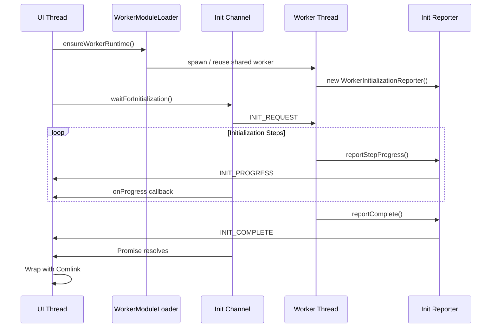

# @hierarchidb/ui-worker-client

UI-side utilities for HierarchiDB’s worker runtime. Provides initialization handshakes, Comlink-safe event/command bridges, runtime export wiring, and worker bridge helpers.

## Directory layout
```
WorkerInitializationChannel.ts  UI-side init handshake (MessageChannel-based)
WorkerInitializationReporter.ts Worker-side reporter to emit init progress/events
workerBridge.ts                 Bridge getter/setter for the Worker remote proxy
events/                        Comlink event/command bridges
wiring/                        Runtime export registry & plugin wiring helpers
utils.ts, batch-types.ts             Shared helpers and message types
```

## Key exports
- Initialization:
  - `WorkerInitializationChannel` — wait for worker readiness with timeout/progress.
  - `WorkerInitializationReporter` — post init steps/errors from the worker thread.
- Runtime bridge:
  - `getWorkerBridge`, `ensureWorkerAPI`, `__getWorkerBridgeClientRef`, `__setWorkerBridgeClientRef`, `WorkerBridge` type.
  - `getRuntimeExports`, `registerRuntimeExports`, `getAllRuntimeExports` for runtime export discovery.
  - `wirePluginsFromModules` — wire plugin UI/worker exports into the runtime registry.
- Comlink helpers:
  - `createComlinkCommandBridge`, `createComlinkEventBridge` and related types for bridging commands/events across Comlink boundaries.
- Types:
  - `WorkerInitConfig`, `InitializationResult`, `InitializationStep`, `WorkerInitState`, `WorkerInitMessageType`, etc.

## Consumers / usage
- App runtime boot (`app/src/worker-runtime/worker.ts`, `workerApiClientLoader`) uses the initialization channel before exposing Comlink APIs.
- `@hierarchidb/runtime-worker` and plugins register exports via `wirePluginsFromModules` / runtime export registry.
- UI dialog hosts and plugin UIs obtain the worker bridge through `@hierarchidb/plugin-service-sdk` which relies on this package.

## Notes
- Designed to be Comlink-agnostic where possible (init channel uses native MessageChannel).
- Keep initialization synchronized: reporter must run at worker startup, channel must wait before issuing Comlink calls.

```typescript
// Worker side with detailed progress tracking
const reporter = new WorkerInitializationReporter();

// Define custom initialization steps
const initSteps = [
  { name: 'Core modules', weight: 20 },
  { name: 'Database connection', weight: 30 },
  { name: 'Cache warming', weight: 20 },
  { name: 'Plugin loading', weight: 20 },
  { name: 'Final setup', weight: 10 }
];

// Report progress for each step
for (let i = 0; i < initSteps.length; i++) {
  const step = initSteps[i];
  reporter.reportStepProgress(step.name, (i + 1) * 20);
  await performStep(step);
}

reporter.reportComplete();
```

### Error Recovery

```typescript
// UI side with retry logic (HierarchiDB integration)
const channel = new WorkerInitializationChannel();
const { WorkerAPIClient } = await loadWorkerAPIClientModule();
let retries = 3;

while (retries > 0) {
  const rawWorker = WorkerAPIClient.getRawWorkerInstance(); // Worker | MessagePort
  const result = await channel.waitForInitialization({
    worker: rawWorker,
    timeout: 10000,
  });

  if (result.success) {
    break;
  }

  retries--;
  if (retries > 0) {
    console.warn(`Retrying worker init… (${retries} attempts left)`);
    WorkerAPIClient.reset();
    await ensureWorkerRuntime();
  }
}
```

## 📡 Message Protocol

The package uses a simple, robust message protocol:

| Message Type | Direction | Description |
|-------------|-----------|-------------|
| `INIT_REQUEST` | UI → Worker | Request initialization status |
| `INIT_PROGRESS` | Worker → UI | Report progress update |
| `INIT_COMPLETE` | Worker → UI | Signal successful initialization |
| `INIT_ERROR` | Worker → UI | Report initialization error |
| `PING` | UI → Worker | Health check |
| `PING_RESPONSE` | Worker → UI | Health check response |

## 🏗️ Architecture



## 🧪 Testing

The package includes comprehensive test coverage:

```bash
# Run unit tests
pnpm test

# Run E2E tests (Node.js environment)
pnpm test e2e-node.test.ts

# Run with coverage
pnpm test --coverage
```

### Example Test

```typescript
import { vi, describe, it, expect } from 'vitest';
import { WorkerInitializationChannel } from '@hierarchidb/runtime-worker-init-notifier';

describe('WorkerInitializationChannel', () => {
  it('should detect worker initialization', async () => {
    const mockWorker = {
      postMessage: vi.fn(),
      addEventListener: vi.fn(),
      removeEventListener: vi.fn()
    };
    
    const channel = new WorkerInitializationChannel();
    
    const promise = channel.waitForInitialization({
      worker: mockWorker as any,
      timeout: 1000
    });
    
    // Simulate worker ready message
    const handler = mockWorker.addEventListener.mock.calls[0][1];
    handler({
      data: {
        type: 'INIT_COMPLETE',
        payload: { progress: 100, message: 'Ready' }
      }
    });
    
    const result = await promise;
    expect(result.success).toBe(true);
  });
});
```

## 🔍 Debugging

Enable debug mode for detailed logging:

```typescript
const channel = new WorkerInitializationChannel();

const result = await channel.waitForInitialization({
  worker: worker,
  timeout: 10000,
  debug: true  // Enables console logging
});
```

Debug output includes:
- Message flow between UI and Worker
- Progress updates with timestamps
- Error details and stack traces
- Timing information

## 🚨 Common Issues and Solutions

### Issue: Worker doesn't respond to INIT_REQUEST
**Solution**: Ensure WorkerInitializationReporter is created before any async operations in your worker.

### Issue: Timeout errors during development
**Solution**: Increase timeout value during development when using HMR or slow builds.

### Issue: Multiple initialization attempts
**Solution**: Use the singleton pattern for your Worker instance.

## 📚 API Reference

### WorkerInitializationReporter

```typescript
class WorkerInitializationReporter {
  // Report progress with a message
  reportStepProgress(stepName: string, stepProgress?: number): void;
  
  // Report successful completion
  reportComplete(): void;
  
  // Report initialization error
  reportError(error: Error | string): void;
}
```

### WorkerInitializationChannel

```typescript
class WorkerInitializationChannel {
  // Wait for worker initialization
  waitForInitialization(config: WorkerInitConfig): Promise<InitializationResult>;
  
  // Clean up resources
  cleanup(): void;
}

interface WorkerInitConfig {
  worker: Worker | MessagePort; // The Worker or MessagePort instance
  timeout?: number;         // Timeout in ms (default: 30000)
  debug?: boolean;          // Enable debug logging (default: false)
}

interface InitializationResult {
  success: boolean;         // Whether initialization succeeded
  error?: Error | string;   // Error if failed
  duration?: number;        // Time taken in ms
}
```

### React Components

```typescript
// Provider component
interface WorkerProviderProps {
  children: React.ReactNode;
  loadingComponent?: React.ReactNode;
  errorComponent?: React.ComponentType<{ error: Error }>;
  getWorkerClient: () => Promise<any>;
  getRawWorker: () => Worker | null;
}

// Hook
interface UseWorkerResult {
  client: any;              // Your worker client
  isReady: boolean;         // Whether worker is initialized
  error: Error | null;      // Any initialization error
  progress: number;         // Progress percentage (0-100)
  message: string;          // Current status message
}
```

## 🤝 Contributing

Contributions are welcome! Please read our contributing guidelines before submitting PRs.

## 📄 License

MIT © HierarchiDB Project

## 🔗 Related Packages

- [@hierarchidb/runtime-worker](../runtime/worker) - Worker implementation
- [@hierarchidb/worker-api](../features/worker-api) - Worker RPC interfaces
- [@hierarchidb/batch-api](../features/batch-api) - Batch progress interfaces
- [Comlink](https://github.com/GoogleChromeLabs/comlink) - RPC library for Web Workers

## 💡 Best Practices

1. **Always initialize the reporter first** in your Worker before any async operations
2. **Use meaningful progress messages** to help with debugging
3. **Handle errors gracefully** with proper error reporting
4. **Set appropriate timeouts** based on your initialization complexity
5. **Use the React integration** for React apps to extract state management
6. **Enable debug mode** during development for better visibility
7. **Test initialization failure scenarios** to ensure robustness

## 📈 Performance Considerations

- The message channel adds minimal overhead (<1ms per message)
- Progress reporting is throttled to prevent message flooding
- Channel automatically cleans up listeners after initialization
- No polling - uses event-driven architecture for efficiency

## 🆘 Support

For issues, questions, or suggestions:
- Open an issue on [GitHub](https://github.com/hierarchidb/hierarchidb)
- Check the [documentation](https://hierarchidb.github.io)
- Join our [Discord community](https://discord.gg/hierarchidb)
