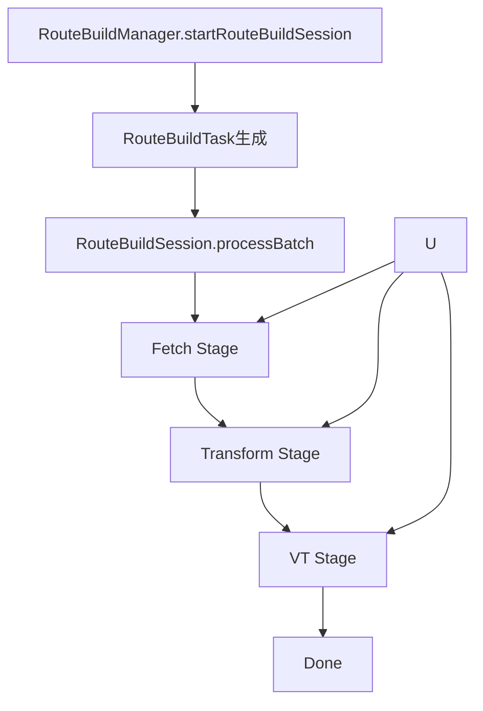
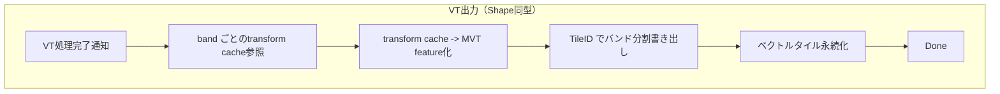

# 現行 Route パイプライン（実装実体）

### 全体フロー

- この設計で最終成果物は `Route LineString` のベクトル地図タイル。  
  そのため最重要経路は `Fetch -> Transform -> VT` の3ステージである。
- 別種のワーカー実体を起動する構成ではなく、`runStageTasks` の実行器は `stage` と `taskFilter` を切り替えて同一ランナーで処理する。
- `searoute_jp` は現状 `searoute` 実装へのフォールバック前提で扱う。

### 実装要件の写像（今回の説明をそのまま反映）

- Fetch は必須実装。`mode` 別に幾何を作る。  
  - `mode direct` は原点・終点の直線
  - `mode great_circle` は大圏路線
  - `mode searoute_jp`（現状は `searoute`）は海路生成
  - `mode osm_route` は将来 OSM API 呼び出し
  - `mode custom` は将来外部由来の代替ルート
- Transform は `route` の品質維持を担う必須処理。  
  - ズーム帯ごとに、始点/終点重なりを起点に線の可視性崩れを防ぐフィルタ  
  - ズーム帯ごとに RDP で中継点を間引き（端点は必ず保持）  
  - ズーム帯ごとの転置インデックスを作成
- VT は Shape と同型。Transform の結果を受け、band 別の最終ベクトルタイル生成に進む。

- Shape/Route の共通化方針:
  - Fetch は mode/ソース由来幾何生成とキャッシュ永続化を担う。
  - Transform はズーム帯別フィルタと簡略化、転置インデックス作成を担う。
  - VT は生成済み transform cache を再利用して MVT 化する。

### 実装上の補足（No-op 由来の混線除去）

- `validation` と `vt` を独立実体として解釈しない。  
  この設計記述では VT は Shape同型の MVT化責務までを含む最終実体。  
- 旧実装で見える `Route Tile Output` への分割呼び出しは、設計上 VT の内部責務として統合して扱う。

### Fetch Stage

```mermaid
flowchart TB
  subgraph RF[Fetch Stage
  RouteBuildSession.processBatch
  plugins/route-plugin/src/services/RouteBuildSession.ts]
    direction LR
    RF0[fetch runStageTasks 開始]
    RF1[runStageTasks stage fetch]
    RF2[タスクメタ情報を元に mode 分岐]
    RF3[Fork fetch worker pool]
    RF4[parallel task 処理]
    RF5[Join barrier]
    RF6[Fetch cache 永続化]
    RF7[Fetch task 完了]

    RF0 --> RF1 --> RF2 --> RF3 --> RF4 --> RF5 --> RF6 --> RF7
  end

  subgraph WF[Fetch task handler
  plugins/route-plugin/src/services/RouteBuildSession.ts]
    direction LR
    WF1[task 受領]
    WF2[mode direct/great_circle/searoute_jp/osm_route/custom 判定]
    WF3[origin/destination 解決]
    WF4[幾何を生成]
    WF5[fetch cache 追記]
    WF6[Task status completed]
    WF1 --> WF2 --> WF3 --> WF4 --> WF5 --> WF6
  end
```

### Transform Stage route simplification

```mermaid
flowchart TB
  subgraph RT[Transform Stage
  RouteBuildSession.processBatch]
    direction LR
    RT0[runStageTasks stage transform]
    RT1[route generation 以外の task を除外]
    RT2[Fork transform worker pool]
    RT3[ズーム帯別 route-filter を適用]
    RT4[ズーム帯別 RDP 簡略化]
    RT5[ズーム帯別転置インデックス作成]
    RT6[Join barrier]
    RT7[Task status completed]

    RT0 --> RT1 --> RT2 --> RT3 --> RT4 --> RT5 --> RT6 --> RT7
  end

  subgraph WT[Transform task handler
  plugins/route-plugin/src/services/RouteBuildSession.ts]
    direction LR
    WT1[task 受領]
    WT2[始点と終点の重なり判定]
    WT3[始点終点を保護した RDP 処理]
    WT4[中継点間のズーム帯別簡略化]
    WT5[Tile candidate を band index 化]
    WT6[transform cache 永続化]
    WT1 --> WT2 --> WT3 --> WT4 --> WT5 --> WT6
  end
```

### VT Stage（Shape 同型）

```mermaid
flowchart TB
  subgraph RVT[VT Stage
  RouteBuildSession.processBatch
  plugins/route-plugin/src/services/RouteBuildSession.ts]
    direction LR
    VT0[runStageTasks stage vt]
    VT1[Route tile 対応バンドを列挙]
    VT2[Fork vt worker pool]
    VT3[route-transform cache を読む]
    VT4[band ごとに MVT 生成]
    VT5[Join barrier]
    VT6[Task status completed]

    VT0 --> VT1 --> VT2 --> VT3 --> VT4 --> VT5 --> VT6
  end

  subgraph WV[VT worker handler
  RouteBuildSession.processBatch
  plugins/route-plugin/src/services/RouteBuildSession.ts]
    direction LR
    WV1[task 受領]
    WV2[必要バンドの cache を取得]
    WV3[Vector tile 作成]
    WV4[Tile 永続化]
    WV1 --> WV2 --> WV3 --> WV4
  end
```

### 補足

- VT は Shape と同様に、transform cache を consume して MVT 保存まで担当する中間ステージとして明示する。
- ベクタタイル最終化は `RouteBuildSession` 内部で VT を経由し、UI側の成果物生成 API と同等の責務分離に収束させる方針。
