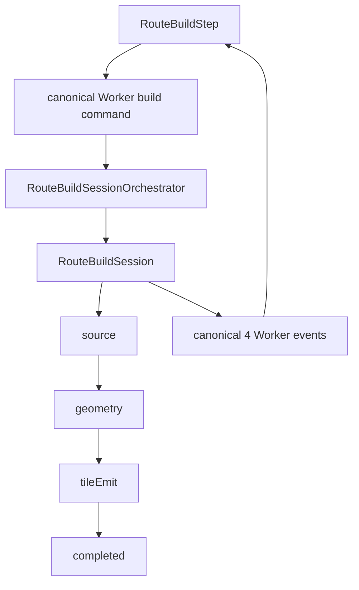
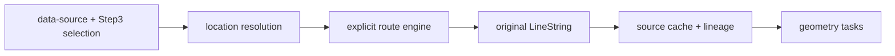
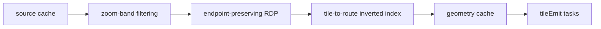
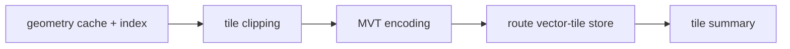
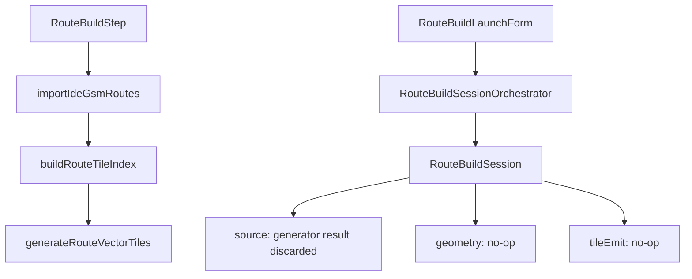

# Route pipeline migration map

最終更新: 2026-08-21

## 文書の位置づけ

本書はIssue #549でroute buildを正規3ステージへ統合するための移行図である。
仕様SSOTではない。次の正規仕様に従う。

- `docs/route-build-flow-spec.md`
- `docs/vt-route-pipeline-design.md`
- `docs/build-session-worker-ui-event-spec.md`

## 正規フロー

正規stage IDは`source / geometry / tileEmit`である。旧語は次の対応で読み替える。

| 正規stage | 旧語 |
| --- | --- |
| `source` | fetch, route-fetch |
| `geometry` | transform |
| `tileEmit` | vt, vectorTile |

## source

- routeごとにオリジナルLineStringを1本だけ生成する。
- engineは`direct / great_circle / osm_route / searoute / custom`から明示する。
- engine欠落、未対応method、load失敗を別engineへfallbackしない。
- `searoute_jp`を`searoute`の別名として受理しない。入力に現れた場合は契約違反として失敗する。
- source artifactの永続化後にのみsource taskを完了する。

## geometry

- filtering、simplification、index生成を同じstageで行う。
- 始点/終点は必ず保持する。
- LineStringが横切るtileを、端点がtile外でもindexへ含める。
- no-op handlerはtaskを`completed`にしない。

## tileEmit

- geometry成果物だけを入力とする。
- MVTとsummaryの永続化後にtask/stageを完了する。
- geometry成果物欠落をsource直読みや空tileで補完しない。

## 現行mainの二重経路

2026-08-21時点では、次の2経路が併存する。

直接経路は実成果物を生成するがcanonical session/eventの所有外である。
session経路はcanonical event sourceだが、sourceはgenerator結果を永続化せず、
geometry/tileEmitは実処理を行わない。
どちらも単独では正規仕様を満たさない。

## Issue #549の統合順

1. `RouteBuildSession`の各stageをWorker serviceの実処理へ接続する。
2. canonical command/APIから`RouteBuildSessionOrchestrator`を起動可能にする。
3. `RouteBuildStep`をcanonical command + event subscriptionへ切り替える。
4. UIの直接3処理経路を削除する。
5. `RouteBuildLaunchForm`が本番導線でない場合は削除し、必要なら同じcanonical commandへ接続する。
6. 同一nodeIdに複数session/runが存在しないことをテストする。

## 完了条件

- UIからWorkerまで正規entry pointが1つである。
- `source -> geometry -> tileEmit`の各stageに対応artifactがある。
- canonical 4イベントがstage/taskのauthoritative stateを配信する。
- no-op成功、暗黙fallback、別経路への互換切替が存在しない。
