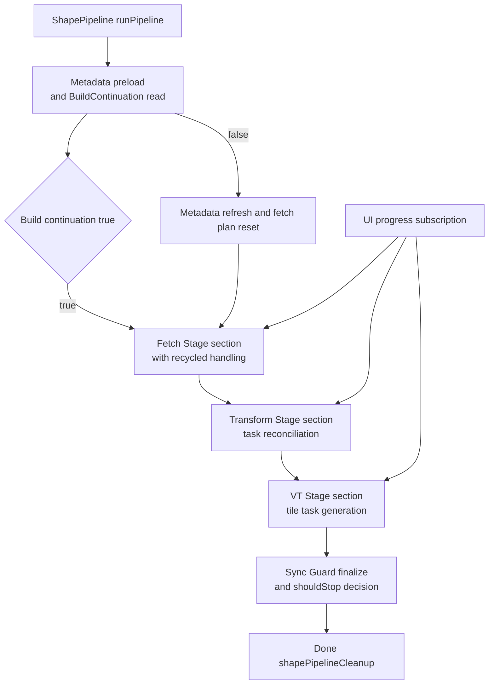
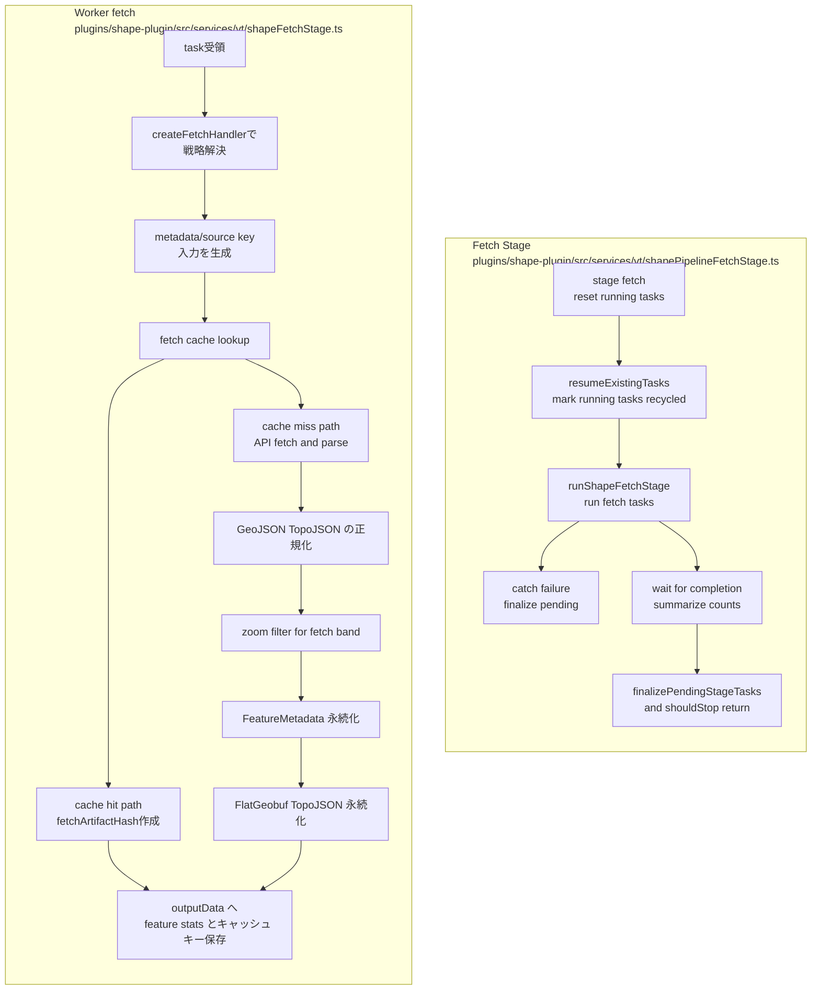
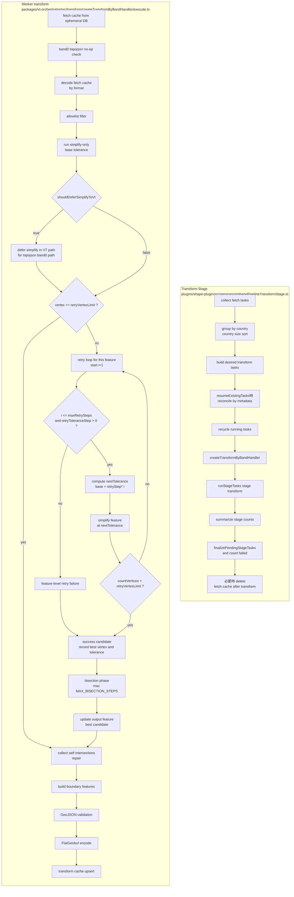
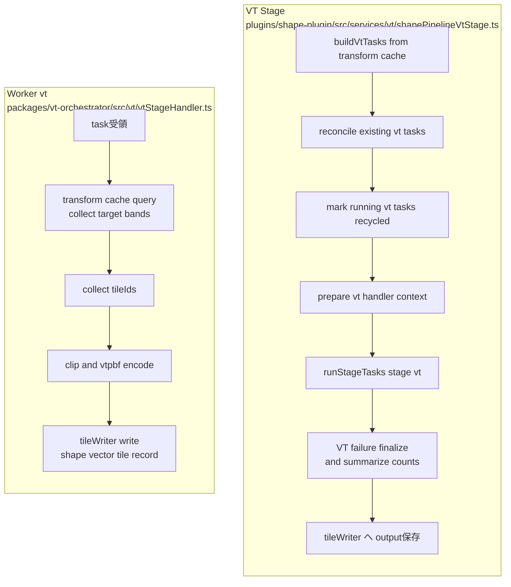

# 現行 Shape パイプライン（実装実体）

### 全体フロー

- 実行順は `Fetch -> Transform -> VT` の3セクション。
- 同一ワーカー実体を複数起動しているわけではなく、`runStageTasks` が `stage` 切替で処理する。
- `continue` 実行時は `resumeExistingTasks` が有効化され、既存タスクを再利用しつつ整合し直す。
- `Sync Guard` は、未完了タスクを確定完了または失敗化することで、二重起動や再開時の取りこぼしを抑制する。

### 実装上の重要ポイント

- 失敗は主に3ステージで収束する。
  - `Fetch` エラーは `finalizePendingStageTasks` 経由で `pending` を `failed` に集約。
  - `Transform` エラーは `stage` 内の幾何簡略化失敗、または頂点上限超過。
  - `VT` エラーはタスク個別の tile 書き込み失敗。
- `Fetch` は `fetch cache` / `feature metadata` の整合を生成・更新し、`Transform` はそのキャッシュを読む。
- `Transform` の結果は `transform cache` に永続化し、`VT` がそれを読み込み `vector tile` を生成する。
- ここで言う「再試行」は汎用リトライではなく、Transform の頂点数上限突破に対する簡略化再評価。

### Fetch Stage

### Transform Stage

#### Transform の実装レベル再試行フロー（feature 単位）

- 再試行判定前提:
  - `shouldDeferSimplifyToVt` が `true` の場合は `simplify-only` をスキップし、頂点超過再試行を走らせない（`fetchCache.format=topojson` かつ `simplifyAlgorithm=topojson`）。
  - それ以外は `shouldCollectBaselineMetrics` が無効でも、`retryVertexLimit` 判定後に再試行検討を開始する。
- `retryVertexLimit` は国コード単位:
  - 既定 `DEFAULT_RETRY_VERTEX_LIMIT=6553`
  - `RU CA AU` は `LARGE_COUNTRY_RETRY_VERTEX_LIMIT=32768`
  - 判定関数は `resolveRetryVertexLimit`。
- 目標条件:
  - 簡略化 feature の各頂点数が `retryVertexLimit` 未満に収まること。
  - `maxRetrySteps = 12`
  - `retryToleranceStep = configuredRetryToleranceStep * 4`（`configuredRetryToleranceStep` は `transformConfig.retryToleranceStep`、上限 `0~2`）
- 再試行ループ（各 feature）:
  - `nextTolerance = baseTolerance + retryToleranceStep * (i + 1)` を `i=0..maxRetrySteps-1` で試行
  - 各試行で `retry-simplify-feature` フェーズを更新
  - 頂点数が条件満たす最初の試行を成功として採用
  - 成功したらその範囲で `bisection` を実施
- bisection フェーズ:
  - 成功試行を得た場合のみ実行
  - `MAX_BISECTION_STEPS = 8`
  - `successIndex` が小さいほど `bisect steps` が大きい（`decay = 2`）
  - 低域/high 域の中点 `tolerance` を反復して、再現品質と頂点数のバランスを微調整
- 最終判定:
  - 修正後でも `retryVertexLimit` を超える feature があればエラーを蓄積しタスク `failed`
  - `transformErrors` に `shapeTransformError` を保存
  - 収束すれば次フェーズへ進み `output` を作成
- 中止条件（feature レベル）:
  - `retryToleranceStep <= 0` の場合は再試行を即終了し、その時点の簡略化結果で継続検査。
  - `i` が `maxRetrySteps` に到達し、なお `retryVertexLimit` を超える場合はこの feature を失敗扱いにし、タスク全体を `failed` に遷移。
  - `bisection` は成功試行を得た場合のみ有効。`MAX_BISECTION_STEPS` を使いきるか、内挿精度が安定するまで継続。

### VT Stage

### 補足

- 各ステージは `markStageTasksRecycled` 以前に `resetStageRunningTasks` を呼ぶ。
- ステージ完了時は `finalizePendingStageTasks` で未完了の `running` を `failed` に振り分ける。
- Transform と VT は `deleteOnComplete` 設定時に不要キャッシュを削除し、実装サイズを抑える。
### 今後の改修計画（頂点収束を1回の探索で固定する案）

#### 方針

- 現在の Transform 内「feature 単位の再試行（`retry per feature`）」から、次の方式へ移行する。
- 目標: まず全体特徴量に対して1回だけ収束探索を行い、得られた `tolerance` を並列区間（既存の transform worker 並列）で再利用する。
- 期待効果: 再試行の振れ幅を抑え、feature ごとにばらつく簡略化判断を廃止して処理挙動を安定化する。

#### 1) Fetch ステージ（実装追加）

- 既存のズーム帯別の小島省略処理が完了した直後に、フィーチャー単位で次を計算し、fetch メタデータへ保存する。
  - `featurePolygonVertexTotal`（そのフィーチャー内ポリゴン全体の頂点数合計）
  - `featureMaxPolygonVertex`（そのフィーチャー内 1 ポリゴンあたりの頂点数最大値）
- 保存先は既存の fetch metadata / feature metadata スキーマに追加フィールドを追加。
- 追加するキーは少なくとも以下を想定。
  - `vertexCountTotalByFeature`
  - `maxVertexCountByFeature`
  - `sourceBandVertexStats`（必要ならズーム帯別に持つ）
- 用途: Transform の最初で、`feature` 群全体の頂点ピークを一括で読むための下流入力とする。

#### 2) Transform ステージ（最初の探索フェーズ追加）

- `runStage` 開始時に、対象 feature 全件から `maxPolygonVertex` を収集して、`numVertex` として保持。
- `numVertex <= 6553` の場合は、現在の `baseTolerance` 系ロジックで進行（探索フェーズはスキップ）。
- `numVertex > 6553` の場合、全体収束探索を実施する。
  - 探索目的: `numVertexSimplify(tolerance) <= 6553` を満たす `tolerance` を見つける
  - 探索対象: RDP簡略化（既存 `geometryOps.simplifyFeature` 相当）
  - 手法: 2分法（二分探索）
  - 判定対象: 取得した `maxPolygonVertex` 全体に対して representative な代表集合（または全件）を簡略化し、最大頂点数の上限違反を評価
  - 上界・下界: 最低 0 / 最大は段階増加（必要なら既存 `tolerance` 倍数を使用して上限を拡張）
  - 収束条件: 連続反復で上限内収束、または反復上限到達時の最適側採用
- 探索で得た `targetTolerance` を、以後の parallel 区間で共通利用する。
  - `runStageTasks` が処理する各 transform worker は、feature ごとに個別再試行せず `targetTolerance` を適用
  - 既存の `retrySimplifyFeatureWithinVertexLimit` は段階的な撤去対象（featureごとの再試行経路）

#### 3) 既存ロジックとの切替点

- 現状分岐の置換（提案）
  - `shouldDeferSimplifyToVt` 判定後
  - 現状: `vertex <= retryVertexLimit` 判定 → feature 単位で `retry` → bisection
  - 改修後: 代わりに `global targetTolerance` で一括簡略化（必要なら最終安全バリデーションだけ実施）
- `retryVertexLimit` 判定フックを残す場合は、探索後の検証用途に限定し、主要フローは「一回の探索 + 共通 tolerance 適用」に寄せる。

#### 4) 追加保存・監査項目（ログ/再現性）

- Fetch 保存値:
  - `featurePolygonVertexTotal`
  - `featureMaxPolygonVertex`
  - `filterVersion`（計算関数バージョン）
- Transform 探索結果:
  - `numVertex`
  - `targetTolerance`
  - `globalBisectionIterations`
  - `discoveredWithBaseTolerance`
  - `finalMaxVertex`
  - `fallbackUsed`（反復上限超過時）

#### 5) 実装の留意点

- 2分探索は「全体で安定した simplify 厳密性を優先」するため、探索時には sample ではなく可能なら対象全 feature（または上位エラー候補の代表集合）に対して評価する。
- 並列フェーズ移譲時点で、`targetTolerance` は `stage input`（または task input metadata）として worker に固定配布する。
- 既存 `reconcile / resumeExistingTasks` ロジックと競合しないよう、探索結果を「task metadata signature」に含める。
