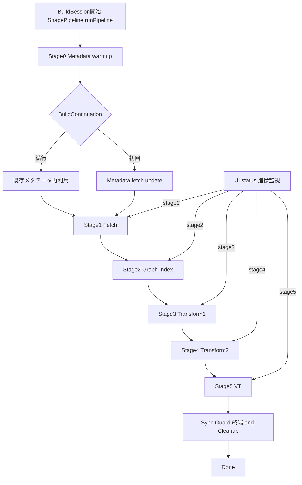
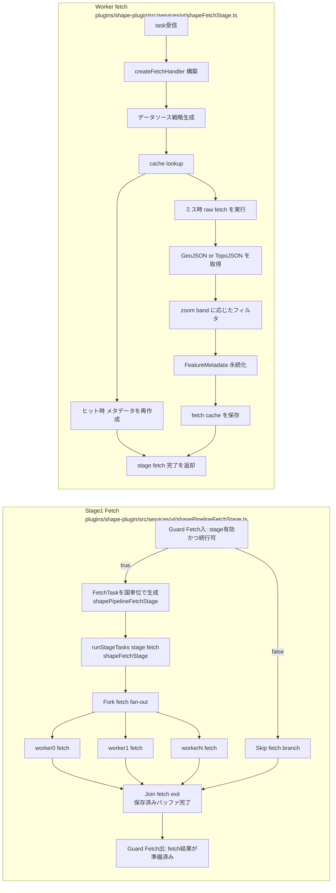
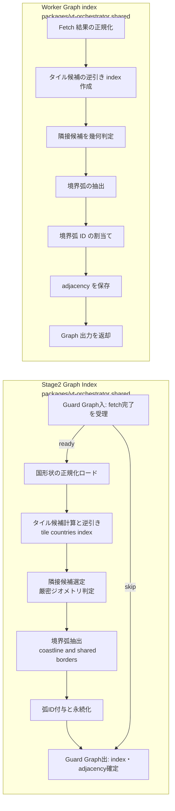
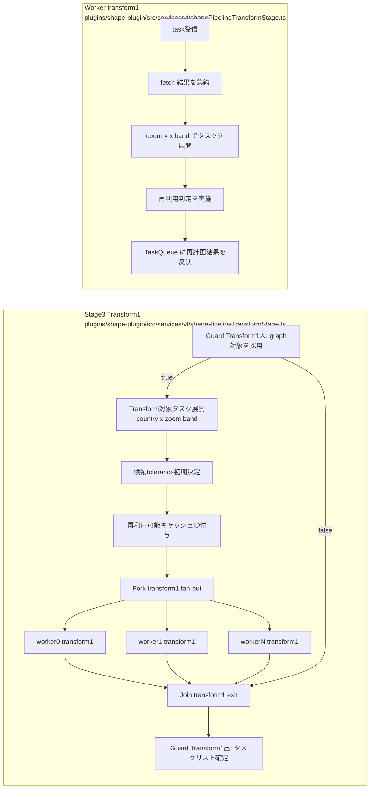
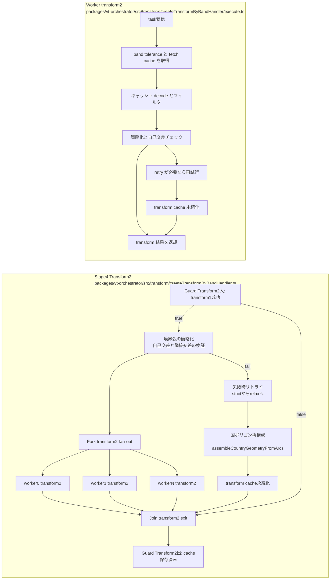
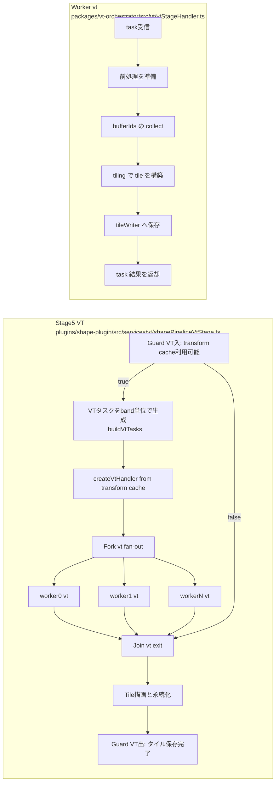

# Shape: Graph/Transform分割を入れた5ステージ化プラン（ドキュメント）

以下は、shape の現行 `fetch -> transform -> vt` を、境界整合と品質制御を前提にした5ステージ設計に拡張するための運用図です。

### 全体フロー

### Stage1 Fetch

### Stage2 Graph Index

### Stage3 Transform1

### Stage4 Transform2

### Stage5 VT

### 5ステージ化のための置換

- Stage0/Metadata: `shapePipeline.ts` 冒頭・`runShapeMetadataStage`
- Stage1/Fetch: `runShapeFetchStageSection` と `shapeFetchStage`
- Stage2/Graph Index: 新規導入
- Stage3/Transform1: `runShapeTransformStageSection` 前半
- Stage4/Transform2: `createTransformByBandHandler`
- Stage5/VT: `runShapeVtStageSection` と `createVtHandler`

### 5ステージ化時のポイント

- 最小工数で進めるなら `runShapeTransformStageSection` を Stage3 と Stage4 へ分割します。
- 並列区間の入出口は `Guard` ノードで明示し、失敗時は最小の再入（Stage4in）へ戻して再試行制御します。
