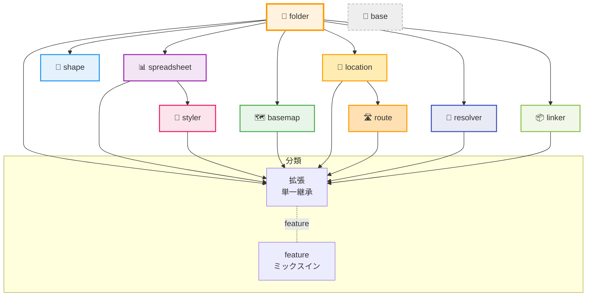

# HierarchiDB Node Type Plugin System

最終更新: 2025-12-XX

HierarchiDBの拡張可能なノードタイププラグインシステムです。地理情報処理、データ管理、階層構造管理など、様々なドメインに特化したノードタイプを提供し、アプリケーションの機能を拡張します。

## 🏗️ アーキテクチャ概要

### 最新ガイドライン（2025-11 更新）

- Dialog ホストはすべて `useTreeNodeUpdater` を経由し、`./ui` の default export（HeadlessMultiStepDialog ラッパー）で公開する。旧 `NodeDialogExtension`/`ExtensibleFolderDialog` は使用しない。
- Basic Info（name/description/tags）は `draftMetadata` へ、ドメイン固有ペイロードは `draftData` へ格納する。folder は data/draftData を空オブジェクトのまま扱う。
- TreeNodeUpdaterAPI を共通インターフェースとして利用する。WorkerAPI は `getTreeNodeUpdaterAPI` のみを公開し、旧 `getDraftAPI` は撤去済み。`initTreeNode` / `updateTreeNodeDraftMetadata` / `updateTreeNodeDraftData` / `commitDraft` / `discardDraft` を使う。
- プラグインレジストリは `pnpm tools:gen-plugin-registry` で生成し、Vite dev/build が動的に取り込む。生成物（`packages/plugin-registry/generated/registry.ts` 等）はコミットに含める。
- 旧 peerEntities や NodeDialogExtension 由来のレガシー経路が残っていたら削除対象。UI/Worker はレジストリ経由のホスト + TreeNodeUpdaterAPI 前提で統一する。
- MultiStep ダイアログでのドラフト更新は共通: Step の `onUpdate` → `useTreeNodeUpdater.updateDraft` → Worker DraftService(TreeNodeUpdaterAPI 実装) → Dexie `nodes.draftData` 更新。保存時は `saveDraft` → `commitDraft` まで一気通し。

### プラグインシステムの特徴

| 特徴 | 説明 | 実装レベル |
|------|------|-----------|
| **UI/Worker分離** | Comlink RPCによる完全な層分離 | ✅ 完成 |
| **実行基盤の共有化** | @hierarchidb/batch による実行統一（shape/location/route） | ✅ 完成 |
| **ダウンロード共有** | 共有 Download アダプタ（AuthRecovery + DownloadService） | ✅ 完成 |
| **進捗/制御の共有** | AbstractBatchSession（pause/resume/cancel・ProgressEvent） | ✅ 完成 |
| **型安全性** | TypeScript Branded Typesによる厳密な型管理 | ✅ 完成 |
| **動的登録** | 実行時プラグイン登録・管理 | ✅ 完成 |
| **拡張システム** | 基盤プラグインを継承した拡張パターン | ✅ 完成 |
| **ライフサイクル** | プラグインレベルのライフサイクルフック | ✅ 完成 |
| **依存管理** | プラグイン間依存関係の自動解決 | ✅ 完成 |
| **データベース抽象化** | Dexie.jsベースの自動スキーマ管理 | ✅ 完成 |

### 3層アーキテクチャ

```
┌─────────────────────────────────────────────────────────────┐
│                    UI Layer (React)                        │
│  ┌──────────────┐ ┌──────────────┐ ┌──────────────────────┐ │
│  │ Plugin Dialog │ │ Plugin Panel │ │ Plugin Icon/Actions  │ │
│  └──────────────┘ └──────────────┘ └──────────────────────┘ │
└─────────────────────────────────────────────────────────────┘
                              ↕ Comlink RPC
┌─────────────────────────────────────────────────────────────┐
│                  Worker Layer (TypeScript)                 │
│  ┌──────────────┐ ┌──────────────┐ ┌──────────────────────┐ │
│  │Entity Handler│ │Lifecycle Hook│ │ Database Operations   │ │
│  └──────────────┘ └──────────────┘ └──────────────────────┘ │
└─────────────────────────────────────────────────────────────┘
                              ↕ Dexie Transaction
┌─────────────────────────────────────────────────────────────┐
│               Database Layer (IndexedDB/Dexie)             │
│  ┌──────────────┐ ┌──────────────┐ ┌──────────────────────┐ │
│  │   CoreDB     │ │ EphemeralDB  │ │   Plugin Databases   │ │
│  └──────────────┘ └──────────────┘ └──────────────────────┘ │
└─────────────────────────────────────────────────────────────┘
```

## 🧭 共通ドラフト保存フロー（全プラグイン共通）

MultiStepDialog の各ステップで入力を更新すると、下記の経路で Dexie まで反映される。

1) UI (plugin-ui-host / plugin-ui-sdk)  
   - ステップ `onUpdate` → `useTreeNodeUpdater.updateDraft`。`draftData` にパッチをマージし、必要に応じて `draftMetadata`（name/description/tags）も更新。  
   - `updateDraft` はローカル state を更新しつつ 150ms デバウンスの `persistDraft` を起動。  
   - `persistDraft` は Worker クライアント (`wc`) に対し `updateTreeNodeDraftMetadata` → `updateTreeNodeDraftData` を送る（TreeNodeUpdaterAPI）。  
   - `saveDraft`（ダイアログ確定）は同じ 2 API を送った後に `commitDraft` を呼ぶ（auto-rename で衝突回避）。

2) Worker (runtime-worker)  
   - DraftService が TreeNodeUpdaterAPI を実装。`updateTreeNodeDraftData/Metadata` は `DraftTreeNodeOperations` を呼び、CoreDB(Dexie) の `nodes` テーブルを更新。`draftData` は `{ ...prev, ...updater }` でマージ。  
   - `commitDraft` は working copy を本番ノードへ反映し、完了後のノードを UI に返す。

3) Dexie (CoreDB)  
   - `nodes.draftData` / `nodes.draftMetadata` に保存され、以降の表示や commit に利用される。

ポイント: 「フォーム更新→updateDraft→Worker DraftService→Dexie」が即時同期、保存時は `commitDraft` まで一気通し。Shape/Location/Route などすべてのプラグインで同じパスを踏む。

### シーケンス図（共通フロー）
```
participant UI(Step:onUpdate)
participant useTreeNodeUpdater
participant WorkerClient(wc)
participant DraftService(Worker)
participant Dexie(CoreDB.nodes)

UI(Step:onUpdate)->>useTreeNodeUpdater: updateDraft(patch)
useTreeNodeUpdater->>useTreeNodeUpdater: state merge (draftData/draftMetadata)
useTreeNodeUpdater-->>WorkerClient(wc): persistDraft (debounced)\nupdateTreeNodeDraftMetadata\nupdateTreeNodeDraftData
WorkerClient(wc)-->>DraftService(Worker): updateTreeNodeDraftMetadata\nupdateTreeNodeDraftData
DraftService(Worker)->>Dexie(CoreDB.nodes): merge draftMetadata/draftData

note over useTreeNodeUpdater,DraftService(Worker): saveDraft() は上記2APIの後\ncommitDraft() を実行（auto-rename考慮）
DraftService(Worker)-->>Dexie(CoreDB.nodes): commitDraft (wc -> main node)
```

## 📂 標準ディレクトリレイアウト（`src/`）

各プラグインは UI・Worker・共有資産を明確に分けた下記レイアウトを推奨する。`package.json` の `"hierarchidb.plugin"` や `exports` もこの構成を前提にする。

```
src/
  common/      # UI/Worker 共有の型・定数・小さなユーティリティ（React/MUI 依存を避ける）
  ui/          # Dialogホスト・ステップ・hooks。default export で HeadlessMultiStepDialog を公開
  worker/      # handler/factory/DB登録など Worker 実装一式
  icon/        # アイコンエントリ（TreeConsole メニュー等）
  services/    # ドメイン固有サービス（必要な場合のみ）。UI/Worker から共有利用
  types/       # 公開したい型。`common/types` と統合でも可
  database/    # プラグイン専用 Dexie 定義がある場合
  __tests__/   # 単体/統合テスト（UI/worker 配下に近い場所へ置くのが望ましい）
```

- 必須: `ui/`, `worker/`, `icon/`（メニュー表示用）、`common/`（共有資産）
- 任意: `services/`, `types/`, `database/`, `__tests__/`（設置場所は対象に近づける）
- `exports` は `./ui`, `./worker`, `./icon`（必要に応じ `./shared`）を想定。UI/Worker は dist ではなく src を参照する。

### 現状の逸脱・補足

- `spreadsheet-plugin`: ルート直下に `src/__tests__/` があり、UI/Worker 配下ではない（移動検討余地）。
- `timeline-plugin`: `types/` ディレクトリを持たず、共有型は最小限。必要なら `common/types` 追加を検討。
- `linker-plugin`: `types/` がなく、共通型を `common/` にまとめている。公開型を増やす場合は `types/` 新設を推奨。
- `resolver-plugin`: 専用 `types/` はなく `common/types` のみ。問題ではないが公開面を増やす際は整理対象。
- 上記以外は `common/ui/worker/icon` の基本構成を維持している。

## 共通コード利用状況（TreeNodeUpdater/draft, 2025-12-XX）

TreeNodeUpdaterAPI と draftMetadata/draftData 経路の採用状況。`rg TreeNodeUpdater` やダイアログ実装の有無を目安に記載。今後の導入優先度を判断するためのスナップショット。

| プラグイン | TreeNodeUpdater/draft 利用 | 備考/次アクション |
|------------|---------------------------|------------------|
| basemap    | ○ | useTreeNodeUpdater 経由で統一済み。維持。 |
| folder     | △ | ドメインなしだが、UI 拡張時は TreeNodeUpdater 経路で実装。 |
| linker     | △ | ダイアログ未実装。新規追加時は `useTreeNodeUpdater` + TreeNodeUpdaterAPI でドラフト作成/更新/commit を統一し、既存の補助フロー（メニュー/パネル）も `draftMetadata`/`draftData` を前提に設計する。 |
| location   | △ | 既存 UI は独自更新が残るため、ダイアログを MultiStep 化して `useTreeNodeUpdater` → `updateTreeNodeDraftMetadata/Data` に寄せる。進捗 API も TreeNodeUpdater 経由のドラフト同期に付け替え。 |
| resolver   | ○ | draftMetadata/draftData へ統一済み。更なる共通化を継続。 |
| route      | ○ | TreeNodeUpdater + draftMetadata/draftData へ統一済み。 |
| shape      | △ | 旧 WorkingCopy 依存の記述を TreeNodeUpdater 用語に更新し、UI/Worker 実装を `useTreeNodeUpdater`/DraftService ベースに置換。Shape の import/export 手順も draftMetadata/draftData で再検証する。 |
| spreadsheet| ○ | 部分利用済み。全ステップが共通フローか確認を推奨。 |
| styler     | △ | 既存ダイアログをマルチステップ化する際に `useTreeNodeUpdater` を導入し、スタイル定義の一時データを draftData に集約。commit は TreeNodeUpdaterAPI で行い、プレビューもドラフトから描画する。 |
| timeline   | △ | 新規実装時は TreeNodeUpdaterAPI でドラフトを管理し、ファイル取込やプレビューも draftData から読む。既存 TODO の導入順序に沿って `useTreeNodeUpdater` を最初に組み込む。 |

メモ: working copy 表記は全プラグインでコード上解消済み。残っていればドキュメントの表記のみとして扱う。

## 📦 プラグイン一覧と分類（最新版）

本システムのノードタイプ・プラグインは単一継承を基本とし、ケイパビリティは feature のミックスインで段階的に付与します（多重継承は行いません）。UI/Worker は Comlink 経由で疎結合となっており、定義・依存・UI エントリは PluginDefinition で一元管理します。

- 基盤（Foundation）
- folder-plugin: ツリーのコンテナ（拡張/拡張レジストリの基盤）
- データ取り込み/変換（Data Ingest & Transform）
  - spreadsheet-plugin: CSV/TSV/Excel 等のソース管理
  - resolver-plugin: プロパティマッピング/スキーマ変換/重複解決
- 可視化/スタイリング（Visualization & Styling）
  - styler-plugin: データからスタイルを定義（Map スタイル適用など）
  - basemap-plugin: ベースマップ/スタイルの管理（MapLibre 統合）
- 地理/分析（Geo & Analysis）
  - shape-plugin: 形状処理/タイル/分析（folder 配下に統一予定）
  - location-plugin: 位置エンティティ/近接検索（Shape 連携オプション）
  - route-plugin: 経路生成/評価（Location 参照）
- メタ/領域（Meta & Project）
  - linker-plugin: プロジェクト領域/メタ設定（旧: project-plugin）

### プラグイン分類とパターン



### 比較表（概要）

| プラグイン | nodeType | 継承元 | データベース名（接頭辞付与） | データソース選択・読み込み | バッチ処理 | 表データ管理 | ベクトルタイル生成 | Mapプレビュー | ネット要件 | 備考 |
|---|---|---|---|---|---|---|---|---|---|---|
| folder-plugin | folder | - | folder-entities-db | - | - | - | - | - | なし | 拡張レジストリ |
| spreadsheet-plugin | spreadsheet | folder | spreadsheet-entities-db | - | - | あり | - | - | なし | CSV/TSV/Excel |
| styler-plugin | styler | spreadsheet | styler-metadata-db | - | - | あり | - | - | なし | スタイルメタ管理 |
| basemap-plugin | basemap | folder | basemap-db | - | - | - | - | 対応 | タイル利用時は要ネット | MapLibre 連携 |
| shape-plugin | shape | folder | shape-entities-db | あり | Yes | あり | create | 対応 | 作成/編集は要ネット | 高負荷/バッチ |
| location-plugin | location | folder | location-entities-db | あり | Yes | あり | create | 対応 | 作成/編集は要ネット | Shape 連携可 |
| route-plugin | route | folder | route-entities-db | あり | Yes | あり | create | 対応 | OSRM時ネット | BatchSession 対応 |
| resolver-plugin | resolver | folder | resolver-db | - | - | - | - | - | なし | スキーマ検出/変換 |
| linker-plugin | linker | folder | linker-entities-db | - | - | - | - | 対応 | ケース依存 | 領域/設定管理 |
| timeline-plugin | timeline | folder | timeline-entities-db | - | - | - | - | - | なし | 利用最小（ドラフト不要） |

注記:
- データベース名は `Dexie(getDBName('…'))` に渡すサフィックス（kebab-case）を示しています。接頭辞は `WORKER_DB_PREFIX` → `VITE_APP_PREFIX` → `hidb` の順で自動付与。複数持つ場合はカンマ区切り。
- Import/Export は CoreDB と Persistent なエンティティDBのシリアライズ/デシリアライズにより原則サポートされます（本表のカラムからは削除）。フォルダやタグ等の共通メタも対象に含まれます。
- ネットワーク要件: shape/location/route は作成・編集時にネット接続が必要なケースがあります。basemap はタイルサーバを利用する場合、運用中に外部タイルサーバへの接続が必要。その他は基本オフラインで運用可能。
- バッチは非同期一括処理の仕組み（セッション/レーン/タスク管理等）が実装されている場合に「Yes」。route は `RouteBatchManager/RouteBatchSession` に基づくバッチが実装済みです。
- ベクトルタイルは当該プラグインがベクトルタイルを生成（create）できるものを示します。
- Mapプレビューは当該プラグインの UI が地図プレビューに対応している場合に「supported」。

## 🧩 Draft/Working Copy 利用状況（metadata / data）

各プラグインが WorkingCopy をどう扱うかの最新整理。Basic Info は draftMetadata、ドメインペイロードは draftData に格納する共通パターンで統一しています（folder は data/draftData を空オブジェクトで維持）。

| プラグイン | Draft ホスト/フック | draftMetadata の主用途 | draftData の主用途 | 備考 |
|---|---|---|---|---|
| basemap | useTreeNodeUpdater（BasemapDialogHost） | name/description/tags | mapStyle / viewport / displayOptions | commit 時に data へ転記 |
| folder | useTreeNodeUpdater（FolderDialogHost） | name/description/tags | なし（空オブジェクト） | data/draftData は常に空 |
| spreadsheet | useTreeNodeUpdater（SpreadsheetDialogHost） | name/description/tags | sheet / source 設定 | 標準パターン |
| styler | useTreeNodeUpdater（StylerDialogHost） | name/description/tags | style 設定 | spreadsheet 派生 |
| shape | useTreeNodeUpdater（ShapeDialogHost） | name/description/tags | dataSource / processingConfig / checkboxState 等 | 標準パターン（shared utils 使用） |
| location | useTreeNodeUpdater（LocationDialogHost） | name/description/tags | dataSource / license / filters 等 | 標準パターン |
| route | useTreeNodeUpdater（RouteDialogHost） | name/description/tags | route payload 全般 | 標準パターン |
| resolver | useTreeNodeUpdater（ResolverDialogHost） | name/description/tags | schema / mapping / validation | 標準パターン |
| linker | useTreeNodeUpdater（ResourcePickerDialogHost 等） | name/description/tags | 最小限（metadata 側が主） | draftData 依存低め |
| timeline | 未使用/最小 | なし | なし | WorkingCopy 非依存 |

補足:
- Draft の生成・編集は DraftAPI（initTreeNode / updateTreeNodeDraftMetadata / updateTreeNodeDraftData / commitDraft）を経由する。createDraftBase 系は廃止済み。
- Basic Info の初期表示は draftMetadata を優先し、fallback として metadata を参照する。payload は draftData を優先し data は読み取り専用。
- 保存後は draftMetadata/draftData を null クリアし、metadata/data に反映するのが正規の commit フロー。


## 🔎 Tabular Preview（Location/Shape/Route 共通）

location / shape / route の各プラグインは、バッチ処理で正規化した“表データ”を保存してUIでプレビューできます（デフォルトOFF）。

- 有効化フラグ（環境変数）
- LOCATION_TABULAR モード（データテーブル表示）
  - `SHAPE_TABULAR=1`
- ROUTE_TABULAR モード（ルートデータテーブル表示）
- UI 機能
  - 複数条件フィルタ（AND: `eq`/`neq`/`contains`/`gt`/`gte`/`lt`/`lte`）
  - 表示列の切替（列セレクタ）
  - `eq` 条件は遅延作成される倒立インデックスで高速化
- 注意: 表プレビューは検索・検証用途です。ノード群の統合シリアライズ/デシリアライズは従来どおり Import/Export 機能をお使いください。


### 共通基盤について

旧 base-plugin 依存の設計は撤廃済みです。共通抽象・型は各プラグイン内で直接実装・再利用し、UI に露出しない「基底プラグイン」は提供していません。


 
## 🧩 プラグイン定義（現行API）

プラグインの定義は `@hierarchidb/common-type` の `PluginDefinition` を用います。従来バージョンの
`config.category` などは廃止し、トップレベルのフィールドに整理されています。

主なフィールド（抜粋）:

- `nodeType: NodeType`（必須）: プラグインの識別子。
- `name: string`/`displayName: string`: 内部名/表示名。
- `description?: string`: 説明。
- `category: { treeId: TreeId | '*'; menuGroup?: 'basic'|'container'|'document'|'advanced'; createOrder?: number }`:
  - どのツリーで利用可能か、メニューの配置/順序を定義。
- `icon?: { muiIconName?: string; emoji?: string; color?: string }`: メニュー/UI用アイコン情報。
- `database: { dbName: string; schema: DatabaseSchema; version: number }`: DexieベースのDB設定。
- `ui?: { dialogComponentPath?: string; panelComponentPath?: string }`: UI側エントリ（動的 import 用の相対パス文字列）。
- `dependencies: string[]`: 依存プラグインの nodeType リスト（ロード順の解決に使用）。
- `priority: number`: 並び順のヒント（小さいほど先）。

この定義は Worker 層での実体（ハンドラ等）と UI 層の登録に共通して参照され、ビルド時に
`~/plugin-registry` の `pluginDefinitions` として集約されます。UI のメニュー構築や
ランタイムのロード順解決は、この定義配列から導出されます。

### メニューとロード順の導出

- ロード順: `dependencies` をもとにトポロジカルソート（folder → spreadsheet → styler 等）。
- メニュー: `category.menuGroup` と `createOrder`、`displayName` から並び順/表示を決定。

### ノード・ダイアログ（現行方針）

- すべてのプラグインは `useTreeNodeUpdater`＋`draftMetadata/draftData` を前提に、`HeadlessMultiStepDialog` をラップしたホストを `./ui` default export で公開する。
- `pnpm tools:gen-plugin-registry` が `plugins/*-plugin/src/ui/preconnect.ts` を収集し、app からは registry 経由で動的にロードする（個別の配線は不要）。
- 旧 `ExtensibleFolderDialog` / `NodeDialogExtensionRegistry` / `initializeDefaultNodeDialogExtensions` は後方互換の名残であり、新規実装では使用しない。

## Plugin Dev MUSTs（プラグイン実装の必須事項）
- 公開TSXの戻り値型: プラグインが公開する TSX 関数/コンポーネントは `JSX.Element`（必要なら `| null`）を明示する（TS2742 回避）。
- 型エクスポート: 各パッケージの `types` と `exports.types` は `src/RuntimeWorkerService.ts` を指す（prebuild typecheck を安定化）。
- パスエイリアス禁止: 公開ソースで `~/` など tsconfig の paths に依存しない。相対参照（../）またはビルド時置換のみ許可。
- React/MUI をバンドルしない: UI を含むプラグインは React/MUI を `peerDependencies` に置き、tsup では `external` 指定する（ホストアプリでの単一インスタンス維持）。
- 環境変数: ブラウザ向けコードで `process.env` は使用しない。`import.meta.env` / `VITE_*` を使用する（必要に応じて共通 `env` ヘルパーを利用）。
- 依存解決: 他パッケージの `../src` 直参照は禁止。公開API（パッケージ名）経由、または d.ts 参照に限定する。


UI 側ユーティリティでは、`~/plugin-registry` の `pluginDefinitions` を読み取り、`label = nativeName || name || nodeType`
のようなルールでメニューに整形します（実装は `app/src/plugin-loader/menu-builders.ts` を参照）。

### プラグイン登録（ランタイム）

ビルド後、UI/Worker は `@hierarchidb/plugin-registry` から派生させた `pluginUiModuleMap` / `pluginWorkerModuleMap` を Inversify コンテナ経由で解決して動的 import を行い、
必要なサービス/ハンドラを登録します（`WorkerService.getSingleton(defs)`）。

#### サンプル（最小）
```ts
import type { PluginDefinition } from '@hierarchidb/common-type';

export const MyPlugin: PluginDefinition = {
  nodeType: 'my-plugin',
  name: 'MyPlugin',
  displayName: 'My Plugin',
  description: 'Example plugin',
  category: { treeId: '*', menuGroup: 'basic', createOrder: 50 },
  icon: { muiIconName: 'Extension', color: '#607d8b' },
  database: { dbName: 'mydb', schema: {/* Dexie schema */} as any, version: 1 },
  ui: { dialogComponentPath: './ui/MyPluginDialog.tsx' },
  dependencies: ['folder'],
  priority: 100,
};
```

## 🗄️ データベース統合パターン（Dexie）

#### 自動スキーマ管理
```typescript
export const MyPluginDefinition: PluginDefinition<MyEntity, never, MyWorkingCopy> = {
  database: {
    entityStore: 'my_entities',  // テーブル名
    schema: {                    // Dexieスキーマ
      '&id': 'EntityId',         // 主キー（Branded Type）
      'nodeId': 'NodeId',        // 外部キー
      'name, description': '',   // インデックス付きフィールド
      'createdAt, updatedAt, version': '',
    },
    version: 1                   // スキーマバージョン
  }
};

// 自動的に作成される専用データベース
// - プラグイン登録時に自動作成
// - 依存関係に基づく初期化順序
// - バージョン管理によるマイグレーション
```

#### 依存関係データベースアクセス
```typescript
export class StylerEntityHandler extends BaseEntityHandler<StylerEntity> {
  async createEntity(nodeId: NodeId, data: Partial<StylerEntity>): Promise<StylerEntity> {
    // 依存先（Spreadsheet）のデータベースにアクセス
    const registry = NodeDefinitionRegistry.getInstance();
    const spreadsheetDB = registry.getDependencyDatabase('styler-plugin', 'spreadsheet-plugin');
    
    if (spreadsheetDB) {
      const spreadsheetTable = spreadsheetDB.getEntityTable();
      const spreadsheetData = await spreadsheetTable.where('nodeId').equals(nodeId).first();
      
      // スプレッドシートデータに基づいてスタイルマップを作成
      data.sourceDataId = spreadsheetData?.id;
    }
    
    return super.createEntity(nodeId, data);
  }
}
```


データベースは CoreDB（共通）とプラグイン専用 DB を分離し、Worker 内でトランザクション一貫性を担保します。

## ✅ 開発チェックリスト（最新版）

- [ ] `PluginDefinition` を用いてトップレベルに `category/icon/dependencies/priority` を定義したか
- [ ] UI/Worker ともに `~/plugin-registry`（集約された定義）を前提にしているか
- [ ] 依存解決（ロード順）に `dependencies` を設定したか
- [ ] UI のメニュー表示に `displayName` と `category` を適切に設定したか
- [ ] Dexie スキーマ（`database.schema`）と `version` を更新時に整合させたか

## 🚫 ポリシー（抜粋）

- tsconfig の `paths` で他パッケージの `dist/*.d.ts` を直接参照しない（モノレポの型崩れ防止）。
- UI/Worker の境界は Comlink 経由。UI から Worker の実装を直接 import しない。

## 🔧 技術スタック

### コア技術基盤

| 技術 | 用途 | バージョン | 説明 |
|------|------|-----------|------|
| **TypeScript** | 型システム | 5.0+ | 厳密な型安全性、Branded Types |
| **Dexie.js** | データベース | 4.0+ | IndexedDBラッパー、トランザクション管理 |
| **Comlink** | Worker通信 | 4.4+ | 型安全なRPC、プロキシベース通信 |
| **React 18+** | UI基盤 | 18.2+ | コンポーネントベースUI |
| **Material-UI** | UIライブラリ | 5.0+ | UIコンポーネント、テーマシステム |

### 地理情報処理

| 技術 | 用途 | プラグイン | 説明 |
|------|------|-----------|------|
| **MapLibreGL JS** | 地図レンダリング | basemap, shape | オープンソース地図エンジン |
| **Turf.js** | 地理的演算 | shape | 地理空間解析ライブラリ |
| **GeoJSON/TopoJSON** | 地理データ | shape, basemap | 地理データ標準形式 |
| **Vector Tiles** | 地図データ配信 | shape | 効率的地図データ配信 |

### データ処理・最適化

| 技術 | 用途 | プラグイン | 説明 |
|------|------|-----------|------|
| **pako** | データ圧縮 | shape | gzip圧縮・解凍 |
| **pbf** | バイナリ処理 | shape | Protocol Buffersデコーダ |
| **csv-parser** | CSVデータ処理 | spreadsheet | CSVファイル解析 |
| **TanStack Virtual** | 仮想化 | 全UI | 大容量データ仮想化 |

### 開発・テスト

| 技術 | 用途 | 説明 |
|------|------|------|
| **Vitest** | ユニットテスト | 高速テスト実行 |
| **fake-indexeddb** | テスト環境 | IndexedDBモック |
| **Turborepo** | モノレポ管理 | 高速ビルド・キャッシュ |
| **pnpm** | パッケージ管理 | ワークスペース管理 |


## 📚 詳細ドキュメント

プラグインシステムの詳細については、以下のドキュメントを参照してください：

- **[アーキテクチャ詳細](./docs/architecture.md)** - システムアーキテクチャ、データフロー、技術的詳細
- **[開発ガイド](./docs/development-guide.md)** - ステップバイステップの開発手順、ベストプラクティス
- **[プラグイン構造](./docs/plugin-structure.md)** - プラグインの内部構造、ファイル組織、コード規約
- **[API リファレンス](./docs/api-reference.md)** - API仕様、インターフェース、型定義

*Generated by HierarchiDB Plugin System Documentation Generator*  
*Version: 2.0.0 | Last Updated: 2024-12-29*
