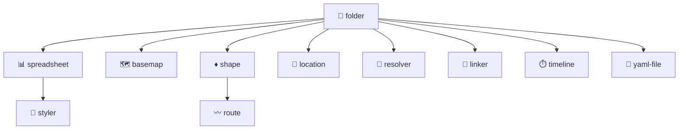

# HierarchiDB プラグイン一覧

最終更新: 2026-04-05

## 概要

HierarchiDB の拡張可能なノードタイププラグインシステム。地理情報処理、データ管理、階層構造管理など、様々なドメインに特化したノードタイプを提供する。

## カテゴリ別プラグイン一覧

### 基盤

| プラグイン | nodeType | 説明 | リンク |
| --- | --- | --- | --- |
| folder-plugin | `folder` | ツリーのコンテナ（全プラグインの基盤） | [README_ja.md](./folder-plugin/README_ja.md) |

### データ取り込み/変換

| プラグイン | nodeType | 説明 | リンク |
| --- | --- | --- | --- |
| spreadsheet-plugin | `spreadsheet` | CSV/TSV/Excel ソース管理 | [README_ja.md](./spreadsheet-plugin/README_ja.md) |
| resolver-plugin | `resolver` | プロパティマッピング・スキーマ変換・重複解決 | [README_ja.md](./resolver-plugin/README_ja.md) |

### 可視化/スタイリング

| プラグイン | nodeType | 説明 | リンク |
| --- | --- | --- | --- |
| styler-plugin | `styler` | データ駆動スタイリング・Map スタイル適用 | [README_ja.md](./styler-plugin/README_ja.md) |
| basemap-plugin | `basemap` | ベースマップ/スタイル管理（MapLibre 統合） | [README_ja.md](./basemap-plugin/README_ja.md) |

### 地理/分析

| プラグイン | nodeType | 説明 | リンク |
| --- | --- | --- | --- |
| shape-plugin | `shape` | 形状データ処理・ベクトルタイル生成・Map プレビュー | [README_ja.md](./shape-plugin/README_ja.md) |
| location-plugin | `location` | 位置エンティティ・近接検索・Shape 連携 | [README_ja.md](./location-plugin/README_ja.md) |
| route-plugin | `route` | 経路生成/評価・BuildSession・Map プレビュー | [README_ja.md](./route-plugin/README_ja.md) |

### メタ/領域

| プラグイン | nodeType | 説明 | リンク |
| --- | --- | --- | --- |
| linker-plugin | `linker` | プロジェクト領域/メタ設定管理（開発中） | [README_ja.md](./linker-plugin/README_ja.md) |

### 時系列

| プラグイン | nodeType | 説明 | リンク |
| --- | --- | --- | --- |
| timeline-plugin | `timeline` | 時系列データ管理（開発中） | [README_ja.md](./timeline-plugin/README_ja.md) |

### データ形式

| プラグイン | nodeType | 説明 | リンク |
| --- | --- | --- | --- |
| yaml-plugin | `yaml-file` | YAML データ管理（IDE-GSM 統合） | [README_ja.md](./yaml-plugin/README_ja.md) |

## プラグイン継承関係

## 機能比較表

| プラグイン | DB | バッチ | ベクトルタイル | Map プレビュー | ネットワーク要件 |
| --- | --- | --- | --- | --- | --- |
| folder-plugin | ✗ | ✗ | ✗ | ✗ | なし |
| spreadsheet-plugin | ○ | ✗ | ✗ | ✗ | なし |
| styler-plugin | ○ | ✗ | ✗ | ✗ | なし |
| basemap-plugin | ○ | ✗ | ✗ | ○ | タイル利用時 |
| shape-plugin | ○ | ○ | ○ | ○ | 作成/編集時 |
| location-plugin | ○ | ○ | ✗ | ○ | 作成/編集時 |
| route-plugin | ○ | ○ | ○ | ○ | OSRM 時 |
| resolver-plugin | ○ | ✗ | ✗ | ✗ | なし |
| linker-plugin | ✗ | ✗ | ✗ | ○ | ケース依存 |
| timeline-plugin | ✗ | ✗ | ✗ | ✗ | なし |
| yaml-plugin | ○ | ✗ | ✗ | ✗ | なし |
