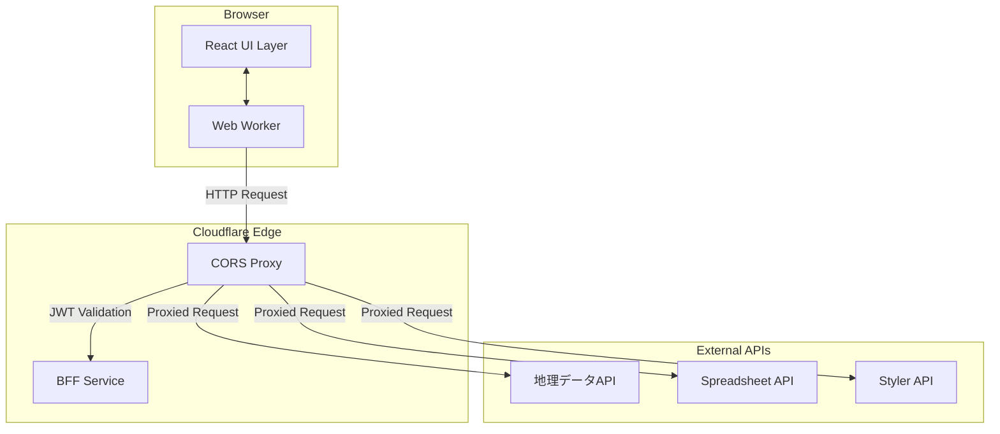

# ビルド処理における認証問題と解決策

## 問題の概要

Shape、Spreadsheet、Stylerプラグインのビルド処理において、外部APIアクセス時にCORS-ProxyやBFFでの認証が必要になった場合の処理フローが未実装です。

### 現在の構成



### 認証が必要になるケース

1. **CORS-Proxy での認証エラー (401)**
   ```typescript
   // Worker側でのAPI呼び出し
   fetch('https://cors-proxy.kubohiroya.workers.dev/?url=https://api.example.com/data', {
     headers: {
       'Authorization': `Bearer ${currentToken}`
     }
   })
   // Response: 401 Unauthorized - JWT expired or invalid
   ```

2. **BFF での認証セッション切れ**
   ```typescript
   // CORS-Proxyが内部的にBFFでJWT検証
   // BFF Response: 401 Unauthorized - Session expired
   ```

3. **外部API での認証要求**
   ```typescript
   // 実際のAPI側での認証エラー
   // API Response: 401 Unauthorized - API key required
   ```

## 現在の認証システムの状況

### 1. UI-Auth パッケージ
```
packages/ui/auth/
├── src/
│   ├── services/fetchWithAuthErrorHandling.ts  # 401エラー検出
│   ├── services/handleAuthError.ts             # 認証エラー処理
│   ├── contexts/MultiAuthContext.tsx           # 複数認証プロバイダー
│   └── hooks/useAuth.ts                        # 認証フック
```

**現在の実装**:
- `fetchWithAuthErrorHandling`: HTTPステータス401を検出
- `handleAuthError`: 認証エラー時の処理（現在は無効化）
- 複数の認証プロバイダー対応（Google, GitHub, Microsoft）

### 2. Backend BFF システム
```
packages/backend/bff/
├── OAuth2 + PKCE フロー対応
├── JWT セッション管理
├── Cloudflare KV でのセッション保存
└── 複数プロバイダー統合
```

**現在の機能**:
- OAuth2認証フロー
- JWTトークン発行・検証
- セッション管理

### 3. CORS-Proxy システム
```
packages/backend/cors-proxy/
├── JWT検証（BFF連携）
├── 複数認証方式サポート
├── ターゲットURL許可リスト
└── 自動CORS対応
```

## 問題点

### 1. **Worker層での認証エラー処理が未実装**
- Worker内でのHTTPリクエストが401で失敗した場合の処理なし
- UI層への認証要求通知メカニズムなし

### 2. **UI-Worker間での認証情報同期なし**
- UIで新しくログインしても、Workerが古いトークンを使用続行
- 認証状態の同期メカニズムなし

### 3. **ビルド処理の中断・再開機能なし**
- 認証エラー発生時に処理を一時停止する機能なし
- 認証完了後の処理再開機能なし

## 解決策の設計

### 1. 共通認証通知システム

```typescript
// packages/_obsolate_common/auth/AuthNotificationSystem.ts
export interface AuthRequiredNotification {
  type: 'AUTH_REQUIRED';
  source: 'worker' | 'cors-proxy' | 'bff' | 'external-api';
  context: {
    requestId: string;
    url: string;
    errorCode: number;
    errorMessage: string;
    sessionId?: string;  // ビルド処理セッション
    pluginType: 'shape' | 'spreadsheet' | 'styler';
  };
  timestamp: number;
}

export interface AuthSuccessNotification {
  type: 'AUTH_SUCCESS';
  context: {
    requestId: string;
    newToken: string;
    expiresAt: number;
    sessionId?: string;
  };
  timestamp: number;
}

export type AuthNotification = AuthRequiredNotification | AuthSuccessNotification;
```

### 2. Worker側認証エラー検出

```typescript
// packages/runtime-worker/worker/src/auth/WorkerAuthHandler.ts
export class WorkerAuthHandler {
  private authCallbacks = new Map<string, (notification: AuthNotification) => void>();
  
  /**
   * HTTP リクエストを認証エラー検出付きで実行
   */
  async fetchWithAuth(
    url: string, 
    init: RequestInit = {},
    context: { sessionId?: string; pluginType: string }
  ): Promise<Response> {
    const requestId = generateRequestId();
    
    try {
      const response = await fetch(url, init);
      
      if (response.status === 401) {
        // 認証エラー通知をUIに送信
        const notification: AuthRequiredNotification = {
          type: 'AUTH_REQUIRED',
          source: this.detectAuthSource(response),
          context: {
            requestId,
            url,
            errorCode: response.status,
            errorMessage: await response.text(),
            sessionId: context.sessionId,
            pluginType: context.pluginType as any,
          },
          timestamp: Date.now(),
        };
        
        await this.notifyAuthRequired(notification);
        
        // 認証完了まで待機
        return this.waitForAuthAndRetry(requestId, url, init);
      }
      
      return response;
    } catch (error) {
      throw error;
    }
  }
  
  private async waitForAuthAndRetry(
    requestId: string, 
    url: string, 
    init: RequestInit
  ): Promise<Response> {
    return new Promise((resolve, reject) => {
      const timeout = setTimeout(() => {
        reject(new Error('Authentication timeout'));
      }, 300000); // 5分タイムアウト
      
      this.authCallbacks.set(requestId, (notification) => {
        if (notification.type === 'AUTH_SUCCESS' && 
            notification.context.requestId === requestId) {
          clearTimeout(timeout);
          
          // 新しいトークンでリトライ
          const newInit = {
            ...init,
            headers: {
              ...init.headers,
              'Authorization': `Bearer ${notification.context.newToken}`,
            },
          };
          
          fetch(url, newInit)
            .then(resolve)
            .catch(reject);
        }
      });
    });
  }
  
  /**
   * UI層からの認証成功通知を受信
   */
  onAuthSuccess(notification: AuthSuccessNotification): void {
    const callback = this.authCallbacks.get(notification.context.requestId);
    if (callback) {
      callback(notification);
      this.authCallbacks.delete(notification.context.requestId);
    }
  }
}
```

### 3. UI側認証プロンプトシステム

```typescript
// packages/ui/auth/src/services/AuthPromptService.ts
export class AuthPromptService {
  private activePrompts = new Map<string, AuthRequiredNotification>();
  private workerConnection?: Worker;
  
  /**
   * Worker からの認証要求通知を処理
   */
  async handleAuthRequired(notification: AuthRequiredNotification): Promise<void> {
    const { context } = notification;
    
    // 既存のプロンプトがある場合はスキップ
    if (this.activePrompts.has(context.requestId)) {
      return;
    }
    
    this.activePrompts.set(context.requestId, notification);
    
    // 認証ダイアログを表示
    const authResult = await this.showAuthDialog({
      title: 'Authentication Required',
      message: `${context.pluginType} plugin requires authentication to continue build processing.`,
      details: {
        url: context.url,
        error: context.errorMessage,
      },
      sessionId: context.sessionId,
    });
    
    if (authResult.success) {
      // 認証成功をWorkerに通知
      const successNotification: AuthSuccessNotification = {
        type: 'AUTH_SUCCESS',
        context: {
          requestId: context.requestId,
          newToken: authResult.token,
          expiresAt: authResult.expiresAt,
          sessionId: context.sessionId,
        },
        timestamp: Date.now(),
      };
      
      await this.notifyWorkerAuthSuccess(successNotification);
    } else {
      // 認証キャンセル時はビルド処理を一時停止
      if (context.sessionId) {
        await this.pauseBuildProcessing(context.sessionId);
      }
    }
    
    this.activePrompts.delete(context.requestId);
  }
  
  private async showAuthDialog(options: {
    title: string;
    message: string;
    details: any;
    sessionId?: string;
  }): Promise<{ success: boolean; token?: string; expiresAt?: number }> {
    // React Portal を使用して認証ダイアログを表示
    return new Promise((resolve) => {
      const dialog = new AuthRequiredDialog({
        ...options,
        onSuccess: (token: string, expiresAt: number) => {
          resolve({ success: true, token, expiresAt });
        },
        onCancel: () => {
          resolve({ success: false });
        },
      });
      
      dialog.show();
    });
  }
}
```

### 4. ビルド処理の一時停止・再開機能

```typescript
// packages/plugin-loader/shape-plugin/src/services/BuildSessionManager.ts (拡張)
export class BuildSessionManager {
  private authHandler = new WorkerAuthHandler();
  
  /**
   * 認証エラー時の処理一時停止
   */
  async pauseForAuth(
    sessionId: string, 
    authNotification: AuthRequiredNotification
  ): Promise<void> {
    const ephemeralDB = getEphemeralShapeDB();
    
    // セッション状態を「認証待ち」に更新
    await ephemeralDB.sessions.update(sessionId, {
      status: 'auth-required',
      pausedAt: Date.now(),
      authContext: {
        requestId: authNotification.context.requestId,
        url: authNotification.context.url,
        errorMessage: authNotification.context.errorMessage,
      },
    });
    
    // 進捗コールバックに認証要求を通知
    this.emitProgress(sessionId, {
      type: 'auth-required',
      message: 'Authentication required to continue processing',
      authContext: authNotification.context,
    });
  }
  
  /**
   * 認証完了後の処理再開
   */
  async resumeAfterAuth(
    sessionId: string, 
    authNotification: AuthSuccessNotification
  ): Promise<void> {
    const ephemeralDB = getEphemeralShapeDB();
    
    // セッション状態を「処理中」に戻す
    await ephemeralDB.sessions.update(sessionId, {
      status: 'processing',
      resumedAt: Date.now(),
      authContext: undefined,
    });
    
    // 新しいトークンをWorkerAuthHandlerに通知
    this.authHandler.onAuthSuccess(authNotification);
    
    // 進捗コールバックに再開を通知
    this.emitProgress(sessionId, {
      type: 'resumed',
      message: 'Processing resumed after authentication',
    });
  }
  
  /**
   * 認証対応版 HTTP リクエスト
   */
  async fetchWithAuth(url: string, init: RequestInit, sessionId: string): Promise<Response> {
    return this.authHandler.fetchWithAuth(url, init, {
      sessionId,
      pluginType: 'shape', // プラグイン種別
    });
  }
}
```

### 5. UI認証ダイアログコンポーネント

```typescript
// packages/ui/auth/src/components/AuthRequiredDialog.tsx
export interface AuthRequiredDialogProps {
  title: string;
  message: string;
  details: {
    url: string;
    error: string;
  };
  sessionId?: string;
  onSuccess: (token: string, expiresAt: number) => void;
  onCancel: () => void;
}

export function AuthRequiredDialog({
  title,
  message,
  details,
  sessionId,
  onSuccess,
  onCancel,
}: AuthRequiredDialogProps) {
  const { signIn, user, isLoading } = useAuth();
  const [isAuthenticating, setIsAuthenticating] = useState(false);
  
  const handleSignIn = async (provider: 'google' | 'github' | 'microsoft') => {
    setIsAuthenticating(true);
    
    try {
      const result = await signIn(provider);
      if (result.success) {
        onSuccess(result.token, result.expiresAt);
      } else {
        // エラー表示
        console.error('Authentication failed:', result.error);
      }
    } catch (error) {
      console.error('Authentication error:', error);
    } finally {
      setIsAuthenticating(false);
    }
  };
  
  const handleCancel = () => {
    // ビルド処理キャンセルの確認
    const confirmed = window.confirm(
      'Canceling authentication will stop the build processing. Are you sure?'
    );
    
    if (confirmed) {
      onCancel();
    }
  };
  
  return (
    <Dialog open maxWidth="md" fullWidth>
      <DialogTitle>
        <Box display="flex" alignItems="center" gap={2}>
          <LockIcon color="warning" />
          {title}
        </Box>
      </DialogTitle>
      
      <DialogContent>
        <Alert severity="warning" sx={{ mb: 2 }}>
          {message}
        </Alert>
        
        {sessionId && (
          <Alert severity="info" sx={{ mb: 2 }}>
            Build processing session: {sessionId.slice(-8)}
          </Alert>
        )}
        
        <Accordion>
          <AccordionSummary expandIcon={<ExpandMoreIcon />}>
            Technical Details
          </AccordionSummary>
          <AccordionDetails>
            <Typography variant="body2" gutterBottom>
              <strong>URL:</strong> {details.url}
            </Typography>
            <Typography variant="body2" color="error">
              <strong>Error:</strong> {details.error}
            </Typography>
          </AccordionDetails>
        </Accordion>
        
        <Box sx={{ mt: 3 }}>
          <Typography variant="h6" gutterBottom>
            Sign in to continue:
          </Typography>
          
          <Box display="flex" gap={2} flexWrap="wrap">
            <Button
              variant="contained"
              startIcon={<GoogleIcon />}
              onClick={() => handleSignIn('google')}
              disabled={isAuthenticating}
            >
              Google
            </Button>
            
            <Button
              variant="contained"
              startIcon={<GitHubIcon />}
              onClick={() => handleSignIn('github')}
              disabled={isAuthenticating}
            >
              GitHub
            </Button>
            
            <Button
              variant="contained"
              startIcon={<MicrosoftIcon />}
              onClick={() => handleSignIn('microsoft')}
              disabled={isAuthenticating}
            >
              Microsoft
            </Button>
          </Box>
        </Box>
      </DialogContent>
      
      <DialogActions>
        <Button onClick={handleCancel} color="error">
          Cancel Processing
        </Button>
        
        {user && (
          <Button variant="contained" onClick={() => onSuccess(user.token, user.expiresAt)}>
            Use Current Session
          </Button>
        )}
      </DialogActions>
    </Dialog>
  );
}
```

## 実装計画

### Phase 1: 基盤システム
1. `AuthNotificationSystem` の共通インターフェース定義
2. `WorkerAuthHandler` のWorker側実装
3. `AuthPromptService` のUI側実装

### Phase 2: プラグイン統合
1. Shape Plugin での認証対応実装
2. Spreadsheet Plugin での認証対応実装  
3. Styler Plugin での認証対応実装

### Phase 3: UI/UX 改善
1. `AuthRequiredDialog` コンポーネント実装
2. ビルド処理ダイアログでの認証状態表示
3. 認証エラーリカバリーのUXフロー

### Phase 4: テスト・最適化
1. 認証フロー統合テスト
2. エラーケーステスト
3. パフォーマンス最適化

## 期待される効果

### 1. **シームレスな認証体験**
- ビルド処理中の認証エラーを適切にハンドリング
- ユーザーは処理を中断せずに認証可能

### 2. **共通化による保守性向上**
- 3つのプラグイン共通の認証処理
- コードの重複排除

### 3. **堅牢性の向上**
- 長時間処理での認証切れ対応
- エラーリカバリー機能

### 4. **ユーザビリティの改善**  
- 認証エラーの詳細情報表示
- ビルド処理の状態可視化
