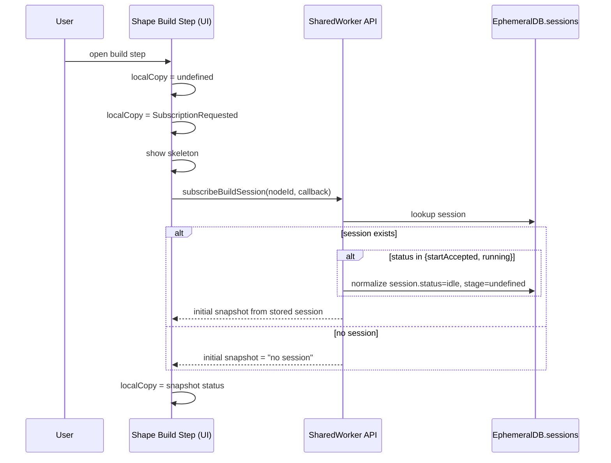
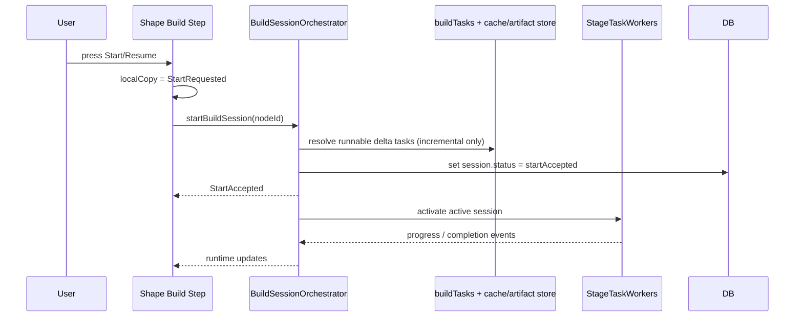
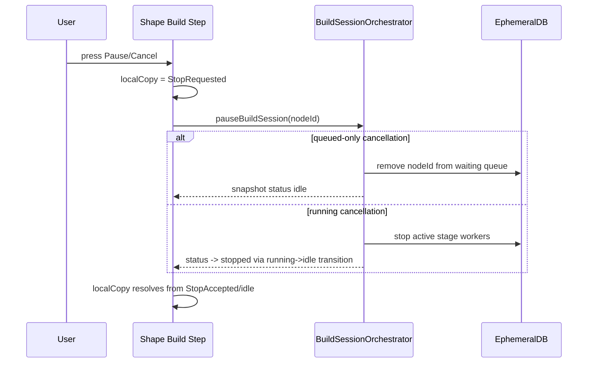

# Shape Plugin Build Dialog / State Transition Notes

This file is the Shape Plugin view-layer summary.  
Runtime orchestration semantics are defined in:

- `packages/runtime-worker/docs/build-session-terminology-ssot.md`
- `packages/runtime-worker/docs/build-session-orchestrator-state-transitions.md`

This document only describes Shape UI behavior that wraps those shared contracts.

## 1. State vocabulary used in Shape UI

- `undefined`  
  Local session snapshot is not received yet.
- `SubscriptionRequested`  
  UI opened build step and requested session subscription.
- `idle`  
  UI subscription is established and user controls are enabled.
- `StartRequested`  
  User pressed Start/Resume and is waiting for runtime to accept.
- `startAccepted` / `StartAccepted`  
  Runtime accepted the request. In UI this is shown while build starts or resumes.
- `running:<stage>`  
  Session executing in `fetch | transform | vt` stage.
- `StopRequested`  
  User pressed Pause/Stop and is waiting for runtime acceptance.
- `idle` (after `StopAccepted`)  
  Runtime/stored status returned to stopped state.
- `completed`  
  Runtime reported completion.
- `failed`  
  Runtime reported failure.

Notes:

- `Build` and `Resume` share the same API path: `startBuildSession`.
- Shape uses `StopRequested` and `StopAccepted` only for **UI-side transition control**.
- `startAccepted` (persisted) and `running`/`idle` (runtime status) are separate concerns in `sessions`.

## 2. Build Step initialization sequence

## 3. Start/Resume (same path)

## 4. Pause / Cancel sequence

- If session is still queued (`startAccepted` only): pause is a queue-cancel.
- If session is running: pause is stop request and active task queue is flushed by orchestrator.

## 5. Dialog/step transitions and persistence

| UI action | Build execution | Subscription |
| --- | --- | --- |
| Close build dialog only | continues | unsubscribed in that tab |
| Move to non-build step in same dialog/tab | continues | unsubscribed in that tab |
| Open build step again | resumes by re-subscribe | resync by snapshot/event stream |
| Close one tab (others open) | continues | only that tab unsubscribes |
| Close all tabs | SharedWorker terminates | resume only on next tab open |
| Runtime/Worker crash | build stops | next open normalizes `startAccepted/running -> idle` (no auto-resume) |

## 6. Multi-node concurrency

- Users can press Start in multiple nodes in parallel.
- Runtime scheduler across plugins is FIFO by arrival order.
- If a queued node is cancelled while waiting, `cancelQueuedBuildSession(nodeId)` removes only that queue entry.

## 7. Current implementation status (Shape)

- ✅ `startBuildSession`, `pauseBuildSession`, `cancelQueuedBuildSession` wired at worker runtime API level.
- ✅ Shape-side control states follow `StartRequested -> StartAccepted -> running -> StopRequested -> (StopAccepted) -> idle` path.
- ✅ Awaiting first task / startup timeout behavior is covered by existing unit/integration/e2e tests.
- ⚠️ Route plugin orchestration is still on its own implementation surface; cross-plugin commonization is intentionally tracked in runtime-worker workstreams.
