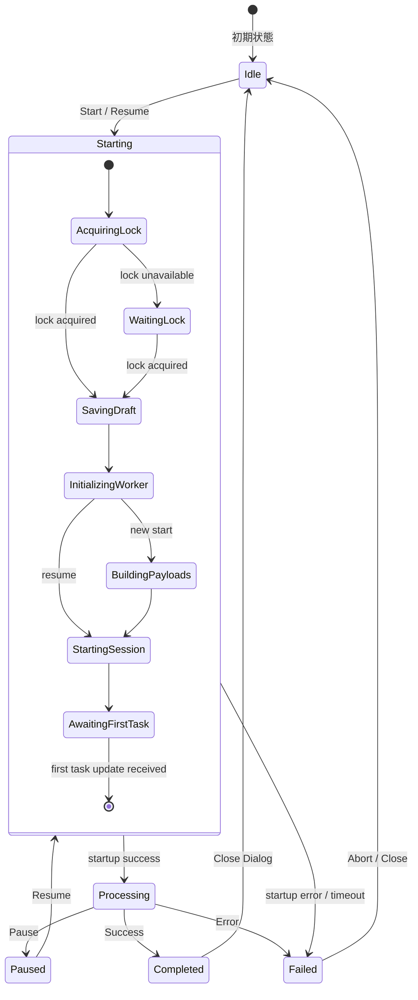
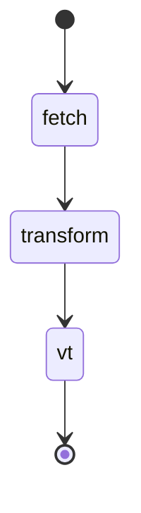

# Shape Plugin ダイアログフローと状態遷移仕様

## 概要

Shape Pluginでは、バッチ処理の開始、進捗監視、完了/中断処理を通じて、複数のダイアログとUIコンポーネントが連携して動作します。本文書では、これらの画面遷移とダイアログの開閉制御について仕様を定義します。

## ダイアログの種類と役割

### 1. ShapeEditDialog（メインダイアログ）
- **役割**: Shape entityの作成・編集、バッチ処理の設定
- **開く条件**: 
  - 新規作成: TreeConsoleから「Add Shape」アクション
  - 編集: ShapePanelから「Edit」ボタン
- **閉じる条件**:
  - Cancelボタン押下
  - Saveボタン押下後、保存成功時

### 2. Build Progress（進捗ビュー）
- **役割**: バッチ処理の進捗表示と制御
- **表示条件**:
  - ShapeEditDialog の Build Progress に到達
  - ShapePanel からの再開導線で Build Progress を開く
- **終了条件**:
  - 処理完了後にユーザーがダイアログを閉じる
  - エラー発生時にユーザーが確認/再試行する
  - ユーザーによるキャンセル操作

### 3. ConfirmationDialog（確認ダイアログ）
- **役割**: 処理の中断・キャンセルの確認
- **開く条件**:
  - Build Progress で Cancel 操作を実行した時
  - エラー発生時の再試行確認
- **閉じる条件**:
  - Yes/Noボタン押下

## 状態遷移フロー（現行実装準拠）





- 実行ステージは `fetch -> transform -> vt`。
- 起動フェーズ `awaiting-first-task` は待機監視対象で、10s で wait 通知、20s で long-wait 警告、45s で timeout エラー終了。

## ダイアログ制御の詳細仕様

### 1. ShapeEditDialog 内の Build Progress への遷移

```typescript
interface DialogTransition {
  trigger: 'START_PROCESSING';
  source: 'ShapeEditDialog';
  target: 'ShapeBuildStep';
  conditions: {
    validationPassed: boolean;
    draftSaved: boolean;
    batchConfigReady: boolean;
  };
  actions: {
    beforeTransition: [
      'saveDraft',
      'createBatchSession',
      'registerProgressCallback'
    ];
    onTransition: [
      'advanceToBuildProgress',
      'startProgressMonitoring'
    ];
  };
}
```

### 2. バッチ処理完了時の自動クローズ

```typescript
interface CompletionBehavior {
  onSuccess: {
    autoClose: true;
    delay: 2000; // 2秒後に自動クローズ
    showNotification: true;
    notificationDuration: 5000;
    actions: [
      'commitDraft',
      'cleanupBatchSession',
      'refreshParentView'
    ];
  };
  onError: {
    autoClose: false; // エラー時は自動クローズしない
    showErrorDetails: true;
    allowRetry: true;
    actions: [
      'logError',
      'preserveDraft',
      'showRetryOption'
    ];
  };
  onCancel: {
    autoClose: true;
    delay: 0; // 即座にクローズ
    confirmBeforeClose: true;
    actions: [
      'pauseBatchSession',
      'preserveDraft',
      'cleanupPartialData'
    ];
  };
}
```

### 3. 進捗イベントによる画面更新

```typescript
interface ProgressEventHandler {
  eventType: 'PROGRESS_UPDATE' | 'STAGE_CHANGE' | 'TASK_COMPLETE' | 'ERROR';
  
  handlers: {
    PROGRESS_UPDATE: (event: ProgressEvent) => {
      // プログレスバーの更新
      updateProgressBar(event.percentage);
      updateTaskCount(event.completed, event.total);
    };
    
    STAGE_CHANGE: (event: StageChangeEvent) => {
      // ステージインジケーターの更新
      highlightCurrentStage(event.newStage);
      updateStageDescription(event.stageInfo);
    };
    
    TASK_COMPLETE: (event: TaskCompleteEvent) => {
      // タスクリストの更新
      markTaskComplete(event.taskId);
      if (event.isLastTask) {
        triggerCompletionSequence();
      }
    };
    
    ERROR: (event: ErrorEvent) => {
      // エラー表示とリトライオプション
      showErrorDialog(event.error);
      enableRetryButton();
      pauseProcessing();
    };
  };
}
```

## 実装要件

### 1. ダイアログ間の状態共有

```typescript
// DialogContextProvider で状態を管理
interface DialogState {
  shapeEditDialog: {
    isOpen: boolean;
    mode: 'create' | 'edit';
    draftId?: EntityId;
  };
  
  batchProcessingDialog: {
    isOpen: boolean;
    sessionId?: string;
    currentStage?: BatchStage;
    progress?: ProgressInfo;
  };
  
  confirmationDialog: {
    isOpen: boolean;
    type?: 'cancel' | 'retry' | 'delete';
    onConfirm?: () => void;
  };
}
```

### 2. リアルタイム通知の購読管理

```typescript
interface ProgressSubscription {
  // 購読開始
  subscribe(sessionId: string): () => void;
  
  // イベントハンドラー登録
  on(event: 'progress', handler: (data: ProgressInfo) => void): void;
  on(event: 'complete', handler: (data: CompletionInfo) => void): void;
  on(event: 'error', handler: (error: Error) => void): void;
  
  // クリーンアップ
  unsubscribe(): void;
}
```

### 3. エラーリカバリー

```typescript
interface ErrorRecovery {
  strategies: {
    NETWORK_ERROR: {
      maxRetries: 3;
      retryDelay: [1000, 2000, 5000]; // Exponential backoff
      fallback: 'PAUSE_AND_NOTIFY';
    };
    
    VALIDATION_ERROR: {
      maxRetries: 0; // 検証エラーはリトライしない
      userAction: 'FIX_AND_RESTART';
    };
    
    QUOTA_EXCEEDED: {
      maxRetries: 1;
      cleanupBeforeRetry: true;
      userAction: 'CONFIRM_CLEANUP';
    };
  };
}
```

## UI/UX ガイドライン

### 1. プログレス表示
- 全体進捗: メインプログレスバー（0-100%）
- ステージ進捗: セカンダリプログレスバー
- タスクカウンター: "120/500 completed (24%)"
- 推定残り時間: "約15分" （過去の処理速度から計算）

### 2. 中断と再開
- 中断時: 現在の状態を保存し、いつでも再開可能
- 再開時: 前回の続きから処理を継続
- タイムアウト: 24時間経過したセッションは自動削除

### 3. 通知
- 成功時: トースト通知（緑色、5秒表示）
- エラー時: モーダルダイアログ（詳細表示付き）
- 警告時: インラインアラート（黄色、dismissable）

## テスト要件

### 1. ダイアログ遷移テスト
- [ ] ShapeEditDialog 内で Build Progress を開く導線
- [ ] 処理完了時の自動クローズ
- [ ] エラー時のダイアログ残留
- [ ] キャンセル確認ダイアログの表示

### 2. 進捗更新テスト
- [ ] リアルタイム進捗更新の反映
- [ ] ステージ切り替えの表示
- [ ] エラー発生時の状態保持

### 3. エッジケース
- [ ] ネットワーク切断時の挙動
- [ ] ブラウザリロード時の復旧
- [ ] 複数ダイアログ同時表示の防止

## 現在の実装状況と改善点

### 実装済み ✅
- ShapeEditDialogの基本機能
- Build Progress 進捗ビューの骨組み
- 進捗情報の表示コンポーネント

### 未実装 ❌
- リアルタイム進捗購読（ポーリングのみ）
- 自動クローズ機能
- エラーリカバリー機能
- セッション復旧機能

### 要改善 ⚠️
- ダイアログ間の状態管理が分散している
- Worker APIとの接続が不完全
- 進捗コールバックが機能していない
