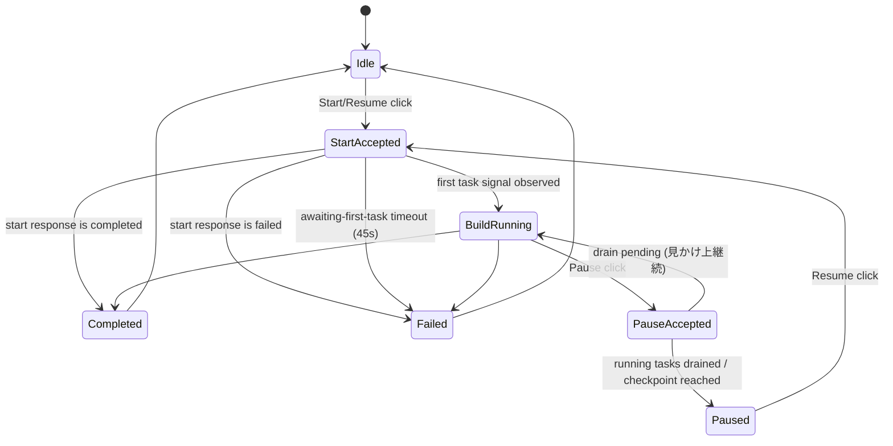

# Shape Plugin ダイアログフローと状態遷移（現行実装整理）

## 目的

本書は、Shape Build の **開始リクエスト** / **一時停止リクエスト** と、以下の状態遷移の実装実態を整理する。

- アイドル状態
- ビルド開始受付
- 実際のビルド開始（task 実行開始）
- ビルド一時停止受付

対象コード（2026-02-17 時点）:

- `plugins/shape-plugin/src/ui/components/build-progress/useShapeBuildStep.ts`
- `packages/components/src/executePauseBuildFlow.ts`
- `plugins/shape-plugin/src/worker/api.ts`
- `plugins/shape-plugin/src/ui/components/build-progress/useBuildProgressPanelState.ts`

---

## 状態の整理（UIで見えるもの）

### 1) ビルド実行状態（`buildStatus` / `runtimeStatus`）

- `idle`: 実行していない
- `running` / `processing`: 実行中
- `paused`: 一時停止中（または停止受付直後）
- `completed`: 完了
- `failed`: 失敗

### 2) 開始トランジション状態（`buildSessionTransition.phase`）

開始〜再開時に UI 内部で進むフェーズ。

- `acquiring-lock`
- `waiting-lock`
- `saving-draft`
- `initializing-worker`
- `building-payloads`（新規開始のみ）
- `starting-session`
- `awaiting-first-task`

### 3) 停止リクエスト状態

- `isPausePending=true`: UI で停止要求中
- Worker 側は `setPaused(nodeId, true)` で pause フラグを先に立てる
- 実タスク停止は `waitIfPaused` チェックポイント到達後

---

## 全体状態遷移（要約）

---

## 開始リクエストの詳細

### 開始受付（UI）

`handleStartOrResume` で以下を実行する。

1. lock acquire / wait
2. draft save
3. worker initialize
4. session start request
5. `awaiting-first-task` へ遷移（通常ケース）

### 実際のビルド開始判定

`awaiting-first-task` 中に `resolveAwaitingFirstTaskDecision` で判定する。

- 成功（実行開始）:
  - `hasFirstTaskSignal && hasStartedTasks`
  - または queued/progress シグナルを確認
- 失敗:
  - `buildStatus=failed`
  - `awaiting-first-task` 45s timeout
- キャンセル扱い:
  - `buildStatus=paused && !isPausePending`

監視ウォッチドッグ:

- 10s: wait 通知
- 20s: long-wait 通知
- 45s: timeout（開始失敗扱い）

### 「開始受付したのに開始せず終了」に見える代表経路

1. `session-start-request` の戻りが `completed`
- UI は `Build completed immediately after start.` で終了遷移する。

2. `awaiting-first-task` でシグナルが来ない
- 45s timeout で失敗遷移する。

3. 開始直後に `buildStatus=failed`
- task 実行前失敗として終了遷移する。

---

## 一時停止リクエストの詳細

### 停止受付（UI→Worker）

`handlePause` は `executePauseBuildFlow` を通し、次を順に実行する。

1. Worker 初期化
2. `pauseBuildSession(...)` 実行（60s timeout 付き）
3. UI 側 `updateSessionRecord(status='paused')`

Worker 側 `session/pause` では、先に `setPaused(nodeId, true)` を実行し、`status='paused'` を保存する。

### 実際の停止完了

Worker は非同期で `waitForRunningTasksToDrain` を行う。

- timeout: 15s
- `drained=false` の場合、`running task(s) to reach a pause point` メッセージを出す

つまり、**停止受付** と **処理停止完了** は同時ではない。

### 「停止ボタンを押しても終わらない」に見える代表経路

- pause フラグは立っているが、実行中タスクがチェックポイント未到達
- drain timeout まで running が残る
- この間、UI 上は停止受付済みでも処理継続に見える

---

## 表示不整合が起きる条件（今回事象に直結）

UI は複数ソースを合成して表示しているため、更新タイミング差で不整合が出る。

- Task queue 更新（running/queued/completed）
- Progress snapshot / progress event
- Session stage heartbeat（`stageId`）

既知の観測:

- `progress snapshot skipped (no subscriber)`
  - 購読タイミング次第で初期 progress が欠落
- `[ShapeRunningResidue] UI_MISMATCH ... reason=running_stage_not_active`
  - stage の running 判定と active stage 判定が一時的にズレる

このため、同一時刻でも以下が同時に起き得る。

- Spinner（並列スロット）は停止表示
- SVG 進捗まとめは「処理中」表示
- タスクカード更新がしばらく止まって見える

---

## ログ確認ポイント

開始系:

- `[ShapeBuildStartResumeTrace]`
- `[ShapeBuildProgressStep]`
- `[ShapeAwaitingFirstTaskDecisionTrace]`

停止系:

- `[ShapeBuildPauseTrace]`
- `[shapeBatchAPI][PauseTrace]`

表示不整合:

- `[ShapeRunningResidue] UI_MISMATCH`
- `progress snapshot skipped (no subscriber)`

---

## 現状まとめ

- 開始受付と実行開始は分離されている（`awaiting-first-task` 監視あり）。
- 停止受付と停止完了も分離されている（running task drain 待ちあり）。
- したがって、
  - 「開始受付後に勝手に終了」
  - 「停止押下後も終わらない」
  は、現行実装の遷移条件上、発生し得る。
- UX 改善では「受付中」「実処理中」「停止待ち」の表示を明示的に分離する必要がある。
