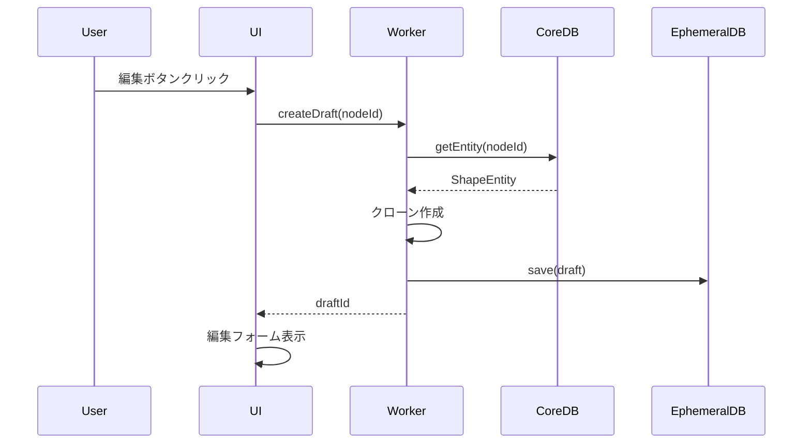
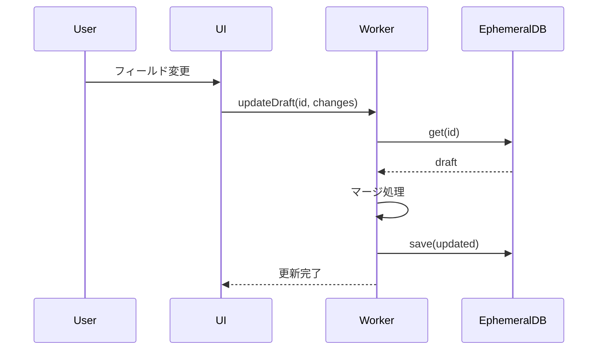
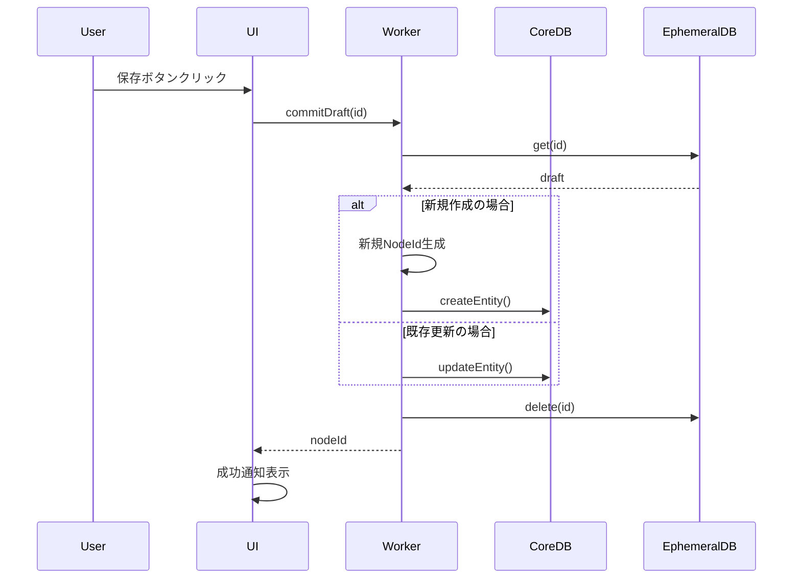

# Working Copy Pattern - Shape Plugin

## 概要

Shape Pluginにおける**Working Copy Pattern**は、HierarchiDBのデータ整合性を保ちながら、安全でロールバック可能な編集機能を提供する中核的な設計パターンです。このドキュメントでは、Shape Pluginでの実装方法と利用方法について詳細に説明します。

## 目次

- [アーキテクチャ](#アーキテクチャ)
- [データフロー](#データフロー)
- [実装詳細](#実装詳細)
- [API リファレンス](#api-リファレンス)
- [利用シナリオ](#利用シナリオ)
- [ベストプラクティス](#ベストプラクティス)
- [トラブルシューティング](#トラブルシューティング)

## アーキテクチャ

### データベース層の分離

Working Copy Patternは、HierarchiDBの**デュアルデータベース戦略**に基づいています：

```
┌─────────────────────────────────────────┐
│              UI Layer                   │
│         (React Components)              │
└────────────────┬────────────────────────┘
                 │ Comlink RPC
┌────────────────▼────────────────────────┐
│            Worker Layer                 │
│       (EntityHandler API)               │
└────────┬────────────────┬───────────────┘
         │                │
┌────────▼──────┐ ┌──────▼──────────────┐
│    CoreDB     │ │    EphemeralDB      │
│ (永続データ)   │ │   (一時データ)       │
│               │ │                     │
│ ShapeEntity   │ │ ShapeDraft    │
└───────────────┘ └─────────────────────┘
```

### 主要コンポーネント

#### 1. ShapeEntity (CoreDB)
永続化される実際のShapeデータ：

```typescript
interface ShapeEntity {
  id: EntityId;                    // エンティティの一意識別子
  nodeId: NodeId;                   // ツリーノードへの参照
  dataSourceName: DataSourceName;  // データソース識別子
  selectedArrayByCountries?: Record<ISO2, boolean[]>; // 国×管理レベルの選択状態
  licenseAgreement?: boolean;      // ライセンス同意状態
  batchConfig?: ObsolateBuildConfig;       // バッチ処理設定
}
```

※ DownloadTaskPayload は UI 側で生成し、`startBuildSession` 呼び出し時に Worker へ渡す。CoreDB には永続化しない。

#### 2. ShapeDraft (EphemeralDB)
編集中の一時データ：

```typescript
interface ShapeDraft {
  nodeId: NodeId;                  // 元のノードID（新規の場合は空）
  baseVersion: number;             // ベースバージョン
  isModified: boolean;             // 変更フラグ
  isDraft?: boolean;               // 新規作成フラグ
  changes: Partial<ShapeEntity>;  // 変更内容
}
```

## データフロー

### 1. 編集開始フロー



### 2. 編集中フロー



### 3. コミットフロー



## 実装詳細

### ShapeEntityHandler の実装

```typescript
// packages/plugin-loader/shape-plugin/src/worker/handlers/ShapeEntityHandler.ts

export class ShapeEntityHandler {
  private coreDB: any;      // CoreDB接続
  private ephemeralDB: any; // EphemeralDB接続

  /**
   * 既存エンティティからWorking Copyを作成
   */
  async createDraft(entity: ShapeEntity): Promise<ShapeDraft> {
    const draft: ShapeDraft = {
      id: entity.id,
      nodeId: entity.nodeId,
      name: entity.name,
      description: entity.description,
      dataSourceName: entity.dataSourceName,
      licenseAgreement: false, // セキュリティのため再同意を要求
      processingConfig: { ...entity.processingConfig },
      selectedCountries: [...entity.selectedCountries],
      adminLevels: [...entity.adminLevels],
      isDraft: false,
      createdAt: entity.createdAt,
      updatedAt: entity.updatedAt,
      version: entity.version,
    };

    // EphemeralDBに保存
    await this.ephemeralDB.workingCopies.put(draft);
    
    console.log(`Created working copy for entity: ${entity.id}`);
    return draft;
  }

  /**
   * 新規ドラフトWorking Copyを作成
   */
  async createNewDraftDraft(parentId: NodeId): Promise<ShapeDraft> {
    const draftId = generateEntityId() as EntityId;

    const draft: ShapeDraft = {
      id: draftId,
      nodeId: '' as NodeId, // コミット時に設定
      name: '',
      description: '',
      dataSourceName: 'naturalearth',
      licenseAgreement: false,
      processingConfig: DEFAULT_PROCESSING_CONFIG,
      selectedCountries: [],
      adminLevels: [],
      isDraft: true, // 新規作成フラグ
      createdAt: Date.now(),
      updatedAt: Date.now(),
      version: 1,
    };

    await this.ephemeralDB.workingCopies.put(draft);
    
    console.log(`Created new draft working copy: ${draftId}`);
    return draft;
  }

  /**
   * Working Copyを更新
   */
  async updateDraft(
    draftId: EntityId, 
    changes: Partial<ShapeEntity>
  ): Promise<ShapeDraft> {
    const existing = await this.ephemeralDB.workingCopies.get(draftId);
    if (!existing) {
      throw new Error(`Working copy not found: ${draftId}`);
    }

    const updated: ShapeDraft = {
      ...existing,
      ...changes,
      isModified: true,
      updatedAt: Date.now(),
    };

    await this.ephemeralDB.workingCopies.put(updated);
    return updated;
  }

  /**
   * Working CopyをCoreDBにコミット
   */
  async commitDraft(draftId: EntityId): Promise<NodeId> {
    // 1. EphemeralDBからWorking Copyを取得
    const draft = await this.ephemeralDB.workingCopies.get(draftId);
    if (!draft) {
      throw new Error(`Working copy not found: ${draftId}`);
    }

    let nodeId: NodeId;
    
    // 2. 新規か既存かで処理を分岐
    if (draft.isDraft) {
      // 新規エンティティの作成
      nodeId = generateNodeId() as NodeId;
      const entity: ShapeEntity = {
        ...draft,
        id: generateEntityId() as EntityId,
        nodeId: nodeId,
        isDraft: undefined, // ドラフトフラグを削除
      };
      
      await this.coreDB.shapes.add(entity);
      console.log(`Created new entity from draft: ${entity.id}`);
      
    } else {
      // 既存エンティティの更新
      nodeId = draft.nodeId;
      const entity = await this.coreDB.shapes.get(draft.id);
      
      if (!entity) {
        throw new Error(`Original entity not found: ${draft.id}`);
      }
      
      // バージョンチェック（楽観的ロック）
      if (entity.version !== draft.version) {
        throw new Error('Version conflict detected. Please refresh and retry.');
      }
      
      const updated: ShapeEntity = {
        ...entity,
        ...draft,
        version: entity.version + 1,
        updatedAt: Date.now(),
      };
      
      await this.coreDB.shapes.put(updated);
      console.log(`Updated entity: ${entity.id}`);
    }

    // 3. Working CopyをEphemeralDBから削除
    await this.ephemeralDB.workingCopies.delete(draftId);
    console.log(`Committed and cleaned up working copy: ${draftId}`);
    
    return nodeId;
  }

  /**
   * Working Copyを破棄
   */
  async discardDraft(draftId: EntityId): Promise<void> {
    await this.ephemeralDB.workingCopies.delete(draftId);
    console.log(`Discarded working copy: ${draftId}`);
  }
}
```

### React Hook の実装

```typescript
// packages/plugin-loader/shape-plugin/src/ui/hooks/useShapeDraft.ts

// NOTE: `useShapeAPI` has been removed. Use `getBuildWorkerBridge()` with `getShapeQueryAPI` / `getShapeMutationAPI` and build-control APIs instead.

export function useShapeDraft(
  nodeId: NodeId | null,
  mode: 'create' | 'edit'
) {
  const [draft, setDraft] = useState<ShapeDraft | null>(null);
  const [isDirty, setIsDirty] = useState(false);
  const [isLoading, setIsLoading] = useState(false);
  const api = useShapeAPI();

  // Working Copyの初期化
  useEffect(() => {
    if (!nodeId && mode === 'edit') return;
    
    const initDraft = async () => {
      setIsLoading(true);
      try {
        let wc: ShapeDraft;
        
        if (mode === 'create') {
          // 新規作成
          wc = await api.createNewDraftDraft(nodeId || ('' as NodeId));
        } else {
          // 既存編集
          const entity = await api.getEntity(nodeId!);
          wc = await api.createDraft(entity);
        }
        
        setDraft(wc);
        setIsDirty(false);
      } catch (error) {
        console.error('Failed to initialize working copy:', error);
      } finally {
        setIsLoading(false);
      }
    };

    initDraft();
  }, [nodeId, mode]);

  // Working Copyの更新
  const updateDraft = useCallback(
    async (changes: Partial<ShapeDraft>) => {
      if (!draft) return;
      
      try {
        const updated = await api.updateDraft(draft.id, changes);
        setDraft(updated);
        setIsDirty(true);
      } catch (error) {
        console.error('Failed to update working copy:', error);
        throw error;
      }
    },
    [draft, api]
  );

  // コミット処理
  const commit = useCallback(async () => {
    if (!draft) return;
    
    setIsLoading(true);
    try {
      const nodeId = await api.commitDraft(draft.id);
      setIsDirty(false);
      return nodeId;
    } catch (error) {
      console.error('Failed to commit working copy:', error);
      throw error;
    } finally {
      setIsLoading(false);
    }
  }, [draft, api]);

  // 破棄処理
  const discard = useCallback(async () => {
    if (!draft) return;
    
    try {
      await api.discardDraft(draft.id);
      setDraft(null);
      setIsDirty(false);
    } catch (error) {
      console.error('Failed to discard working copy:', error);
    }
  }, [draft, api]);

  return {
    draft,
    isDirty,
    isLoading,
    updateDraft,
    commit,
    discard,
  };
}
```

## API リファレンス

### EntityHandler API

| メソッド | 説明 | パラメータ | 戻り値 |
|---------|------|-----------|--------|
| `createDraft` | 既存エンティティからWorking Copyを作成 | `entity: ShapeEntity` | `Promise<ShapeDraft>` |
| `createNewDraftDraft` | 新規ドラフトWorking Copyを作成 | `parentId: NodeId` | `Promise<ShapeDraft>` |
| `getDraft` | Working Copyを取得 | `id: EntityId` | `Promise<ShapeDraft \| undefined>` |
| `updateDraft` | Working Copyを更新 | `id: EntityId, changes: Partial<ShapeEntity>` | `Promise<ShapeDraft>` |
| `commitDraft` | Working CopyをCoreDBにコミット | `id: EntityId` | `Promise<NodeId>` |
| `discardDraft` | Working Copyを破棄 | `id: EntityId` | `Promise<void>` |

### React Hooks

| Hook | 説明 | パラメータ | 戻り値 |
|------|------|-----------|--------|
| `useShapeDraft` | Shape編集用のWorking Copy管理 | `nodeId: NodeId \| null, mode: 'create' \| 'edit'` | Working Copy状態と操作関数 |

## 利用シナリオ

### シナリオ 1: 既存Shapeの編集

```typescript
// ShapeEditDialog.tsx

function ShapeEditDialog({ nodeId, onClose }: Props) {
  const {
    draft,
    isDirty,
    isLoading,
    updateDraft,
    commit,
    discard,
  } = useShapeDraft(nodeId, 'edit');

  const handleCountryChange = async (countries: string[]) => {
    await updateDraft({
      selectedCountries: countries,
    });
  };

  const handleSave = async () => {
    try {
      await commit();
      toast.success('Shape updated successfully');
      onClose();
    } catch (error) {
      toast.error('Failed to save changes');
    }
  };

  const handleCancel = async () => {
    if (isDirty) {
      const confirmed = await confirm('Discard unsaved changes?');
      if (!confirmed) return;
    }
    await discard();
    onClose();
  };

  if (isLoading) return <LoadingSpinner />;

  return (
    <Dialog open onClose={handleCancel}>
      <DialogTitle>Edit Shape</DialogTitle>
      <DialogContent>
        <CountrySelector
          value={draft?.selectedCountries || []}
          onChange={handleCountryChange}
        />
      </DialogContent>
      <DialogActions>
        <Button onClick={handleCancel}>Cancel</Button>
        <Button onClick={handleSave} disabled={!isDirty}>
          Save
        </Button>
      </DialogActions>
    </Dialog>
  );
}
```

### シナリオ 2: 新規Shapeの作成

```typescript
// ShapeCreateDialog.tsx

function ShapeCreateDialog({ parentNodeId, onClose }: Props) {
  const {
    draft,
    isDirty,
    updateDraft,
    commit,
    discard,
  } = useShapeDraft(null, 'create');

  const [step, setStep] = useState(0);

  const handleStepComplete = async (stepData: any) => {
    await updateDraft(stepData);
    setStep(step + 1);
  };

  const handleCreate = async () => {
    try {
      // 最終バリデーション
      if (!draft?.name) {
        throw new Error('Name is required');
      }
      if (!draft?.licenseAgreement) {
        throw new Error('License agreement is required');
      }

      const nodeId = await commit();
      toast.success(`Shape created: ${nodeId}`);
      onClose(nodeId);
    } catch (error) {
      toast.error(error.message);
    }
  };

  return (
    <StepperDialog
      steps={[
        <BasicInfoStep onComplete={handleStepComplete} />,
        <TabularDataSourceStep onComplete={handleStepComplete} />,
        <LicenseStep onComplete={handleStepComplete} />,
        <CountrySelectionStep onComplete={handleStepComplete} />,
        <ProcessingConfigStep onComplete={handleStepComplete} />,
      ]}
      currentStep={step}
      onFinish={handleCreate}
      onCancel={async () => {
        await discard();
        onClose();
      }}
    />
  );
}
```

### シナリオ 3: バッチ処理との統合

```typescript
// ShapeBuildStep.tsx

function ShapeBuildStep({ data, onChange }: Props) {
  const api = useShapeAPI();

  const startBuildSession = async () => {
    try {
      const nodeId = data?.nodeId;
      if (!nodeId) return;

      const payloads = await api.generateDownloadTaskPayloadsFromSelection(
        data?.batchConfig?.dataSource ?? data?.dataSourceName ?? 'gadm',
        data?.selectedArrayByCountries,
      );
      const session = await api.startBuildSession(nodeId, data?.batchConfig ?? DEFAULT_CONFIG, payloads);

      onChange({ batchSessionId: session.sessionId });
    } catch (error) {
      console.error('Failed to start build processing:', error);
    }
  };

  return (
    <BuildStep onResume={startBuildSession} />
  );
}
```

## ベストプラクティス

### 1. エラーハンドリング

```typescript
// 常にtry-catchでエラーをハンドリング
try {
  await commitDraft(draftId);
} catch (error) {
  if (error.message.includes('Version conflict')) {
    // バージョンコンフリクトの処理
    await refreshAndRetry();
  } else {
    // その他のエラー
    showErrorNotification(error);
  }
}
```

### 2. 変更の自動保存

```typescript
// デバウンスを使用した自動保存
const debouncedUpdate = useMemo(
  () => debounce(async (changes) => {
    await updateDraft(changes);
  }, 1000),
  [updateDraft]
);
```

### 3. 離脱防止

```typescript
// ページ離脱前の確認
useEffect(() => {
  const handleBeforeUnload = (e: BeforeUnloadEvent) => {
    if (isDirty) {
      e.preventDefault();
      e.returnValue = '';
    }
  };

  window.addEventListener('beforeunload', handleBeforeUnload);
  return () => window.removeEventListener('beforeunload', handleBeforeUnload);
}, [isDirty]);
```

### 4. メモリリーク防止

```typescript
// コンポーネントのアンマウント時にWorking Copyを破棄
useEffect(() => {
  return () => {
    if (draft && isDirty) {
      // 非同期でクリーンアップ
      api.discardDraft(draft.id).catch(console.error);
    }
  };
}, []);
```

### 5. 楽観的更新

```typescript
// UIを即座に更新し、バックグラウンドで永続化
const handleChange = async (field: string, value: any) => {
  // 楽観的にUIを更新
  setLocalState({ ...localState, [field]: value });
  
  // バックグラウンドでWorking Copyを更新
  try {
    await updateDraft({ [field]: value });
  } catch (error) {
    // エラー時はUIを元に戻す
    setLocalState(prevState);
    showError('Failed to save changes');
  }
};
```

## トラブルシューティング

### よくある問題と解決方法

#### 1. Working Copyが見つからない

**エラー**: `Working copy not found: [id]`

**原因**: 
- EphemeralDBがクリアされた
- セッションタイムアウト
- ブラウザのリロード

**解決方法**:
```typescript
// Working Copyの再作成
const recoverDraft = async () => {
  const entity = await api.getEntity(nodeId);
  const newDraft = await api.createDraft(entity);
  setDraft(newDraft);
};
```

#### 2. バージョンコンフリクト

**エラー**: `Version conflict detected`

**原因**: 他のユーザーが同じエンティティを更新

**解決方法**:
```typescript
// 最新データを取得してマージ
const resolveConflict = async () => {
  const latest = await api.getEntity(nodeId);
  const merged = mergeChanges(draft.changes, latest);
  await updateDraft(merged);
};
```

#### 3. メモリリーク

**症状**: Working Copyが蓄積される

**原因**: コンポーネントのアンマウント時にクリーンアップされない

**解決方法**:
```typescript
// 適切なクリーンアップの実装
useEffect(() => {
  const cleanup = async () => {
    if (draftRef.current) {
      await api.discardDraft(draftRef.current.id);
    }
  };

  return () => {
    cleanup();
  };
}, []);
```

#### 4. 保存の失敗

**エラー**: `Failed to commit working copy`

**原因**: 
- ネットワークエラー
- バリデーションエラー
- 権限不足

**解決方法**:
```typescript
// リトライメカニズムの実装
const commitWithRetry = async (maxRetries = 3) => {
  for (let i = 0; i < maxRetries; i++) {
    try {
      return await api.commitDraft(draftId);
    } catch (error) {
      if (i === maxRetries - 1) throw error;
      await delay(1000 * Math.pow(2, i)); // Exponential backoff
    }
  }
};
```

## パフォーマンス最適化

### 1. 差分更新

```typescript
// 変更があったフィールドのみ送信
const updateOnlyChangedFields = async (newData: Partial<ShapeEntity>) => {
  const changes = diff(draft, newData);
  if (Object.keys(changes).length > 0) {
    await updateDraft(changes);
  }
};
```

### 2. バッチ更新

```typescript
// 複数の変更をまとめて送信
const batchUpdates = useMemo(() => {
  const pending: Partial<ShapeEntity>[] = [];
  
  return {
    add: (changes: Partial<ShapeEntity>) => {
      pending.push(changes);
    },
    flush: async () => {
      if (pending.length === 0) return;
      const merged = pending.reduce((acc, curr) => ({ ...acc, ...curr }), {});
      await updateDraft(merged);
      pending.length = 0;
    },
  };
}, [updateDraft]);
```

### 3. キャッシング

```typescript
// Working Copyのキャッシュ
const draftCache = new Map<EntityId, ShapeDraft>();

const getCachedDraft = async (id: EntityId) => {
  if (draftCache.has(id)) {
    return draftCache.get(id);
  }
  
  const wc = await api.getDraft(id);
  if (wc) {
    draftCache.set(id, wc);
  }
  return wc;
};
```

## まとめ

Working Copy Patternは、Shape Pluginにおいて以下の利点を提供します：

1. **データ整合性**: CoreDBは常に一貫した状態を維持
2. **安全な編集**: いつでもロールバック可能
3. **パフォーマンス**: EphemeralDBでの高速な編集操作
4. **ユーザビリティ**: 直感的な編集体験
5. **並行性**: 複数のWorking Copyを同時に管理可能

このパターンを正しく実装することで、堅牢で使いやすいShape編集機能を提供できます。

## 関連ドキュメント

- [HierarchiDB Architecture](../../../docs/ARCHITECTURE.md)
- [Entity Handler Pattern](../../../docs/ENTITY_HANDLER.md)
- [Batch Processing](./BATCH_PROCESSING_NOTIFICATION.md)
- [Dialog Flow](../../../packages/runtime-worker/docs/build-session-orchestrator-state-transitions.md)
